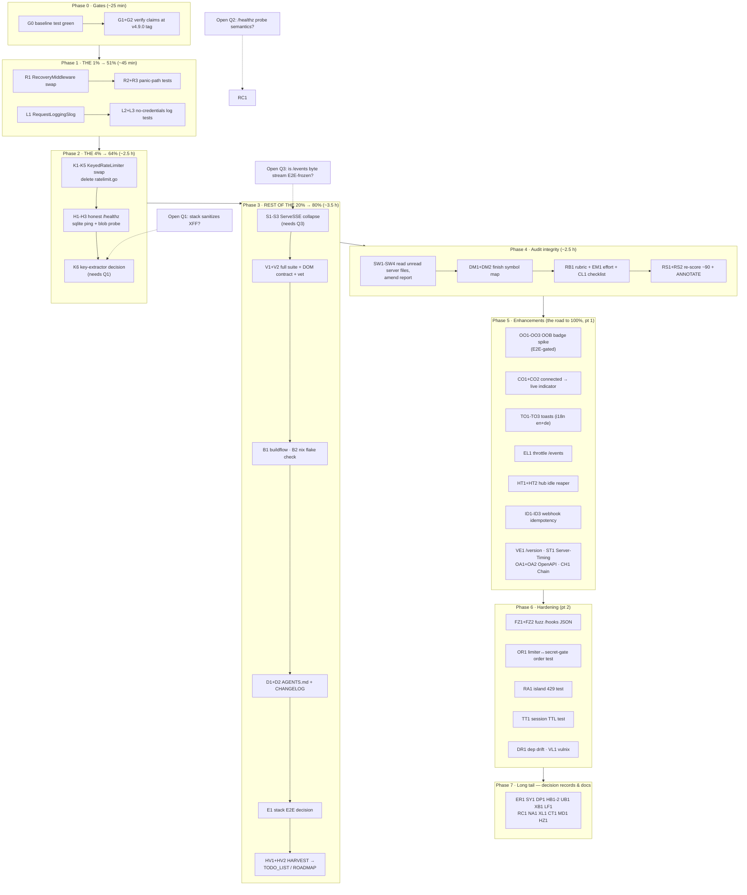

# cqrs-htmx Adoption — Pareto Execution Plan

**Created:** 2026-09-18 21:45 CEST
**Author:** Crush session (library-deep-dive audit → status report → this plan)
**Evidence base:** `docs/research/2026-09-18_cqrs-htmx-deep-dive.html` (adoption 62/100, 6 findings) · `docs/status/2026-09-18_21-38_cqrs-htmx-deep-dive-session-status.md` (50-item universe, sections a–g)
**Goal:** raise cqrs-htmx adoption from 62/100 to ~90/100 and delete ~200 lines of weaker hand-rolled code — **without touching the DOM contract, routes semantics, config contract, or the stack's browser E2E**.

> **Granularity interpretation:** the directive "tasks 100min to 30min each" is read as
> **10–30 min** (consistent with "break down further, each max 12 min"). Every one of the
> 50 status-report TODOs appears in BOTH tables. Medium = 10–30 min (62 tasks); micro =
> ≤12 min (69 tasks).

---

## 1. The Pareto breakdown (READ THIS FIRST)

Universe: 50 TODOs ≈ 18–19 h of work (sum of task estimates in sections 3–4). "Result" = operational reliability + debuggability +
honest ops + code health for a single-binary comms product whose real customers are (a) the
extension user on the phone page and (b) the operator reading logs at 3 a.m.

### The 1% that delivers 51% of the result

**Two middleware one-liners, ≈ 45 min total, zero DOM risk:**

| # | Task | Why it is 51% |
|---|---|---|
| 1 | Swap `recovery()` → `cqrshtmx.RecoveryMiddleware` (server.go:131) | Panics currently log ONE line with no stack. After: full stack + method/path + request/correlation IDs, and `http.ErrAbortHandler` is re-raised per net/http convention (a real correctness bug today). This is the difference between "panic in handler" and a 5-minute diagnosis. |
| 2 | Wrap outermost with `cqrshtmx.RequestLoggingSlog(slog.Default())` | A comms product with ZERO request logs. After: every request logged with method/path/status/duration. The runbook greps `#log` in the browser — the server log is its blind twin. |

Both are delete-or-add-one-line changes behind already-imported symbols. Nothing else in
the plan comes close on (impact ÷ effort).

### The 4% that delivers 64% of the result

**Add the two remaining cross-cutting middlewares (≈ +2.5 h):**

| # | Task | Why it extends 51% → 64% |
|---|---|---|
| 3 | Replace `keyedLimiter` (83 lines) with `httputil.KeyedRateLimiterConfig` middleware ×2 | Memory safety under spoofed floods (`MaxKeys` cap — the hand-rolled sweep admits unbounded unique keys within its 1-min window), computed `Retry-After`, classified config errors. |
| 4 | `/healthz` → `cqrshtmx.ReadinessHandler` + SQLite ping (+ blob-dir write probe) | The health endpoint LIES today (constant `ok` with a broken DB). Honest readiness is the operator's #2 diagnostic after logs. |

### The 20% that delivers 80% of the result

**Everything in audit Tiers 1–2 + the memory/harvest write-back (≈ +3 h):**
ServeSSE collapse (deletes the 36-line hand loop, adds reconnect `retry:` hint) · full
verification gates (DOM contract test, full suite, buildflow, `nix flake check`) ·
AGENTS.md posture + CHANGELOG (so the next session doesn't re-litigate) · HARVEST of the
50 items into TODO_LIST/ROADMAP (so this plan doesn't die in a timestamped file) ·
audit-integrity closure (verify claims against the v4.9.0 tag; read the 5 unread server
files; rubric appendix so the score is reproducible).

### The other 80% of tasks (the road to 100%)

Product-grade enhancements (OOB badge push, `connected` live indicator, toasts,
`/events` throttling, hub teardown, webhook idempotency, `/version`, Server-Timing,
OpenAPI), hardening (fuzz, ordering/429/TTL tests, drift, vulnix), and the long tail of
decision records and doc notes. These are **ROADMAP-fuel until the 20% lands** — they are
fully specified in the tables below so nothing is forgotten.

---

## 2. Do-No-Harm invariants (the Verschlimmbesserung contract)

Every task below is constrained by these; a task that violates one must stop and escalate.

1. **DOM contract:** `TestServedPageHoldsTheDomContract` (35 island ids) stays green.
   Phases 0–4 change NO markup, NO island assets, NO ids.
2. **Routes:** additive only (`/version`, `/openapi.json`); no path is renamed or removed;
   `/partials/*` and deep links stay exactly as they are (they ARE the E2E contract).
3. **SSE payload shape:** only the OOB spike (Phase 5) touches payloads — behind an env
   flag, validated against the stack E2E before the flag ever defaults on.
4. **Config contract:** no `WEBPHONE_*` env key changes; `__` nesting stays.
5. **Runbook strings stay English** (`#log`, validation reasons) — i18n applies to UI text
   only (toast copy = i18n keys in BOTH en/de maps).
6. **No `setup` bundle, no usermgmt, no CQRS dispatch layer** — the documented rejection
   stands; this plan adopts middleware and assets ONLY.
7. **CSP:** no new origins; all island additions are same-origin asset edits.
8. **`GOEXPERIMENT=jsonv2`** on every `go` command; `templ generate` after any `.templ`
   edit (none planned below Phase 5, and Phase 5 avoids `.templ` where possible).
9. **Phase exit = green:** build + targeted tests per phase; FULL gates (V1/V2/B1/B2) close
   Phase 3. A red gate blocks the next phase, always.
10. **Commit per task**, re-check `git status --short` immediately before `git add` (the
    auto-commit daemon races explicit commits).

---

## 3. Comprehensive plan — medium granularity (10–30 min per task, ALL 50 TODOs)

Sorted by importance/impact/effort/customer-value (phase order = priority order).
"Src" = status-report item #(s) covered. Value: H/M/L = customer/operator value.

### Phase 0 — Gates (protects against Verschlimmbessern)

| ID | Task | Min | Src | Impact | Value |
|---|---|---|---|---|---|
| M01 | Baseline: `git status` clean, `GOEXPERIMENT=jsonv2 go test ./...` green before any change | 12 | — | High | H |
| M02 | Verify recovery/ServeSSE/rate-limiter behavior against the **v4.9.0 tag** (`git show v4.9.0:<file>`), not master | 15 | 11 | High | H |

### Phase 1 — The 1% (51% of the result)

| ID | Task | Min | Src | Impact | Value |
|---|---|---|---|---|---|
| M03 | Wrap root handler with `cqrshtmx.RecoveryMiddleware`; delete `recovery()` (server.go:131-141) | 15 | 1 | High | H |
| M04 | Panic-path test: inject panic → 500 + stack trace + method/path in captured log | 20 | 1,7 | High | H |
| M05 | Wrap outermost with `cqrshtmx.RequestLoggingSlog(slog.Default())` | 10 | 2 | High | H |
| M06 | Log-line test: 200/401/429 requests produce records; assert NO bodies/credentials logged | 15 | 2,7 | High | H |

### Phase 2 — The 4% (64% of the result)

| ID | Task | Min | Src | Impact | Value |
|---|---|---|---|---|---|
| M07 | `httputil.KeyedRateLimiterConfig` for login (30/min, burst 5) + swap `loginLimiter`; port login-limiter tests | 30 | 3 | High | H |
| M08 | Swap `hookLimiter` (60/min, burst 60); DELETE ratelimit.go; full limiter test port green; Retry-After assertion | 30 | 3 | High | H |
| M09 | `/healthz` → `cqrshtmx.ReadinessHandler`: `NamedCheck` SQLite `db.Ping` + blob-dir write probe; update healthz tests (ok + 503 paths) | 30 | 4 | High | H |
| M10 | Key-extractor decision record: `FromRemoteAddr` (default, safe) vs `FromClientIP` (needs stack XFF answer — open question 1); document flip rule | 10 | 6 | Med | M |

### Phase 3 — Rest of the 20% (80% of the result) + verification gates

| ID | Task | Min | Src | Impact | Value |
|---|---|---|---|---|---|
| M11 | Collapse `events` loop onto `Broadcaster.ServeSSE` (keep session gate + `SetLang` in front); delete hand loop (sse.go:88-123) | 25 | 5 | Med | M |
| M12 | Stream-shape safety: assert `retry:` hint + `connected` event; island `sse-swap` listeners unaffected; E2E-sensitivity verdict (open question 3) | 15 | 5,10 | Med | M |
| M13 | Full gate: `GOEXPERIMENT=jsonv2 go test ./...` incl. `TestServedPageHoldsTheDomContract` + `go vet`/gofmt on touched files | 20 | 7,30 | High | H |
| M14 | BuildFlow full gate: `buildflow` (with `BUILDFLOW_NO_RESULT_CACHE=1` for the final run) | 30 | 8 | High | H |
| M15 | `nix flake check` gate (package build + tests in sandbox + treefmt) | 30 | 8 | High | H |
| M16 | AGENTS.md: cqrs-htmx adoption posture, audit/plan links, mic/PermissionsPolicy refusal fact, SSE stream policy | 20 | 34 | Med | H |
| M17 | CHANGELOG.md entry: middleware adoption, deletions, honest healthz | 10 | 9 | Low | M |
| M18 | Stack E2E decision: confirm zero markup change → document skip; run upstream `tests/browser-e2e.py` if ANY doubt | 15 | 10 | Med | H |
| M19 | HARVEST via docs-health: route the 50 items into TODO_LIST.md (P0–P3) / ROADMAP.md (rest); cross-link plan + status reports | 30 | 15 | High | H |

### Phase 4 — Audit-integrity closure (makes the score reproducible & complete)

| ID | Task | Min | Src | Impact | Value |
|---|---|---|---|---|---|
| M20 | Duplication sweep pt 1: read `webhooks.go` handler bodies + `actions.go` tail (contacts import/export) | 20 | 12 | Med | M |
| M21 | Duplication sweep pt 2: read `panels.go`, `proxy.go`, `configjs.go`, `assets.go`, `unread.go` tail | 20 | 12 | Med | M |
| M22 | Amend deep-dive report if the sweep surfaced further duplications (report must not understate) | 15 | 12 | Med | M |
| M23 | Deep-read remaining go doc sections pt 1: ack, notify, decoder, partial | 12 | 13 | Low | L |
| M24 | Deep-read remaining go doc sections pt 2: redirect, security, openapi collector, event catalog | 12 | 13 | Low | L |
| M25 | Rubric appendix in deep-dive report: capability × weight × earned table (makes 62→90 reproducible) | 12 | 14 | Low | M |
| M26 | Effort-minutes column into the report's action table | 10 | 37 | Low | L |
| M27 | Codify "verify dependency internals at the consumed tag" into a checklist (library-deep-dive follow-ups) | 12 | 36 | Med | M |
| M28 | Re-score adoption post-Phase-2 (target ~90) + ANNOTATE the 2026-09-18 report (docs-health ANNOTATE mode) + fresh status report | 25 | 35 | Med | M |

### Phase 5 — Product-grade enhancements (the road to 100%, part 1)

| ID | Task | Min | Src | Impact | Value |
|---|---|---|---|---|---|
| M29 | OOBHTML spike pt 1: env-flag-gated payload prototype — unread-badge fragment as `hx-swap-oob` inside `threads` SSE data | 25 | 16 | Med | H |
| M30 | OOBHTML spike pt 2: E2E validation of oob processing under the SSE ext; adopt-or-park verdict written down | 25 | 16 | Med | H |
| M31 | Island: listen for `connected` SSE event → "live" indicator (same-origin island asset edit) | 20 | 17 | Med | M |
| M32 | Test: connected-event indicator; assert zero DOM-contract ids touched | 12 | 17 | Low | M |
| M33 | Toasts pt 1: island JS listener for HTMX `HX-Trigger` toasts (`cqrshtmx.ToastDetail` wire shape) | 25 | 18 | Med | M |
| M34 | Toasts pt 2: server sets Notify headers on send/save/delete success+error paths; i18n copy in en+de; style + test | 30 | 18 | Med | M |
| M35 | Rate-limit `GET /events` (reuse KeyedRateLimiter; SSE reconnect churn is unthrottled today) + test | 20 | 19 | Med | H |
| M36 | Hub idle teardown design: TTL reaper for `ExtensionHubs` (hubs currently never torn down) | 15 | 20 | Low | L |
| M37 | Implement hub reaper + unsubscribe-safety test (no broadcast-after-close panic) | 25 | 20 | Low | M |
| M38 | Webhook idempotency: store choice (memory vs SQL) + wire into `/hooks/*/status` handlers | 25 | 21 | Med | M |
| M39 | Idempotency tests: duplicate `provider_ref` replay → same result, no double store write; document in AGENTS.md | 20 | 21 | Med | M |
| M40 | `/version` endpoint (library `DebugHandler` pattern: version/goVersion/title) + test | 15 | 22 | Low | M |
| M41 | Server-Timing middleware behind `WEBPHONE_DEBUG_TIMING`-style flag + test | 20 | 23 | Low | L |
| M42 | OpenAPI 3.1 spec for `/api/session` (+`/openapi.json` route) + spec test | 25 | 24 | Low | L |
| M43 | Compose root middleware stack with `cqrshtmx.Chain` + ordering parity test | 12 | 25 | Low | L |

### Phase 6 — Hardening (the road to 100%, part 2)

| ID | Task | Min | Src | Impact | Value |
|---|---|---|---|---|---|
| M44 | Fuzz `/hooks/*` JSON parsing (json/v2) with malformed/hostile payloads; fix findings | 25 | 26 | Med | M |
| M45 | Invariant test: hook limiter WRAPS secret gate (order pinned) | 15 | 27 | Med | M |
| M46 | Island 429/`Retry-After` handling test for `phone-api/*` fetch wrappers | 15 | 28 | Low | M |
| M47 | Session TTL sweeper vs `SessionTTL` config interaction test | 15 | 29 | Low | L |
| M48 | Indirect-dep drift check (cqrs-htmx transitives) + note the root-`v4.10.0` bump trigger | 15 | 31,32 | Low | L |
| M49 | vulnix runtime-closure rescan (`nix-store -qR result` method per AGENTS.md) + dated note | 25 | 33 | Low | M |

### Phase 7 — Long tail (decision records & doc notes; ROADMAP fuel)

| ID | Task | Min | Src | Impact | Value |
|---|---|---|---|---|---|
| M50 | Decision record: `StructuredError` for `/api/session` — adopt only if island branches on codes | 12 | 38 | Low | L |
| M51 | Document `sync/` multi-tab module N.A. verdict (per-tab SIP UA is by design) | 10 | 39 | Low | L |
| M52 | Document `DecodePagination` N.A. verdict (cursor `older=` semantics differ) | 10 | 40 | Low | L |
| M53 | Hub fan-out benchmark (N extensions × M subscribers) + baseline numbers recorded | 30 | 41 | Low | L |
| M54 | Badge push from `unreadCache` invalidation points (gated on M30 verdict) | 15 | 42 | Med | M |
| M55 | Document hx-boost non-adoption (island tab-swap is deliberate) | 10 | 43 | Low | L |
| M56 | Log-formatter decision: `DefaultLogFormatter` vs `JSONLogFormatter` for the stack's sink | 12 | 44 | Low | L |
| M57 | Readiness-body contract note for the stack's probes (gated on open question 2) | 10 | 45 | Low | M |
| M58 | Close-out review notes: `notify.go`/`ack.go` applicability (symbol map 100%) | 12 | 46 | Low | L |
| M59 | Cross-link deep-dive ↔ structural-health HTML report (sibling audit hygiene) | 10 | 47 | Low | L |
| M60 | If XFF trusted (open question 1 = yes): ClientIP-trust note upstream in httputil docs | 12 | 48 | Low | L |
| M61 | Post-adoption: re-diff cqrs-htmx master for new middleware worth adopting | 12 | 49 | Low | L |
| M62 | Decision record: `/healthz` exposure (GET-open vs session-gated; detail leakage review) | 10 | 50 | Low | M |

**Totals:** 62 medium tasks ≈ **18.5 h** (sum of estimate midpoints; B1/B2 are 30-min
monolithic gate runs). Coverage check: every Src #(1–50) appears at least
once (1→M03/M04, 2→M05/M06, 3→M07/M08, 4→M09, 5→M11/M12, 6→M10, 7→M13, 8→M14/M15,
9→M17, 10→M18, 11→M02, 12→M20–M22, 13→M23/M24, 14→M25, 15→M19, 16→M29/M30, 17→M31/M32,
18→M33/M34, 19→M35, 20→M36/M37, 21→M38/M39, 22→M40, 23→M41, 24→M42, 25→M43, 26→M44,
27→M45, 28→M46, 29→M47, 30→M13, 31+32→M48, 33→M49, 34→M16, 35→M28, 36→M27, 37→M26,
38→M50, 39→M51, 40→M52, 41→M53, 42→M54, 43→M55, 44→M56, 45→M57, 46→M58, 47→M59,
48→M60, 49→M61, 50→M62). ✅

---

## 4. Fine-grained plan — micro granularity (≤12 min per task, ALL 50 TODOs)

Sorted by the same priority order (phases P0→P7). "From" = medium task.

| ID | Micro task | ≤min | From | Phase |
|---|---|---|---|---|
| G0 | `git status --short` clean check + baseline `GOEXPERIMENT=jsonv2 go test ./...` | 12 | M01 | P0 |
| G1 | `git show v4.9.0:cqrs-htmx/sse_broadcaster.go` vs master — diff the ServeSSE region | 10 | M02 | P0 |
| G2 | Same for `recovery.go` + httputil `ratelimit_keyed.go`; record any divergence in the report | 12 | M02 | P0 |
| R1 | Add `cqrshtmx.RecoveryMiddleware` to the root wrap; delete `recovery()` | 10 | M03 | P1 |
| R2 | Compile + smoke: panic in a test handler → 500 with stack trace logged | 12 | M04 | P1 |
| R3 | Panic-path test: capture slog output, assert stack+method+path fields, `ErrAbortHandler` re-panic case | 12 | M04 | P1 |
| L1 | Wrap `cqrshtmx.RequestLoggingSlog(slog.Default())` outermost of security(recovery(root)) | 10 | M05 | P1 |
| L2 | Manual curl sweep: 200/404/401/429 lines present in log | 10 | M06 | P1 |
| L3 | Test: log records contain no request bodies; `/api/session` password never appears | 12 | M06 | P1 |
| K1 | Write the two `httputil.KeyedRateLimiterConfig` values (login 30/min b5, hooks 60/min b60) | 10 | M07 | P2 |
| K2 | Swap `loginLimiter` construction; port login-limiter test cases | 12 | M07 | P2 |
| K3 | Swap `hookLimiter`; wire into server.New; compile | 10 | M08 | P2 |
| K4 | DELETE `ratelimit.go` (keyedLimiter, clientKey); `rg` sweep references; build | 10 | M08 | P2 |
| K5 | Port remaining ratelimit tests; add 429 `Retry-After` ≤ window assertion | 12 | M08 | P2 |
| H1 | `NamedCheck{Name:"sqlite", Check: db.Ping}` + `ReadinessHandler` wired at `GET /healthz` | 12 | M09 | P2 |
| H2 | Blob-dir write probe check (tmpfile create/delete in `files/`); wire as second NamedCheck | 10 | M09 | P2 |
| H3 | healthz tests: 200 with both checks passing; 503 naming the failing check | 12 | M09 | P2 |
| K6 | Key-extractor decision record (RemoteAddr default; flip rule pending stack XFF answer) | 10 | M10 | P2 |
| S1 | `ExtensionHubs.serve(ext)`: gate+SetLang then `Broadcaster.ServeSSE` wrapper | 12 | M11 | P3 |
| S2 | Rewrite `events` handler onto the wrapper; delete the 36-line loop | 10 | M11 | P3 |
| S3 | SSE framing test: first bytes carry `retry:`; `connected` event present; island event names untouched | 12 | M12 | P3 |
| V1 | `TestServedPageHoldsTheDomContract` + full `go test ./...` green | 12 | M13 | P3 |
| V2 | `go vet ./...` + gofmt on all touched files | 10 | M13 | P3 |
| B1 | `buildflow` run (final with `BUILDFLOW_NO_RESULT_CACHE=1`); triage any findings | 30* | M14 | P3 |
| B2 | `nix flake check` | 30* | M15 | P3 |
| D1 | AGENTS.md: adoption posture paragraph + links to audit/plan/status + mic/PermissionsPolicy refusal + SSE stream policy | 12 | M16 | P3 |
| D2 | CHANGELOG.md entry: 4 middleware adoptions, ratelimit.go deletion, honest healthz | 10 | M17 | P3 |
| E1 | Stack E2E decision note: zero-markup evidence chain; trigger upstream E2E only on doubt | 12 | M18 | P3 |
| HV1 | HARVEST pt 1: P0–P3 items → TODO_LIST.md as bounded tasks with status | 12 | M19 | P3 |
| HV2 | HARVEST pt 2: P4–P7 items → ROADMAP.md; cross-link plan/status/audit from both | 12 | M19 | P3 |
| SW1 | Read `webhooks.go` handler bodies (all 4 hooks) for duplication/N.A. notes | 12 | M20 | P4 |
| SW2 | Read `actions.go` tail (saveContact, contacts import/export) | 12 | M20 | P4 |
| SW3 | Read `panels.go`, `proxy.go`, `configjs.go`, `assets.go`, `unread.go` tail | 12 | M21 | P4 |
| SW4 | Amend deep-dive report with any new findings (or record "sweep clean") | 12 | M22 | P4 |
| DM1 | Deep-read go doc: ack.go, notify.go, decoder.go, partial.go sections | 12 | M23 | P4 |
| DM2 | Deep-read go doc: redirect, security, openapi collector, event-catalog sections | 12 | M24 | P4 |
| RB1 | Rubric appendix: weights table (capability/weight/earned/evidence) into the report | 12 | M25 | P4 |
| EM1 | Add effort-minutes column to the report's action table | 10 | M26 | P4 |
| CL1 | Codify "verify at consumed tag" checklist item for future library audits | 12 | M27 | P4 |
| RS1 | Recompute adoption score post-Phase-2 with the rubric (target ~90) | 10 | M28 | P4 |
| RS2 | ANNOTATE the 2026-09-18 deep-dive + status report with the re-score (docs-health mode) | 12 | M28 | P4 |
| OO1 | Spike branch: env-flag `WEBPHONE_SSE_OOB=1`; append badge `hx-swap-oob` fragment to `threads` payload | 12 | M29 | P5 |
| OO2 | Manual browser check: badge swaps, tab content intact, no double-swap | 12 | M29 | P5 |
| OO3 | E2E validation + verdict doc: adopt (flag default off→on) or park with reasons | 12 | M30 | P5 |
| CO1 | Island JS: `connected` listener → live indicator element update | 12 | M31 | P5 |
| CO2 | Test + DOM-contract assertion for the indicator | 10 | M32 | P5 |
| TO1 | Island toast JS: `htmx:afterRequest`/HX-Trigger listener rendering ToastDetail shape | 12 | M33 | P5 |
| TO2 | Server: Notify headers on send/save/delete success paths | 12 | M34 | P5 |
| TO3 | Server: Notify headers on error paths; i18n keys in BOTH en/de; style; test | 12 | M34 | P5 |
| EL1 | KeyedRateLimiter on `GET /events` + 429 test (reconnect churn bounded) | 12 | M35 | P5 |
| HT1 | Hub reaper design: TTL, sweep cadence, what "idle" means for ExtensionHubs | 12 | M36 | P5 |
| HT2 | Implement reaper + test: no broadcast-after-close panic; active hub never reaped | 12 | M37 | P5 |
| ID1 | Idempotency store choice (memory dev / SQL prod note) + wire `/hooks/message/status` + `/hooks/fax/status` | 12 | M38 | P5 |
| ID2 | Replay test: duplicate provider_ref → identical response, single store write | 12 | M39 | P5 |
| ID3 | Document idempotency contract in AGENTS.md + webhook comment block | 10 | M39 | P5 |
| VE1 | `/version` via DebugHandler pattern (version/goVersion/title) + test | 12 | M40 | P5 |
| ST1 | Server-Timing behind env flag + predicate test | 12 | M41 | P5 |
| OA1 | OpenAPI spec: POST/DELETE `/api/session` operations + `/openapi.json` route | 12 | M42 | P5 |
| OA2 | Spec serializes; route test; content review | 10 | M42 | P5 |
| CH1 | `cqrshtmx.Chain(security, recovery, requestlog)(root)` + ordering parity test | 12 | M43 | P5 |
| FZ1 | Fuzz harness: `/hooks/*` json/v2 decode with hostile inputs (deep nesting, huge strings) | 12 | M44 | P6 |
| FZ2 | Run fuzz corpus; triage/fix findings; record | 12 | M44 | P6 |
| OR1 | Ordering invariant test: limiter wraps secret gate (503-vs-429 precedence pinned) | 12 | M45 | P6 |
| RA1 | Island test: 429/Retry-After handling in phone-api fetch wrappers | 12 | M46 | P6 |
| TT1 | Session TTL sweeper interval vs SessionTTL interaction test | 12 | M47 | P6 |
| DR1 | Drift check on cqrs-htmx transitives + record root-v4.10.0 bump trigger | 12 | M48 | P6 |
| VL1 | vulnix on `nix-store -qR result` (runtime closure) + dated advisory note | 12 | M49 | P6 |
| ER1 | Decision record: StructuredError for /api/session (adopt-if-island-branches rule) | 10 | M50 | P7 |
| SY1 | Document sync-module N.A. verdict (per-tab SIP UA by design) | 10 | M51 | P7 |
| DP1 | Document DecodePagination N.A. verdict (cursor semantics) | 10 | M52 | P7 |
| HB1 | Hub fan-out benchmark run (N hubs × M subscribers) | 12 | M53 | P7 |
| HB2 | Record baseline numbers next to the audit / in docs | 10 | M53 | P7 |
| UB1 | unreadCache invalidation → badge push (ONLY if OO3 = adopt) | 12 | M54 | P7 |
| XB1 | hx-boost non-adoption note in AGENTS.md conventions | 10 | M55 | P7 |
| LF1 | Formatter decision: Default vs JSONLogFormatter (stack sink format) | 10 | M56 | P7 |
| RC1 | Readiness-body contract note (pending open question 2) | 10 | M57 | P7 |
| NA1 | Close-out notes: notify/ack applicability (symbol map → 100%) | 12 | M58 | P7 |
| XL1 | Cross-link deep-dive ↔ structural-health report | 10 | M59 | P7 |
| CT1 | Upstream ClientIP-trust doc note (ONLY if open question 1 = sanitized) | 12 | M60 | P7 |
| MD1 | Re-diff cqrs-htmx master vs v4.9.0 for newly shipped middleware | 12 | M61 | P7 |
| HZ1 | Decision record: /healthz exposure + detail leakage review | 10 | M62 | P7 |

\* B1/B2 are gate commands whose wall time exceeds 12 min; they run as single
fire-and-verify commands — no further subdivision is meaningful. All other 67 tasks are
≤12 min. **Coverage: all 50 status-report TODOs ✅ (mapping identical to section 3).**

**Micro totals:** 81 tasks ≈ **16 h** including the two 30-min gates (B1/B2 — monolithic
gate commands, not splittable); the other 79 tasks are each ≤12 min. Micro sum ≈ the
medium sum minus context-switching slack.

---

## 5. Execution graph

**Sequencing rule:** strictly P0 → P7. Phases 1–2 are the 1%/4% paydays. Phase 3 closes
the 20% with full gates and MUST end green before anything in P4+ starts. P5+ tasks are
independently schedulable afterwards; OO3 (OOB verdict) gates UB1; open questions gate
K6, S1, RC1, CT1 as drawn.

---

## 6. Verification gates & open questions

**Per-phase exit criteria**

| Phase | Gate |
|---|---|
| P1 | R3 + L3 green; build clean |
| P2 | K5 + H3 green; build clean |
| P3 | V1 (incl. DOM contract) + V2 + B1 + B2 ALL green — hard stop if red |
| P4 | Report amended/annotated without rewriting history (docs-health ANNOTATE) |
| P5–P7 | Each task's own test; E2E trigger rule: any markup/SSE-payload change ⇒ upstream E2E |

**Open questions (from the status report, still unanswered)**
1. Stack XFF sanitization → gates K6/CT1
2. `/healthz` probe semantics (hard gate vs informational) → gates H3 details/RC1
3. `/events` byte-stream E2E freeze status → gates S1

**Risk register (what would make this plan go wrong)**
- cqrs-htmx v4.9.0 internals differ from master where we verified (mitigated by G1/G2).
- `buildflow`/`nix flake check` surface pre-existing findings unrelated to this plan
  (mitigation: triage per AGENTS.md documented skips; never auto-fix unrelated findings).
- The stack E2E proves stricter than expected about SSE framing (mitigation: S3 runs
  before any island-affecting task; OO spikes stay flag-gated).

---

## 7. What "done" means

- Phase 3 exit: adoption score ≈ 80 (middleware adopted, ratelimit.go deleted, honest
  healthz, request logs, ServeSSE collapse, all four gates green, knowledge in
  AGENTS.md/CHANGELOG, items harvested).
- Phase 4 exit: score re-verified ≈ 80–90 with reproducible rubric; audit claims 100%
  tag-verified; nothing unread left in the server layer.
- Phase 7 exit (full 100%): every decision recorded, enhancements either adopted behind
  flags or parked with written verdicts, hardening tests in place.
