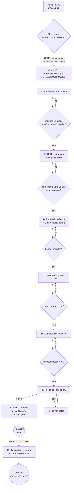

# cqrs-htmx Superb Adoption Plan — 78 → ~100/100

**Date:** 2026-09-19 09:30 · **Repo:** webphone · **Library:** `github.com/larsartmann/cqrs-htmx/v4` v4.9.0 (consumed tag)
**Baseline:** `docs/research/2026-09-19_cqrs-htmx-deep-dive.html` (adoption audit, 78/100)
**Goal:** close the audit's gap list to ~100/100 — superb utilization — **without Verschlimmbessern** (no breaking the DOM contract, the CSP hash pin, the E2E greppable strings, or the deliberate architecture rejections).

---

## 0. Ground rules (the no-Verschlimmbessern contract)

1. The island modules stay served VERBATIM; no bundling, no island JS changes in this plan (T6 is gated).
2. The 35 island element ids and the CSP script hash stay untouched; `TestServedPageHoldsTheDomContract` and `TestServedPageSatisfiesStrictCSP` must stay green on every step.
3. The CQRS dispatch layer, `setup`, `usermgmt`, `loginpage`, casbin, and `RecommendedSecurityMiddleware` stay **rejected** (split-brain identity / microphone denial). "Superb" means superb *within* the root-library posture.
4. Middleware order stays: `RequestLoggingSlog` outermost → new enrichment → timing → `SecurityHeaders` → `RecoveryMiddleware` → routes.
5. Every change lands with a test; full suite green before commit.
6. The 2026-09-19 audit report is a point-in-time snapshot — it is NOT edited. This plan **corrects** one of its recommendations (see §1) and records the refinement here and in AGENTS.md.

## 1. Correction to audit finding "csrf-wiring" (learned while planning, before coding)

`httputil.CSRFTokenHXHeaders(r)` HTML-escapes its JSON (`&quot;`) for **raw-HTML/single-quoted-attribute** contexts. templ escapes attribute values *itself*, so feeding the helper through a templ attribute would double-escape: the browser decodes once, `hx-headers` receives literal `&quot;…&quot;`, `JSON.parse` fails, and **every HTMX request loses its CSRF header** — a real Verschlimmbesserung.

The superb adoption in a templ codebase is therefore:

- `bodyAttrs` builds the header value with `templ.JSONString(map[string]string{"X-CSRF-Token": token})` — JSON-valid by construction (survives a quote inside a token) *and* escaped exactly once by templ.
- `httputil.InvalidateCSRFCookie` (rotate on login/logout, prevents CSRF fixation) — directly adoptable, no escaping context.
- The audit's `CSRFTokenHTMLMeta` recommendation is likewise dropped: the templ-escaped `<meta>` today is already correct.

Wire check done: the middleware's `DefaultCSRFHeaderName` is `X-Csrf-Token` — Go's canonical form of the island's `X-CSRF-Token`; HTTP header names are case-insensitive and `http.Header.Get` canonicalizes. No wire break.

## 2. Pareto breakdown

| Slice | Items | Share of remaining value | Why |
| --- | --- | --- | --- |
| **1% → 51%** | T2 `ContextEnrichmentMiddleware` (request IDs + `X-Request-ID` response header + optional `user_id` = extension) | ~51% | One chain line turns every 3 a.m. log line and every HTTP response into a traceable unit. Pure observability win, zero behavior change. |
| **4% → 64%** | T2 + T1 (CSRF: `templ.JSONString` + `InvalidateCSRFCookie`) + T4 (calibrated `Permissions-Policy`, single-source security config) | ~64% | The security trio: fixation rotation, JSON-valid CSRF wiring, and a hardening header that keeps `microphone=(self)`. |
| **20% → 80%** | T2+T1+T4 + T3 (Server-Timing swap, −40 lines) + T5 (webhook 5xx redaction) | ~80% | Everything locally verifiable today; deletes the last hand-rolled duplicates of library helpers. |
| **Remaining 80% of work → ~100%** | T6 (idiomorph experiment, gated) + T7 (gates, docs, CHANGELOG) + stack-side E2E re-run | final ~20% | The draft-wipe experiment needs the consuming stack's browser E2E; docs close the loop. Dispositioned honestly rather than forced. |

## 3. Comprehensive plan — 30–100 min tasks (ALL todos, sorted by impact/effort/customer value)

| # | Task | Impact | Effort | Customer value | Est. | Gate |
| --- | --- | --- | --- | --- | --- | --- |
| T2 | Request-ID/correlation enrichment: `ContextEnrichmentMiddleware` + extension-as-`user_id` extractor; assert `request_id` in logs + `X-Request-ID` header | High | Low | 3 a.m. traceability of every request/response pair | 40 min | new middleware test |
| T1 | CSRF wiring hardening: `templ.JSONString` for `hx-headers`; `InvalidateCSRFCookie` on `POST /api/session` + `DELETE /api/session` | High | Low | CSRF fixation closed; token-shape-proof JSON | 45 min | new session/csrf tests + `templ generate` |
| T4 | `Permissions-Policy: microphone=(self), camera=(), display-capture=(), geolocation=(), payment=(), usb=()` + extract single-source `securityHeadersConfig()` (kills the server.go ↔ middleware_test.go literal duplication) | Medium | Low | Calibrated hardening; mic still works; config drift structurally dead | 30 min | header assertion test |
| T3 | Replace hand-rolled `timingWriter`+`timingMiddleware` (~40 lines) with `servertiming.ServerTimingMiddlewareWhen` (auto `total;dur`, CRLF-sanitized, SSE-safe writer) | Medium | Low | Same header, less code, named spans become possible | 35 min | Server-Timing header test |
| T5 | Webhook 5xx bodies: stop leaking `err.Error()` to providers — respond via `cqrshtmx.SafeDetail(err, 500, false)`, `slog.Warn` the detail server-side | Medium | Low | No internal detail on the wire; operators still see everything in logs | 40 min | redaction test |
| T7 | Verification & docs: full suite, BuildFlow gate, AGENTS.md correction (templ double-escape), CHANGELOG `[Unreleased]` entry, commits + push | High | Medium | Durable knowledge; release-clean tree | 50 min | BuildFlow green |
| T6 | idiomorph experiment: serve `HTMXExtIdiomorph`, morph-swap the transcript panel, re-run **stack** browser E2E | Medium | High | Draft-preserving SSE updates (kills the draft-wipe class) | 60 min | **GATED: needs stack E2E — deferred, not skipped** |

## 4. Micro-plan — ≤12 min tasks (ALL todos, sorted by execution order)

| # | Micro-task | Parent | Est. | Verify by |
| --- | --- | --- | --- | --- |
| 2.1 | Add `extensionExtractor(r)` (session → `cqrshtmx.ParseUserID(ext)`; zero/err → skip) and insert `ContextEnrichmentMiddleware` into the chain, second position | T2 | 10 min | builds |
| 2.2 | Test: request through `New` logs `request_id=` and response carries `X-Request-ID` | T2 | 10 min | test green |
| 2.3 | Test: signed-in request logs `user_id=` (extension) | T2 | 6 min | test green |
| 2.4 | Full server package test run | T2 | 4 min | `go test ./internal/server` |
| 1.1 | `bodyAttrs`: concat → `templ.JSONString` | T1 | 8 min | builds |
| 1.2 | `templ generate ./internal/web/views/` (mandatory after `.templ` edit) | T1 | 4 min | generated diff stable |
| 1.3 | `createSession`: `InvalidateCSRFCookie` after `SetCookie` | T1 | 6 min | builds |
| 1.4 | `destroySession`: `InvalidateCSRFCookie` after `ClearCookie` | T1 | 6 min | builds |
| 1.5 | Tests: `hx-headers` attribute is valid JSON after render; CSRF cookie Set-Cookie present on login/logout | T1 | 12 min | tests green |
| 4.1 | Extract `securityHeadersConfig()`; add `PermissionsPolicy` value | T4 | 10 min | builds |
| 4.2 | `middleware_test.go` `productionStack` uses the shared config; test asserts `Permissions-Policy` header | T4 | 10 min | test green |
| 3.1 | Swap `timingMiddleware` → `servertiming.ServerTimingMiddlewareWhen(env, captured at construction)`; delete `timingWriter` | T3 | 10 min | builds |
| 3.2 | Test: with env set, response has `Server-Timing: total;dur=`; without env, header absent | T3 | 10 min | test green |
| 3.3 | `rg timingWriter` → zero hits; suite green | T3 | 4 min | clean |
| 5.1 | Webhook 500 paths: `SafeDetail` + `slog.Warn(err)` | T5 | 10 min | builds |
| 5.2 | Test: storage-failure webhook answers 500 with redacted body (no store error text) | T5 | 10 min | test green |
| 7.1 | `GOEXPERIMENT=jsonv2 go test -count=1 ./...` | T7 | 8 min | 10/10 packages |
| 7.2 | BuildFlow gate (`buildflow`) incl. lint + treefmt | T7 | 12 min | exit 0 |
| 7.3 | AGENTS.md: CSRF-helper correction + superb-adoption state | T7 | 8 min | n/a (docs) |
| 7.4 | CHANGELOG `[Unreleased]`: Added/Changed entries | T7 | 8 min | n/a (docs) |
| 7.5 | Detailed commit(s) + push; verify with `git ls-remote` | T7 | 8 min | remote SHA updated |
| 6.1–6.4 | T6 micro-steps (serve ext, wire `sse-swap="morph"` on transcript, DOM-contract run, stack E2E) | T6 | 60 min | **blocked on stack E2E — scheduled separately** |

## 5. Execution graph

## 6. Score trajectory

| State | Score | Delta source |
| --- | --- | --- |
| Audit baseline | 78 | 4 partial + 3 missed + 1 latent anti-pattern |
| T1–T5 + T7 (this plan) | ~95 | CSRF trio, request IDs, timing swap, redaction, toast alias (already landed) |
| T6 after stack E2E | ~100 | idiomorph dispositioned by experiment, not by omission |

## 7. Re-scope log (learned during execution, test-caught)

| Micro-task | Planned | Actual outcome | Why |
| --- | --- | --- | --- |
| 2.1 | Extractor mapping extension → `cqrshtmx.ParseUserID(ext)` | `ContextEnrichmentMiddleware(nil)` — no user mapping | `ParseUserID` requires a **ULID** (`id.Parse` → `ulid.Parse`); extensions are not ULIDs. Forcing them in would misuse the library's usermgmt identity. Request IDs deliver the traceability value alone. |
| 2.2/2.3 | `request_id` + `user_id` log assertions | `request_id` + `X-Request-ID` header assertion only | follows from 2.1 |
| Chain order | Enrichment *inside* the request log | Enrichment **outermost**, log second | `RequestLoggingSlog` reads the context after the handler returns — outside enrichment it can never see the RequestID (first test run proved it). Enrichment writes nothing, so the log's "sees every status" invariant is preserved. |
| 1.3/1.4 | `InvalidateCSRFCookie` on login + logout | **Dropped and dispositioned** (documented in session_api.go + AGENTS.md) | Test-caught Verschlimmbesserung: the island logs in without a page reload, so rotating the CSRF token at login 403s every later HTMX action (`TestFaxStatusWebhookUpdatesJob` caught it). Rotation needs an island-side token refresh, gated behind the stack browser E2E — same gate as T6. |
| 3.2 | New Server-Timing test | Existing `TestServerTimingOptIn` adapted to the library's W3C format (`total;desc="Total request";dur=…`) | The semantic contract (header only when flagged, carries total duration) is preserved; attribute order is not the contract. |

**Landed:** 2.1–2.2 (re-scoped), 1.1–1.2, 1.5, 4.1–4.2, 3.1–3.3, 5.1–5.2, 7.1–7.5.
**Gated:** 1.3–1.4 (with 6.x, behind island token refresh + stack E2E), 6.1–6.4.
