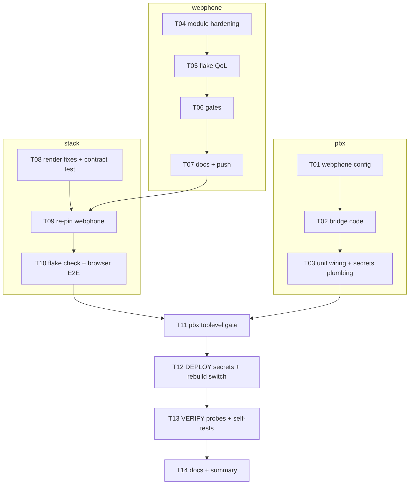

# SUPERB Plan — Tri-repo functional completion (webphone ↔ stack ↔ pbx-artmann)

**Date:** 2026-09-19 11:51 (CEST)
**Input:** `docs/status/2026-09-19_11-02_flake-review-and-tri-repo-integration-audit.md`
**Mission:** make everything from the audit's next-things list perfect and functional, deploy to `pbx.artmann.tech`, and verify — without verschlimmbessern a live PBX.

## Contracts (researched and pinned this session — the bridge implements these exactly)

**webphone outbound → provider** (`internal/gateway/webhook.go`):

- `POST {gateway.webhook_url}/message` — multipart: `kind=message`, `owner`, `to`, `body`, file parts `attachment` — header `Authorization: Bearer <gateway.webhook_secret>`
- `POST {gateway.webhook_url}/fax` — multipart: `kind=fax`, `owner`, `to`, file part `document` (fax.pdf)
- Receipt: 2xx + `{"provider_ref": "..."}` (or bare token ≤256 chars); non-2xx = failure shown to the user

**webphone inbound ← provider** (`internal/server/webhooks.go`, all `Authorization: Bearer <secret>`):

- `POST /hooks/message` — `{owner, from, body, attachments:[{name, mime_type, data_base64}]}` → 202
- `POST /hooks/fax` — `{owner, from, pages, provider_ref?, pdf_base64}` → 202
- `POST /hooks/message/status` — `{provider_ref, status: delivered|failed, error?}`
- `POST /hooks/fax/status` — `{provider_ref, status: transmitted|failed, pages?, error?}`
- Fail-closed without a configured secret (503); hooks are rate-limited per peer host.

**Config keys:** `gateway.mode = loopback|webhook`, `gateway.webhook_url`, `gateway.webhook_secret` (env: `WEBPHONE_GATEWAY__WEBHOOK_SECRET`).

**Secrets model (pbx-artmann):** files under `/var/lib/telephony-secrets`, root-owned; services read them via systemd (`EnvironmentFile` for webphone, `LoadCredential` for the receiver) so no new group-permission surgery is needed; `telephony-secrets-perms.service` heal-loop already chgrps everything `turnserver` + 600 — harmless for root-read mechanisms.

## Pareto breakdown

### The 1% that delivers 51%

1. **pbx-artmann**: `webphone.phoneApi.enable = true` + shared contacts (1000/1001/2000) — two config lines that light up History + Voicemail + Directory for the live deployment.
2. **Deploy + verify** the above (the commanded `nix flake update && nixos-rebuild switch`).

### The 4% that delivers 64% (add)

3. **Messaging bridge**: extend `telnyx-webhooks.py` into a real gateway — inbound Telnyx `message.received` → webphone `/hooks/message`; status events → `/hooks/message/status`; serve `/gateway/message` (+`/gateway/fax` honest 501) for webphone's outbound mode; one shared secret; MMS inbound media fetched size-capped; outbound MMS rejected with an actionable 4xx.
4. **Stack render fixes**: `contactsJson` double-escape; rendered `phoneApi` flag mirrors `phoneApi.enable` only.
5. **webphone module hardening**: `recommendedProxySettings` on the websocket location; `/events` location (buffering off + 3600s) in the module's own vhost; `memoryMax` option; `dataDir` `/var/lib` assertion.

### The 20% that delivers 80% (add)

6. devShell `GOEXPERIMENT`/`GOTOOLCHAIN` attrs; module-check vhost assertions; `nixosModules.webphone` alias; `lib.*` style + `with pkgs` removal; `fileset` src narrowing.
7. Re-pin webphone input in the stack (after push) + full gate suites in webphone and stack (buildflow, go tests, flake check, aarch64 package cross-build, browser E2E against the new pin).
8. Cross-repo config.js contract assertion in the stack's webphone VM test (if not already present).
9. Docs: webphone AGENTS integration facts + TODO harvest + CHANGELOG entries in all three repos.

### The other 20% to reach 100% (owner-action or deliberately deferred — NOT silently dropped)

- **Portal BLOCKEDs (owner only):** attach US DID to a Telnyx messaging profile; create a Telnyx V2 API key (`/var/lib/telephony-secrets/telnyx_api_key`); Warsaw DID re-purchase. Outbound/inbound SMS goes live the moment these land — the bridge is built and wired now.
- **operator.enable + recording.serve.enable on prod:** need owner-pushed password secrets (`telephony_operator_password`, `telephony_recordings`).
- **Stack operator-API polish** (their own TODO, tracked there): HTTP Range for voicemail audio seek, `vm_read` mark-read, auth-failure lockout.
- **webphone v2.1.0 release ceremony** (runbook: fold CHANGELOG, tag, lychee, stack bump) — resolves the `/version` drift; next owner-driven release.
- **Pin policy (tags vs main) + pbx-artmann path→github input** — owner architecture decisions.
- **Inbound fax TIFF→PDF → `/hooks/fax`** feed from the stack's rxfax store — follow-up once messaging is live.

## Medium-granularity plan (30–100 min, impact-sorted)

| #   | Task                                                                                                                                                                                             | Repo        | Impact | Effort | Depends    |
| --- | ------------------------------------------------------------------------------------------------------------------------------------------------------------------------------------------------ | ----------- | ------ | ------ | ---------- |
| T01 | pbx-artmann webphone config: `phoneApi.enable=true`, contacts, gateway (mode/url/settings via env), `environmentFile` wiring                                                                     | pbx-artmann | 🔥🔥🔥 | 45m    | —          |
| T02 | Messaging bridge: `telnyx-webhooks.py` rewrite (inbound→`/hooks/message`, status→`/hooks/message/status`, `/gateway/message`→Telnyx API, `/gateway/fax` 501, LoadCredential secrets) + unit test | pbx-artmann | 🔥🔥🔥 | 100m   | T01        |
| T03 | `generate.sh` secret list + `webhooks.nix` unit wiring (LoadCredential) + docs (AGENTS/CHANGELOG/TODO)                                                                                           | pbx-artmann | 🔥🔥   | 40m    | T02        |
| T04 | webphone module hardening: proxySettings, `/events` location, `memoryMax`, dataDir assertion                                                                                                     | webphone    | 🔥🔥   | 60m    | —          |
| T05 | webphone flake QoL: devShell env attrs, `lib.*`, drop `with pkgs`, alias, fileset src, module-check vhost assertions                                                                             | webphone    | 🔥     | 50m    | T04        |
| T06 | webphone gates: `BUILDFLOW_NO_RESULT_CACHE=1 buildflow`, `GOEXPERIMENT=jsonv2 go test -count=1 ./...`, `nix flake check`, aarch64 pkg, smoke                                                     | webphone    | gate   | 45m    | T04,T05    |
| T07 | webphone docs: AGENTS integration facts, TODO harvest, CHANGELOG Unreleased; commit + push                                                                                                       | webphone    | 🔥     | 30m    | T06        |
| T08 | Stack render fixes (contactsJson, phoneApi flag) + config.js contract assertion in `tests/webphone.nix` (if missing)                                                                             | stack       | 🔥🔥   | 60m    | —          |
| T09 | Re-pin webphone input in stack (verify push landed via `git ls-remote`); stack gates: `nix flake check` + webphone VM test check                                                                 | stack       | gate   | 40m    | T07 (push) |
| T10 | Browser E2E `nix build -L .#telephony-browser` against the new pin; stack docs (CHANGELOG/TODO)                                                                                                  | stack       | gate   | 60m    | T09        |
| T11 | pbx-artmann local gates: toplevel build (x86) + `nix flake check` subset; ensure stack tree clean for re-lock                                                                                    | pbx-artmann | gate   | 30m    | T03,T10    |
| T12 | **Deploy**: SSH-create secrets (`openssl rand`) → `nix flake update` → `nixos-rebuild switch --flake .#pbx --target-host root@pbx.artmann.tech`                                                  | pbx-artmann | 🔥🔥🔥 | 45m    | T11        |
| T13 | **Verify**: probe suite (`/healthz`, `/config.js` phoneApi+contacts, `/` 200, hooks 401/503), service states, loopback `/gateway` self-test, one marked inbound test message                     | prod        | 🔥🔥🔥 | 30m    | T12        |
| T14 | Final docs pass + session summary + report                                                                                                                                                       | all         | 🔥     | 20m    | T13        |

## Fine-granularity plan (≤12 min each, includes ALL todos)

### T01 — pbx config (3 × 12m)

| #   | Step                                                                                                                                                           | Verify      |
| --- | -------------------------------------------------------------------------------------------------------------------------------------------------------------- | ----------- |
| F01 | Add `webphone.phoneApi.enable = true;` + `webphone.contacts` (1000 Lars, 1001 Alice, 2000 Ring group) to `hosts/pbx/default.nix` with rationale comments       | nix eval    |
| F02 | Add `services.webphone.settings.gateway = { mode="webhook"; webhook_url="http://127.0.0.1:8069/gateway"; }` + `environmentFile = "${secretsDir}/webphone_env"` | nix eval    |
| F03 | Sanity: `nix eval` the telephony options resolve (no typos)                                                                                                    | eval output |

### T02 — bridge (8 × 12m)

| #   | Step                                                                                                                                                                                                                    | Verify                   |
| --- | ----------------------------------------------------------------------------------------------------------------------------------------------------------------------------------------------------------------------- | ------------------------ |
| F04 | Read current `telnyx-webhooks.py` once more; design module split (config via env, Telnyx client, normalizer, dispatch) keeping existing endpoints byte-compatible                                                       | —                        |
| F05 | Implement secrets/config plumbing: `LoadCredential` reads (`webphone_secret`, `telnyx_key`), env `WEBPHONE_URL`, `SMS_TO_EXTENSION`, `FROM_NUMBER`                                                                      | unit                     |
| F06 | Implement inbound: parse `message.received`, normalize E164/text/media, size-capped https fetch of media, POST `/hooks/message` (Bearer, 202/2xx tolerance, retry once)                                                 | unit test w/ stub server |
| F07 | Implement status: `message.finalized`/`message.delivery_updated` → `/hooks/message/status` (`delivered`/`failed` mapping incl. `delivery_failed`, `expired`)                                                            | unit                     |
| F08 | Implement `/gateway/message`: multipart parse (kind/owner/to/body/attachment), Telnyx `POST /v2/messages` (JSON, Bearer key), map `data.id` → `provider_ref`; 4xx on attachments (actionable text); 503 when key absent | unit                     |
| F09 | Implement `/gateway/fax`: honest 503 + actionable message (fax not wired to Telnyx yet)                                                                                                                                 | unit                     |
| F10 | Keep `/telnyx/webhooks` logging behavior; forward unknown events to log only; add `/gateway/health`                                                                                                                     | unit                     |
| F11 | Wire tests: `python3 -m unittest` style, stdlib stub HTTPServer; add to repo `tests/` + a NixOS-test-free runner script                                                                                                 | tests green              |

### T03 — unit + secrets plumbing (3 × 12m)

| #   | Step                                                                                                                                 | Verify       |
| --- | ------------------------------------------------------------------------------------------------------------------------------------ | ------------ |
| F12 | `webhooks.nix`: add `LoadCredential`, keep DynamicUser; no new nginx locations needed (loopback hop)                                 | nix eval     |
| F13 | `generate.sh`: add `webphone_gateway_secret`, `webphone_env` (derived), `telnyx_api_key` (empty placeholder note) to the secret list | diff         |
| F14 | Docs: AGENTS bridge section, CHANGELOG, TODO rows                                                                                    | read-through |

### T04 — webphone module hardening (4 × 12m)

| #   | Step                                                                                                 | Verify             |
| --- | ---------------------------------------------------------------------------------------------------- | ------------------ |
| F15 | `recommendedProxySettings = true;` on websocket location                                             | module eval        |
| F16 | Add `/events` location (`proxy_buffering off`, `proxy_read_timeout 3600s`, `proxy_http_version 1.1`) | module eval        |
| F17 | `memoryMax` option (nullOr str, default null) → `serviceConfig.MemoryMax` (mkIf)                     | module eval + test |
| F18 | `dataDir` assertion `hasPrefix "/var/lib/"` + invalid-StateDirectory message                         | eval test          |

### T05 — flake QoL (5 × 12m)

| #   | Step                                                                                                              | Verify           |
| --- | ----------------------------------------------------------------------------------------------------------------- | ---------------- |
| F19 | devShell: `GOEXPERIMENT = "jsonv2"; GOTOOLCHAIN = "local";` attrs (buildflow already sets its own env — additive) | nix develop eval |
| F20 | `pkgs.lib` → `lib` in perSystem (flake-parts provides nixpkgs lib), drop `with pkgs;` in devShell                 | nix flake check  |
| F21 | `nixosModules.webphone` alias                                                                                     | eval             |
| F22 | `src` → `lib.fileset` (go.mod/go.sum/cmd/internal)                                                                | build            |
| F23 | Module-check: assert vhost locations + systemd unit present in evaluated config                                   | check run        |

### T06 — webphone gates (4 × 12m)

| #   | Step                                                                        | Verify |
| --- | --------------------------------------------------------------------------- | ------ |
| F24 | `templ generate` no-op check + `GOEXPERIMENT=jsonv2 go test -count=1 ./...` | green  |
| F25 | `BUILDFLOW_NO_RESULT_CACHE=1 buildflow` (in nix develop)                    | green  |
| F26 | `nix flake check` (x86) + `nix build .#webphone --system aarch64-linux`     | green  |
| F27 | `python3 scripts/webphone-smoke.py`                                         | 21/21  |
| F28 | Commit (detailed) + push + `git ls-remote` confirm                          | pushed |

### T07 — webphone docs (2 × 12m)

| #   | Step                                                                             | Verify |
| --- | -------------------------------------------------------------------------------- | ------ |
| F29 | AGENTS.md: integration-state facts section; TODO_LIST harvest from status report | read   |
| F30 | CHANGELOG Unreleased entry; commit + push                                        | pushed |

### T08 — stack fixes (4 × 12m)

| #   | Step                                                                                  | Verify        |
| --- | ------------------------------------------------------------------------------------- | ------------- |
| F31 | Fix `contactsJson` (drop `escapeJs` inside `toJSON`)                                  | render test   |
| F32 | Fix rendered `phoneApi` → mirror `cfg.webphone.phoneApi.enable` only                  | grep          |
| F33 | Check `tests/webphone.nix` for config.js assertions; add key-set assertion if missing | VM check runs |
| F34 | Stack fmt + `nix flake check` (or targeted checks)                                    | green         |

### T09/T10 — re-pin + E2E (3 × 12m+)

| #   | Step                                                                     | Verify    |
| --- | ------------------------------------------------------------------------ | --------- |
| F35 | `nix flake lock --update-input webphone` in stack (after F28/F30 pushed) | lock diff |
| F36 | `nix flake check` (or the check subset) with new pin                     | green     |
| F37 | `nix build -L .#telephony-browser` (browser E2E, chromium)               | green     |
| F38 | Stack CHANGELOG/TODO + commit + push                                     | pushed    |

### T11 — pbx local gates (2 × 12m)

| #   | Step                                                                                               | Verify  |
| --- | -------------------------------------------------------------------------------------------------- | ------- |
| F39 | `nix build .#nixosConfigurations.pbx.config.system.build.toplevel` (x86)                           | green   |
| F40 | Stack tree clean check (path-lock determinism) + `nix flake update` dry inspect (which nodes move) | inspect |

### T12 — deploy (3 × 12m)

| #   | Step                                                                                                                                                                                                                                                             | Verify             |
| --- | ---------------------------------------------------------------------------------------------------------------------------------------------------------------------------------------------------------------------------------------------------------------- | ------------------ |
| F41 | SSH root@pbx.artmann.tech: create `/var/lib/telephony-secrets/webphone_gateway_secret` (`openssl rand -hex 24`), derive `webphone_env` (`WEBPHONE_GATEWAY__WEBHOOK_SECRET=…`), `telnyx_api_key` placeholder absent-safe; `chgrp turnserver` + 600 via perms unit | files exist, perms |
| F42 | `cd /home/lars/projects/pbx-artmann && nix flake update && nixos-rebuild switch --flake .#pbx --target-host root@pbx.artmann.tech`                                                                                                                               | switch OK          |
| F43 | Watch units: `webphone`, `telephony-operator`, `telnyx-webhooks`, `nginx`, `telephony-web-config`                                                                                                                                                                | all active         |

### T13 — verify (3 × 12m)

| #   | Step                                                                                                                                                                      | Verify   |
| --- | ------------------------------------------------------------------------------------------------------------------------------------------------------------------------- | -------- |
| F44 | Fetch probes: `/healthz` 200 JSON; `/config.js` contains `"phoneApi": true` + contacts; `/` 200; `/telnyx/webhooks` GET 404; `/hooks/message` (no auth) 401               | all pass |
| F45 | Loopback self-tests via SSH: `/gateway/message` without key → 503 actionable; with Bearer but no `telnyx_api_key` → 503 actionable; `/gateway/fax` → 503 actionable       | pass     |
| F46 | One marked inbound test: POST `/hooks/message` (Bearer) with `[bridge-verify 2026-09-19]` from `+0000000000` → 202; SSE/nav badge verified next login (reported to owner) | pass     |
| F47 | Confirm no unit flapping (`systemctl --failed` empty), nginx config test OK                                                                                               | pass     |

### T14 — close out (2 × 12m)

| #   | Step                                                                      | Verify |
| --- | ------------------------------------------------------------------------- | ------ |
| F48 | pbx-artmann CHANGELOG/TODO/AGENTS commit + push; final cross-repo summary | pushed |
| F49 | Annotate status report with outcome appendix (docs-health ANNOTATE style) | done   |

## Execution graph

## Safety rails (live PBX!)

- Every change lands **gated** before the next repo depends on it; no repo-to-repo pin moves on unverified code.
- The stack tree must be **clean** before pbx-artmann's path re-lock (deterministic narHash).
- Secrets only as runtime files; nothing secret in any store path, repo, or log line.
- The bridge **fails closed and actionable** (503 with a "not configured" reason) whenever `telnyx_api_key` is absent — it never 5xx-springs or hangs webphone's UI actions.
- `nixos-rebuild switch` is atomic: a failing switch keeps the running generation.
- One deliberately visible test artifact (F46) is marked and reported for deletion by the owner if unwanted.
- Webphone module changes default to **no-op** for existing consumers (memoryMax null, module nginx untouched unless enabled) — the stack keeps its own vhost and is unaffected until re-pinned.
