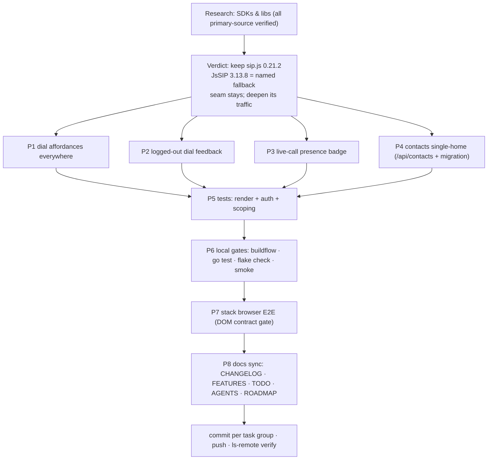

# SUPERB: Island ↔ Server Integration (the seam deepens, never dissolves)

- **Date:** 2026-09-19 19:37
- **Trigger:** owner reaction after the architecture Q&A: the sip.js island
  feels "VERY bad, basically not integrated at all" with the Go side.
- **Mandate:** make the integration SUPERB; research all possible SDKs/libs.
- **Status:** EXECUTED 2026-09-19 (P1–P8 complete; all local gates +
  stack browser E2E green against webphone `a0ce1e6`).

## TL;DR verdict

The seam architecture is correct and stays (calls must survive server deploys
and tab switches; media terminates in the browser). What is missing is seam
_traffic_: every server-rendered screen should be able to reach the phone, the
shell should reflect live call state, and the one real data split brain
(personal contacts: island `localStorage` vs server SQLite) gets consolidated
on the server. The SIP stack stays **sip.js 0.21.2, vendored** — the full SDK
research below confirms there is no better option, with **JsSIP 3.13.8
(actively maintained, May 2026)** documented as the fallback trigger.

## Part 1 — Ground truth audit (read from code, 2026-09-19)

What already exists (the "not integrated at all" feeling is overstated):

| Surface                  | Mechanism                                                          | Stable names                                                       |
| ------------------------ | ------------------------------------------------------------------ | ------------------------------------------------------------------ |
| Identity                 | island POSTs `/api/session`; server verifies against PBX directory | `requireSession`, session TTL store                                |
| Config                   | server renders `/config.js` → `window.PBX_CONFIG`                  | `sipDomain`, `websocketPath`, `iceServers`, `phoneApi`, `contacts` |
| Click-to-call (contacts) | `data-dial` buttons → shell.js pushes into island dial form        | `#dest`, `#dial-form`, shell.js delegated listener                 |
| CSRF live adoption       | `GET /api/csrf` after login/logout rotation                        | `adoptFreshCsrfToken`                                              |
| PBX proxy                | `/phone-api/*` session-gated, rides `PhoneAPI.HTTPClient()`        | `phone-api/history`, `phone-api/voicemail`                         |
| Events                   | SSE on `.wp-root`; island ↔ shell via CustomEvents                 | `wp:lang-changed`, `wp:calls-changed`, `sse-connect`               |

What is genuinely missing (verified in code today):

1. **History tab rows have no call-back** (`CDRRow` renders dir/target/when/
   duration only — no `data-dial`).
2. **Voicemail tab rows have no call-back** (`VoicemailRow` shows
   `vmCaller(msg)` label; `CIDNumber` is available but unused for dialing).
3. **Messages thread view has no call affordance** (thread remote is a
   `domain.PhoneNumber`; no dial button).
4. **`data-dial` dead-ends silently when the island is logged out**: shell.js
   submits `#dial-form` inside the hidden `#phone-view`; the user sees nothing.
5. **No live-call presence in the shell**: `wp:calls-changed` is dispatched by
   `calls.js` but only `ice.js` listens — nav/header show nothing while calls
   run.
6. **Personal contacts split brain (the real one)**: island
   `localStorage["pbx-contacts"]` (`CONTACTS_KEY` in panels.js, written by the
   history row ☆ button) vs the Contacts tab's per-extension SQLite store —
   two homes for the same fact, never synced. (History is NOT a split brain:
   island = local session log + same server CDR via `/phone-api/history`.)

## Part 2 — SDK / library research (all claims primary-source verified 2026-09-19)

| Candidate                       | Role                            | Verified state                                                                                                                                                                                                                       | Verdict                                                                                                                                                                                                                                                                                                                                                                                                      |
| ------------------------------- | ------------------------------- | ------------------------------------------------------------------------------------------------------------------------------------------------------------------------------------------------------------------------------------ | ------------------------------------------------------------------------------------------------------------------------------------------------------------------------------------------------------------------------------------------------------------------------------------------------------------------------------------------------------------------------------------------------------------ |
| **sip.js** `onsip/SIP.js`       | browser SIP stack (current)     | npm `latest` = **0.21.2** (published 2022-10-27); repo not archived, pushed 2026-06-15, 2097 stars, MIT. No release in ~4 years.                                                                                                     | **KEEP.** Proven island, raw `UserAgent` API, watchdog covers the 0.x reconnect hang.                                                                                                                                                                                                                                                                                                                        |
| **JsSIP** `versatica/JsSIP`     | browser SIP stack (alternative) | npm `latest` = **3.13.8** (published ~2026-05-06, npm metadata; registry tarball `jssip-3.13.8.tgz`); repo pushed 2026-05-06, 2603 stars; npm license MIT (GitHub license field is `NOASSERTION` — MIT-with-exception historically). | **Documented fallback.** This is NEW information vs the 2026-09-18 sip.js-0.22 evaluation (which only checked sip.js): JsSIP is the actively maintained stack. Swap trigger: sip.js breaks in modern Chromium (WebRTC API removals), a security advisory lands, or a needed capability (e.g. video) forces it. Swapping = rewrite of the island call path + full stack E2E re-run; never done speculatively. |
| sipML5 `DoubangoTelecom/sipml5` | browser SIP stack (legacy)      | GitHub API: `archived: true`, last push 2020-12-18.                                                                                                                                                                                  | Dead. Excluded.                                                                                                                                                                                                                                                                                                                                                                                              |
| Other browser SIP stacks        | —                               | Web sweep (AI search, labeled lead): everything else viable is an _app_ built on sip.js/JsSIP (SaraPhone/niliphone, CloudSIP, Browser-Phone v0.3). No third maintained stack exists.                                                 | Confirms the two-stack ecosystem.                                                                                                                                                                                                                                                                                                                                                                            |
| **emiago/sipgo**                | Go SIP signaling                | GitHub API: BSD-2-Clause, 1068 stars, pushed 2026-09-17 — very active.                                                                                                                                                               | Rejected for this product: a Go-side UA still terminates media in the browser (Go has no microphone), so it only adds a stateful signaling proxy in the hottest path.                                                                                                                                                                                                                                        |
| **pion/webrtc**                 | Go WebRTC (media)               | GitHub API: MIT, 16786 stars, pushed 2026-09-18.                                                                                                                                                                                     | Rejected: would turn webphone into a B2BUA/SBC — codec work, bandwidth, latency, and a rebuild of the proven island.                                                                                                                                                                                                                                                                                         |
| FreeSWITCH ESL (Go)             | server-side call orchestration  | GitHub search "freeswitch esl": top clients are Java (`esl-client/esl-client`, pushed 2022), Python (`switchio`), Node (`node-esl`). No prominent maintained Go client in top results.                                               | Not adopted. If server-initiated calls (originate/click-to-call from other systems) ever become a product need, prefer the stack/PBX layer (it already records + bridges webhooks), not ESL inside webphone. ROADMAP idea.                                                                                                                                                                                   |

**Decision record:** stay on vendored sip.js 0.21.2; JsSIP 3.13.8 is the named
fallback with explicit triggers; all Go-side telephony remains rejected —
integration work targets seam traffic (events + affordances + one data home),
never the media path.

## Part 3 — Pareto breakdown

### The 1% that delivers 51%

**Dial affordances everywhere + honest feedback.** `data-dial` on history
rows, voicemail rows, thread headers; a visible toast + login focus when the
island is logged out. Three templ edits, one shell.js guard, i18n keys. After
this, no screen in the product is more than one click from a call — the single
strongest killer of the "two apps" feeling.

### The 4% that delivers 64%

1. **Live-call presence in the shell** — shell.js listens to the existing
   `wp:calls-changed` CustomEvent and badges the header ("on call", count).
   Zero server changes; the shell finally _reacts_ to the phone.
2. **Personal contacts single-home** — new session-gated JSON endpoints
   (`/api/contacts`) over the existing per-extension store; island panel reads
   and writes them; one-time idempotent migration imports
   `localStorage["pbx-contacts"]` then clears it. Kills the only true data
   split brain.

### The 20% that delivers 80%

Tests (render assertions for every new affordance, `/api/contacts` auth +
scoping), full local gates (buildflow, `go test`, `nix flake check`, smoke),
the stack browser E2E re-run (the DOM contract gate), and the docs sync
(CHANGELOG, FEATURES, TODO_LIST, AGENTS decision record, ROADMAP).

### The other 20% to reach 100%

Explicit non-goals written down so nobody re-litigates: no sip.js swap, no
server-side media, no ESL, no i18n dictionary merge (two dictionaries stay —
JS island vs Go views — an accepted cost), no changes to pinned DOM ids or
E2E-greppable strings, PBX_CONFIG `contacts` stays as offline fallback.

## Part 4 — Comprehensive plan (medium tasks, 30–100 min each)

Sorted by importance → impact → effort → customer value.

| ID | Task                                                                                                                                                                                                                      | Why (customer value)                                      | Impact    | Effort | Est  |
| -- | ------------------------------------------------------------------------------------------------------------------------------------------------------------------------------------------------------------------------- | --------------------------------------------------------- | --------- | ------ | ---- |
| P1 | Dial affordances: `data-dial` on History `CDRRow`, Voicemail `VoicemailRow` (guard `CIDNumber != ""`), Messages thread header                                                                                             | every screen can call; redial/callback in one click       | Very High | S      | 60m  |
| P2 | Logged-out dial feedback: shell.js detects hidden `#phone-view` on `data-dial`, shows toast in `#toasts`, focuses `#ext`                                                                                                  | kills the silent dead-end                                 | High      | S      | 45m  |
| P3 | Live-call presence: shell.js listens `wp:calls-changed`, header badge with call count + CSS                                                                                                                               | shell reacts to the phone live                            | High      | S      | 50m  |
| P4 | Contacts single-home: `GET/POST/DELETE /api/contacts` (JSON, session-gated, extension-scoped), island `panels.js` switches to it, one-time localStorage migration (dedupe name+number, clear only after confirmed import) | one home per fact; contacts survive browser loss          | Very High | M      | 100m |
| P5 | Tests: render assertions (data-dial per tab), `/api/contacts` auth/scoping/shape, i18n key sync auto-covers new keys                                                                                                      | the contract tripwire grows with the product              | High      | S      | 60m  |
| P6 | Local gates: `buildflow` (no cache), `go test -count=1 ./...`, `nix flake check`, smoke script                                                                                                                            | nothing ships unverified                                  | Gate      | S      | 40m  |
| P7 | Stack browser E2E re-run (`nix build -L .#telephony-browser` in the stack checkout)                                                                                                                                       | THE island regression gate for any markup/behavior change | High      | S      | 45m  |
| P8 | Docs sync: CHANGELOG (Unreleased), FEATURES integration section, TODO_LIST harvest, AGENTS decision record (JsSIP fallback + contacts single-home), ROADMAP server-telephony rejection note                               | future sessions start informed                            | Required  | S      | 40m  |

## Part 5 — Fine breakdown (each ≤ 12 min)

Sorted by importance → impact → effort → customer value.

| #   | Task (≤12 min)                                                                                                                     | Maps to |
| --- | ---------------------------------------------------------------------------------------------------------------------------------- | ------- |
| f1  | `history.templ` `CDRRow`: add `data-dial` button (reuse `contacts.call` key)                                                       | P1      |
| f2  | `voicemail.templ` `VoicemailRow`: `data-dial` guarded on `msg.CIDNumber`                                                           | P1      |
| f3  | `messages.templ` thread view header: dial button with `Remote.String()`                                                            | P1      |
| f4  | i18n keys in BOTH maps (en/de) if new; `templ generate ./internal/web/views/`; views tests                                         | P1      |
| f5  | shell.js: `data-dial` guard — `#phone-view` hidden → toast into `#toasts` + focus `#ext`                                           | P2      |
| f6  | shell.js: `wp:calls-changed` listener → header badge (count of live calls)                                                         | P3      |
| f7  | `app.css`: badge/dot + toast styles (shell territory; no island style.css edits)                                                   | P2/P3   |
| f8  | island/shell format + no-undef gate: prettier scope check, `nix flake check` island-lint                                           | P2/P3   |
| f9  | server: `GET /api/contacts` JSON `{personal, shared}` via `requireSession`, extension-scoped store reads                           | P4      |
| f10 | server: `POST /api/contacts`, `DELETE /api/contacts?id=` (JSON mirror of store ops; CSRF via island `authedFetch`)                 | P4      |
| f11 | island `panels.js`: `loadContacts()` from `/api/contacts` post-login; config `sharedContacts` stays as failure fallback            | P4      |
| f12 | island `panels.js`: ☆ save + delete buttons call the API (optimistic update + re-fetch on next render)                             | P4      |
| f13 | island: one-time migration `pbx-contacts` → server (dedupe name+number; `removeItem` only after confirmed import; one `#log` line) | P4      |
| f14 | Go tests: `/api/contacts` 401 anonymous, cross-extension isolation, JSON shape                                                     | P5      |
| f15 | Go tests: history/voicemail/thread partials render `data-dial` (count per row)                                                     | P5      |
| f16 | `GOEXPERIMENT=jsonv2 go test -count=1 ./...` green                                                                                 | P6      |
| f17 | `nix develop` → `BUILDFLOW_NO_RESULT_CACHE=1 buildflow` green                                                                      | P6      |
| f18 | `nix flake check` + `python3 scripts/webphone-smoke.py` green                                                                      | P6      |
| f19 | stack checkout: `nix build -L .#telephony-browser` green; record wall-time vs 151s baseline                                        | P7      |
| f20 | CHANGELOG `Unreleased`: dial everywhere, presence, contacts single-home                                                            | P8      |
| f21 | FEATURES.md: integration rows upgraded (PARTIALLY → FULLY where true)                                                              | P8      |
| f22 | TODO_LIST: harvest + mark done items                                                                                               | P8      |
| f23 | AGENTS.md: JsSIP 3.13.8 fallback decision + contacts single-home invariant                                                         | P8      |
| f24 | ROADMAP.md: server-side telephony (originate/ESL) rejected-for-now note with research pointers                                     | P8      |
| f25 | explicit commits per task group; push; verify `git ls-remote`                                                                      | all     |

## Part 6 — Execution graph

P1–P4 are independent and can execute in parallel; P5 starts as soon as the
first of them lands; P6→P7→P8 are strictly sequential.

## Part 7 — Verschlimmbessern guards (hard)

1. **No pinned DOM id changes**: all 35 contract ids (`reg-status`,
   `vm-wrap`, `history-list`, `contacts-wrap`, `#toasts`, …) and E2E-greppable
   strings stay byte-identical; `TestServedPageHoldsTheDomContract` must stay
   green untouched.
2. **No sip.js changes**: no bundle swap, no `update.sh` run, no reconnect
   logic edits. The media/signaling path is frozen for this plan.
3. **Island module graph stays acyclic**: new listeners live in shell.js
   (shell territory) or existing island modules; `internal/arch/arch_test.go`
   and island-lint (no-undef) must stay green.
4. **Migration is idempotent and non-destructive**: localStorage is cleared
   only after the server confirmed the import; a failed import keeps the local
   list working (config fallback path stays).
5. **Existing routes unchanged**: `/contacts/save|import|delete|export` keep
   their HTML-partial contract; `/api/contacts` is additive JSON.
6. **No new inline scripts / CSP changes**: everything rides shell.js,
   app.css, templ — the strict-CSP test must stay green without edits.
7. **`#log` stays English**; island i18n additions go in the island's own
   dictionary, tab strings in `views/i18n.go` (both en + de — the sync test
   enforces).
8. **Rollback**: every task group is an independent commit; reverting any one
   must not break the others (affordances, presence, contacts API are
   orthogonal).

## Part 8 — Verification gates (definition of done)

- [ ] `GOEXPERIMENT=jsonv2 go test -count=1 ./...` green
- [ ] `BUILDFLOW_NO_RESULT_CACHE=1 buildflow` green (inside `nix develop`)
- [ ] `nix flake check` green (includes island-lint + treefmt)
- [ ] `python3 scripts/webphone-smoke.py` green (21 checks)
- [ ] Stack `nix build -L .#telephony-browser` green (DOM contract + media
      proof `window.__pcs`)
- [ ] Manual loopback smoke: dial from History tab while island logged out →
      toast + focus; logged in → keypad dials; ☆ save lands in the Contacts
      tab; header badge appears during a call
- [ ] Docs synced (CHANGELOG/FEATURES/TODO_LIST/AGENTS/ROADMAP), committed
      per task group, pushed, `git ls-remote` verified

## Non-goals (do not creep)

sip.js swap or bump · server-side media/SBC (pion) · Go SIP UA (sipgo) ·
FreeSWITCH ESL in webphone · merging the two i18n dictionaries · unifying
island voicemail/history panels with their tabs (both already share data
sources; ids are E2E-pinned) · theming the island with templ-components.
