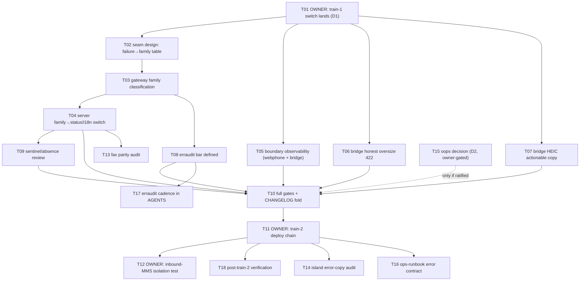

# SUPERB — webphone + bridge error excellence (2026-09-22 01:20)

## Why this plan exists

The owner re-ran erraudit after the 2026-09-21 triage and the verdict was
"still looks so so". The triage was correct — 202 findings, zero real
defects, every suppression reasoned — but "no defects" is not the same as
"a great error architecture". What is "so so":

1. **The error hierarchy is flat and ad-hoc** (`erraudit tree`: 4 named
   errors, 0 relationships). The classification that DOES exist
   (`ErrInvalidSend` → 422, `ErrProviderRejected` → 502, transport → 502
   generic) is a hand-rolled mapping duplicated across the message and fax
   handlers in `internal/server/actions.go`.
2. **Boundary errors are swallowed silently** — mid-stream `io.Copy` /
   `w.Write` failures, skipped contact-import cards, bridge inbound
   media-fetch failures: all invisible to the operator.
3. **The bridge still answers dishonestly at its size limits** — an
   oversized MMS dies as a truncated-multipart 400, HEIC (the iPhone
   default!) as an "unsupported type" wall.
4. **The erraudit bar is undefined** — nobody has written down WHICH
   flags this repo enforces, so every session re-litigates the 114
   policy findings.

**Not in scope (owner-gated / separate):** samber/oops adoption (open
owner question — see "Deferred"), the Telnyx fraud ticket, IPv6 pin,
key rotation. This plan is the error work only.

## Grounding (verified this session)

- `github.com/larsartmann/go-error-family` (local checkout
  `~/projects/go-error-family`): six families — **Rejection, Conflict,
  Transient, Corruption, Infrastructure, Orchestration**; constructors
  `errorfamily.New<Family>(code, message)` + `.WithContext(k, v)`;
  `errorfamily.Classify(err)` / `IsRetryable(err)`; zero third-party
  deps, Go 1.26+, errors.AsType-based. Its README explicitly positions
  it as **complementary** to samber/oops: libraries classify (families),
  applications enrich (oops). That resolves the oops tension: adopt
  families for BEHAVIOR now, oops only later and only if enrichment is
  ever wanted.
- erraudit flags the owner uses: `--type-aware --enforce-go-error-family
  --no-suppress --enforce-samber-oops --enforce-generic-return`. Only
  `--enforce-go-error-family` maps to an adopted convention once this
  plan lands; oops/generic-return stay documented non-fixes until the
  owner says otherwise.
- User-visible error text is a CONTRACT: the webphone renders the
  bridge's error strings verbatim (2026-09-21 self-send burn); i18n keys
  `err.messageRejected/messageTransport/faxRejected/faxTransport` are
  pinned by tests + the new EN/DE format-verb parity test. **No family
  refactor may change a single rendered string.**

## Dependency gates

- **D1 — the pending switch lands FIRST.** Train 1 (MMS bridge, error
  honesty, CSP fix, i18n) is committed but undeployed (owner-actions
  Part 6.2). All code in this plan queues as train 2; starting it before
  the switch grows the undeployed delta — verschlimmbesser risk.
- **D2 — oops is owner-gated.** Do not touch `go.mod` for oops.
- **D3 — inbound-MMS isolation test** (owner, carrier phone) gates the
  GV verdict and any inbound error-copy work.

## Pareto breakdown

### The 1% that delivers 51%

**Family-typed classification at the seams.** Exactly two seams produce
every outbound failure the user can see: the gateway (`post`,
`SendMessage`, `SendFax`) and the services (`messaging.Send`,
`fax.Send`). Introduce go-error-family there and ONLY there:

| failure today                       | family           | why                                  |
| ----------------------------------- | ---------------- | ------------------------------------ |
| `ErrInvalidSend` (validation)       | Rejection        | user's input; not retryable          |
| `ErrProviderRejected` 4xx           | Rejection        | provider refused the request content |
| provider 5xx                        | Transient        | their side; retry later              |
| transport (dial refused, timeout)   | Transient        | retryable by nature                  |
| store/SQLite failures               | Infrastructure   | our side; not retryable by user      |
| `ErrNotFound` / `ErrThreadNotFound` | (stay sentinels) | absence is not an error family       |

`actions.go` then maps **family → (HTTP status, i18n key, retry advice)**
in ONE switch instead of two ad-hoc type-ladders. The AGENTS
failure→feedback table becomes type-enforced. ~6 call sites, one new
import, zero rendered-string changes.

### The 4% that delivers 64%

1. **Boundary observability** — log (never change behavior) at the four
   silent boundary classes: mid-stream body-write failures, import-card
   skips (count + first reason), bridge inbound media-fetch failures,
   staged-media store/fetch events. All are currently `//nolint`'d as
   "nothing to do" — true for the RESPONSE, false for the LOG.
2. **Bridge honest limits** — Content-Length pre-check → honest 422
   (kills the truncated-400); HEIC/unsupported copy that names the fix
   ("iPhone: switch camera format to 'Most Compatible' or send JPG").

### The 20% that delivers 80%

3. **A defined erraudit bar** — write the enforced invocation into the
   repo (documented skip in `.buildflow.yml` style + AGENTS), so a green
   run MEANS something: `--type-aware --enforce-go-error-family` gates;
   oops/generic-return are audit-only until the owner decides.
4. **Absence/sentinel cleanup** — review `ErrNotFound` vs
   `ErrThreadNotFound` vs `sql.ErrNoRows` flows and the one
   `errors.Join` site; keep only where callers actually branch.
5. **Full gates + train 2 release** — buildflow no-cache, flake check,
   smoke, CHANGELOG fold, then the owner's push→bump→relock→switch.
6. **Post-train verification** — rejection banner E2E, bridge contract
   suite, CSP-spam-gone confirmation.

### The other 20% (to 100%)

7. Fax error parity audit (same family flow as messaging).
8. Island error-copy audit (i18n error strings vs the #log policy).
9. Sibling ops-runbook error-contract section.
10. oops staged-adoption plan — ONLY if the owner ratifies (D2).
11. Monthly erraudit audit cadence recorded in AGENTS.
12. generic_return typing — only-where-branching analysis (expect: zero
    sites need it; document the conclusion, change nothing).

## Comprehensive plan — tasks of 30–100 min (sorted: importance / impact / effort / customer value)

| #   | Task                                                                                                   | Size | Impact   | Depends | Notes                                       |
| --- | ------------------------------------------------------------------------------------------------------ | ---- | -------- | ------- | ------------------------------------------- |
| T01 | OWNER: land train-1 switch (Part 6.2) + post-switch checks (CSP gone, rejection banner, MMS send test) | 15m  | Critical | —       | Unblocks ALL code below (D1)                |
| T02 | Design the seam classification: adopt go-error-family; map every gateway/service failure (table above) | 90m  | Critical | T01     | Decision record + failing tests FIRST       |
| T03 | Implement family classification in `internal/gateway` (post/SendMessage/SendFax) + tests               | 60m  | High     | T02     | Rendered strings unchanged (tests pin them) |
| T04 | `actions.go` consumes family → (status, i18n key, retry advice) in ONE switch + tests                  | 60m  | High     | T03     | Keep ErrInvalidSend fast-path 422           |
| T05 | Boundary observability sweep: log mid-stream writes, import skips, bridge media failures (both repos)  | 45m  | High     | T01     | Logs only; zero behavior change             |
| T06 | Bridge: Content-Length pre-check → honest 422 for oversize MMS (kills truncated-400) + tests           | 30m  | Med      | T01     | pbx repo; rides train 2 switch              |
| T07 | Bridge: HEIC/unsupported-type actionable copy + test                                                   | 30m  | Med      | T01     | iPhone users hit this TODAY                 |
| T08 | Define the erraudit bar: enforced flags documented, audit-only flags marked, AGENTS + config           | 30m  | Med      | T03     | "green" must mean something                 |
| T09 | Absence/sentinel cleanup review (NotFound vs ThreadNotFound vs sql.ErrNoRows; errors.Join site)        | 30m  | Low      | T04     | Only-where-branching; expect zero changes   |
| T10 | Full gates: `BUILDFLOW_NO_RESULT_CACHE=1 buildflow`, `nix flake check`, smoke + CHANGELOG fold         | 45m  | High     | T04–T09 | Train 2 gate                                |
| T11 | OWNER: train-2 deploy chain (push → sibling bump → relock → probe → switch)                            | 15m  | High     | T10     | Same ritual as Part 6.2                     |
| T12 | OWNER: inbound-MMS isolation test (carrier phone → DID) + GV verdict into FEATURES/AGENTS              | 10m  | High     | T11     | D3                                          |
| T13 | Fax error parity audit vs messaging (family flow, honesty, i18n)                                       | 30m  | Low      | T04     | Same patterns, smaller surface              |
| T14 | Island error-copy audit (i18n error strings, toast wording vs #log policy)                             | 45m  | Low      | T11     | island-tests + served-asset checks          |
| T15 | oops decision record; IF ratified: separate staged-adoption plan doc                                   | 20m  | Low      | —       | D2; do NOT improvise the refactor           |
| T16 | Sibling ops-runbook: error-contract section (bridge strings verbatim, status semantics, families)      | 30m  | Low      | T11     | Operator reference                          |
| T17 | Record monthly erraudit audit cadence in AGENTS                                                        | 10m  | Low      | T08     | Keeps the bar from rotting                  |
| T18 | Post-train-2 verification: rejection banner E2E, bridge contract suite, erraudit green on enforced set | 20m  | Med      | T11     | Closes the loop                             |

## Fine breakdown — every task at ≤ 12 min (sorted the same way)

| ID    | Atomic step                                                                            | Est | Parent |
| ----- | -------------------------------------------------------------------------------------- | --- | ------ |
| F01.1 | Run Part 6.2 chain; confirm switch + probe output                                      | 12m | T01    |
| F01.2 | Browser: CSP spam gone, self-send shows 40310 reason, image send works                 | 6m  | T01    |
| F02.1 | Read go-error-family `error.go`/`classify.go` end-to-end (contract only)               | 12m | T02    |
| F02.2 | Write the failure→family table for ALL gateway/service error sites (audit)             | 12m | T02    |
| F02.3 | `go get github.com/larsartmann/go-error-family`; go.mod hygiene via buildflow          | 8m  | T02    |
| F02.4 | Failing tests: Classify(err) expectations per site (table-driven skeleton)             | 12m | T02    |
| F02.5 | Decision record: seam list + family table into this doc's appendix                     | 10m | T02    |
| F03.1 | gateway.post: non-2xx → Rejection (4xx) / Transient (5xx) wrapping ErrProviderRejected | 12m | T03    |
| F03.2 | gateway.post: transport errors → Transient (wrap, keep detail)                         | 12m | T03    |
| F03.3 | SendMessage/SendFax: form-build failures → Infrastructure                              | 8m  | T03    |
| F03.4 | Subtests: family survives %w wrapping (AsType through the chain)                       | 12m | T03    |
| F03.5 | Run gateway + server suites; fix fallout                                               | 12m | T03    |
| F04.1 | Extract `classifyForUser(err) (status, i18nKey)` helper in server                      | 12m | T04    |
| F04.2 | Rewire message handler to the helper; strings byte-identical (test diff)               | 12m | T04    |
| F04.3 | Rewire fax handler to the helper; strings byte-identical (test diff)                   | 12m | T04    |
| F04.4 | Pin: unknown error → 502 generic + logged family (test)                                | 10m | T04    |
| F05.1 | Log mid-stream copy/write failures (server, 6 sites: one-line slog)                    | 12m | T05    |
| F05.2 | Import skips: count + first reason into one log line                                   | 10m | T05    |
| F05.3 | Bridge: log inbound media-fetch failures (pbx) + test                                  | 12m | T05    |
| F05.4 | Bridge: log staged-media store + fetch events + test                                   | 10m | T05    |
| F06.1 | Bridge: read Content-Length before body; > cap → 422 honest text                       | 12m | T06    |
| F06.2 | Test: 9 MiB body → 422 with "1 MB" wording (not 400)                                   | 10m | T06    |
| F07.1 | HEIC magic bytes (ftyp heic/heix/hevc) detection → distinct 422 copy                   | 12m | T07    |
| F07.2 | Copy: name the iPhone fix ("Settings → Camera → Formats → Most Compatible")            | 8m  | T07    |
| F07.3 | Tests: HEIC 422 wording; generic-unsupported stays                                     | 10m | T07    |
| F08.1 | Write the enforced invocation (type-aware + go-error-family) into AGENTS               | 12m | T08    |
| F08.2 | Mark oops/generic-return audit-only in AGENTS + .buildflow.yml skip note               | 10m | T08    |
| F08.3 | Run the enforced set → must be green (or plan the gap)                                 | 8m  | T08    |
| F09.1 | Grep all ErrNotFound/ErrThreadNotFound/sql.ErrNoRows consumers; tabulate               | 12m | T09    |
| F09.2 | Review errors.Join site (contacts) for AsType-survival; test if unclear                | 12m | T09    |
| F09.3 | Document conclusion (expect: no change); close task                                    | 6m  | T09    |
| F10.1 | `BUILDFLOW_NO_RESULT_CACHE=1 buildflow` inside devShell; fix findings                  | 12m | T10    |
| F10.2 | `nix flake check` (templ/island/kvm gates); fix fallout                                | 12m | T10    |
| F10.3 | `python3 scripts/webphone-smoke.py`; fix fallout                                       | 12m | T10    |
| F10.4 | CHANGELOG fold + FEATURES/TODO sync                                                    | 12m | T10    |
| F11.1 | OWNER: push, sibling bump, relock, lock-drift-probe, diff-closures, switch             | 12m | T11    |
| F12.1 | OWNER: carrier-phone MMS → DID; check thread + webhook log                             | 10m | T12    |
| F12.2 | Record GV verdict in FEATURES/AGENTS                                                   | 8m  | T12    |
| F13.1 | Audit fax paths against the message family flow; list gaps                             | 12m | T13    |
| F13.2 | Fix gaps (if any) + tests                                                              | 12m | T13    |
| F14.1 | Inventory island error strings (i18n en/de + toasts) vs policy                         | 12m | T14    |
| F14.2 | Fix wording drift + island tests                                                       | 12m | T14    |
| F15.1 | Owner decision: adopt oops or ratify non-fix; record in AGENTS                         | 8m  | T15    |
| F15.2 | IF adopted: write separate staged plan doc (not this train)                            | 12m | T15    |
| F16.1 | Draft ops-runbook error-contract section                                               | 12m | T16    |
| F16.2 | Cross-link from webphone AGENTS bridge section                                         | 6m  | T16    |
| F17.1 | AGENTS: monthly erraudit audit line                                                    | 6m  | T17    |
| F18.1 | Post-switch: rejection banner E2E + bridge suite + enforced erraudit green             | 12m | T18    |

## Execution graph

## Verschlimmbesser guardrails

1. **No rendered error string may change** — tests byte-pin the user
   text; any diff is a build failure, not a review note.
2. **No new dependencies beyond go-error-family** (zero-dep, owner's own
   lib, already vetted by erraudit's own flag).
3. **Train discipline**: nothing starts before T01 lands; T10 gates the
   train; the owner deploys.
4. **Sentinels stay sentinels** — absence is not an error family; no
   blanket typing of every function signature (the generic_return
   findings stay audit-only).
5. **Logs, not behavior**: the observability sweep may only ADD log
   lines.

## Appendix: current state (for the executing session)

- erraudit enforced-set status TODAY: 0 real defects; 46 ignored-error
  sites + 2 swallows + 6 read-side closes documented; `errors.As` fully
  migrated to `errors.AsType`; tree: 4 sentinels, depth 0.
- Bridge suite 25/25; webphone 11 packages green; both-arch toplevel
  eval + build green; pending closure byte-truth verified
  (`5x7f1a0x…-telnyx-webhooks.py` + `PUBLIC_BASE_URL` + nginx
  `/mms-media/`).
- Open owner questions carried over: oops ratification (D2), inbound-MMS
  isolation test (D3), +14084757593 ownership.

## Appendix: T02 decision record (executed 2026-09-22, train 2)

D1 waiver: the owner ordered train-2 execution before the train-1 switch
landed ("get the whole TODO list done") — the undeployed delta grows
deliberately; T11 still gates deployment.

Failure→family table as IMPLEMENTED (codes pin that classification is
ours — the library default would tag any untagged error Transient):

| Site (file)                                               | Code                                                                      | Family                                | Mechanism                                                                                                          |
| --------------------------------------------------------- | ------------------------------------------------------------------------- | ------------------------------------- | ------------------------------------------------------------------------------------------------------------------ |
| gateway `post` transport (`client.Do`)                    | `gateway.transport`                                                       | Transient                             | `WrapTransientf`                                                                                                   |
| gateway `post` request build (bad URL from config)        | `gateway.request`                                                         | Infrastructure                        | `WrapInfrastructuref`                                                                                              |
| gateway `post` receipt read + decode                      | `gateway.receipt`                                                         | Transient                             | `WrapTransientf` (truncated 2xx plausible; retry cheap)                                                            |
| gateway `SendMessage`/`SendFax` form build, PDF open      | `gateway.form`                                                            | Infrastructure                        | `WrapInfrastructuref` (our blob/paths)                                                                             |
| gateway non-2xx → `*ErrProviderRejected`                  | — (type untyped)                                                          | Rejection (4xx/3xx) / Transient (5xx) | implements `Classified` (`ErrorFamily()`); NOT wrapped — its `Error()`/`Detail` strings are pinned + user-rendered |
| messaging `ErrInvalidSend`                                | —                                                                         | Rejection                             | implements `Classified`; Reason stays the rendered copy                                                            |
| fax `ErrInvalidFax`                                       | —                                                                         | Rejection                             | implements `Classified`; Reason stays the rendered copy                                                            |
| messaging.Send store failures (thread/attachment/persist) | `store.thread_resolve` / `store.attachment_save` / `store.message_append` | Infrastructure                        | `WrapInfrastructuref`                                                                                              |
| fax.Send store failures (spool/create)                    | `store.fax_spool` / `store.fax_create`                                    | Infrastructure                        | `WrapInfrastructuref`                                                                                              |

Decisions that fell out of execution:

1. **`classifyForUser` is total, not pure-family.** A 4xx provider answer
   classifies Rejection but its PINNED surface is 502-with-detail (the
   2026-09-21 self-send burn); the helper therefore answers 502 for
   `*ErrProviderRejected` BEFORE consulting the family. First test run
   caught the drift (422 for a provider refusal) — kept as a pin.
2. Families survive `fmt.Errorf("gateway: %w", …)` service wraps by
   chain-walking (`errors.AsType[Classified]`) — pinned in
   `internal/gateway/family_test.go`.
3. Log strings preserved verbatim per lane (`message|fax send rejected
   by provider`, `… send gateway failure`) via the `lane` parameter; the
   family rides the log line as a field (`family=rejection`).
4. Test homes: `internal/gateway/family_test.go` (post lanes + wrap
   survival + type visibility), `internal/messaging/family_test.go`,
   `internal/fax/family_test.go` (validation → Rejection through wraps),
   `internal/server/classify_test.go` (family→status table + unknown →
   502 generic).

## Execution status (2026-09-22, this train)

Executed in one session by owner instruction ("get the whole TODO list
done"), waiving D1's wait-for-switch ordering:

- DONE: T02, T03, T04 (families at the seams + one ladder), T05
  (boundary logs webphone AND bridge), T06 (oversize 422 pre-check),
  T07 (HEIC fix-the-phone copy), T08 (erraudit bar, enforced set
  green), T09 (sentinel review — one DEAD sentinel removed:
  `messaging.ErrThreadNotFound`; `store.ErrNotFound`/`sql.ErrNoRows`
  earn their keep; the `errors.Join` site survives `errors.Is` by
  construction), T13 (fax parity: structural now — one shared ladder;
  asymmetry note: fax persists `job.Error`, messages do not),
  T14 (island error copy: en/de parity test-enforced, 9/9 island tests
  green, no drift found), T16 (ops-runbook § "Webphone error contract"
  - AGENTS cross-link), T17 (monthly cadence line in AGENTS).
- T10 gates: webphone buildflow 52 success / 0 failed (no-cache);
  13 packages `go test` green; key flake checks re-built
  (webphone sandbox tests, island-lint, format); smoke 38+4 green.
  pbx-artmann: 31 bridge + 8 reconcile + 3 backup tests green;
  ruff/nix fmt clean; both-arch toplevel eval green + x86 build green
  with byte-truth (new bridge store path `x6w180k…` carries
  bridge_log/HEIC/declared_length).
- OWNER-OPEN: T01 (train-1 switch), T11 (train-2 deploy chain — now
  carries BOTH trains), T12 (carrier-phone MMS isolation test), T15
  (oops ratification), T18 (post-train-2 verification).
