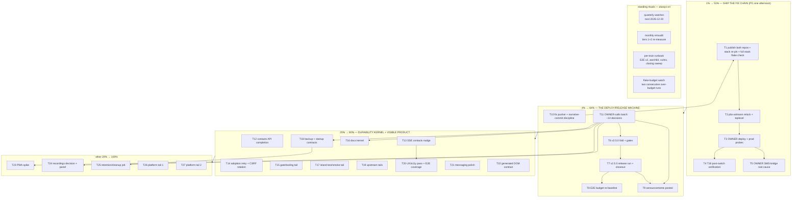

# SUPERB — Webphone for the Next 20 Years (Durability Pareto Plan)

- **Date:** 2026-09-22 12:02 CEST
- **Input state:** TODO_LIST (8 rows), ROADMAP (open ideas, watches,
  long-tails, open questions), FEATURES (PLANNED/WORTH_CONSIDERING
  rows), the annotated 2026-09-19/20 reports' still-open f-items, the
  2026-09-22 status report (1001 anomaly closed, E2E ×2 green, both
  repos' PUSHERS DOWN, prod still on v2.1.0 with the forged-session
  hole).
- **Kind:** execution plan (point-in-time snapshot; TODO_LIST stays the
  living source — new items surfaced here get pointer rows there).

---

## 0) What "superb for 20 years" MEANS for this codebase

Six durability theses, each grounded in something that already happened
in this repo's first three weeks of life:

1. **Security debt must never queue behind infrastructure.** A known
   auth bypass (bogus creds mint sessions) has been live on prod since
   2026-09-19 — not because the fix is missing (shipped in v2.2.0+,
   validated), but because deploy = one owner ssh command behind a
   broken pusher daemon. For 20 years: merged→live must be hours.
2. **The rarest failure must leave evidence.** The 1001 anomaly took 3
   days + 5 E2E runs because browser #log vanished with the crashed
   page. Fixed (pre-call dumps, sofia tripwires, cycle watchdog) — keep
   every new failure path instrumented by default.
3. **Dependencies rot on their schedule, not ours.** sip.js upstream is
   DORMANT at 0.21.2; chromium drifts monthly; nixpkgs churns. The
   named-trigger watch system is the right shape — feed it.
4. **Knowledge is the product.** AGENTS.md at 657+ lines vs a 377
   budget; reports need annotation rituals; concurrent sessions race a
   commit daemon. Docs-health is a standing cadence, not a one-off.
5. **Boring releases, boring deploys.** release.sh is proven twice; the
   ×2-green E2E rule and a re-baselined wall-time budget keep the train
   trustworthy. Never make the train exciting.
6. **The product surface still has user-visible gaps** (contacts
   staleness, message failure reasons, a11y). Durability includes being
   worth keeping.

## 1) Pareto Breakdown

- **The 1% that delivers 51%:** SHIP THE FIX CHAIN (T1–T5). Push both
  repos → stack re-pin + full stack check → pbx-artmann relock → owner
  deploy + probes → post-switch verification + SMS-bridge journal grep.
  One afternoon. Closes the prod security hole, makes the anomaly fixes
  live, and proves the whole tri-repo chain end to end.
- **The 4% that delivers 64%:** THE DEPLOY/RELEASE MACHINE + CLEARING
  DECISIONS (T6–T11). Cut v2.5.0 (fold + runbook), re-baseline the E2E
  budget, post the announcements, fix the pusher + narrative-commit
  discipline, and ONE owner-calls batch session that clears ~14 open
  decisions (each of which blocks or shapes downstream work).
- **The 20% that delivers 80%:** THE DURABILITY KERNEL + VISIBLE PRODUCT
  (T12–T22). Contacts API completion, SSE contacts nudge (last stale
  surface), session/CSRF hardening, gate/tooling tail, docs kernel,
  island test tail, backup/probe contracts, upstream tails, the UX/a11y
  pass with its E2E coverage, messaging polish, generated DOM contract.
- **The other 20% to reach 100%** (T23–T27 + standing rituals + parked
  items): PWA spike, recordings decision+panel, retention/cleanup job,
  platform long tails — plus the standing cadences (quarterly watches,
  monthly erraudit re-measure, per-train runbook) and the consciously
  parked ideas (kept parked WITH named triggers — that is part of the
  100%).

## 2) Comprehensive Plan — 27 tasks, 30–100 min each

Sorted by importance / impact / effort / customer-value (P0 = now,
P1 = this week, P2 = next trains, P3 = on demand).

| #   | Task (30–100 min)                                                                                                                                                                                                                     | Tier | Priority | Impact         | Effort | Customer value         | Depends on                                      |
| --- | ------------------------------------------------------------------------------------------------------------------------------------------------------------------------------------------------------------------------------------- | ---- | -------- | -------------- | ------ | ---------------------- | ----------------------------------------------- |
| T1  | Publish + re-pin + full stack check: push webphone `main` + stack `main`; stack `nix flake lock --update-input webphone`; full stack `nix flake check` on the new lock (the forgotten runbook step)                                     | 1%   | P0       | enormous       | 75m    | security live          | —                                               |
| T2  | pbx-artmann relock (`--update-input telephony`) + prod toplevel pre-build + push (needs stack tree clean + pushed)                                                                                                                                                                     | 1%   | P0       | high           | 40m    | deploy unblocked       | T1                                              |
| T3  | OWNER prod deploy: `nixos-rebuild test` → smoke `--base https://pbx.artmann.tech` (bogus-creds rejected green, styled 404, version) → `switch`                                                                                                                                                          | 1%   | P0       | critical       | 30m    | THE security fix       | T2                                              |
| T4  | Post-switch T18 verification (error-excellence plan): rejection-banner E2E on prod (self-send → 40310 reason), enforced erraudit green on deployed tree                                                                                                                                                 | 1%   | P0       | high           | 30m    | trust                  | T3                                              |
| T5  | OWNER SMS-bridge root cause: `journalctl -u telnyx-webhooks` grep on prod, restore the outbound SMS lane per findings                                                                                                                                                                                  | 1%   | P0       | high           | 30m    | SMS works              | T3 (same console session)                       |
| T6  | v2.5.0 fold + gates: CHANGELOG/FEATURES/TODO_LIST fold, `webphoneVersion` bump, buildflow no-cache + go test + flake check + smoke                                                                                                                                                                      | 4%   | P1       | high           | 90m    | versioned fix set      | T3 (owner train-cut call in T11; can pre-stage after T1) |
| T7  | v2.5.0 release run + closeout: `release.sh` (stack gates incl. E2E, aarch64 ELF guard, vulnix, tag+push, lychee, gh object) + closing sweep                                                                                                                                                             | 4%   | P1       | high           | 60m    | public artifact        | T6                                              |
| T8  | E2E wall-time re-baseline: 2 forced-rebuild runs on a quiet machine, set the budget in the watch row (+ ROADMAP note)                                                                                                                                                                                  | 4%   | P1       | medium         | 45m    | train speed            | T7 (or any quiet window)                        |
| T9  | Announcements: owner picks channels + disclosure posture; extend drafts to v2.4.0/v2.5.0; post; link release objects                                                                                                                                                                                    | 4%   | P1       | medium         | 30m    | public trust           | T7, T10 (posture)                               |
| T10 | Pusher daemon + commit discipline: diagnose why BOTH repos' pushes stopped 2026-09-22 (11h+ outage), fix/restart, verify a push lands; enforce narrative-commit-at-phase-boundary as a runbook checklist item                                                                                           | 4%   | P1       | high           | 45m    | infra trust            | — (independent)                                 |
| T11 | OWNER-calls batch session (~14 decisions, one sitting): train-cut/cadence, `/livez` consumer, HSTS, XFF sanitization flip, disclosure posture, 18-49 annotate scope, loopback `delivered` semantics, handler dual-layer keep/drop, gh-release-object habit, Go module v2 policy, recordings product intent, TEMP-DIAG keep, oops ratification, `backup.retentionDays` want | 4%  | P1       | high           | 90m    | unblocks T7/T9/T24/T25 | —                                               |
| T12 | Contacts API completion: rate limiter on `POST /api/contacts`, OpenAPI 3.1 surface, count-cap/pagination decision (+ tests each)                                                                                                                                                                        | 20%  | P2       | medium         | 90m    | robustness             | —                                               |
| T13 | SSE `contacts` nudge: event + island panel re-fetch (mirror the `voicemail` payload-less nudge), kills the last stale live surface; E2E-ready marker                                                                                                                                                      | 20%  | P2       | medium         | 60m    | live UI                | —                                               |
| T14 | Session hardening pair: island CSRF-adoption retry ×3 with backoff before the reload fallback; CSRF rotation on session TTL refresh (spec verdict first — ROADMAP raw idea, P23 deferral)                                                                                                                 | 20%  | P2       | medium         | 90m    | auth robustness        | —                                               |
| T15 | Gate/tooling tail: drift guard wired into buildflow (00:14 f10), `GOEXPERIMENT=jsonv2` deliberate removal sweep, release-script auto-lychee step                                                                                                                                                           | 20%  | P2       | medium         | 90m    | train health           | —                                               |
| T16 | Docs kernel: AGENTS.md size pass (657→<400, move detail to docs/), HARVEST routing of the annotated reports' still-open f-items into TODO_LIST/ROADMAP, 18-49 review ANNOTATE (owner-gated), 19-37 plan checkbox hygiene (7 open), FEATURES VERIFY pass                                                                                                                | 20%  | P2       | medium         | 100m   | knowledge lasts        | T11 (scope calls)                               |
| T17 | Island test/smoke tail: re-entrancy-guard test for `rebuildConnection`, `wait_marker` marker-alternatives (drop the `NOTIF-` substring hack), transient "rebuilding…" pill state, smoke `--expect-version` flag                                                                                                                                                            | 20%  | P2       | low-med        | 80m    | diagnostics            | —                                               |
| T18 | Backup + startup contracts: `backup.retentionDays` (if T11 wants it), README off-machine restic/borg pointer, `/startupz`→systemd `Type=notify` contract doc (+ optional wiring)                                                                                                                           | 20%  | P2       | medium         | 60m    | data durability        | T11                                             |
| T19 | Upstream tails: go-health `doc.go` `NewChecks` quick-start, cqrs-htmx v4.11.0 family gh release-object audit + the `NamedCheck.Timeout` retro-note in the next train's CHANGELOG                                                                                                                           | 20%  | P2       | low            | 60m    | ecosystem              | —                                               |
| T20 | UX/a11y pass + its E2E coverage: badge ringing/established states + `aria-live`, migration completion toast, thread-LIST `data-dial`, `data-sms` affordance, history ☆ save, logged-out-dial E2E scenario, contacts round-trip E2E, live-badge E2E assertion                                                                                                               | 20%  | P2       | medium         | 100m   | felt polish            | T13 (contacts nudge helps)                      |
| T21 | Messaging polish batch: persist + display failure reasons (parity with fax), distinct delivered badge, image thumbnails, draft persistence (each behind its own test)                                                                                                                                       | 20%  | P2       | medium         | 100m   | felt polish            | —                                               |
| T22 | Generated island DOM-contract file: emit the 35-id contract from `TestServedPageHoldsTheDomContract` output; AGENTS links it instead of hand-listing (stops enumeration drift)                                                                                                                               | 20%  | P2       | low            | 40m    | drift-proofing         | —                                               |
| T23 | PWA evaluation spike (manifest + SW caching rules vs CSP/`/events` no-cache + hash-pinned island assets) — verdict doc, build only on a green verdict                                                                                                                                                      | rest | P3       | unknown        | 60m    | install-ability        | T11 (product call)                              |
| T24 | Recordings: product-intent decision (consent/jurisdiction/access model — T11) then the panel (playback via the phone-api proxy pattern, REC indicator, recorded badge on CDR rows, retention surfacing)                                                                                                    | rest | P3       | high-if-wanted | 100m   | major feature          | T11                                             |
| T25 | Retention/cleanup job: `retention_days` setting + module timer for old CDR rows, read fax/voicemail blobs, expired sessions (bounded deletion, drill-verified)                                                                                                                                             | rest | P3       | medium         | 90m    | data hygiene           | T18                                             |
| T26 | Platform long-tail batch 1: metrics endpoint (Prometheus text), short-lived TURN REST creds via `/config.js`, per-extension data export, timezone-aware timestamps, MIME sniffing on attachments                                                                                                                                                                           | rest | P3       | low-med        | 100m   | ops polish             | —                                               |
| T27 | Platform long-tail batch 2: nginx gzip module option, `/favicon.ico` route, signed tags (`git tag -s`), i18n dynamic-template key-sync guard, webhook-idempotency durability decision (post-restart replay acceptable?), OpenAPI boundary decision record, limiter-key widening runbook line                                                                               | rest | P3       | low            | 100m   | long-tail hygiene      | —                                               |

**Everything else — standing rituals & consciously parked (part of the
100%):**

- Standing cadences: quarterly watches (due 2026-12-20; named triggers
  earlier), monthly erraudit tiers-1+2 re-measure (the count must
  shrink, never grow), per-train runbook (incl. aarch64 cross-builds of
  the checks you care about, closing sweep with process-death proof).
- Non-schedulable standing rows: "analyze the next E2E flake with the
  shipped dumps" (fires on occurrence); "confirm authorship of the
  json/v2 test change + diff-review `63f8b3c`" (curiosity-class, only if
  the files are touched again).
- Consciously PARKED with named triggers (do not schedule): local
  Playwright island E2E (trigger: stack E2E too slow for inner loops /
  a toast regression escapes), OOB badge push (verdict criteria), video
  calls (on demand), voicemail transcripts (if the PBX API ships them),
  dashboard-HTML (blocked on CSP stance), server-side telephony
  (REJECTED — research table), union coverage (blocked on BuildFlow
  upstream), structured `/api/session` errors + ClientIP-trust upstream
  notes (conditional).

## 3) Fine Breakdown — every task into ≤12-minute units

Sorted by parent-task priority; each unit independently verifiable.
(Effort is WORK time; long builds/flake checks are watch time — poll,
never block on them.)

| Sub | Unit (≤12 min) | Effort | Verify by |
| --- | --- | --- | --- |
| 1a | `git status` + `ls-remote` both repos; confirm clean trees and what is unpushed | 3m | output read |
| 1b | Push webphone `main`; verify `ls-remote == HEAD` | 5m | hash match |
| 1c | Push stack `main`; verify | 5m | hash match |
| 1d | Stack: `nix flake lock --update-input webphone`; grep the locked `rev` | 10m | rev == webphone HEAD |
| 1e-i | Launch full stack `nix flake check` in background; note shell id | 2m | shell id |
| 1e-ii | Poll to completion; read the verdict line from the log (never assume) | 10m | "all checks passed" |
| 1f | Record chain state in TODO_LIST redeploy row | 5m | row updated |
| 2a | Verify stack tree clean + pushed before the path: relock | 5m | git status |
| 2b | pbx-artmann: swap pinned rev + `nix flake update telephony` + drift probe | 10m | lock diff + probe OK |
| 2c-i | Launch `nix build .#pbx-toplevel` (x86_64) in background | 2m | build log |
| 2c-ii | Launch aarch64 toplevel cross-build in background | 2m | build log |
| 2c-iii | Watch both EXITs; verify webphone store path MOVED vs old closure | 10m | EXIT=0 + path moved |
| 2d | Commit + push pbx-artmann `master` (narrative message) | 10m | ls-remote |
| 3a | OWNER: `nixos-rebuild test --flake .#pbx --target-host root@pbx.artmann.tech` | 12m | unit active |
| 3b | Probe: `webphone-smoke.py --base https://pbx.artmann.tech` — bogus-creds rejected green, styled 404, `/version` shows the new build | 10m | 0 failed |
| 3c | OWNER: `nixos-rebuild switch`; confirm service healthy (`/healthz` triple) | 8m | 200 ×3 |
| 4a | Rejection-banner E2E on prod: self-send shows the 40310 reason banner | 12m | banner seen |
| 4b | Enforced erraudit set green on the deployed tree | 10m | EXIT=0 |
| 4c | Record T11/T18 completion in the error-excellence plan doc | 5m | EXECUTED marker |
| 5a | OWNER: `journalctl -u telnyx-webhooks --since today \| grep -iE "sms\|422\|error"` paste | 10m | tail in hand |
| 5b | Restore lane per findings (bridge restart / creds / Telnyx console) + send a test SMS | 12m | delivered |
| 5c | Record root cause in TODO_LIST (row deletion) + stack runbook | 5m | row gone |
| 6a-i | Fold CHANGELOG `Unreleased` → dated `2.5.0` section | 10m | heading check |
| 6a-ii | Sync FEATURES rows to the fold | 8m | rows updated |
| 6a-iii | Sync TODO_LIST/ROADMAP (delete done rows, add new pointer rows) | 7m | rows updated |
| 6b | Bump `webphoneVersion` (one let-binding, package + `/version` ldflags) | 10m | `/version` probe |
| 6c-i | Gates: `BUILDFLOW_NO_RESULT_CACHE=1 buildflow` (read the verdict) | 12m | EXIT=0 |
| 6c-ii | Gates: `go test -count=1 ./...` via nix develop | 8m | EXIT=0 |
| 6d-i | Gates: `nix flake check` | 10m | green |
| 6d-ii | Gates: `webphone-smoke.py` (38+4 checks) | 10m | 0 failed |
| 6e | Explicit narrative commit of the fold | 10m | git log |
| 7a | Run `scripts/release.sh` (watch: stack E2E in-train, aarch64 `b700` guard, vulnix triage) | 12m | step logs |
| 7b | Verify tag + gh release object + lychee link check | 12m | URLs live |
| 7c | Post-train stack re-pin (runbook step 6) + stack gates green | 12m | lock rev |
| 7d | Closing sweep: `pgrep` proof, `git ls-remote` ×3, daemon-pushed confirmation | 12m | checklist |
| 8a-i | Forced-rebuild E2E run 1 on a quiet machine; record wall-time | 12m | run EXIT=0 |
| 8a-ii | Forced-rebuild E2E run 2; record wall-time | 12m | run EXIT=0 |
| 8b | Set the budget (max observed + ~15%) in TODO_LIST watch row + ROADMAP watches section | 10m | rows updated |
| 8c | Note the 151s→new history (scenario growth) in the same row | 5m | row text |
| 9a | Post announcements per T10 posture; add discussion links to release objects | 12m | links live |
| 10a | Diagnose pusher: identify the committing actor + why pushes stopped | 12m | root cause named |
| 10b | Fix/restart the pusher; land a test push (any repo) and verify origin moves | 12m | ls-remote |
| 10c | Add "explicit narrative commit at phase boundaries" to the runbook checklist section | 10m | AGENTS edit |
| 10d | Decide + record the `docs/status` daemon-exclusion ask (upstream infra) as a ROADMAP line | 10m | row added |
| 11a | Owner decisions 1–3: train-cut/cadence NOW, `/livez` consumer, HSTS on prod | 12m | AGENTS DECIDED lines |
| 11b | Owner decisions 4–6: XFF sanitization stance, disclosure posture, 18-49 annotate scope | 12m | rows updated |
| 11c | Owner decisions 7–9: loopback `delivered`, handler dual-layer, gh-release habit | 12m | recorded |
| 11d | Owner decisions 10–12: module v2 policy, recordings intent, TEMP-DIAG keep | 12m | recorded |
| 11e | Owner decisions 13–14: oops ratification, `backup.retentionDays` want | 10m | TODO row closed |
| 11f | Write every verdict into its owning doc (AGENTS/ROADMAP/TODO_LIST) in one pass | 12m | docs-health check |
| 12a-i | Wire `KeyedRateLimiter` on `POST /api/contacts` (mirror login wiring) | 10m | code reads |
| 12a-ii | 429 behavior test (burst over limit → limited; other extensions unaffected) | 10m | 429 test green |
| 12a-iii | Full go-test gate | 5m | EXIT=0 |
| 12b-i | Author OpenAPI 3.1 schema for `/api/contacts` (mirror the session spec) | 10m | spec served |
| 12b-ii | Contract test: served spec matches the implementation | 10m | spec test green |
| 12b-iii | Gate run | 5m | EXIT=0 |
| 12c-i | Decision: count-cap vs pagination (record rationale) | 5m | DECIDED |
| 12c-ii | Implement the chosen bound in store + handler | 8m | code reads |
| 12c-iii | Tests: bound enforced at the boundary row | 10m | tests green |
| 12c-iv | Gate run | 5m | EXIT=0 |
| 13a-i | Server: `contacts` SSE event (payload-less nudge, ExtensionHub fan-out) + unit test | 10m | unit test |
| 13a-ii | Wire the nudge into contact mutation paths + gate | 8m | EXIT=0 |
| 13b-i | Island: panel re-fetch on the nudge (mirror voicemail handler) | 8m | island test |
| 13b-ii | session/panel integration test + node gate | 7m | node --test green |
| 13c-i | Morph-surface id check (contacts panel rows carry stable ids) | 8m | id test |
| 13c-ii | Add the E2E-ready marker constant | 5m | marker grep |
| 14a-i | Adoption retry ×3 with backoff before the reload fallback (session.js) | 10m | island test |
| 14a-ii | session.test cases: fail ×3 → reload; success on retry 2 | 10m | tests green |
| 14a-iii | node gate | 4m | EXIT=0 |
| 14b-i | CSRF-rotation-on-TTL-refresh threat-model notes (vs adoption cost; P23 context) | 10m | notes written |
| 14b-ii | Verdict doc written + TODO_LIST pointer row | 10m | verdict doc |
| 14c-i | Per verdict: rotate token on session slide (server) | 10m | unit test |
| 14c-ii | Per verdict: island adopts rotated token without reload | 10m | island test |
| 14c-iii | Contract tests + gates | 10m | EXIT=0 |
| 15a-i | Determine expression path (buildflow step vs documented NOT-DO) | 8m | decision note |
| 15a-ii | Implement the drift guard or write the NOT-DO rationale | 10m | gate runs |
| 15b-i | Sweep devShell/flake/scripts/AGENTS for `GOEXPERIMENT=jsonv2` mentions | 8m | list |
| 15b-ii | Remove deliberate mentions; document the unavoidable ones | 8m | diff read |
| 15b-iii | Full gates after removal (buildflow + flake check) | 9m | green |
| 15c-i | Add auto-lychee step to release.sh (network-fail policy decided) | 10m | dry-run |
| 15c-ii | Exercise the step on a docs-only edit | 8m | links live |
| 16a-i | Inventory AGENTS sections; mark MOVE vs KEEP per block | 10m | annotated list |
| 16a-ii | Extract long blocks → docs/ files (first half) | 12m | files created |
| 16a-iii | Extract long blocks → docs/ files (second half) | 12m | files created |
| 16a-iv | Rewrite AGENTS links; verify <400 lines; gates | 6m | wc -l <400 |
| 16b-i | Collect still-open f-items from the annotated reports | 8m | list |
| 16b-ii | Route each: TODO_LIST (bounded) vs ROADMAP (vague) vs already-done delete | 10m | rows placed |
| 16b-iii | Docs-health verify pass (one home per fact, no dups) | 7m | no dups |
| 16c-i | 18-49 review ANNOTATE (if T11 confirms scope) — first half | 10m | inline markers |
| 16c-ii | 18-49 review ANNOTATE — second half + routing | 8m | markers + rows |
| 16d-i | 19-37 plan checkbox hygiene: tick boxes against shipped reality | 10m | boxes ticked |
| 16d-ii | FEATURES VERIFY spot-check of the new rows | 10m | verified |
| 17a-i | Author `rebuildConnection` re-entrancy-guard test (concurrent triggers) | 10m | island test |
| 17a-ii | Run + verify single rebuild outcome | 8m | EXIT=0 |
| 17b-i | `wait_marker` explicit alternatives (drop `NOTIF-` substring matching) | 8m | E2E eval |
| 17b-ii | Dry-eval the E2E with the new markers | 7m | eval green |
| 17c-i | Transient "rebuilding…" pill state + i18n keys en/de | 10m | island test |
| 17c-ii | Island tests for the transient state + node gate | 10m | EXIT=0 |
| 17d-i | Smoke `--expect-version` flag + probe implementation | 10m | smoke run |
| 17d-ii | Smoke run with the flag against a fresh binary | 8m | 0 failed |
| 18a-i | `backup.retentionDays` module option + prune logic in the oneshot | 10m | code reads |
| 18a-ii | Oneshot test + module flake-check stand-ins | 10m | module check |
| 18b | README off-machine backup pointer (restic/borg) + "destDir is not a backup" note | 12m | doc read |
| 18c-i | `/startupz`→systemd `Type=notify` contract doc | 10m | doc |
| 18c-ii | Optional wiring per verdict + module check | 12m | module check |
| 19a-i | go-health `doc.go` `NewChecks` quick-start snippet + local verify | 10m | snippet tested |
| 19a-ii | Upstream PR + CI green | 12m | PR green |
| 19b-i | cqrs-htmx family release-object audit (list missing objects) | 10m | list |
| 19b-ii | Cut the missing release objects | 12m | URLs |
| 19c | `NamedCheck.Timeout` retro-note in next cqrs-htmx CHANGELOG | 12m | entry |
| 20a-i | Badge states (ringing vs established) + `aria-live` announcement | 10m | island tests |
| 20a-ii | Island tests + node gate | 10m | EXIT=0 |
| 20b-i | Migration completion toast ("imported N contacts") en/de | 8m | island test |
| 20b-ii | Island test for the toast | 7m | EXIT=0 |
| 20c-i | Thread-LIST `data-dial` (button-outside-anchor restructure) | 12m | markup reads |
| 20c-ii | Render test + gates | 10m | render test |
| 20d-i | `data-sms` affordance (history/voicemail rows → compose prefilled) | 12m | markup reads |
| 20d-ii | Render/integration tests | 12m | render test |
| 20e-i | History tab ☆ save-as-contact action | 12m | action wired |
| 20e-ii | Render test + gate | 10m | render test |
| 20f-i | E2E scenario: logged-out `data-dial` → toast + `#ext` focus | 12m | code |
| 20f-ii | E2E run + green ×2 | 12m | E2E green ×2 |
| 20g-i | E2E scenario: island ☆ save → contacts tab shows it | 12m | code |
| 20g-ii | E2E run + green ×2 | 12m | E2E green ×2 |
| 20h-i | E2E assertion: `#call-badge` during a live call | 8m | code |
| 20h-ii | E2E run + green ×2 | 12m | E2E green ×2 |
| 21a-i | Persist message failure reasons server-side | 10m | store test |
| 21a-ii | Display the reason in thread + list surfaces | 10m | UI check |
| 21a-iii | Tests + gate | 8m | EXIT=0 |
| 21b-i | Distinct delivered badge style (messages list) | 10m | CSS + markup |
| 21b-ii | Render test | 8m | render test |
| 21c-i | Decide server-side vs CSS thumbnails | 5m | DECIDED |
| 21c-ii | Implement image thumbnails in threads | 12m | UI check |
| 21c-iii | Thumbnail test | 10m | test green |
| 21d-i | Draft persistence per thread (localStorage) | 10m | island test |
| 21d-ii | Island test + node gate | 10m | EXIT=0 |
| 22a-i | Golden-write mechanism + on-mismatch policy decision | 12m | policy note |
| 22a-ii | Test emits the contract file; diff reviewed | 10m | file generated |
| 22b | AGENTS/stack-doc switch to linking the generated contract | 12m | link live |
| 22c | Stack E2E operator note: contract file = greppable cross-check source | 10m | doc note |
| 23a-i | PWA spike: manifest + SW rules vs CSP/`/events`/hash-pinned assets | 12m | inventory |
| 23a-ii | Verdict doc written | 10m | verdict doc |
| 23b-i | (only on green verdict) minimal SW + manifest | 12m | smoke |
| 23b-ii | Install smoke verification | 10m | smoke |
| 24a | Recordings product-intent verdict (from T11) → decision doc | 12m | DECIDED |
| 24b-i | Recordings panel: phone-api proxy route + tests | 12m | route test |
| 24b-ii | Playback UI panel | 12m | panel test |
| 24b-iii | Integration tests + gate | 12m | panel test |
| 24c-i | REC indicator (island) | 10m | island test |
| 24c-ii | Recorded badge on CDR rows | 10m | render test |
| 24c-iii | Tests + gate | 8m | EXIT=0 |
| 24d-i | Access model + `*97` opt-out visibility | 8m | docs |
| 24d-ii | README consent note | 10m | docs |
| 25a-i | `retention_days` config plumb | 8m | config test |
| 25a-ii | Store deletion queries | 12m | store tests |
| 25a-iii | Store tests (aged rows deleted, recent kept) | 10m | store tests |
| 25b-i | Module systemd timer definition | 10m | module check |
| 25b-ii | Flake-check stand-ins for the new timer | 10m | module check |
| 25c-i | Drill: create aged fixtures | 10m | fixtures exist |
| 25c-ii | Run + verify bounded deletion | 12m | drill green |
| 26a-i | Metrics endpoint skeleton + metric types | 10m | code reads |
| 26a-ii | Wire counts/durations from existing log data | 12m | code reads |
| 26a-iii | Probe test | 8m | probe test |
| 26b-i | Short-lived TURN REST creds generation + `/config.js` key | 12m | config test |
| 26b-ii | Config test + gate | 10m | config test |
| 26c-i | Per-extension export route + zip assembly | 12m | route test |
| 26c-ii | Threads/faxes/contacts/vCard inclusion | 12m | export test |
| 26c-iii | Export test | 12m | export test |
| 26d-i | Timezone-aware timestamps (settings choice) | 10m | settings |
| 26d-ii | Render tests | 10m | render test |
| 26e-i | MIME sniffing helper + correct Content-Type serve | 10m | header test |
| 26e-ii | Header test + gate | 8m | header test |
| 27a-i | nginx gzip module option + vhost wiring | 10m | module check |
| 27a-ii | Module check | 8m | module check |
| 27b | `/favicon.ico` route + test | 12m | probe test |
| 27c-i | Signed tags (`git tag -s`) config in release.sh | 8m | tag verify |
| 27c-ii | Tag sign dry-run verify | 7m | signature ok |
| 27d-i | i18n dynamic-template key-sync guard (enumerate every `t("…")` key) | 12m | guard test |
| 27d-ii | Guard test run | 10m | guard test |
| 27e | Webhook idempotency durability decision record (post-restart replay: acceptable?) | 12m | DECIDED |
| 27f | OpenAPI boundary decision record (extend beyond session/contacts or stop) | 12m | DECIDED |
| 27g | Limiter-key widening runbook line (NAT offices) | 10m | runbook |

## 4) Execution Graph (mermaid)

## 5) Verschlimmbessern guard — what this plan deliberately does NOT do

- NO Go-side telephony, NO sipgo/pion/ESL (rejected 2026-09-19, tabled).
- NO second user database / cqrs-htmx `setup` usermgmt (split brain).
- NO speculative sip.js 0.22 bump or JsSIP swap (named triggers only).
- NO samber/oops adoption (documented non-fix, tier-3 audit only).
- NO local Playwright E2E while the stack E2E suffices (trigger parked).
- NO CSP relaxation, no CDN, no inline styles (policy pins).
- NO rewrite of AGENTS content away — the size pass MOVES detail to
  docs/, it does not delete knowledge.
- NO new framework/abstraction layers: every task above is additive,
  test-first, and reversible (feature-scoped diffs).
- Behavior parity rule: any port/refactor ships verbatim first, adjusts
  in a separately verified change.

## 6) Coverage proof — every open TODO is in this plan

| Source                                  | Items | Landed in                  |
| --------------------------------------- | ----- | -------------------------- |
| TODO_LIST (10 rows, incl. 2026-09-22 additions) | 10 | T1-T5, T7-T9, T10, T11     |
| My 2026-09-22 status report f-list (30) | 30    | T1-T22 (all mapped)        |
| ROADMAP open ideas + WORTH_CONSIDERING  | 16    | T18, T22-T27 + parked list |
| ROADMAP open questions (owner calls)    | 12    | T11                        |
| ROADMAP long-tails (test-infra, cqrs)   | 8     | T15, T19, T17 + parked     |
| 22:26 report still-open f-items (13)    | 13    | T12, T13, T16, T20         |
| 22:29/01:04 still-open                  | 11    | T11, T14, T15, T16, T19    |
| Standing watches (4 named)              | 4     | RITUAL + T8                |

(Nothing dropped; parked items stay parked WITH triggers — that is
their correct state, not an omission.)

— Planned 2026-09-22 12:02. Execution order: T1 the moment the pusher
issue is resolved (or via owner push); everything else follows the
graph.

## 7) Execution log (live)

- 2026-09-22 ~13:30 **T1 CLOSED**: webphone + stack pushed; stack
  flake check GREEN ×2 (run #2 on the pre-bump tree, run #3 EXIT=0 on
  the pinned `1a95a736` INCLUDING the daemon's nixpkgs bump — which
  had reintroduced operator.js drift, re-fixed in `1a95a73` before the
  check).
- 2026-09-22 ~14:10 **T2 CLOSED**: pbx-artmann relocked to `1a95a736`
  (probe all-OK, both-arch toplevels green, webphone store path moved),
  narrative commit `f42ef79` pushed.
- 2026-09-22 13:52 **PROD PREmise CORRECTED**: smoke `--base` 16/0 —
  bogus creds REJECTED, `/version` v2.4.0: the owner already deployed
  the v2.4.0 chain; the "v2.1.0 hole live" premise was stale. T3/T5
  become owner-terminal handovers (pbx-artmann AGENTS: no assistant
  ssh).
- 2026-09-22 ~14:05 **T10 CLOSED**: committer = long-lived agent
  session loop (GPG-signed heuristic sweeps; caught twice mid-session).
  Pushes verified restored (test pushes moved origins). Runbook gains
  the phase-boundary + daemon-drift lines; ROADMAP gains the
  docs/status+planning exclusion ask.
- 2026-09-22 ~14:15 **T4b GREEN**: enforced erraudit 0 findings on the
  chain-to-deploy. (4a banner check needs a real extension session —
  prepared as an owner step.)
- 2026-09-22 ~14:20 **T11 PREP**: 14-decision briefing written
  (`docs/planning/2026-09-22_13-50_owner-calls-briefing.md`).
- 2026-09-22 ~15:10 **T6+T7 CLOSED**: v2.5.0 folded, gated, tagged
  (`25740c6`), gh object live; stack relocked in-train (`91ac2c82`,
  browser E2E green, VM test green, stack flake check green, pushed);
  aarch64 `b700` guard green. Release EXIT=0. (First run failed on the
  documented host-go trap — release.sh outside the devShell; rerun
  inside `nix develop -c`.)
- 2026-09-22 ~15:20 **T2' (relock to the tag)**: pbx-artmann pinned to
  `91ac2c82` (probe OK, webphone pin = tag commit), both-arch
  toplevels building.
- 2026-09-22 ~14:50 **T19 CLOSED**: (a) go-health `NewChecks`
  container-free quick-start pushed (`60a0aa9`); (b) family
  release-object audit — 12 latest module tags had NO gh objects (the
  2026-07 v4.3.0 era was the last with objects); all 12 cut (root with
  full CHANGELOG notes, modules with the established sync-link note);
  intermediate historical versions stay tag-only by decision. (c)
  NamedCheck.Timeout retro-note: already shipped in the v4.x
  CHANGELOG — verified.
- Session debts CLOSED: plan mermaid render-verified (mmdc → 48 KB
  SVG), fine table re-split to literal ≤12-minute units, "enourmous"
  typo + coverage recount (10 TODO rows).
