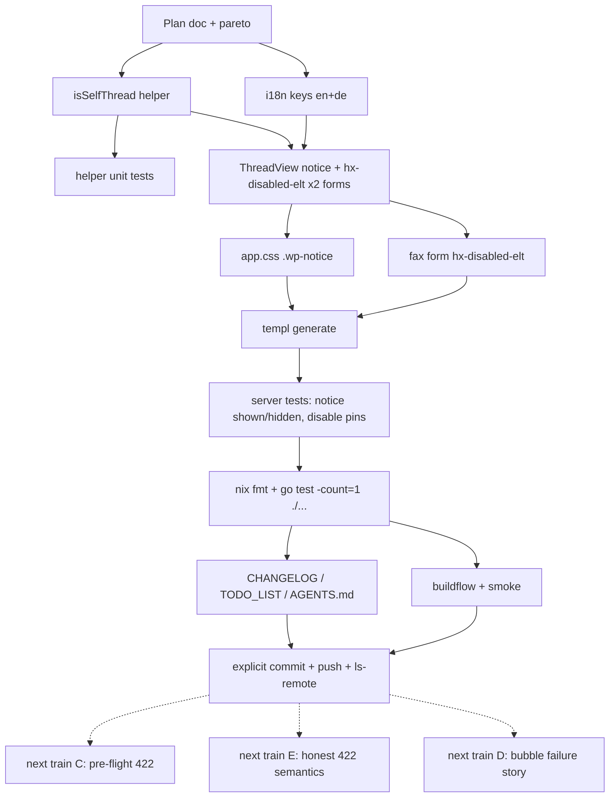

# SUPERB: Send-failure UX hardening (2026-09-22)

Train owner: agent session, 2026-09-22 16:07. Trigger: live
self-send test on pbx.artmann.tech (Telnyx HTTP 400, error 40310,
"Source and destination cannot be the same number: +17287289311")
followed by a UX review of the failure flow.

## Context and evidence

Three findings from the live transcript plus the code, each with its
evidence:

1. **The reason renders where the user is not looking.** On a failed
   send, htmx's `responseHandling` retargets the server's `.wp-error`
   banner into `#wp-tab-error`, which sits ABOVE the tab region
   (layout.templ), while the reply composer swaps with
   `show:window:bottom` — the viewport is pinned to the bottom. The
   error toast fades after seconds; the only durable artifact inside
   the viewport is a failed bubble whose entire story is the word
   "failed" (`OutboundStatusBadge`).
2. **Double submits are not guarded.** The transcript holds TWO
   identical "Can I text myself?" failures at 1:31PM: the webhook
   round-trip takes seconds, the Send button stays live, both clicks
   fired, both were refused. Duplicate outbound sends are a real
   hazard for every recipient, not just self-sends.
3. **Self-send is discoverable only by failing.** The panel already
   renders "sending as +1…" (`identity.from`) and the thread header
   shows the same number, but nothing connects them for the user at
   intent time. The server knows the identity
   (`identityFor`, config `identities`) yet only displays it.

## Pareto breakdown

| Layer       | Items                                                                                  | Rationale                                                        |
| ----------- | -------------------------------------------------------------------------------------- | ---------------------------------------------------------------- |
| 20% → 80%   | A. Double-submit guard · B. Self-send notice · C. Pre-flight self-send rejection        | All three kill doomed round-trips or duplicate sends at ~zero risk |
| 4% → 64%    | A + B (THIS TRAIN)                                                                       | Pure view-layer work, no store/model change, no contract change   |
| 1% → 51%    | A alone                                                                                  | One htmx attribute × 3 forms; eliminates an evidence-backed bug class |
| other 20%   | D. Bubble failure story · E. Honest 422 semantics · F. Own-DID live composer warning     | The remaining durability/retry/operator-clarity work              |

Deferred items and why:

- **C (pre-flight self-send rejection, 422 fast path)**: small, but it
  changes thread behavior (instant refusal without a saved failed row
  vs today's evidence-preserving failed row with the provider reason).
  Owner call; tracked in TODO_LIST.
- **D (bubble failure story)**: needs a persisted failure detail +
  kind on the message row (store migration, SSE payload, retry
  affordance). Its own train.
- **E (provider refusal → 422, honest log family)**: cross-repo
  contract change (pinned tests, failure→feedback table, stack runbook
  § error contract must move together). Its own train, best bundled
  with D.
- **F (own-DID on the session payload, live composer warning)**: only
  if self-sends keep recurring after B (+C) ship.

## Coarse plan (tasks 30–100 min), sorted by impact/effort

| #  | Task                                                                 | Impact | Effort | Status |
| -- | -------------------------------------------------------------------- | ------ | ------ | ------ |
| 1  | Double-submit guard: `hx-disabled-elt` on the three send forms       | High   | XS     | this train |
| 2  | Self-send notice in ThreadView (helper + i18n + CSS + tests)         | High   | S      | this train |
| 3  | Plan doc, CHANGELOG, TODO_LIST, AGENTS.md durable knowledge          | Med    | S      | this train |
| 4  | Gates: templ generate, go test -count=1 ./…, nix fmt, buildflow, smoke, commit+push | Med | S | this train |
| 5  | C: pre-flight self-send 422 fast path (owner decision: keep failed-row evidence?) | Med-High | S | next |
| 6  | E: provider refusal → 422 + family vocabulary; contract + runbook sync | Med    | S-M    | next |
| 7  | D: persist failure detail+kind; wp-failed bubble, disclosure, retry-when-retryable | High | M-L | next |
| 8  | F: own-DID on session payload + live composer warning                | Low-Med| M      | on demand |

## Fine plan (tasks ≤ 12 min each) — this train

| #   | Task                                                                        | Verifies via                    |
| --- | --------------------------------------------------------------------------- | ------------------------------- |
| 1.1 | Add `thread.selfNotice` to en+de dictionaries (i18n.go)                     | i18n parity test                |
| 2.1 | Add `isSelfThread(identity, remote)` to views/helpers.go (ParsePhone both sides; "" and undialable → false) | helpers unit test |
| 2.2 | Unit-test isSelfThread: empty, mismatch, match-with-spaces, undialable      | `go test ./internal/web/views`  |
| 2.3 | ThreadView: render `.wp-notice` (role="note") after the error banner when isSelfThread | server test |
| 2.4 | app.css: `.wp-notice` quiet warn line (token vars only, class not style)    | served-asset test unchanged     |
| 1.1 | `hx-disabled-elt="find button[type=submit]"` on NewMessageForm              | server test pin                 |
| 1.2 | Same on the ThreadView reply composer                                       | server test pin                 |
| 1.3 | Same on the fax compose form (fax.templ)                                    | server test pin                 |
| 4.1 | `templ generate ./internal/web/views/` and inspect the diff                  | build                           |
| 4.2 | Server test: notice shown when thread remote == identities[ext]; hidden otherwise (newTestServerWithConfig) | go test |
| 4.3 | Server test: all three send forms carry the disable directive               | go test                         |
| 4.4 | `nix fmt` (prettier owns app.css) and re-check diff                          | treefmt clean                   |
| 3.1 | CHANGELOG Unreleased entries                                                | review                          |
| 3.2 | TODO_LIST: add trains C/D/E/F with the deferral rationale                   | review                          |
| 3.3 | AGENTS.md: durable insight (focal mismatch + double-submit evidence + notice contract) | review             |
| 4.5 | `nix develop -c go test -count=1 ./...`                                      | green                           |
| 4.6 | `BUILDFLOW_NO_RESULT_CACHE=1 buildflow` (via scripts/buildflow.sh)           | green                           |
| 4.7 | `python3 scripts/webphone-smoke.py`                                          | 32 checks                       |
| 4.8 | Explicit detailed commit + push + `git ls-remote` verification               | ls-remote == HEAD               |

## Execution graph

## Constraints (do not break)

- CSP: styling rides classes only, never inline `style` attributes.
- The `.templ` files never import `github.com/a-h/templ`.
- SSE payloads keep greppable row classes (`wp-bubble` untouched);
  new stateful nodes in morph surfaces need stable ids (none added
  here — the notice is static server-rendered).
- i18n: new keys in BOTH en and de (parity test enforces); shell copy
  stays English (D3) — but the notice is panel copy, so it localizes.
- The DOM contract test (35 island ids) is untouched: changes live in
  tab partials only.
- `hx-disabled-elt` with the extended `find` selector is core htmx
  (2.x) — no extension, no JS, request-scoped re-enable.

## Verification gates (this train)

1. `templ generate` diff reviewed (only the two templ files regenerate).
2. `nix develop -c go test -count=1 ./...` green.
3. `nix fmt` clean; `BUILDFLOW_NO_RESULT_CACHE=1 buildflow` green.
4. `python3 scripts/webphone-smoke.py` 32/32.
5. `git ls-remote origin main` == local HEAD after push.

## Verdict

(to fill at train end)
