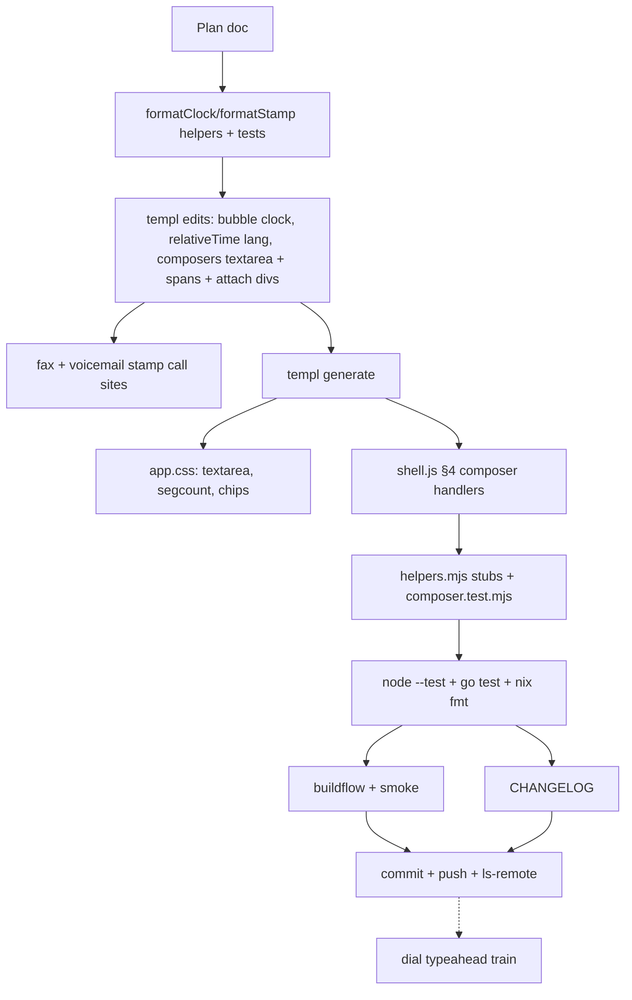

# SUPERB: Composer UX batch (2026-09-22 16:36)

Train owner: agent session, 2026-09-22 16:36. Trigger: owner asked for
more UI/UX ideas after the send-failure train
(`docs/planning/2026-09-22_16-07_SUPERB-send-failure-ux.md`); this
ships the recommended pareto slice from that brainstorm.

## Context and evidence

The composer is the highest-frequency surface in the product, and it
has four daily-felt gaps, all visible in the owner's own live
transcript from the 40310 session:

1. **The reply field is a single-line `<input>`** — long SMS bodies
   scroll sideways; no line breaks possible at all.
2. **No SMS segment awareness** — SMS bills per 160-char GSM-7 segment
   (70/67 for UCS-2); users composing long texts fly blind.
3. **Timestamps are English-shaped in both languages** — bubbles use
   `time.Kitchen` ("4:09PM") regardless of `wp-lang=de`; German users
   expect 24h ("16:09"). Row fallbacks ("Jan 2, 15:04") are already
   24h but month-first-English.
4. **Attachment selection shows only the native "No file chosen"** —
   no filenames, no way to remove one of several chosen files.

## Pareto breakdown

| Layer     | Items                                                          | Rationale                                                  |
| --------- | -------------------------------------------------------------- | ---------------------------------------------------------- |
| 20% → 80% | T1 textarea composers · T2 segment counter · T3 de 24h times   | The three corrections users feel on every single visit      |
| 4% → 64%  | T1 + T2                                                        | Composer = highest-frequency surface                        |
| 1% → 51%  | T1 alone                                                       | Enter-to-send kills the biggest daily friction              |
| other 20% | T4 attachment chips (+ deferred: dial typeahead, jump-to-latest, drafts) | Remaining polish                                  |

## Decisions this train

- **T1**: `<input name="body">` → `<textarea class="wp-compose-body"
  rows="1">` in BOTH message composers. Auto-grow via CSS
  `field-sizing: content` (CSP-pure, no JS height math; older
  browsers degrade to a normal scrollable textarea). Enter sends,
  Shift+Enter breaks — a shell.js §4 delegated keydown handler using
  `form.requestSubmit()` (htmx binds submit; the disabled-elt guard
  from the last train still applies). IME composition guarded
  (`isComposing`).
- **T2**: correct GSM-7/UCS-2 segmentation in shell.js (ext-table
  chars cost 2 units; 160/153 vs 70/67; CRLF normalized). UI is
  language-neutral by design: `` shows
  "N SMS" ONLY past one segment (D3 shell-copy English is moot — "N
  SMS" reads the same in German).
- **T3**: one pair of view helpers — `formatClock` (de "15:04", en
  Kitchen unchanged) and `formatStamp` (de "02.01. 15:04", en "Jan 2,
  15:04" unchanged). Call sites: message Bubble, relativeTime's
  beyond-24h fallback (relativeTime gains a lang param), FaxRow,
  voicemail vmWhen. English output is byte-identical to today (no
  churn); German goes 24h + numeric-date.
- **T4**: chips container `
` inside the
  reply + fax compose forms; shell.js renders name chips with remove
  buttons via a `DataTransfer` rebuild. Feature-detected: without
  DataTransfer the native input stays the only UI (graceful, CSP-safe:
  createElement/textContent/classes only).
- **AGENTS.md is deliberately untouched**: the concurrent session is
  mid-restructure splitting it into docs/lessons.md etc.; the existing
  "new shell-side listeners go in shell.js" rule already covers this
  train's placement.

## Coarse plan (30–100 min), impact/effort-sorted

| # | Task                                                | Impact | Effort | Status |
| - | --------------------------------------------------- | ------ | ------ | ------ |
| 1 | T1 textarea composers + Enter/Shift+Enter           | High   | S      | this train |
| 2 | T2 segment counter (server span + shell.js math)    | High   | S      | this train |
| 3 | T3 formatClock/formatStamp + 4 call sites + tests   | Med    | S      | this train |
| 4 | T4 attachment chips (reply + fax) + tests           | Med    | S      | this train |
| 5 | Plan doc, CHANGELOG, gates, commit+push             | Med    | S      | this train |
| 6 | Dial typeahead (contacts from PBX_CONFIG)           | High   | M      | next train |
| 7 | Jump-to-latest chip on live pushes while scrolled up | Med   | S-M    | next train |
| 8 | Per-thread draft persistence (localStorage)        | Med    | S      | next train |

## Fine plan (≤ 12 min each)

| #   | Task                                                                        | Verifies via                     |
| --- | --------------------------------------------------------------------------- | -------------------------------- |
| 1.1 | helpers.go: formatClock/formatStamp (+time import)                          | helpers unit tests               |
| 1.2 | helpers_test.go: both langs, fixed instants, EN byte-stability              | `go test ./internal/web/views`   |
| 2.1 | messages.templ: Bubble uses formatClock; relativeTime(t, lang); ThreadRow    | go test + render tests           |
| 2.2 | fax.templ FaxRow + voicemail.templ vmWhen → formatStamp                     | go test                          |
| 3.1 | messages.templ: both composers body→textarea.wp-compose-body; segcount span; reply form attach div | server test      |
| 3.2 | fax.templ: attach div                                                        | server test                      |
| 3.3 | templ generate                                                               | build                            |
| 4.1 | app.css: textarea sizing, segcount, chips                                    | nix fmt + served asset           |
| 4.2 | shell.js §4: smsSegments + keydown + input + change/click                    | island node tests                |
| 4.3 | helpers.mjs: closest()/querySelector() element support + DataTransfer stub   | island node tests                |
| 4.4 | island-tests/composer.test.mjs: segments math table, Enter routing, chips    | `node --test`                    |
| 5.1 | Server test: de bubble clock (cookie wp-lang=de → no AM/PM, 2-digit hour)    | go test                          |
| 5.2 | Full `go test -count=1 ./...`                                                | green                            |
| 5.3 | island tests + `nix fmt`                                                     | green/clean                      |
| 5.4 | buildflow + smoke                                                            | green (attribution check)        |
| 5.5 | CHANGELOG Unreleased                                                         | review                           |
| 5.6 | Explicit commit + push + ls-remote verify                                    | ls-remote == HEAD                |

## Execution graph

## Constraints (do not break)

- CSP: no inline styles (field-sizing CSS, not JS height), no inline
  scripts; chips via createElement/textContent/classes only.
- The served-DOM contract test (35 island ids) is untouched; textarea
  keeps name="body" so the multipart wire format is identical
  (textarea CRLF-normalizes newlines — segment math normalizes too).
- Morph surfaces untouched (composer is outside transcript/list
  regions; chips live in the composer).
- English rendered output byte-identical (en formats unchanged) —
  zero churn for the E2E and existing pins.
- Shell must survive JS failure: server renders the spans/containers
  hidden; without shell.js the forms work exactly as today minus the
  niceties (native file input stays functional).
- AGENTS.md off-limits (concurrent restructure in flight).
- i18n: no new dictionary keys required (counter "N SMS" neutral;
  chips aria-label "remove" is D3 shell-English).

## Verification gates

1. `templ generate` diff = expected files only.
2. `nix develop -c go test -count=1 ./...` green.
3. `nix run nixpkgs#nodejs -- --test --test-force-exit internal/web/assets/island-tests/*.test.mjs` green.
4. `nix fmt` clean; buildflow green or ATTRIBUTED external red
   (concurrent contacts/crm train); smoke 38/0.
5. `git ls-remote origin main` == local HEAD after push.

## Verdict

EXECUTED 2026-09-22, complete (T1-T4 shipped; typeahead /
jump-to-latest / drafts remain planned next trains).

- T1: both message composers are textareas; Enter sends via
  form.requestSubmit() (Shift+Enter + IME guarded). 5 composer specs
  drive the real listeners; `TestComposerCarriesSegmentCounterAndTextarea`
  pins the server-side markup contract.
- T2: GSM-7/UCS-2 segmentation pinned at every billing boundary
  (160/153, ext chars ×2, 70/67, CRLF=1); counter renders "N SMS" only
  past one segment.
- T3: `formatClock`/`formatStamp` — de 24h + numeric date, en
  byte-stable; bubble/relativeTime/fax/voicemail all ride the helpers;
  `TestBubbleClockFollowsLanguage` pins en meridiem vs de 24h.
- T4: chips with remove (DataTransfer rebuild, feature-detected) on
  reply + fax forms; two genuine stub gaps in helpers.mjs (variadic
  append, class-selector matching) fixed toward real-DOM semantics.
- Gates: island-lint EXIT=0 (the freeze report's DataTransfer worry
  was disproven by running the real gate — `env.browser` already
  covers it); 49/49 node tests; `go test -count=1 ./...` 14/14 green;
  `nix fmt` clean; smoke 38/0. Full buildflow RED on 9 erraudit
  findings — ALL in the concurrent CRM train's files (crm/server/store
  paths; their own `4320c7d` "erraudit 0" fix predates newer code;
  views scoped: 0). Attributed external, not gated here.
- Still open (honest): browser-truth verification of requestSubmit↔htmx
  and field-sizing posture — one stack E2E run covers both trains'
  markup changes (owner question pending since the 16:29 report).
- Process notes: one mid-train multiedit conflict with the concurrent
  CRM train (re-read + reapplied); their transient store-generics
  breakage was waited out, never touched. The auto-commit daemon swept
  the implementation into chore commits; the narrative commit lands at
  this boundary.
