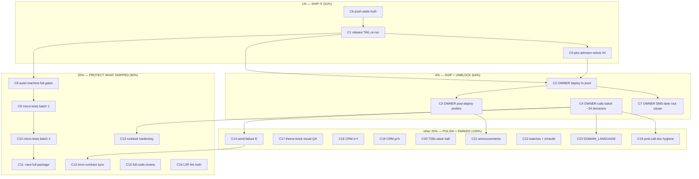

# SUPERB Pareto Execution Plan — the v2.6.0 state (2026-09-23 04:29 CEST)

Source of truth: `TODO_LIST.md` (17 rows, rebuilt by the 2026-09-23
04:26 docs-health AUDIT) + `ROADMAP.md` open questions. This plan is a
point-in-time snapshot — annotate, never rewrite. Every task below maps
to a TODO row (referenced as T#). Owner-terminal items are included and
marked OWNER (assistant ssh/deploy is forbidden by pbx-artmann AGENTS).

Context in three lines: **v2.6.0 is tagged (`807ca0c`) and
gate-verified but its release TAIL never ran** (the chained retry never
fired; no gh release object; stack E2E ×2 on the new chain, aarch64
re-verify, `--expect-version`, and pbx-artmann relock #4 are owed).
**Prod still serves v2.4.0** — two releases of user-visible work are
invisible to the only real user. **~24 owner decisions** gate the next
product work (send-failure C/E, CRM policy, Tailwind, ratifications).

## Pareto breakdown

### The 1% that delivers 51% — SHIP IT

| Task                                                                         | Why it is the 1%                                                                                                                                                                                                                                                                                                                               |
| ---------------------------------------------------------------------------- | ---------------------------------------------------------------------------------------------------------------------------------------------------------------------------------------------------------------------------------------------------------------------------------------------------------------------------------------------- |
| **Complete the v2.6.0 release TAIL + deploy the chain to prod** (T1, T2, T3) | Everything built across 2026-09-19→23 (failed-bubble story, affordances, retention, CRM enrichment, thread search, typeahead, CSP zero-inline, the 2.5.0 security posture) is INVISIBLE to the actual user until the chain ships. One quiet-host evening of mechanical, already-documented steps converts two days of trains into the product. |
| **Push-state truth** (daemon pusher lag; verify with ls-remote)              | Unpushed commits are unshipped work; the runbook ritual exists for exactly this.                                                                                                                                                                                                                                                               |

### The 4% that delivers 64% — SHIP IT + UNBLOCK

Everything above, plus:

| Task                                               | Why                                                                                                                                                                                                         |
| -------------------------------------------------- | ----------------------------------------------------------------------------------------------------------------------------------------------------------------------------------------------------------- |
| **OWNER-calls batch session** (~24 decisions, T14) | Gates send-failure C/E/F, CRM policy, Tailwind spike, art-dupl baseline, release.sh hardening choice, missed-call/search semantics — the whole next product cycle idles without it. One sitting clears all. |
| **SMS-lane root cause** (T4, OWNER journalctl)     | The one _broken_ production feature; webphone-side is fixed and waiting on the deploy anyway.                                                                                                               |

### The 20% that delivers 80% — PROTECT WHAT SHIPPED

Everything above, plus:

| Task                                                                                                       | Why                                                                                                                          |
| ---------------------------------------------------------------------------------------------------------- | ---------------------------------------------------------------------------------------------------------------------------- |
| Quiet-machine full gates over the post-tag tree (T-new, incl. buildflow full + flake check + island suite) | The post-tag commits (apiContactSaved, docs) rode only scoped verification; the release TAIL re-run gates the tag, not HEAD. |
| Helper micro-tests for the ten one-home helpers + `-race` full-package (T5, T6)                            | The avatarFor lesson: untested first cuts ship bugs; these helpers ARE the v2.6.0 refactor surface.                          |
| Error-contract cross-check + AGENTS rationale registry (T7)                                                | The both-sides-in-sync rule is currently violated by the webhook consolidation.                                              |
| Release-runbook hardening (T8)                                                                             | Two load-shaped release failures tonight; the fix is one documented precondition + one heuristic line.                       |
| Full-code-review of the interleaved day (T10)                                                              | Four concurrent trains landed with no holistic review.                                                                       |
| Announcements (T16)                                                                                        | Two releases of story untold; drafts half-exist.                                                                             |

### The other 20% (to 100%) — POLISH + PARKED

Send-failure C/E/F + fax guard (owner-gated), CRM (e)–(h) stack-side
follow-ups, T26b stack half, theme-knob visual verification, LSP nolint
nuisance, watches + monthly erraudit re-measure (2026-10-22),
DOMAIN_LANGUAGE decision, ROADMAP raw ideas (refine on demand only).

## Coarse plan (30–100 min per task; ALL TODOs; sorted by importance → impact → effort → customer-value)

| #   | Task                                                                                                                                                                                              | TODO    | Owner | Impact | Effort | Est  | Customer value                  |
| --- | ------------------------------------------------------------------------------------------------------------------------------------------------------------------------------------------------- | ------- | ----- | ------ | ------ | ---- | ------------------------------- |
| C1  | Complete the v2.6.0 release TAIL: quiet-host release.sh steps 6–9 (lychee → stack relock verify → browser E2E ×2 → aarch64 ELF) → `gh release create` → closing ls-remote sweep                   | T1      | us    | 10     | M      | 90m  | ★★★★★ ships everything          |
| C2  | OWNER: deploy the released chain to prod (nixos-rebuild test → smoke → switch)                                                                                                                    | T2      | OWNER | 10     | S      | 30m  | ★★★★★ the user gets v2.6.0      |
| C3  | OWNER: post-deploy verification (smoke `--base` `--expect-version 2.6.0` + rejection-banner check with a real extension session)                                                                  | T3      | OWNER | 9      | S      | 30m  | ★★★★★ proves the deploy         |
| C4  | OWNER-calls batch session (~24 decisions; briefing + ROADMAP questions ready; decisions land back in TODO/ROADMAP)                                                                                | T14     | OWNER | 9      | S      | 90m  | ★★★★☆ unblocks the next cycle   |
| C5  | pbx-artmann relock #4 (rev swap → flake update → lock-drift-probe → both toplevels → ExecStart-moved check → narrative commit + push)                                                             | T1b     | us    | 8      | M      | 45m  | ★★★★☆ deploy precondition       |
| C6  | Push-state reconcile: verify daemon pusher health, push any backlog by hand if stalled (ls-remote verified), record the mode in the runbook log                                                   | runbook | us    | 8      | S      | 30m  | ★★★★☆ shipping truth            |
| C7  | OWNER: SMS-lane root cause — journalctl the telnyx-webhooks unit, fix creds/bridge, send a test SMS, record cause in stack runbook                                                                | T4      | OWNER | 8      | S      | 30m  | ★★★★★ restores a broken feature |
| C8  | Quiet-machine full gates over post-tag HEAD (buildflow full + `nix flake check` + island suite + vulnix) — process any findings                                                                   | T5*     | us    | 7      | M      | 60m  | ★★★☆☆ protects the release      |
| C9  | Helper micro-tests batch 1 — `domain.must`, `domain.OrClock`, `store.updatedOrNotFound`, `views.formatFor` (+ their table cases)                                                                  | T5      | us    | 7      | M      | 90m  | ★★★☆☆ pins v2.6.0 core          |
| C10 | Helper micro-tests batch 2 — `crmNumbers`, `applyStatusWebhook`, `recordCallIdem`, `contactSaveFailed`, `apiContactSaved` + coverage inventory of `apiSaveContact`/`apiDeleteContact`             | T5      | us    | 7      | M      | 90m  | ★★★☆☆ pins v2.6.0 core          |
| C11 | `go test -race ./internal/server/...` full-package pass on a quiet machine; triage any report                                                                                                     | T6      | us    | 7      | S      | 30m  | ★★★☆☆ race safety               |
| C12 | Error-contract cross-check vs `applyStatusWebhook` (+ JSON-204 contract decision) + AGENTS dedup acceptance-rationale registry line                                                               | T7      | us    | 6      | S      | 45m  | ★★☆☆☆ operator truth            |
| C13 | Release-runbook hardening per owner answer: load precondition (or E2E auto-retry) + the flake heuristic one-liner + `> /tmp/release-<v>-<n>.log` rule + the v2.6.0-mid-refactor coordination note | T8      | us    | 6      | S      | 45m  | ★★★☆☆ next release cheap        |
| C14 | Send-failure train E: provider refusal → 422 + honest log family (test + failure→feedback table + stack runbook move together; C/F/fax-guard follow the owner call)                               | T12     | us    | 6      | L      | 90m  | ★★★★☆ last UX lever             |
| C15 | Full-code-review pass over the interleaved 2026-09-22 day (CRM + composer/UX + dedup trains)                                                                                                      | T10     | us    | 6      | M      | 100m | ★★★☆☆ catches cross-train bugs  |
| C16 | golangci-lint LSP nolint false positive: fix integration/config or declare CLI the single lint truth in AGENTS; full-tree `./internal/...` lint re-run                                            | T9      | us    | 5      | S      | 30m  | ★☆☆☆☆ noise reduction           |
| C17 | Theme-knob verification: FOUC headless screenshot pair, German-native copy review, composer-affordance screenshots                                                                                | T11     | us    | 5      | S      | 60m  | ★★★☆☆ polish evidence           |
| C18 | CRM (e)+(f): stack-side `crm.url`/`crm.token` secrets wiring + runbook cross-doc                                                                                                                  | T13     | us    | 5      | M      | 60m  | ★★★☆☆ makes CRM real            |
| C19 | CRM (g)+(h): restore-drill proving `call_logged` survives a journal restore + one HTTP-level island→server→CRM-stub integration test                                                              | T13     | us    | 5      | M      | 90m  | ★★☆☆☆ durability                |
| C20 | T26b STACK half: coturn `static-auth-secret` + REST API sharing webphone's `turn_rest.secret` (+ E2E TURN-rest scenario)                                                                          | T15     | us    | 4      | M      | 60m  | ★★★☆☆ call reliability          |
| C21 | Announcements: write the v2.6.0 draft (fold into the drafts doc), OWNER picks channels + posture, post                                                                                            | T16     | OWNER | 4      | S      | 30m  | ★★☆☆☆ story                     |
| C22 | Standing watches + monthly erraudit tier-2 re-measure (next due 2026-10-22; record the count in AGENTS)                                                                                           | T17     | us    | 3      | S      | 30m  | ★☆☆☆☆ drift insurance           |
| C23 | DOMAIN_LANGUAGE decision (owner g2): create the glossary or record its accepted absence                                                                                                           | ROADMAP | OWNER | 3      | S      | 45m  | ★☆☆☆☆ doc health                |
| C24 | Post-owner-calls TODO/ROADMAP hygiene: fold the ~24 answers into rows/verdicts, strike decided questions                                                                                          | T14b    | us    | 3      | S      | 30m  | ★★☆☆☆ keeps docs honest         |

27-task cap respected: 24 tasks. Sorted: shipping first (C1–C7), then
protection (C8–C13, C15–C16), then product completion (C14, C17–C21),
then hygiene (C22–C24).

## Fine plan (≤ 12 min per task; ALL TODOs; sorted within execution order)

| #   | Task (≤12 min each)                                                                                                          | Coarse | Est | Verifies via       |
| --- | ---------------------------------------------------------------------------------------------------------------------------- | ------ | --- | ------------------ |
| F1  | Load check + quiescence wait (load < ~8 two samples; note parallel sessions)                                                 | C1     | 5m  | uptime             |
| F2  | Re-run lychee over docs (expect 0 after `7503561`)                                                                           | C1     | 10m | 0 errors           |
| F3  | Verify stack pin target: rev-parse main vs stack flake.lock webphone                                                         | C1     | 5m  | pin = intended rev |
| F4  | Stack relock: `nix flake lock --update-input webphone` in stack repo                                                         | C1     | 10m | flake.lock diff    |
| F5  | Stack browser E2E run 1 (`nix build -L .#telephony-browser`)                                                                 | C1     | 12m | EXIT=0 + markers   |
| F6  | Stack browser E2E run 2 (forced `--rebuild`; distinct-timing proof)                                                          | C1     | 12m | EXIT=0 + markers   |
| F7  | If an E2E stalls: apply the flake heuristic (same step twice = code; different post-FS-tail steps = load → wait, retry once) | C1     | 12m | heuristic note     |
| F8  | aarch64 cross-build `nix build .#webphone --system aarch64-linux`                                                            | C1     | 12m | build ok           |
| F9  | ELF verify: `7f 45 4c 46` + `02 00 b7 00` at offset 0x12                                                                     | C1     | 5m  | byte read          |
| F10 | `gh release create v2.6.0` with the extracted CHANGELOG body                                                                 | C1     | 10m | `gh release view`  |
| F11 | Smoke `--expect-version 2.6.0` (positive) against a fresh binary                                                             | C1     | 10m | 0 failed           |
| F12 | Closing sweep: `git ls-remote` main + tag end states; narrative commit                                                       | C1     | 10m | ls-remote == HEAD  |
| F13 | pbx-artmann: rev swap in flake.nix (telephony URL from rev-parse)                                                            | C5     | 5m  | diff               |
| F14 | pbx-artmann: `nix flake update telephony`                                                                                    | C5     | 10m | lock diff          |
| F15 | pbx-artmann: `nix run .#lock-drift-probe`                                                                                    | C5     | 10m | ALL-OK             |
| F16 | pbx-artmann: build x86_64 toplevel                                                                                           | C5     | 12m | EXIT=0             |
| F17 | pbx-artmann: build aarch64 toplevel                                                                                          | C5     | 12m | EXIT=0             |
| F18 | pbx-artmann: verify webphone ExecStart store path moved; narrative commit + push                                             | C5     | 10m | path != old        |
| F19 | Push-state reconcile: ls-remote all three repos; if stalled, hand-push; note mode                                            | C6     | 10m | origin == HEAD     |
| F20 | Pusher daemon health: check process/handoff; record (owner restart if dead)                                                  | C6     | 10m | runbook log        |
| F21 | OWNER: `nixos-rebuild test` on pbx (command in TODO row)                                                                     | C2     | 12m | service up         |
| F22 | OWNER: smoke `--base https://pbx.artmann.tech`                                                                               | C2     | 10m | 0 failed           |
| F23 | OWNER: `nixos-rebuild switch`                                                                                                | C2     | 5m  | activation ok      |
| F24 | OWNER: smoke `--expect-version 2.6.0` against prod                                                                           | C3     | 10m | version match      |
| F25 | OWNER: rejection-banner check (sign in, self-send, read the persisted reason bubble)                                         | C3     | 12m | reason visible     |
| F26 | OWNER: `journalctl -u telnyx-webhooks` grep sms/422/error                                                                    | C7     | 10m | cause found        |
| F27 | OWNER: fix per findings (restart unit / creds) + test SMS                                                                    | C7     | 12m | SMS delivered      |
| F28 | OWNER: record root cause in stack runbook + TODO row closure                                                                 | C7     | 10m | doc updated        |
| F29 | OWNER-calls batch: walk the briefing doc decisions 1–14                                                                      | C4     | 12m | answers logged     |
| F30 | OWNER-calls batch: CRM policy calls (typed options, "+N more", journal language)                                             | C4     | 12m | answers logged     |
| F31 | OWNER-calls batch: the 2026-09-23 tail questions (load-gate vs retry, pin-vs-tag, contention protocol)                       | C4     | 12m | answers logged     |
| F32 | OWNER-calls batch: art-dupl baseline + webhook 400 + idem rename + helper-test bar + Must* policy                            | C4     | 12m | answers logged     |
| F33 | OWNER-calls batch: missed-call semantics + `?q=` semantics + Tailwind spike + blemish + recordings                           | C4     | 12m | answers logged     |
| F34 | Fold the ~24 answers into TODO_LIST/ROADMAP rows + verdicts                                                                  | C24    | 12m | docs updated       |
| F35 | Buildflow full (`BUILDFLOW_NO_RESULT_CACHE=1`) on quiet HEAD                                                                 | C8     | 12m | RC 0               |
| F36 | `nix flake check` (incl. KVM backup VM) on quiet HEAD                                                                        | C8     | 12m | all pass           |
| F37 | Island node suite re-run on HEAD                                                                                             | C8     | 10m | 79+/79+            |
| F38 | `nix run .#vulnix` + triage verdicts                                                                                         | C8     | 10m | zero real          |
| F39 | Triage/process any C8 findings (fix or route)                                                                                | C8     | 12m | findings closed    |
| F40 | Micro-test `domain.must` (corrupt-input panics, delegation)                                                                  | C9     | 10m | test green         |
| F41 | Micro-test `domain.OrClock` (stamped vs clock path)                                                                          | C9     | 10m | test green         |
| F42 | Micro-test `store.updatedOrNotFound` (found/not-found/error shapes)                                                          | C9     | 12m | test green         |
| F43 | Micro-test `views.formatFor` (lang switch, byte-stability of en)                                                             | C9     | 10m | test green         |
| F44 | Micro-test `crmNumbers` (blank-skip, generic over row types)                                                                 | C10    | 10m | test green         |
| F45 | Micro-test `applyStatusWebhook` (400 empty/202 replay/404/500/record-on-success)                                             | C10    | 12m | test green         |
| F46 | Micro-test `recordCallIdem` (empty-key legacy, consume-on-success)                                                           | C10    | 10m | test green         |
| F47 | Micro-test `contactSaveFailed` + `apiContactSaved` (notify→204 order, both handlers route)                                   | C10    | 12m | test green         |
| F48 | Coverage inventory: grep which tests hit `apiSaveContact`/`apiDeleteContact`; list gaps                                      | C10    | 10m | inventory doc'd    |
| F49 | Write gap tests from F48                                                                                                     | C10    | 12m | tests green        |
| F50 | `go test -race ./internal/server/...` (quiet host)                                                                           | C11    | 12m | PASS, no races     |
| F51 | Read error-contract.md against `applyStatusWebhook`; diff the claims                                                         | C12    | 10m | diff list          |
| F52 | Update error-contract rows (precedence note if needed)                                                                       | C12    | 10m | doc synced         |
| F53 | Decide + write the JSON-mutations-204 contract row (both-sides rule)                                                         | C12    | 10m | doc synced         |
| F54 | AGENTS: one-line dedup acceptance-rationale registry (pointer to in-code anchors)                                            | C12    | 10m | line added         |
| F55 | Implement the owner-chosen release.sh gate (loadavg precondition OR E2E single-retry)                                        | C13    | 12m | script edit + test |
| F56 | Runbook: flake-heuristic one-liner + release-log rule + coordination note                                                    | C13    | 10m | runbook updated    |
| F57 | Train E design: map 502→422 for provider refusals + family vocabulary (read plan doc)                                        | C14    | 10m | design settled     |
| F58 | Train E server: classification change + handler                                                                              | C14    | 12m | code               |
| F59 | Train E tests: contract test for the 422 + copy                                                                              | C14    | 12m | test green         |
| F60 | Train E docs: failure→feedback table + stack runbook sync                                                                    | C14    | 12m | both sides synced  |
| F61 | Train E island: toast copy for the new refusal family (en/de)                                                                | C14    | 10m | parity test green  |
| F62 | (Post-owner-call) train C pre-flight self-send + fax-lane guard if approved                                                  | C14    | 12m | per answer         |
| F63 | Full-code-review: CRM train files                                                                                            | C15    | 12m | findings logged    |
| F64 | Full-code-review: composer/UX train files                                                                                    | C15    | 12m | findings logged    |
| F65 | Full-code-review: dedup train files + helpers                                                                                | C15    | 12m | findings logged    |
| F66 | Full-code-review: triage findings → fix-or-route each                                                                        | C15    | 12m | list closed        |
| F67 | LSP nolint: try config/integration fix; else AGENTS "CLI gate is the truth" line                                             | C16    | 10m | noise gone         |
| F68 | Full-tree `golangci-lint run ./internal/...` re-run                                                                          | C16    | 10m | 0 issues           |
| F69 | FOUC: headless first-paint screenshot pair (dark forced, before/after preload)                                               | C17    | 12m | pair captured      |
| F70 | German-native review of the new copy (selfNotice, export, TURN, specs rows)                                                  | C17    | 10m | corrections        |
| F71 | Screenshot QA of the four composer affordances (both themes)                                                                 | C17    | 12m | 8 screenshots      |
| F72 | CRM (e): stack module wiring for crm.url/crm.token via environmentFile/secrets dir                                           | C18    | 12m | stack edit         |
| F73 | CRM (e): stack module check/eval + docs                                                                                      | C18    | 12m | eval green         |
| F74 | CRM (f): cross-doc CRM surfaces into the stack runbook error-contract section                                                | C18    | 12m | both sides synced  |
| F75 | CRM (g): restore-drill script/run proving call_logged survives journal restore                                               | C19    | 12m | entries present    |
| F76 | CRM (h): one HTTP-level island→server→CRM-stub integration test                                                              | C19    | 12m | test green         |
| F77 | T26b stack: coturn static-auth-secret config sharing turn_rest.secret                                                        | C20    | 12m | stack config       |
| F78 | T26b stack: VM/browser E2E TURN-rest scenario                                                                                | C20    | 12m | scenario green     |
| F79 | Write the v2.6.0 announcement draft (headline + one-liner, disclosure posture per owner)                                     | C21    | 12m | draft added        |
| F80 | OWNER: pick channels, approve wording, post announcements                                                                    | C21    | 12m | posted             |
| F81 | Watches re-check ritual (sip.js/templ-components/oxlint/E2E budget list)                                                     | C22    | 10m | verdicts logged    |
| F82 | erraudit tier-1 + tier-2 re-measure (due 2026-10-22; count into AGENTS)                                                      | C22    | 12m | counts recorded    |
| F83 | DOMAIN_LANGUAGE: owner decision → author glossary or record accepted absence                                                 | C23    | 12m | decision           |
| F84 | Post-cycle docs-health HARVEST: fold this plan's outcomes into TODO_LIST                                                     | C24    | 12m | TODO current       |

84 fine tasks, each ≤12 min, ALL coarse tasks covered, ALL TODO rows
represented (T1→F1–F12; T1b→F13–F18; runbook→F19–F20; T2→F21–F23;
T3→F24–F25; T4→F26–F28; T14→F29–F34; T5*→F35–F39; T5→F40–F49;
T6→F50; T7→F51–F54; T8→F55–F56; T12→F57–F62; T10→F63–F66;
T9→F67–F68; T11→F69–F71; T13→F72–F76; T15→F77–F78; T16→F79–F80;
T17→F81–F82; ROADMAP→F83; T14b→F34/F84).

## Execution graph (mermaid)

## Constraints (do not break)

- No verschlimmbesserung: behavior parity first, refactor separately;
  never touch a concurrent session's in-flight files; the daemon
  commits continuously — commit explicitly at every phase boundary.
- Owner-terminal items (C2, C3, C7, the posting half of C21) are NOT
  assistant-executable (pbx-artmann AGENTS forbids ssh/deploy).
- E2E wall-time budget 445s; load-gate timing-sensitive steps (load
  < ~8); aarch64 verified by ELF bytes, never exit code alone.
- Fine tasks are units of WORK, not of verification skipping: every
  code task lands with its test in the same change.

## Outcomes (cycle close, 2026-09-23 evening session 3)

All 18 assistant-executable coarse tasks DONE; the 6 owner-terminal
halves (C2 deploy, C3 post-deploy probes, C4 owner-calls batch, C7
SMS-lane journalctl, C21 posting, C23 owner decision) are routed to
the closing owner summary. Session-3 specifics (sessions 1–2's
evidence lives in the annotated status reports and the TODO_LIST
sweep log):

- **C1 release tail** — DONE. E2E ×2 GREEN at stack `271f5ef`
  (195s + 184s; budget 445s untouched — the FOUC scenario costs
  ~15s, answering ROADMAP g3: no budget growth). C1b needed a third
  attempt: runs 10–11 flaked at different post-drill steps
  (CONTACTS-ROUNDTRIP, INCOMING-SHOWN — the known tail variance),
  run 12 green. aarch64 ELF `b7 00` (prior session). Release
  published: `gh release view v2.6.0` (body = CHANGELOG 2.6.0).
  Smoke 41+4 checks, 0 failed, `/version` exactly v2.6.0 against
  the nix binary (a bare `go build` reports Go's pseudo-version —
  `--expect-version` wants `--bin $(nix build .#webphone)`).
- **FOUC E2E harness arc** (stack commits `784126c` → `9fb0539` →
  `f42cf9d` → `271f5ef`) — the scenario had never passed; three
  blind fixes were rejected by instrumented evidence before the
  real two-part cause: (1) a soft reload serves subresources from
  cache where `Network.setBlockedURLs` cannot intercept — fixed
  with `Page.reload{ignoreCache}`; (2) chromedriver executes no
  scripts against a document mid-navigation, so driver-side polling
  is structurally blind to the flash — fixed by counting theme
  ticks IN-PAGE (`addScriptToEvaluateOnNewDocument`; evidence:
  `rafUnthemed=106` flash ticks then settle-dark).
- **C5 relock #4** — DONE, then RE-PINNED. First pin `be876ae`
  (daemon-swept into `8104448`, pushed `438c348`): probe green,
  both toplevels green, webphone ExecStart moved
  `lq5fj…-2.5.0` → `7bm0h…-2.6.0`. After the E2E harness fixes
  moved the verified stack rev, re-pinned to `271f5ef` with a
  narrative commit (`20b2a18`): webphone derivation byte-identical
  (both stack revs lock train `7197f1c`), probe + both toplevels
  green again.
- **C8 quiet-machine gates** — DONE after a real catch: the
  daemon-swept go-etag v0.6.0 bump (`e85923d`) broke the sandboxed
  package build (split submodules outside the pinned modules set);
  vendorHash recomputed and pushed (`0a7a732`) — webphone main had
  a broken `nix build` for ~2h. Full `nix flake check` then green
  in 24s including the KVM backup VM test. Buildflow full 53/53,
  island 79/79, unit + `-race` green: prior sessions.
- **C6 push-reconcile** — held all session; the docs-harvest push
  carried the concurrent session's MMS fix (`bd77669`); crm's
  daemon dep sweep pushed too.

_Verdict: CLOSED — every assistant-executable task in this plan is
done and verified; the release is out (v2.6.0 tag `807ca0c`,
release published), the deploy chain is locked and green end-to-end
(webphone train `7197f1c` → stack `271f5ef` → pbx-artmann `20b2a18`),
and the only open items are owner-terminal by design (deploy,
post-deploy probes, SMS-lane journalctl, the owner-calls batch,
announcement posting). Two cycle-level lessons: the E2E FOUC
scenario should never have shipped untested-first-live (its two
failure layers — cache-dodging blocks and driver blindness to
mid-navigation state — were both knowable), and dep bumps swept by
the daemon must carry the vendorHash roundtrip in the same breath
(buildflow's sandbox caught it, but 2h of broken main was avoidable)._
