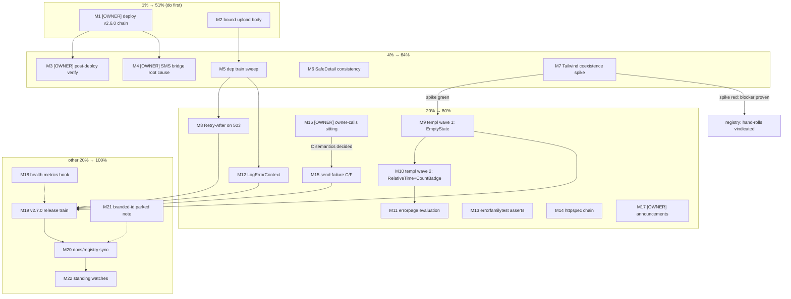

# SUPERB — Stack Adoption Pareto Plan

**Created:** 2026-09-24 13:33 (CLI-dated)
**Inputs:** library-utilization audit `docs/research/2026-09-24_larsartmann-stack-deep-dive.html` (commit `c2b0050`) + `TODO_LIST.md` sweep 2026-09-23 evening (7 open rows) + repo state verified green (`go mod tidy` repair applied this session; full build green).
**Question answered:** what should we _really_ do next with the audit findings and the open TODO backlog — ranked by customer value, impact, effort.
**Status:** PLAN (awaiting execution-mode approval; owner tasks flagged OWNER).

---

## 1. Pareto breakdown

### The 1% that deliver 51%

| # | Task                                                                                              | Why it is THE 1%                                                                                                                                                                                                                                                  |
| - | ------------------------------------------------------------------------------------------------- | ----------------------------------------------------------------------------------------------------------------------------------------------------------------------------------------------------------------------------------------------------------------- |
| A | **[OWNER] Deploy the released v2.6.0 chain to prod** (`nixos-rebuild test` → smoke → `switch`)    | Prod serves v2.5.0 while the whole chain (webphone `7197f1c` → stack `271f5ef` E2E ×2 → pbx-artmann `20b2a18`) sits green and verified. One command sequence turns ~3 weeks of shipped work into customer-visible value. Nothing else in the backlog comes close. |
| B | **Bound the upload request body** (`MaxBytesReader` in `requireSessionMultipart`, actions.go:421) | The only unbounded request path in the product (audit finding #1, misused/high). One line + one test closes the single real security gap the audit found.                                                                                                         |

### The 4% that deliver 64% (adds to the 1%)

| # | Task                                                                                                                                                        | Incremental value                                                                                                                         |
| - | ----------------------------------------------------------------------------------------------------------------------------------------------------------- | ----------------------------------------------------------------------------------------------------------------------------------------- |
| C | **[OWNER] Post-deploy verification** (smoke `--expect-version 2.6.0` + rejection-banner self-send)                                                          | Converts "deployed" into _proven_ deployed; the version check already verified ±                                                          |
| D | **[OWNER] SMS bridge root cause on prod** (journal `telnyx-webhooks`, fix creds/restart, test SMS)                                                          | Outbound SMS is a _broken product feature_ on prod since 2026-09-19; webphone-side fixes ride the deploy but the root cause is stack-side |
| E | **Dependency train sweep** (cqrs-htmx v4.12.0 + httputil v1.3.0 + error-family v0.10.2 + go-sse v0.6.1, one train, vendorHash roundtrip in the same breath) | Closes all 4 actionable version gaps at once; lands Retry-After machinery + drags go-cqrs-lite v4 modules to the v4.11.x line             |
| F | **SafeDetail redaction consistency** (action-handler client-visible error strings)                                                                          | One library call away; makes the error contract uniform with the webhook path                                                             |
| G | **Tailwind-coexistence spike** (4 templ-components on a throwaway route)                                                                                    | One experiment decides the whole templ-components lane (120 unused components) — adopt bottom-up or vindicate the blocker forever         |

### The 20% that deliver 80% (adds to the 4%)

| # | Task                                                                   | Incremental value                                                              |
| - | ---------------------------------------------------------------------- | ------------------------------------------------------------------------------ |
| H | Retry-After adoption on fail-closed 503s (after E)                     | Politeness signal for provider retries; small contract win                     |
| I | templ-components wave 1: `EmptyState` ×9 sites (if G green)            | Deletes the largest duplicated-markup family + its test burden                 |
| J | templ-components wave 2: `RelativeTime` + `CountBadge` (if G green)    | Two more hand-rolls retired; byte-stable pins must be reviewed                 |
| K | errorpage module evaluation (family-aware 404/panel)                   | The deepest templ adoption; decision doc, adopt-or-keep                        |
| L | `errorfamily.LogErrorContext` + `errorfamilytest` adoption             | Standardized log fields + 5 test files lose hand-rolled asserts                |
| M | httpspec conformance on the middleware chain                           | Free 19-spec behavioral suite; retires re-stated parity asserts                |
| N | Send-failure remainder C/F + fax-lane guard (C needs OWNER call first) | Closes the 2026-09-22 UX plan                                                  |
| O | **[OWNER] Owner-calls batch sitting** (~20 decisions, briefing ready)  | Unblocks parked decisions incl. C, Tailwind disposition, several ratifications |
| P | **[OWNER] Announcements posting** (5 drafts approved)                  | Public presence for v2.1.0–v2.6.0                                              |

### The other 20% to reach 100%

| # | Task                                                                                                                  | Notes                                                  |
| - | --------------------------------------------------------------------------------------------------------------------- | ------------------------------------------------------ |
| Q | v2.7.0 release train (fold → bump → gates → tag → stack bump → aarch64 → pbx-artmann relock)                          | Only after this cycle's code lands; runbook dance      |
| R | Docs/registry sync (AGENTS templ-components adoption table, error-contract rows, FEATURES/CHANGELOG)                  | Keeps one-home-per-fact honest after each wave         |
| S | go-health `WithEvaluationHook` → `/metrics` health counters                                                           | Mirrors the CRM lookup-counter pattern; nice telemetry |
| T | branded-id Valuer/Scanner at the store boundary                                                                       | PARKED by audit: only on the next storage-format touch |
| U | Standing watches (erraudit tier-2 2026-10-22; quarterly 2026-12-20; E2E budget; templ v1.20.x; sip.js named triggers) | Scheduled, not urgent                                  |

---

## 2. Comprehensive plan — medium granularity (30–100 min each)

Sorted by importance / impact / effort / customer value. `Tier` = Pareto tier. `Who`: A = assistant, O = OWNER terminal/decisions.

| ID  | Tier | Task                                                                                                                                                                                    | Who | Est   | Priority rationale                                 | Evidence / gates                                                       |
| --- | ---- | --------------------------------------------------------------------------------------------------------------------------------------------------------------------------------------- | --- | ----- | -------------------------------------------------- | ---------------------------------------------------------------------- |
| M1  | 1%   | Deploy v2.6.0 chain to prod: `nixos-rebuild test --flake .#pbx --target-host root@pbx.artmann.tech` → smoke → `switch`                                                                  | O   | 45m   | Customer value king; chain green end-to-end        | runbook `docs/release-runbook.md`; pbx-artmann `20b2a18`               |
| M2  | 1%   | Bound upload body: `http.MaxBytesReader` in `requireSessionMultipart` (+~1MB envelope const), oversize unit test, smoke probe check, error-contract row                                 | A   | 45m   | Only unbounded request path in product             | audit finding #1; actions.go:421; `uploadLimit` is maxMemory not a cap |
| M3  | 4%   | Post-deploy verification: `webphone-smoke.py --base https://pbx.artmann.tech --expect-version 2.6.0` + rejection-banner self-send + record                                              | O   | 30m   | Proves the deploy                                  | TODO row 2                                                             |
| M4  | 4%   | SMS bridge root cause: journal `telnyx-webhooks` since 2026-09-19, grep sms/422/error, fix creds/restart, test SMS, record in TODO + stack runbook                                      | O   | 60m   | Broken prod feature                                | TODO row 3; pbx AGENTS forbids assistant ssh                           |
| M5  | 4%   | Dependency train sweep: bump cqrs-htmx v4.12.0 + httputil v1.3.0 + error-family v0.10.2 + go-sse v0.6.1; tidy; `go test -count=1 ./...`; buildflow; `nix build` + vendorHash roundtrip  | A   | 90m   | 4 version gaps in one train; Retry-After machinery | audit §Version currency; lesson `0a7a732` (vendorHash same-breath)     |
| M6  | 4%   | SafeDetail consistency: route action-handler client-visible `err.Error()` strings through `cqrshtmx.SafeDetail`; tests; error-contract sync                                             | A   | 30m   | Redaction uniformity, one import away              | webhooks.go:28 (only SafeDetail site today)                            |
| M7  | 4%   | Tailwind-coexistence spike: throwaway route rendering `EmptyState`, `RelativeTime`, `CountBadge`, `NotFound404` with library CSS beside app.css; pixel + CSP verdict; spike-verdict doc | A   | 60m   | Decides the templ-components lane                  | audit finding #2; AGENTS "unproven here"                               |
| M8  | 20%  | Retry-After evaluation: grep 503 writers post-M5 (`/hooks/*` fail-closed, startupz); adopt `WithRetryAfter` where the contract fits; contract test                                      | A   | 30m   | Politeness for provider bursts                     | cqrs-htmx v4.12.0 changelog                                            |
| M9  | 20%  | templ wave 1 (only if M7 green): replace 9 `wp-empty` sites with `EmptyState`; templ generate; DOM/CSP tests; smoke; stack E2E nudge                                                    | A   | 100m  | Largest duplicated-markup family                   | DOM contract `docs/dom-contract.md`; E2E re-run rule                   |
| M10 | 20%  | templ wave 2 (only if M7 green): `RelativeTime` for stamps + `CountBadge` for nav badges; review byte-stable pins                                                                       | A   | 60m   | Two more hand-rolls retired                        | `formatClock`/`formatStamp` byte-stable pins; `wp-nav-badge`           |
| M11 | 20%  | errorpage module evaluation: add dep, render 404/error panel on throwaway route, CSP/nonce/styling fit; adopt-or-keep decision doc                                                      | A   | 60m   | Deepest adoption; family-aware pages               | templ-components `errorpage` (Family enum bridge)                      |
| M12 | 20%  | `errorfamily.LogErrorContext` adoption across slog error sites (keep English op text); field-format test                                                                                | A   | 45m   | Standardized family/code/retryable fields          | audit finding #4                                                       |
| M13 | 20%  | `errorfamilytest` asserts: swap hand-rolled family asserts in the 5 family test files                                                                                                   | A   | 60m   | Test ergonomics, one home                          | messaging/gateway/fax `family_test.go`, `classify_test.go`             |
| M14 | 20%  | httpspec on the chain: `httpspec.Run` against the New() middleware chain; triage; retire re-stated parity asserts                                                                       | A   | 90m   | Free 19-spec conformance                           | httputil httpspec; middleware_test.go overlaps                         |
| M15 | 20%  | Send-failure remainder: OWNER call on C semantics → implement C + fax-lane self-send guard (+F only if self-sends recur); i18n keys BOTH maps; tests                                    | A+O | 90m   | Closes the 09-22 UX plan                           | plan `2026-09-22_16-07_SUPERB-send-failure-ux.md`                      |
| M16 | 20%  | Owner-calls batch sitting: walk briefing doc, ~20 decisions, land results in TODO/ROADMAP                                                                                               | O   | 90m   | Unblocks C, Tailwind disposition, ratifications    | briefing `2026-09-22_13-50_owner-calls-briefing.md`                    |
| M17 | 20%  | Announcements posting: owner approves wording/channels/disclosure posture; post drafts v2.1.0–v2.6.0                                                                                    | O   | 30m   | Public presence                                    | drafts `docs/announcements/`                                           |
| M18 | tail | go-health `WithEvaluationHook` → `/metrics` health-check outcome counters (pattern: CRM lookups) + test                                                                                 | A   | 45m   | Telemetry nicety                                   | server.go /metrics; go-health hook seam                                |
| M19 | tail | v2.7.0 release train: full runbook dance incl. stack bump + aarch64 + pbx-artmann relock #5                                                                                             | A+O | 100m+ | Ships the cycle                                    | `docs/release-runbook.md`                                              |
| M20 | tail | Docs/registry sync: AGENTS templ-components table + adoption registry rows; error-contract rows; FEATURES/CHANGELOG                                                                     | A   | 30m   | One-home-per-fact after waves                      | AGENTS conventions                                                     |
| M21 | tail | branded-id Valuer/Scanner — PARKED; leave a seam comment "adopt on next storage-format touch"                                                                                           | A   | 5m    | Audit verdict: no standalone migration             | id_sql.go; parseID tolerates both formats                              |
| M22 | tail | Standing watches upkeep: calendar erraudit 2026-10-22 + quarterly 2026-12-20; verify E2E budget watch row fresh                                                                         | A   | 10m   | Scheduled hygiene                                  | TODO watches row                                                       |

22 tasks. Every open TODO_LIST row is represented (rows 1→M1, 2→M3, 3→M4, 4→M15, 5→M16, 6→M17, 7→M22); every audit opportunity is represented (1→M2, 2→M6, 3→M5/M8, 4→M7/M9/M10/M11, 5→M12/M13, 6→M5, 7→M14, 8→M21, 9→M18).

---

## 3. Fine breakdown — max 12 min each

Global order = execution order (tier, then dependency, then value). Parent IDs map to §2.

| FID   | Parent | Task (≤12 min)                                                                                                                        | Who | Gate / verify             |
| ----- | ------ | ------------------------------------------------------------------------------------------------------------------------------------- | --- | ------------------------- |
| F1.1  | M1     | Pre-flight: pbx-artmann tree clean at `20b2a18`, probe green, `git ls-remote` end states                                              | O   | runbook pre-flight        |
| F1.2  | M1     | `nixos-rebuild test --flake .#pbx --target-host root@pbx.artmann.tech`                                                                | O   | switch builds             |
| F1.3  | M1     | Prod smoke: `python3 scripts/webphone-smoke.py --base https://pbx.artmann.tech --expect-version 2.6.0`                                | O   | 0 failed                  |
| F1.4  | M1     | `nixos-rebuild switch` + `/version` recheck; mark TODO row done                                                                       | O   | version == 2.6.0          |
| F2.1  | M2     | Add `uploadBodyLimit = uploadLimit + 1<<20` + `r.Body = http.MaxBytesReader(w, r.Body, uploadBodyLimit)` in `requireSessionMultipart` | A   | edit compiles             |
| F2.2  | M2     | Unit test: oversize multipart → 400 with "too large" text; boundary at limit passes                                                   | A   | new test green            |
| F2.3  | M2     | `nix develop -c go test -count=1 ./internal/server/`                                                                                  | A   | package green             |
| F2.4  | M2     | Add smoke probe check: oversized upload to /messages/send rejected                                                                    | A   | smoke 42+4                |
| F2.5  | M2     | error-contract.md row for the oversize path                                                                                           | A   | doc synced                |
| F3.1  | M3     | Smoke prod URL incl. `--expect-version 2.6.0` (already F1.3 if M1 ran; else standalone)                                               | O   | 0 failed                  |
| F3.2  | M3     | Sign in, self-send SMS to PBX DID, verify persisted provider reason in failed bubble                                                  | O   | banner visible            |
| F3.3  | M3     | Record results in TODO_LIST row 2                                                                                                     | O   | row updated               |
| F4.1  | M4     | `journalctl -u telnyx-webhooks --since 2026-09-19` scan                                                                               | O   | findings noted            |
| F4.2  | M4     | Grep sms / 422 / error lines; isolate failure class                                                                                   | O   | root cause named          |
| F4.3  | M4     | Restart unit or fix creds per findings                                                                                                | O   | unit healthy              |
| F4.4  | M4     | Send test SMS end-to-end through the phone UI                                                                                         | O   | delivered                 |
| F4.5  | M4     | Record root cause in TODO row 3 + stack runbook                                                                                       | O   | docs synced               |
| F5.1  | M5     | `nix develop -c go get` the four module bumps                                                                                         | A   | go.mod updated            |
| F5.2  | M5     | `go mod tidy` + `go build ./...`                                                                                                      | A   | build green               |
| F5.3  | M5     | `nix develop -c go test -count=1 ./...`                                                                                               | A   | suite green               |
| F5.4  | M5     | `buildflow` (inside nix develop; BUILDFLOW_NO_RESULT_CACHE=1 if suspicious)                                                           | A   | gate green                |
| F5.5  | M5     | `nix build .#webphone`; if vendorHash mismatch → roundtrip in the SAME commit                                                         | A   | lesson `0a7a732`          |
| F5.6  | M5     | Commit + push with detailed message; note drift in TODO watches row                                                                   | A   | `git ls-remote` verified  |
| F6.1  | M6     | Inventory client-visible `err.Error()` writers in actions/panels handlers                                                             | A   | list complete             |
| F6.2  | M6     | Wrap the strings through `cqrshtmx.SafeDetail(err, status, false)`                                                                    | A   | tests compile             |
| F6.3  | M6     | Server tests + error-contract sync                                                                                                    | A   | green                     |
| F7.1  | M7     | Throwaway route + library Tailwind CSS include beside app.css                                                                         | A   | CSP test still green      |
| F7.2  | M7     | Render `EmptyState`, `RelativeTime`, `CountBadge`, `NotFound404`                                                                      | A   | renders                   |
| F7.3  | M7     | Pixel check (collisions vs app.css tokens) + CSP/DOM tests                                                                            | A   | verdict data              |
| F7.4  | M7     | Spike-verdict doc `docs/planning/2026-09-24_*-tailwind-coexistence-verdict.md` + TODO disposition                                     | A   | decision recorded         |
| F8.1  | M8     | Grep 503 writers post-M5; list candidates (hooks fail-closed, startupz degraded)                                                      | A   | list                      |
| F8.2  | M8     | Adopt `WithRetryAfter` where contract fits; keep 503 bodies unchanged                                                                 | A   | tests                     |
| F8.3  | M8     | Contract test pinning the header                                                                                                      | A   | green                     |
| F9.1  | M9     | Enumerate the 9 `wp-empty` sites; order by tab                                                                                        | A   | list                      |
| F9.2  | M9     | Replace empty states: messages + history tabs                                                                                         | A   | DOM test updated          |
| F9.3  | M9     | Replace: fax + voicemail + contacts + settings                                                                                        | A   | DOM test updated          |
| F9.4  | M9     | `templ generate ./internal/web/views/` + build                                                                                        | A   | committed *_templ.go      |
| F9.5  | M9     | Full server tests + smoke                                                                                                             | A   | green                     |
| F9.6  | M9     | Note stack E2E re-run requirement; trigger if markup classes changed                                                                  | A   | stack E2E green           |
| F10.1 | M10    | `RelativeTime` swap; review byte-stable timestamp pins (formatClock/formatStamp tests)                                                | A   | pins updated deliberately |
| F10.2 | M10    | `CountBadge` for nav badges; keep `wp-nav-badge` if DOM contract pins it                                                              | A   | DOM contract              |
| F10.3 | M10    | Tests + smoke                                                                                                                         | A   | green                     |
| F11.1 | M11    | Add `templ-components/errorpage` dep; render 404 + panel on throwaway route                                                           | A   | renders                   |
| F11.2 | M11    | CSP/nonce/styling/Tailwind fit check                                                                                                  | A   | verdict data              |
| F11.3 | M11    | Adopt-or-keep decision doc                                                                                                            | A   | decision recorded         |
| F12.1 | M12    | Map slog error sites with hand-packed family fields                                                                                   | A   | list                      |
| F12.2 | M12    | Swap to `errorfamily.LogErrorContext`; keep English op context                                                                        | A   | compiles                  |
| F12.3 | M12    | Field-format test + suite                                                                                                             | A   | green                     |
| F13.1 | M13    | Add `errorfamilytest` require to go.mod                                                                                               | A   | tidy                      |
| F13.2 | M13    | Swap asserts: messaging + gateway family tests                                                                                        | A   | green                     |
| F13.3 | M13    | Swap asserts: fax + classify tests; run suite                                                                                         | A   | green                     |
| F14.1 | M14    | Boot `httpspec.Run(t, chain-built-handler)` in a new test                                                                             | A   | first run                 |
| F14.2 | M14    | Triage failures vs webphone's deliberate divergences (Permissions-Policy, CSP)                                                        | A   | skip-list justified       |
| F14.3 | M14    | Retire middleware_test asserts that httpspec now covers                                                                               | A   | parity kept               |
| F14.4 | M14    | Keep suite in default `go test` path (no new CI needed)                                                                               | A   | runs in suite             |
| F15.1 | M15    | OWNER call: C semantics (instant refusal vs failed row)                                                                               | O   | decision                  |
| F15.2 | M15    | Implement C + fax-lane self-send guard                                                                                                | A   | tests                     |
| F15.3 | M15    | i18n keys in BOTH maps + suite                                                                                                        | A   | en/de test green          |
| F15.4 | M15    | F (own-DID warning) ONLY if self-sends recur post-B/C                                                                                 | A   | conditional               |
| F16.1 | M16    | Schedule the sitting; walk briefing top-to-bottom                                                                                     | O   | —                         |
| F16.2 | M16    | Record each decision back into TODO_LIST / ROADMAP                                                                                    | O   | rows updated              |
| F17.1 | M17    | Owner approves wording/channels/disclosure posture                                                                                    | O   | —                         |
| F17.2 | M17    | Post the five announcements                                                                                                           | O   | posted                    |
| F18.1 | M18    | Wire `WithEvaluationHook` counters → `/metrics` (mirror CRM counter rendering)                                                        | A   | renders when enabled      |
| F18.2 | M18    | Test + buildflow                                                                                                                      | A   | green                     |
| F19.1 | M19    | Release fold: daemon sweep check, CHANGELOG cut                                                                                       | A   | clean base                |
| F19.2 | M19    | Version bump + gates (buildflow, vulnix, `nix flake check`)                                                                           | A   | green                     |
| F19.3 | M19    | Tag + push + gh release (git ls-remote verify)                                                                                        | A   | tag out                   |
| F19.4 | M19    | Stack train bump + browser E2E                                                                                                        | A   | ×2 green                  |
| F19.5 | M19    | aarch64 cross-build verify (ELF bytes)                                                                                                | A   | aarch64 ELF               |
| F19.6 | M19    | pbx-artmann relock #5 + re-pin; probe + toplevels green                                                                               | A+O | green                     |
| F20.1 | M20    | AGENTS: templ-components adoption table + registry rows for adopted waves                                                             | A   | table current             |
| F20.2 | M20    | error-contract + FEATURES + CHANGELOG sync for the cycle                                                                              | A   | docs current              |
| F21.1 | M21    | Seam comment at store ID call sites: "adopt id.Valuer/Scanner on next storage-format touch"                                           | A   | comment only              |
| F22.1 | M22    | Calendar/notes: erraudit 2026-10-22, quarterly 2026-12-20                                                                             | A   | scheduled                 |

77 fine tasks, all ≤12 min, ALL TODOs covered (22 medium tasks fully decomposed).

---

## 4. Execution graph

Owner-gated path: M1 → (M3, M4); M16 unblocks M15 and ratifies M7's disposition.

---

## 5. Guardrails — do NOT verschlimmbessern

- **CSP absolutes:** no inline scripts, no inline `style` attributes (silently dead), `TestServedPageHatisfiesStrictCSP` fails on any inline script. templ-components adoptions must survive this test — that is precisely what M7 measures first.
- **DOM contract:** any markup change (M9–M11) → update `docs/dom-contract.md` + run `TestServedPageHoldsTheDomContract` + re-run the STACK browser E2E (greppable row classes ride the island/pages verbatim).
- **Byte-stable pins:** `formatClock`/`formatStamp` have byte-stable tests — a `RelativeTime` swap must delete those pins _deliberately_, never silently.
- **Dependency trains:** one train per sweep (M5), `go mod tidy`, full gates, and the vendorHash roundtrip in the SAME commit — the `0a7a732` lesson. Never mid-train partial states on main.
- **Concurrent sessions:** re-read shared files (AGENTS, pages.go, i18n.go, flake.nix) immediately before editing; never revert others' in-flight work.
- **i18n:** new keys in BOTH maps; service validation reasons + `#log` + shell copy stay English.
- **templ:** `templ generate ./internal/web/views/` after ANY .templ edit; committed `*_templ.go`.
- **Tests:** `-count=1`; full suite before any commit narrative claims green; buildflow is the gate.
- **No speculative swaps:** sip.js stays pinned (named triggers only); JsSIP fallback only on named triggers; recording stays two-level (stack records, webphone never).
- **TODO_LIST is the living source:** this plan is a snapshot; when tasks complete, update TODO_LIST (docs-health style: done work deleted, never struck through).

## 6. Verification per phase

| Phase                   | Gate                                                                     |
| ----------------------- | ------------------------------------------------------------------------ |
| After M2/M6/M8/M12–M15  | `nix develop -c go test -count=1 ./...` + buildflow on touched scope     |
| After M5                | full gates + `nix build .#webphone` + `git ls-remote` end-state check    |
| After M7                | spike-verdict doc committed; TODO disposition row                        |
| After M9–M11 (if green) | DOM/CSP tests + smoke + stack browser E2E                                |
| After M19               | runbook closing sweep incl. aarch64 ELF check + pbx-artmann relock probe |

---

_Snapshot plan. Living state: TODO_LIST.md. Audit evidence: docs/research/2026-09-24_larsartmann-stack-deep-dive.html._
