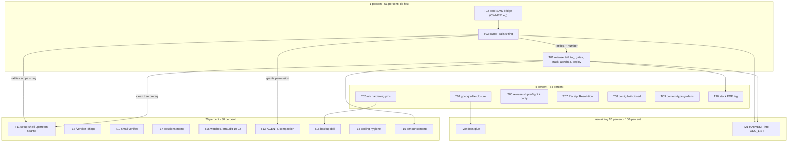

# SUPERB — Post-Review Pareto Execution Plan

**Created:** 2026-09-30 13:14 CEST · **Series:** 2026-09-30 review-series (follows the 12:58 session status + brutal self-review)
**Inputs:** `docs/status/2026-09-30_12-58_go-cqrs-lite-question-session-status.md` §f (40 items), `TODO_LIST.md` as swept 2026-09-29, AGENTS.md rules. Deduped: TODO_LIST rows are authoritative where they overlap my §f items.
**Mode:** PLANNING ONLY — no execution triggered yet ("wait for instructions" stands until the owner says GO).
**UPDATE 2026-09-30 ~15:00:** GO arrived; executing. Events that overtook the
plan: upstream shipped the setup-shell seams itself (cqrs-htmx setup/v4.13.x —
T11's upstream legs done, webphone-side adoption NO-GO on the footprint gate,
salvage rides v2.9.0 per the TODO_LIST setup row); T01 resolved the release
number as **v2.8.0** (tag cut 2026-09-30, tag `5c666a3`+gates); T02's owner
triage pack landed in the command sheet §4; T04/T19 verified + annotated.
Item-level verdicts live in the T21 harvest.

## Situation & scope fences

- The 2026-09-30 review series (arch 4.4 + data-model + error-family train, all green-verified) left a folded-but-untagged release, a prod-facing SMS bridge failure, ~15 parked owner decisions, and one open library question (go-cqrs-lite `system`+`metaengine`).
- **Concurrent session ACTIVE right now** (fax→Paperless, plan doc 12:53, status 13:09; owns in-flight edits to AGENTS.md / CHANGELOG.md / README.md / nix/module-check.nix). This plan does NOT absorb the fax workstream (it has its own plan + TODO_LIST row) and this session does NOT touch the files it holds dirty.
- **Verschlimmbessern guard:** every task must leave the repo verifiably no worse (skill rule + owner threat). No speculative rewrites; TODO_LIST rows are not duplicated into code comments; behavior parity for any port; gates green before "done".

## Assumptions (my 12:58 §g questions, resolved autonomously — override at the owner-calls sitting)

| #  | Assumption                                                                                                       | Basis                                                                                                    |
| -- | ---------------------------------------------------------------------------------------------------------------- | -------------------------------------------------------------------------------------------------------- |
| A1 | go-cqrs-lite adoption = CLOSED as wontfix; only cheap closure/verification tasks enter the plan                  | The 2026-09-24 deep-dive ruling; no owner mandate since                                                  |
| A2 | Sequencing = release tail FIRST, setup-shell seams after                                                         | TODO_LIST setup-shell row: "PREREQ: the release-tail row above ships FIRST (never ride a folded tree)"   |
| A3 | No AGENTS.md / TODO_LIST.md edits in this session                                                                | Concurrent session owns AGENTS.md right now; TODO_LIST harvest (T21) waits for a quiet window + owner GO |
| A4 | Owner-terminal legs (ssh/deploy/pbx-artmann rebuild) are marked OWNER — pbx-artmann AGENTS forbids assistant ssh | AGENTS.md + TODO_LIST row 1                                                                              |

## Pareto breakdown — where the value is

Customer here = the household users on pbx.artmann.tech (prod serves v2.6.0) + the consuming stack/pbx-artmann train.

### The 1% that delivers 51%

1. **T02 — prod SMS bridge failure** (owner journal/restart): sending SMS on prod may be broken RIGHT NOW; highest customer pain per minute of effort.
2. **T01 — v2.7.x release tail**: everything since 2.6.0 (error-family, nix hardening, honest Content-Type, EmptyState, drift fixes) is folded but invisible to prod; also unblocks the stack's flipped contacts assert + the bridge declared-type lane.
3. **T03 — owner-calls batch sitting**: ~15 parked decisions gate other work (release number, `-t 3`, AGENTS compaction permission, setup-shell T01/T02 ratification, go-cqrs-lite Q1/Q2 close, push-lag policy…).

### The 4% that delivers 64% (add)

T04 go-cqrs-lite closure trio · T05 nix hardening pins · T06 release.sh preflight + parity proof · T07 Receipt.Resolution (correctness debt filed twice) · T08 config fail-closed boot · T09 gateway Content-Type follow-ups · T10 stack browser-E2E release leg.

### The 20% that delivers 80% (add)

T11 setup-shell upstream seams (gated: after T01 + T03) · T12 `/version` ldflags enrichment · T19 small verifies (dispatcher lag, go-health ride, deep-dive annotation) · T17 sessions credentials-at-rest memo · T16 watches (erraudit 2026-10-22) · T13 AGENTS compaction (owner-gated) · T18 backup drill run · T14 tooling hygiene · T15 announcements.

### The other 20% to reach 100%

T20 docs glue (series cross-link, ROADMAP trigger line, rulings-index question) · T21 HARVEST of this plan into TODO_LIST · parked/conditional (NOT scheduled): internal/server carve (trigger = next file added there), XFF limiter flip (needs stack proof), QMD indexing + skill routing note (owner meta calls, folded into T03).

---

## Level 1 — comprehensive plan (30–100 min tasks, 21 total, sorted by importance/impact/effort/customer-value)

| #   | Task                                                                                                                                                     | Delivers (impact / customer value)                                                               | Tier | Effort                  | Owner leg                      | Depends / notes                                                   |
| --- | -------------------------------------------------------------------------------------------------------------------------------------------------------- | ------------------------------------------------------------------------------------------------ | ---- | ----------------------- | ------------------------------ | ----------------------------------------------------------------- |
| T02 | Prod SMS bridge failure: evidence pack + owner journal/restart + root-cause record                                                                       | Restores outbound SMS on prod if bridge-side; closes a 2026-09-19 probe                          | 1%   | S (45m)                 | journal/restart/test-SMS OWNER | None — first                                                      |
| T01 | Release tail: number decision → tag → gates → stack bump → aarch64 → gh object → (owner deploy) → pbx-artmann relock #5                                  | Ships all folded value to prod; unblocks stack assert + bridge lane; keeps tri-repo train honest | 1%   | S-M (4×100m)            | deploy + relock rebuild OWNER  | After any T02 finding that needs a webphone patch (none expected) |
| T03 | Owner-calls batch: briefing update (+ NEW: go-cqrs-lite Q1/Q2 close, QMD index, push-lag) + sitting + backport                                           | Unblocks ~15 parked decisions incl. T11 ratification, T13 permission, release number             | 1%   | S (60m)                 | sitting OWNER                  | Briefing prep assistant-doable now                                |
| T04 | go-cqrs-lite closure: pin-vs-local drift check, read `system.New` surface, ADR-0123 v5 impact scan, closure annotation                                   | Kills a recurring question with evidence; corrects my 12:58 unverified claims                    | 4%   | S (60m)                 | —                              | Independent quick win                                             |
| T05 | Nix-review follow-ups pt 1: module-check eval pins (UMask/StateDirectoryMode/dataDir) + VM/drill mode asserts                                            | Pins the 09-29 hardening so regressions fail the check, not prod                                 | 4%   | S-M (100m)              | —                              | Quiet window for nix/module-check.nix (concurrent session!)       |
| T06 | Nix-review follow-ups pt 2: release.sh ls-remote preflight, vulnix cwd guard, flake-split parity proof, devshell statix/deadnix, AGENTS one-command line | Every future release fails LOUDLY on unpushed state; tooling parity proven                       | 4%   | S-M (60m)               | —                              | AGENTS line waits for T13 window                                  |
| T07 | `gateway.Receipt.Resolution` enum (immediate/deferred) + drop fax service `*gateway.Loopback` assert                                                     | Closes the twice-filed type-model debt; receipt tells the truth about provider flow              | 4%   | S-M (60m)               | —                              | Data-model review 2026-09-30                                      |
| T08 | `config.Load()` fail-closed: ParseExtension over `identities` keys, ParsePhone over contacts                                                             | Typoed config boots LOUD, not silently missing lookups                                           | 4%   | S (45m)                 | —                              | Same review                                                       |
| T09 | Gateway honest-Content-Type follow-ups: golden part-header-block pin + webphone×bridge compat matrix doc                                                 | Wire contract pinned byte-exact; compat lanes documented                                         | 4%   | S (45m)                 | —                              | 09-29 04:32 §f                                                    |
| T10 | templ-components release-gate leg: trigger + read stack browser E2E, budget line update                                                                  | Closes the EmptyState markup-change E2E debt                                                     | 4%   | S (30m)                 | stack run OWNER-adjacent       | Rides T01's stack gates                                           |
| T11 | Setup-shell upstream seams: cqrs-htmx `Config.DisableAuth` + service-optional `New()` + `/auth` 404 test + tag setup/vX                                  | Leg 1 of the shell adoption (webphone composition is a SEPARATE later plan)                      | 20%  | M (4×12m slices + wait) | tag ratification OWNER         | T01 shipped + T03 ratifies T01/T02 of that plan                   |
| T12 | `/version` enrichment via ldflags (rev/dirty/date) + ReadBuildInfo fallback                                                                              | Kills the store-path chain-verification dance; smoke asserts get real                            | 20%  | M (90m)                 | —                              | 09-25 §f9                                                         |
| T19 | Small verifies: dispatcher/v4 v4.5.0 lag, go-health v0.4.1 ride, deep-dive version-table annotation                                                      | Pins three "probably fine" claims as evidence                                                    | 20%  | S (30m)                 | —                              | Independent                                                       |
| T17 | Sessions credentials-at-rest review memo (threat model + sweep evidence)                                                                                 | Periodic re-review the AGENTS invariant owes                                                     | 20%  | S (30m)                 | —                              | Fold verdict into T03 if change needed                            |
| T16 | Watches: erraudit tier-1+2 re-measure (due 2026-10-22) + quarterly sweep annotations                                                                     | Tier-2 must STAY 0                                                                               | 20%  | S (30m)                 | —                              | Date-gated                                                        |
| T13 | AGENTS compaction 498 → ≤377 lines (war stories → lessons.md, rules stay)                                                                                | Every future session gets faster context                                                         | 20%  | M (90m)                 | permission OWNER               | T03 grants; NOT during concurrent sessions                        |
| T18 | Backup drill run + restored-mode assert                                                                                                                  | Restore path proven again post-hardening                                                         | 20%  | S (30m)                 | —                              | T05.5 lands first                                                 |
| T14 | Tooling hygiene: markdownlint posture, codespell exclusion, buildflow-full reconcile, render-diff script commit, BuildFlow freshness note                | Stops 5092 finding noise from inviting a reflow disaster                                         | 20%  | S (60m)                 | posture OWNER                  | —                                                                 |
| T15 | Announcements: fresh draft for the ACTUAL number + owner picks/posts                                                                                     | Public record of the release train                                                               | 20%  | S (30m)                 | post OWNER                     | After T01 number decision                                         |
| T20 | Docs glue: review-series cross-link, ROADMAP event-sourcing trigger line, rulings-index → briefing                                                       | Navigability + the go-cqrs-lite revisit trigger recorded                                         | rest | S (30m)                 | —                              | —                                                                 |
| T21 | HARVEST this plan into TODO_LIST + dedup sweep-log + docs-health VERIFY                                                                                  | Plan items get a living home (plans entomb otherwise)                                            | rest | S (30m)                 | GO OWNER                       | After plan approval, quiet window                                 |

**Excluded (with reason):** fax→Paperless execution (concurrent session, own plan doc `2026-09-30_12-53_*`) · erraudit family adoption (DONE 2026-09-30) · internal/server carve, XFF flip, QMD index, skill routing note (parked/conditional — ROADMAP + T03).

---

## Level 2 — micro-breakdown (each ≤12 min, 87 total, sorted by parent priority then execution order)

| #  | Parent | Micro-task                                                                                                                   | Owner?      | Gate / notes                             |
| -- | ------ | ---------------------------------------------------------------------------------------------------------------------------- | ----------- | ---------------------------------------- |
| 1  | T02    | Collect evidence pack: 2026-09-19 probe output, expected journal greps, restart commands                                     |             | doc snippet for owner                    |
| 2  | T02    | Owner: journal telnyx-webhooks unit, grep sms/422/error, restart or fix creds, test SMS                                      | OWNER       | pbx-artmann AGENTS forbids assistant ssh |
| 3  | T02    | Record root cause in TODO_LIST row + stack runbook                                                                           |             | docs-health style                        |
| 4  | T02    | Close self-send rejection-banner browser check (journal-only confirmation acceptable)                                        | OWNER       | narrows to journal if human SMS worked   |
| 5  | T01    | Decide release number (2.7.0 vs 2.8.0; ">= 2.8" bridge claims at stake)                                                      | OWNER       | T03 may pre-decide                       |
| 6  | T01    | CHANGELOG: cut [Unreleased] → version + date                                                                                 |             |                                          |
| 7  | T01    | Run `buildflow` full gate (`BUILDFLOW_NO_RESULT_CACHE=1`)                                                                    |             | must exit 0                              |
| 8  | T01    | Run `nix flake check` (incl. KVM backup VM)                                                                                  |             |                                          |
| 9  | T01    | Cut + verify signed tag                                                                                                      |             | `git ls-remote` end state                |
| 10 | T01    | aarch64 cross-build + ELF e_machine=183 verify                                                                               |             | ELF bytes, not exit code                 |
| 11 | T01    | Smoke fresh binary: `--bin $(nix build .#webphone) --expect-version <V>`                                                     |             | 41+4 checks                              |
| 12 | T01    | Stack repo: lock bump to tag + vendorHash roundtrip SAME BREATH                                                              |             | `0a7a732` lesson                         |
| 13 | T01    | Stack gates incl. browser E2E (budget 445s; re-run once on the known transfer flake)                                         |             |                                          |
| 14 | T01    | Publish gh release object for the tag                                                                                        |             |                                          |
| 15 | T01    | Owner: deploy (`nixos-rebuild test` → smoke → `switch`) + post-deploy `--base https://pbx.artmann.tech --expect-version <V>` | OWNER       | command sheet §0                         |
| 16 | T01    | pbx-artmann relock #5 + re-pin (assistant edits, owner rebuild)                                                              | split       | stack tree MUST be clean first           |
| 17 | T03    | Update owner-calls briefing: + go-cqrs-lite Q1/Q2 close, QMD indexing, push-lag threshold                                    |             | briefing doc 2026-09-22_13-50            |
| 18 | T03    | Owner: the sitting — all decisions in one pass                                                                               | OWNER       |                                          |
| 19 | T03    | Backport decisions to TODO_LIST / ROADMAP rows                                                                               |             | quiet window                             |
| 20 | T04    | Drift check: local go-cqrs-lite HEAD `004298c1a` vs pinned v4.12.0 (`git describe`, diff READMEs' claims)                    |             | record which tree answered 12:58         |
| 21 | T04    | Read `system.New` composition surface; correct or refute the "fights the middleware chain" claim                             |             | source, not README                       |
| 22 | T04    | ADR-0123 v5 impact scan over the 7 indirect modules cqrs-htmx drags in                                                       |             | note in closure                          |
| 23 | T04    | ANNOTATE the 12:58 status report with closure verdict (appendix, never rewrite)                                              |             | docs-health ANNOTATE                     |
| 24 | T04    | Add closure line to owner-calls briefing (formal Q1 close)                                                                   |             |                                          |
| 25 | T05    | Module-check eval pins: `UMask=="0077"` + `StateDirectoryMode=="0750"` both units                                            |             | stand-ins already exist                  |
| 26 | T05    | Module-check: dedicated `dataDir` assertion entry                                                                            |             | destDir has one                          |
| 27 | T05    | VM test: backup files not world-readable (`stat -c %a` → 600/700)                                                            |             | KVM-gated                                |
| 28 | T05    | VM test: `/var/lib/webphone` mode 0750 + oneshot `Result=success`                                                            |             |                                          |
| 29 | T05    | Drill test: restored file mode ≤0640                                                                                         |             |                                          |
| 30 | T05    | Re-run `nix flake check` green                                                                                               |             |                                          |
| 31 | T06    | vulnix app cwd guard ("run from repo root" when `flake.lock` absent)                                                         |             |                                          |
| 32 | T06    | release.sh unpushed-commits preflight (`git ls-remote` vs HEAD, fail LOUD)                                                   |             |                                          |
| 33 | T06    | Flake-split output-parity proof (worktree at `46ad1d3`, `nix flake show --json` diff)                                        |             |                                          |
| 34 | T06    | devShells: add statix + deadnix                                                                                              |             |                                          |
| 35 | T06    | AGENTS one-command `nix build .#checks.x86_64-linux.<name>` line                                                             |             | after concurrent session lands           |
| 36 | T07    | Define `Resolution` enum (immediate/deferred) on `gateway.Receipt`                                                           |             | data-model review §finding               |
| 37 | T07    | Loopback gateway returns Resolution=immediate                                                                                |             |                                          |
| 38 | T07    | Webhook gateway returns Resolution=deferred                                                                                  |             |                                          |
| 39 | T07    | Drop fax `service.go:136` `*gateway.Loopback` type-assert                                                                    |             | symptom removed                          |
| 40 | T07    | Tests + family_test pin for the new seam                                                                                     |             |                                          |
| 41 | T07    | Gate battery green                                                                                                           |             |                                          |
| 42 | T08    | ParseExtension over every `identities` key in `config.Load()`                                                                |             | fail closed                              |
| 43 | T08    | ParsePhone over every shared contact                                                                                         |             |                                          |
| 44 | T08    | English fail-closed error texts (operator-facing policy)                                                                     |             |                                          |
| 45 | T08    | Boot-fail tests (typoed key → boot error)                                                                                    |             | contrast timezone behavior               |
| 46 | T08    | Gate battery green                                                                                                           |             |                                          |
| 47 | T09    | Byte-exact part-HEADER-block golden (reordering catcher)                                                                     |             |                                          |
| 48 | T09    | Compat matrix (old binary→sniff lane, new→declared lane) beside the AGENTS gateway bullet                                    |             | AGENTS edit → quiet window               |
| 49 | T09    | Webhook-lane smoke probe decision note (loopback-only today)                                                                 |             | decide, don't build speculatively        |
| 50 | T10    | Trigger stack browser E2E after T01 stack bump                                                                               |             | rides #13                                |
| 51 | T10    | Read run, update E2E budget line in watches row                                                                              |             |                                          |
| 52 | T11    | cqrs-htmx branch: `Config.DisableAuth` field                                                                                 |             | upstream repo                            |
| 53 | T11    | Mount conditional: `/auth/*` never mounts when disabled (setup.go:68/mount.go:45)                                            |             |                                          |
| 54 | T11    | Service-optional `New()` (no forced `usermgmt.Service`, setup.go:38-53)                                                      |             |                                          |
| 55 | T11    | Upstream tests: /auth 404 in disable mode + no-usermgmt boot                                                                 |             |                                          |
| 56 | T11    | Tag `setup/vX` + release notes (owner ratifies)                                                                              | OWNER       |                                          |
| 57 | T12    | flake ldflags: `buildCommit` (rev/dirtyRev), `buildCommitDate` (lastModifiedDate)                                            |             | commit-time only, no build clock         |
| 58 | T12    | ReadBuildInfo fallback (`vcs.revision`/`vcs.modified`)                                                                       |             |                                          |
| 59 | T12    | `/version` handler renders the new fields                                                                                    |             |                                          |
| 60 | T12    | Smoke: key-checked (not shape-pinned) version asserts                                                                        |             |                                          |
| 61 | T12    | error-contract + README rows for the enriched shape                                                                          |             |                                          |
| 62 | T13    | Owner grants AGENTS compaction permission                                                                                    | OWNER       | asked 09-29, unanswered                  |
| 63 | T13    | Extraction pass 1: war stories → docs/lessons.md                                                                             |             | content moves, not copies                |
| 64 | T13    | Pass 2: rules-only AGENTS rewrite, ≤377 lines                                                                                |             | next content add pays for itself         |
| 65 | T13    | Line-count + buildflow preflight green verify                                                                                |             |                                          |
| 66 | T14    | markdownlint posture decision (configure to house style OR record detect-only)                                               | OWNER picks | stops the 5092-finding trap              |
| 67 | T14    | codespell: exclude `docs/status/**` (or fix the 2 `pre-emptive` words)                                                       |             |                                          |
| 68 | T14    | Reconcile AGENTS buildflow-full claim vs `.buildflow.yml` (who's wrong)                                                      |             |                                          |
| 69 | T14    | Commit the render-diff script + park its recipe in AGENTS/lessons                                                            |             | carried since 09-24                      |
| 70 | T14    | BuildFlow binary freshness advisory note                                                                                     |             |                                          |
| 71 | T15    | Fresh announcement draft for the ACTUAL number                                                                               |             | drafts live in docs/announcements/       |
| 72 | T15    | Owner approves wording + picks channel + posts                                                                               | OWNER       | disclosure posture: fix-acknowledged     |
| 73 | T16    | erraudit tier-1+2 re-measure (due 2026-10-22; tier-2 stays 0)                                                                |             | date-gated                               |
| 74 | T16    | Quarterly watch sweep annotations (next 2026-12-20)                                                                          |             |                                          |
| 75 | T17    | Credentials-at-rest review memo (threat, sweep-on-read/Create evidence, TTL story)                                           |             |                                          |
| 76 | T17    | Fold verdict into owner-calls if any hardening needed                                                                        |             |                                          |
| 77 | T18    | Run `webphone-backup-drill`                                                                                                  |             | KVM                                      |
| 78 | T18    | Verify restore-mode assert green (ties #29)                                                                                  |             |                                          |
| 79 | T19    | Verify dispatcher/v4 v4.5.0 lag is upstream-intentional (cqrs-htmx go.mod)                                                   |             |                                          |
| 80 | T19    | Verify go-health v0.4.1 ride was deliberate (CHANGELOG/daemon trail)                                                         |             | deep-dive said HOLD                      |
| 81 | T19    | ANNOTATE deep-dive version-currency table (stale vs current go.mod)                                                          |             |                                          |
| 82 | T20    | Cross-link the review-series docs (status 12:58 + this plan)                                                                 |             |                                          |
| 83 | T20    | ROADMAP: record the go-cqrs-lite revisit trigger (event-sourced state or 2nd binary)                                         |             |                                          |
| 84 | T20    | Rulings-index question ("why not library X" pointer block?) → briefing                                                       |             | folds A1/Q2                              |
| 85 | T21    | HARVEST: route this plan's new items into TODO_LIST rows                                                                     | OWNER GO    |                                          |
| 86 | T21    | Dedup sweep-log line in docs/dedup-registry.md                                                                               |             |                                          |
| 87 | T21    | docs-health VERIFY pass over changed living docs                                                                             |             |                                          |

**Time estimate:** ~87 × ~10 min ≈ 14–15 h assistant-legs + owner legs (deploy, sitting, postings) — multi-session by design; the 1% tier alone is one focused day.

---

## Execution graph

## Verification contract (every task)

- Code tasks (T07, T08, T11, T12, T05/T06 nix legs): targeted tests → `nix develop -c go test -count=1 ./...` → buildflow → `nix flake check` where nix surface changed. DOM-affecting changes additionally owe the stack browser E2E.
- Docs tasks (T03, T04, T09, T14, T15, T19, T20): docs-health VERIFY; ANNOTATE never rewrites snapshots.
- Release tasks (T01): release-runbook ritual verbatim; end states via `git ls-remote`, never push logs.
- NOTHING touches the concurrent session's in-flight files (AGENTS.md, CHANGELOG.md, README.md, nix/module-check.nix) until it lands.

## Open owner gates (cannot proceed without)

1. T01 number decision (2.7.0 vs 2.8.0) — may happen inside T03.
2. T03 sitting (unblocks T11 ratification, T13 permission, `-t 3`, Q1/Q2 close).
3. T21 HARVEST go-ahead (this plan → TODO_LIST).
