# SUPERB — UI/UX Pareto Execution Plan

**Date:** 2026-10-01 03:53
**Input:** [UI/UX Idea Catalogue](2026-10-01_03-49_ui-ux-idea-catalogue.md) — 120 ideas, themes A–L
**Status:** Plan — awaiting owner approval before execution
**Constraint frame:** the product's hard rules are load-bearing. Every task below
respects them; the ones that touch them are flagged inline.

- `CSP` — no inline scripts / `style` attributes; behavior in `shell.js` or
  island modules, styles in `app.css` / scoped `tw.css`.
- `MORPH` — stateful nodes in morph surfaces need stable `id`s.
- `DOM` — greppable ids/classes; changing them updates
  `docs/dom-contract.md` + re-runs the stack browser E2E.
- `E2E` — needs the stack browser E2E on the wire.
- `SEAM` — needs a server/provider capability, not just presentation.

**Verschlimmbessern guard.** This plan adds surfaces; every task must leave the
served page, the morph surfaces, and the existing tests no worse than found.
No task may break the DOM contract, the CSP posture, or the island's
never-unload property. Every workstream runs the local gate before it is
called done.

---

## Step 1 — Pareto breakdown

The tiers are by **value contribution**, not literal item count. A "1% item"
is the single workstream that, if it were the ONLY thing shipped, would move the
product most.

### The 1% → 51%: "Stateful, trustworthy core interactions"

The two primary verbs are **call** and **message**. Today neither shows its own
state: messages have no delivery feedback and the call has no timer or visible
controls, so the product reads as *buttons on a log* rather than a live phone.

- **M1 — Messaging trust**: optimistic bubble + delivery state + retry +
  rollback (B2, B3, B1, J1).
- **M3 — Call state visibility**: explicit control cluster + timer + ringback
  pulse (A1, A2, A3).

If only this ships, the product stops feeling like a prototype.

### The 4% → 64% (next ~5 items)

- **M4 — Morph accessibility**: focus + announcements (G1, G2, G3, G4).
  Disproportionately high value because every new morph surface inherits the
  fix.
- **M5 — Perceived speed**: skeletons + swap transition (F1, F2, G8, J6).
- **M7 — Mobile spine**: full-screen call overlay + bottom tabs + tap targets +
  single-column stack (I1, I2, I5, I10).
- **M6 — Keyboard reachability**: skip link + `aria-current` + error
  association + contrast (E4, G5, G7, G10).
- **M2 — Transcript clarity**: date separators + unread divider (B4, B5, B20).

Together with the 1%, this is ~5% of the ideas delivering ~64% of the felt
improvement.

### The 20% → 80% (next ~24 items)

The `Now`/`Next`, `S`-to-`M` shortlist across every theme — M9 through M17:
dial affordances, contacts navigation, history filters, compose ergonomics,
voicemail/fax playback, visual tokens, URL state, feedback/trust.

### The other 20% to reach 100%

Structural depth and `SEAM` work — M18 through M26: onboarding + demo mode,
mobile extras, theming depth, messaging richness, messaging organization,
contacts depth, i18n + service status, call depth, shell sizing. These are real
but either speculative or need server-side design first.

---

## Step 2 — Comprehensive plan (medium granularity)

26 workstreams, 30–100 minutes each, every one of the 120 ideas assigned,
sorted by tier then by impact × value. Impact / Value are 1–5; Effort is the
dominant size (S/M/L).

| Rank | ID | Workstream | Ideas | Est | Impact | Effort | Value | Tier |
|------|----|------------|-------|-----|--------|--------|-------|------|
| 1 | M1 | Messaging trust: optimistic + delivery + retry + rollback | B1,B2,B3,J1 | 84m | 5 | M | 5 | 1% |
| 2 | M3 | Call state visibility: controls + timer + ringback | A1,A2,A3 | 72m | 5 | M | 5 | 1% |
| 3 | M7 | Mobile spine: call overlay + bottom tabs + tap targets | I1,I2,I5,I10 | 72m | 5 | M | 5 | 4% |
| 4 | M2 | Transcript clarity: date separators + unread divider | B4,B5,B20 | 48m | 4 | S | 4 | 1% |
| 5 | M4 | Morph accessibility: focus + live announcements | G1,G2,G3,G4 | 72m | 4 | M | 3 | 4% |
| 6 | M5 | Perceived speed: skeletons + swap transition | F1,F2,G8,J6 | 60m | 4 | S | 4 | 4% |
| 7 | M8 | Command palette + shortcut help | E1,H1,H2 | 72m | 4 | M | 4 | 20% |
| 8 | M10 | Contacts navigation: search + sections + inline edit | D1,D2,D3,D7 | 72m | 4 | S | 4 | 20% |
| 9 | M6 | Keyboard reachability: skip link + aria-current + contrast | E4,G5,G7,G10 | 48m | 3 | S | 3 | 4% |
| 10 | M17 | Feedback/trust: reconnect + retry + toasts + spinner | J2,J4,J5,J7,J8,J9 | 84m | 4 | M | 4 | 20% |
| 11 | M13 | Voicemail playback: waveform + speed + playing row | C1,C2,C3,C9,C10 | 72m | 4 | M | 3 | 20% |
| 12 | M12 | Compose ergonomics: enter-send + drafts + countdown | B8,B11,B12,B16,B17 | 60m | 3 | S | 3 | 20% |
| 13 | M11 | History filters: kinds + day grouping + channel icons | D8,D9,D10 | 60m | 3 | S | 3 | 20% |
| 14 | M9 | Dial affordances: name-on-type + DTMF + re-dial | A4,A5,A8,A9,K5 | 72m | 3 | S | 3 | 20% |
| 15 | M15 | Visual tokens: icon set + state colors + theme state | F3,F4,F7,F9 | 60m | 3 | S | 3 | 20% |
| 16 | M16 | Nav/URL state: filters + tab restore + breadcrumb | E2,E3,E7,E8 | 60m | 3 | S | 3 | 20% |
| 17 | M14 | Fax: thumbnail + status timeline + resend | C4,C5,C6 | 72m | 3 | S | 3 | 20% |
| 18 | M21 | Messaging richness: MMS preview + snippets + schedule | B6,B7,B9,B10,B19 | 72m | 3 | M | 3 | 100% tail |
| 19 | M18 | Onboarding/demo: tour + hints + demo mode | K1,K2,K3,K4 | 72m | 3 | M | 3 | 100% tail |
| 20 | M25 | Call depth: incoming focus + missed badge + media test | A6,A7,A10 | 72m | 3 | M | 3 | 100% tail |
| 21 | M19 | Mobile extras: row actions + swipe + safe-area | I3,I4,I6,I7,I8,I9 | 72m | 3 | S | 3 | 100% tail |
| 22 | M20 | Theming depth: accent + density + empty-art + shape | F5,F6,F8,F10 | 72m | 2 | M | 2 | 100% tail |
| 23 | M22 | Messaging organization: pin + archive + mute | B13,B14,B15,B18 | 72m | 2 | M | 2 | 100% tail |
| 24 | M23 | Contacts depth: merge + favorites + detail drawer | D4,D5,D6 | 72m | 2 | M | 2 | 100% tail |
| 25 | M24 | i18n + services: locale + RTL + status dots | L1,L2,L3,L4,L5,J10 | 72m | 2 | M | 2 | 100% tail |
| 26 | M26 | Shell sizing: island collapse + resizable sidebar | E5,E6 | 36m | 2 | S | 2 | 100% tail |

**Totals:** 26 workstreams, 120/120 ideas covered, ≈29.2 h of focused work.

---

## Step 3 — Detailed breakdown (≤12 min per task)

146 micro-tasks. Sorted by the same key as the medium plan (tier → impact ×
value), so the table is already in priority order top-to-bottom. Impact /
Effort / Value are inherited from the parent workstream and therefore omitted
per row.

### Tier 1% + 4% — do these first

| ID | Task (≤12 min) | Est |
|----|----------------|-----|
| M1.1 | Add a per-message delivery-state field to the render path (pending/delivered/failed) | 12m |
| M1.2 | Optimistic-bubble render helper + CSS pending style | 12m |
| M1.3 | Wire island send to append the optimistic bubble immediately | 12m |
| M1.4 | Extend status hook → per-message state, pushed over the `thread` event | 12m |
| M1.5 | Render delivery state on outbound bubbles (MORPH id) | 12m |
| M1.6 | Retry button on a failed bubble → resend POST | 12m |
| M1.7 | Rollback visuals + failure toast on send failure | 12m |
| M3.1 | Active-call control cluster markup (mute / hold / hangup / keypad) | 12m |
| M3.2 | Wire the cluster to existing `calls.js` actions | 12m |
| M3.3 | Call-timer component + tick loop | 12m |
| M3.4 | Reset/stop timer on terminate, hold, and transfer | 12m |
| M3.5 | Ringback pulse on the remote avatar | 12m |
| M3.6 | Pulse CSS + reduced-motion guard | 12m |
| M7.1 | `@media` full-screen call overlay | 12m |
| M7.2 | Bottom tab bar markup + CSS (DOM contract update) | 12m |
| M7.3 | Single-column stack reordering island above tabs | 12m |
| M7.4 | Enforce ≥44px tap targets on `.wp-mini` | 12m |
| M7.5 | Autofill audit (`inputmode` / `autocomplete`) on login + dial | 12m |
| M7.6 | Responsive verification pass across breakpoints | 12m |
| M2.1 | Date-separator computation helper (Go views) | 12m |
| M2.2 | Render date separators in the transcript | 12m |
| M2.3 | Unread-divider marker + props threading | 12m |
| M2.4 | Per-day counts in day headers | 12m |
| M4.1 | Focus target: panel heading gets `tabindex="-1"` | 12m |
| M4.2 | Move focus to the heading after a partial swap | 12m |
| M4.3 | Live region for unread-count changes | 12m |
| M4.4 | Announce new-message pushes via `aria-live` | 12m |
| M4.5 | `aria-current="page"` on the active nav link | 12m |
| M4.6 | Badge `aria-label` "N unread" | 12m |
| M5.1 | Skeleton partials for list surfaces | 12m |
| M5.2 | Wire `hx-indicator` → skeleton on nav swaps | 12m |
| M5.3 | Fade/slide transition on `#tab-content` | 12m |
| M5.4 | Reduced-motion guard for the transition | 12m |
| M5.5 | Relative-time auto-refresh loop | 12m |

### Tier 20% — the shortlist fan-out

| ID | Task (≤12 min) | Est |
|----|----------------|-----|
| M8.1 | Palette overlay markup + CSP-safe script shell | 12m |
| M8.2 | Fuzzy filter over tabs, threads, contacts, numbers | 12m |
| M8.3 | Command execution (navigate / start compose) | 12m |
| M8.4 | Ctrl/Cmd-K binding in `shell.js` | 12m |
| M8.5 | Shortcut-help overlay markup | 12m |
| M8.6 | Settings cheat-sheet panel | 12m |
| M10.1 | Contacts search input + client/server filter | 12m |
| M10.2 | Section headers / jumplist for long lists | 12m |
| M10.3 | Inline edit form per contact row | 12m |
| M10.4 | Wire edit to the store seam | 12m |
| M10.5 | Single-contact vCard export endpoint | 12m |
| M10.6 | Export link on the row | 12m |
| M6.1 | Skip-to-content link | 12m |
| M6.2 | `aria-describedby` on dial + login errors | 12m |
| M6.3 | Contrast pass on `.wp-muted` / `.hint` | 12m |
| M6.4 | Theme toggle exposes current state to SR | 12m |
| M17.1 | SSE reconnect banner | 12m |
| M17.2 | Auto-recovery notice on reconnect | 12m |
| M17.3 | Retry / copy-detail affordance in error banners | 12m |
| M17.4 | Toast queue with dismiss + stacking rules | 12m |
| M17.5 | Submitted-button spinner (extend `hx-disabled-elt`) | 12m |
| M17.6 | Success pulse on contact save / message send | 12m |
| M17.7 | Confirm-dialog consistency | 12m |
| M13.1 | Waveform render from audio peaks | 12m |
| M13.2 | Scrubber interaction | 12m |
| M13.3 | Playback-speed control | 12m |
| M13.4 | Playing-row highlight (MORPH id) | 12m |
| M13.5 | Unread clears on play + mirrors to nav badge | 12m |
| M13.6 | Consolidate voicemail row into one action card | 12m |
| M12.1 | Enter-to-send handler + setting | 12m |
| M12.2 | Per-thread draft persistence | 12m |
| M12.3 | Segment over-limit countdown | 12m |
| M12.4 | Copy number / copy message action | 12m |
| M12.5 | Mark-all-read button | 12m |
| M11.1 | History filter chips markup | 12m |
| M11.2 | Filter query params + server-side filtering | 12m |
| M11.3 | Day-grouping helper | 12m |
| M11.4 | Per-day counts | 12m |
| M11.5 | Channel + outcome icons on rows | 12m |
| M9.1 | Name-as-you-type resolver under `#dest` | 12m |
| M9.2 | Number-normalization hint text | 12m |
| M9.3 | DTMF key press animation | 12m |
| M9.4 | Transient tones-sent list | 12m |
| M9.5 | Re-dial on the island's last-call row | 12m |
| M9.6 | Re-dial on history rows | 12m |
| M15.1 | Icon set selection + inline SVG sprite | 12m |
| M15.2 | Replace emoji row actions with icons | 12m |
| M15.3 | State-color tokens (success/warning/danger) | 12m |
| M15.4 | Apply tokens to badges, banners, toasts | 12m |
| M15.5 | Theme toggle icon + avatar contrast fix | 12m |
| M16.1 | Filter value → query-param plumbing | 12m |
| M16.2 | Last-active-tab restore | 12m |
| M16.3 | Breadcrumb component | 12m |
| M16.4 | Sticky nav keeps active tab visible | 12m |
| M16.5 | URL push/pop correctness check | 12m |
| M14.1 | PDF first-page thumbnail render | 12m |
| M14.2 | Thumbnail in the fax list | 12m |
| M14.3 | Fax status-timeline component | 12m |
| M14.4 | Wire status from hooks | 12m |
| M14.5 | Resend button on failed rows | 12m |
| M14.6 | Resend handler + timeline styling | 12m |

### Tier 100% tail — structural depth + SEAM

| ID | Task (≤12 min) | Est |
|----|----------------|-----|
| M21.1 | MMS image thumbnail + lightbox | 12m |
| M21.2 | Attachment-type preview in the thread list | 12m |
| M21.3 | Snippet store seam | 12m |
| M21.4 | Snippet picker in the composer | 12m |
| M21.5 | Quick-reply chips | 12m |
| M21.6 | Schedule-message UI + gateway/provider support | 12m |
| M18.1 | Demo-mode data seeding (loopback) | 12m |
| M18.2 | First-run tour overlay | 12m |
| M18.3 | Tour-step wiring | 12m |
| M18.4 | Contextual hints on composer + dial | 12m |
| M18.5 | Hint dismiss persistence | 12m |
| M18.6 | "What this can do" panel + no-PBX verify | 12m |
| M25.1 | Incoming-call focus mode | 12m |
| M25.2 | Missed-call badge on the island | 12m |
| M25.3 | Badge clear-on-view | 12m |
| M25.4 | Pre-call media/ICE test | 12m |
| M25.5 | Device-check UI | 12m |
| M25.6 | Verify across call states | 12m |
| M19.1 | Mobile action bar on contact/history rows | 12m |
| M19.2 | Swipe-to-delete | 12m |
| M19.3 | Pull-to-refresh on SSE lists | 12m |
| M19.4 | Header collapse on scroll | 12m |
| M19.5 | Safe-area inset polish | 12m |
| M19.6 | Responsive verification pass | 12m |
| M20.1 | Per-tab accent tokens | 12m |
| M20.2 | Apply accent to panel heads | 12m |
| M20.3 | Density toggle + CSS | 12m |
| M20.4 | Empty-art set | 12m |
| M20.5 | Rounded/sharp token switch | 12m |
| M20.6 | Verify both light + dark themes | 12m |
| M22.1 | Pin/star store field | 12m |
| M22.2 | Pin UI on the row | 12m |
| M22.3 | Archive action | 12m |
| M22.4 | Mute → badge suppression | 12m |
| M22.5 | Notification deep-link into thread | 12m |
| M22.6 | Verify morph ids / per-day counts in long threads | 12m |
| M23.1 | Duplicate detection | 12m |
| M23.2 | Merge action | 12m |
| M23.3 | Favorites store field | 12m |
| M23.4 | Speed-dial row | 12m |
| M23.5 | Contact detail-drawer endpoint | 12m |
| M23.6 | Drawer UI + morph/state verify | 12m |
| M24.1 | Locale date/number helper | 12m |
| M24.2 | Apply locale formatting | 12m |
| M24.3 | Server-side language persistence | 12m |
| M24.4 | Live language switch (no reload) | 12m |
| M24.5 | RTL logical-property audit | 12m |
| M24.6 | Service status probe dots + Settings render | 12m |
| M26.1 | Island collapse control + persisted state | 12m |
| M26.2 | Resizable sidebar + persisted width | 12m |
| M26.3 | Layout verification pass | 12m |

---

## Step 4 — Execution graph

```mermaid
graph TD
  subgraph T1["Tier 1% → 51%"]
    M1["M1 · Messaging trust<br/>optimistic + delivery + retry + rollback"]
    M2["M2 · Transcript clarity<br/>date separators + unread divider"]
    M3["M3 · Call state<br/>controls + timer + ringback"]
  end

  subgraph T2["Tier 4% → 64%"]
    M4["M4 · Morph a11y<br/>focus + announcements"]
    M5["M5 · Perceived speed<br/>skeletons + transitions"]
    M6["M6 · Keyboard reachability<br/>skip link + aria + contrast"]
    M7["M7 · Mobile spine<br/>overlay + bottom tabs"]
  end

  subgraph T3["Tier 20% → 80%"]
    M8["M8 · Command palette + help"]
    M9["M9 · Dial affordances"]
    M10["M10 · Contacts navigation"]
    M11["M11 · History filters"]
    M12["M12 · Compose ergonomics"]
    M13["M13 · Voicemail playback"]
    M14["M14 · Fax depth"]
    M15["M15 · Visual tokens"]
    M16["M16 · Nav / URL state"]
    M17["M17 · Feedback / trust"]
  end

  subgraph T4["Tier 100% tail"]
    M18["M18 · Onboarding / demo"]
    M19["M19 · Mobile extras"]
    M20["M20 · Theming depth"]
    M21["M21 · Messaging richness"]
    M22["M22 · Messaging organization"]
    M23["M23 · Contacts depth"]
    M24["M24 · i18n + services"]
    M25["M25 · Call depth"]
    M26["M26 · Shell sizing"]
  end

  M1 --> M2
  M1 --> M17
  M3 --> M9
  M3 --> M25
  M4 --> M12
  M4 --> M13
  M5 --> M11
  M6 --> M15
  M7 --> M19
  M8 --> M16
  M10 --> M23
  M13 --> M14
  M12 --> M21
  M16 --> M22
  M15 --> M20
  M24 -.-> M7

  classDef t1 fill:#0f766e,color:#fff
  classDef t2 fill:#155e75,color:#fff
  classDef t3 fill:#334155,color:#fff
  classDef t4 fill:#1e293b,color:#fff
  class M1,M2,M3 t1
  class M4,M5,M6,M7 t2
  class M8,M9,M10,M11,M12,M13,M14,M15,M16,M17 t3
  class M18,M19,M20,M21,M22,M23,M24,M25,M26 t4
```

Solid arrows are sequencing dependencies (do the source first, or at least
decide its shape first). The dotted arrow is a soft coupling only.

---

## Execution protocol (per workstream)

1. `nix develop -c go test -count=1 ./...` before starting (clean baseline).
2. Land the change in the smallest verifiable unit.
3. `templ generate ./internal/web/views/` after any `.templ` edit.
4. Re-run the gate: unit + island `node:test` + `nix flake check` for markup
   changes; update `docs/dom-contract.md` where ids change.
5. If markup changed, re-run the stack browser E2E (`E2E` tasks only).
6. Commit in small, explicitly-committed units with a narrative message.

## Risks / what must not break

- **M1 / M17 / M22** mutate morph surfaces — every stateful node needs a stable
  `id`, or focus, drafts, and playing audio die on swap (`MORPH`).
- **M7 / M15 / M20** touch the DOM contract and the adopted-component CSS —
  update `docs/dom-contract.md`, use the `tw.css` build, never a second Tailwind
  version (`DOM`, `TW`).
- **M8 / M21 / M18** add JS-heavy overlays and a demo mode — all script stays in
  same-origin files; no inline handlers or `style` attrs (`CSP`).
- **M4 / M6** change focus behavior globally — verify against the existing
  a11y and island tests, not just visually.

## Open questions (owner decisions needed)

- Treat this as input to `ROADMAP.md` (raw ideas) or promote tiers 1% + 4% into
  `TODO_LIST.md` (bounded tasks)?
- Is mobile (`M7`, `M19`) first-class or graceful-degradation? Reorders ~⅓ of
  the tail.
- Which `SEAM` workstreams (M21–M24, parts of M18/M25) get a server-side design
  before any UI work?

## Next action

Awaiting approval. On approval, execute in tier order — 1% first — with the
per-workstream protocol above.
