# SUPERB Execution Plan — Verification & Performance (webphone, 2026-10-01)

**Created:** 2026-10-01 05:35 CEST · **Input:** the session's three status reports
(`2026-10-01_02-54`, `_04-07`, `_05-27` in `docs/status/`) deduplicated into ONE
master backlog, then Pareto-ranked. **Method:** pareto-planning skill; two
deliberate deviations from the skill default, both owner-ordered: output is this
Markdown file with a mermaid graph (skill default: styled HTML), and the
fine-grain cap is 12 min (skill: 15).

**The one-line goal:** turn a fast, shipped-but-unverified phone into a
_verified_ fast phone, and capture the session's knowledge where the next
session finds it — without Verschlimmbessern (every task leaves the repo
verifiably no worse; the island's verbatim-serving pin, the strict CSP, the
`no-store` security pins, and the DOM contract are load-bearing and untouchable).

---

## Step 1 — Pareto Breakdown

### The 1% that delivers 51% of the result (1 task)

**T01 — The one live-call verification ritual.** A single real incoming call
through `pbx.artmann.tech` retires SIX open questions at once: (1) does the mic
pre-warm train actually work (accept→speak sub-second, mic indicator at ring),
(2) ICE panel `path:`/`rtt:` numbers, (3) is the MOH music audible, (4) wired vs
Bluetooth (picks the next latency knob), (5) does the autoplay bug actually
bite (was the ring silent?), (6) did the demo call land in `/recordings/` + CDR.
No code — pure evidence. Everything else in this plan is calibrated by it.

### The 4% that delivers 64% of the result (4 tasks)

1% **plus** the gates that make "green" mean something and the one diagnosed
user-visible bug:

- **T02** — full `buildflow` gate (the repo's ONE quality gate; the mic train
  shipped on targeted gates only).
- **T03** — stack browser E2E re-run (proves registration + REAL WebRTC media
  with the changed island; the closest thing to T01 that is fully automated).
- **T04** — smoke binary boot (`go build` + `scripts/webphone-smoke.py`).
- **T09** — ring-silence fix: the `AudioContext`s are created outside a user
  gesture (`audio.js:10,37`) → suspended → the ring tone may be silent. The
  only KNOWN bug in the island; three reports old.

### The 20% that delivers 80% of the result (≈11 tasks)

4% **plus** the performance ships and the knowledge capture that stops drift:

- **T05** — ETag + 304 for `/assets/*` (after reconciling `server.go:252`'s
  existing composite-ETag machinery).
- **T06** — scoped gzip for static handlers only.
- **T07** — outgoing-call mic warm (mirror of the shipped incoming fix).
- **T08** — curl timing baseline (the "measured" tag).
- **T10** — HARVEST: three reports → `TODO_LIST.md`/`ROADMAP.md`.
- **T11** — ops-runbook demo-call recipe (telephony repo, incl. the corrected
  password path — kills the re-derivation class).
- **T12** — `deploy.md` secret PATH column (same class).
- **T13** — WebTransport verdict planning doc (chat-only knowledge → repo).
- **T14** — answer-latency `#log` lines (click → 200-sent → Established).
- **T27** — push verification (`git ls-remote`).
- **T20** — prod hygiene batch (`/tmp/song.wav`, Option A/B decision).

### The remaining 80% → 100% (everything else, 15 tasks)

T15–T19, T21–T26: island hardening tests, devicechange/pagehide, cross-browser,
ice-panel enrichment, iceServers/trickle evaluations, telephony VM tests,
wrapper script, annotations, README/FEATURES, lessons capture. Full list in the
tables below — nothing from the three reports is dropped.

---

## Step 2 — Comprehensive Plan (medium granularity, 30–100 min each, 26 tasks)

Sorted by tier → impact → effort. "Size" = wall-clock estimate incl. tests.
`Dep` = dependency edge in the graph below.

| ID  | Tier | Task                                                                                                                                                                                    | Size    | Impact   | Dep                  |
| --- | ---- | --------------------------------------------------------------------------------------------------------------------------------------------------------------------------------------- | ------- | -------- | -------------------- |
| T01 | 1%   | **Live-call ritual** (user dials; I prep the checklist and collect: accept→speak, indicator-at-ring, ICE `path:`/`rtt:`, MOH audible, BT/wired, ring audible?, `/recordings/`+CDR)      | 45m     | Critical | —                    |
| T02 | 4%   | **buildflow full gate** on the current tree                                                                                                                                             | 60m     | Critical | —                    |
| T03 | 4%   | **Stack browser E2E re-run** (nix-international-telephony `tests/browser.nix` flow)                                                                                                     | 90m     | Critical | —                    |
| T04 | 4%   | **Smoke boot**: `go build` + `scripts/webphone-smoke.py` over the current island                                                                                                        | 30m     | High     | —                    |
| T09 | 4%   | **Ring-silence fix**: gesture-scoped AudioContext create/resume; unify ringback+ringTone into ONE ctx; island tests pin no-ctx-before-gesture                                           | 90m     | High     | —                    |
| T05 | 20%  | **ETag + 304 for `/assets/*`**: read `server.go:252` composite-ETag context FIRST, then sha-of-bytes strong ETag, keep `no-cache`, rewrite the stale comment, unit tests (200/304/HEAD) | 60m     | High     | T01(calibrates), T02 |
| T06 | 20%  | **Scoped gzip** for the static handlers only (never `/events`), + tests incl. "SSE response has no Content-Encoding" pin                                                                | 60m     | High     | T02                  |
| T07 | 20%  | **Outgoing mic warm** via `mic.js` on dialpad focus / session-open; factory already reuses it; tests                                                                                    | 60m     | High     | T01                  |
| T10 | 20%  | **HARVEST** the three reports into `TODO_LIST.md`/`ROADMAP.md` (docs-health)                                                                                                            | 45m     | High     | —                    |
| T08 | 20%  | **Curl timing baseline** first-load + reload, before/after T05/T06 (numbers into the plan file as an appendix)                                                                          | 30m     | Medium   | T05, T06             |
| T11 | 20%  | **ops-runbook demo-call recipe** (telephony repo): originate+playback, corrected `/var/lib/telephony-secrets/` password path, kill switch, originate caller-ID note                     | 30m     | High     | —                    |
| T12 | 20%  | **`deploy.md` secret PATH column** (telephony repo) — kills the `/run/secrets` confusion class at the source                                                                            | 30m     | Medium   | —                    |
| T13 | 20%  | **WebTransport verdict doc** under `docs/planning/` (rationale + revisit triggers from the 02:54 answer)                                                                                | 30m     | Medium   | —                    |
| T14 | 20%  | **Answer-latency `#log` lines** (English, greppable: click→200-sent→Established) + island tests                                                                                         | 60m     | Medium   | T09                  |
| T27 | 20%  | **Push verification** `git ls-remote` for all train commits                                                                                                                             | 15m→30m | Medium   | —                    |
| T20 | 80%  | **Prod hygiene batch**: delete `/tmp/song.wav`, Option A (MOH) vs B (file) standing-demo decision, document one                                                                         | 30m     | Medium   | T01                  |
| T15 | 80%  | **Mic test hardening**: survives-rebuild, dial-after-missed consumes warm, second-onInvite guard; dedupe stubs into `helpers.mjs`                                                       | 45m     | Medium   | T07                  |
| T16 | 80%  | **Lifecycle hygiene**: `devicechange` re-warm + `pagehide` release                                                                                                                      | 45m     | Medium   | T07                  |
| T17 | 80%  | **Mic-failure `announce()`** at ring time (permission-denied visibility)                                                                                                                | 30m     | Medium   | —                    |
| T18 | 80%  | **iceServers trimming evaluation** (needs T01's path numbers; fewer TURN allocations)                                                                                                   | 45m     | Medium   | T01                  |
| T19 | 80%  | **Cross-browser gUM check** (Safari 26.4 / Firefox: gesture-less getUserMedia at ring)                                                                                                  | 45m     | Medium   | —                    |
| T21 | 80%  | **Telephony VM tests**: `local_stream://moh` wired under default sounds; originate+`&playback` smoke                                                                                    | 90m     | Medium   | —                    |
| T22 | 80%  | **Ice panel enrichment**: gathering duration, time-to-first-media, "gather cap hit" hint                                                                                                | 60m     | Medium   | T01                  |
| T23 | 80%  | **`pbx-fs` wrapper** on prod + `sofia` caller-ID/timeout-knob docs                                                                                                                      | 30m     | Low      | T11                  |
| T24 | 80%  | **Stack vhost read**: verify `encode` absence + UDP 443 state; write the h3/encode recommendation (no change without it)                                                                | 45m     | Low      | —                    |
| T25 | 80%  | **Docs sweep**: README FAQ (fast answer + indicator-at-ring), FEATURES.md island row, annotate the 02:54/04:07 reports (ANNOTATE mode)                                                  | 45m     | Low      | T05–T07              |
| T26 | 80%  | **lessons.md candidate** (crush-config commit): "derive runtime paths from config values, not docs tables" + trickle-ICE investigation note                                             | 45m     | Low      | —                    |

Deliberately OUT of this plan (release-coupled, not forgotten): CHANGELOG
version fold + AGENTS.md mic-bullet shortening happen at the next release train;
`go test ./...`-level suites ride buildflow (T02).

---

## Step 3 — Detailed Breakdown (micro-tasks, ≤12 min each, sorted by execution order)

Dependency groups run in the order below; IDs are stable for the graph.

| µID                                                          | Task                                                                                                                                  | Min | Dep                     |
| ------------------------------------------------------------ | ------------------------------------------------------------------------------------------------------------------------------------- | --- | ----------------------- |
| **Group G0 — parallel start: gates + user ritual (no code)** |                                                                                                                                       |     |                         |
| µ01                                                          | Prep T01 checklist: the six observations, in page order, with where each is read (island console, ICE panel, `/recordings/`)          | 10  | —                       |
| µ02                                                          | T01 execution: user places + accepts a real call; six observations recorded verbatim                                                  | 12  | µ01                     |
| µ03                                                          | T01: ICE panel screenshot/transcript → `path:`/`rtt:` noted in this file's appendix                                                   | 6   | µ02                     |
| µ04                                                          | T01: `/recordings/` + CDR check for the demo call (basic-auth URL)                                                                    | 8   | µ02                     |
| µ05                                                          | T01 verdicts: mark the six questions answered; flag any regression found                                                              | 6   | µ03,µ04                 |
| µ06                                                          | T02: run `buildflow` (BUILDFLOW_NO_RESULT_CACHE=1), capture verdict                                                                   | 12  | —                       |
| µ07                                                          | T02: triage any finding (known gomod-check FP documented in AGENTS → route, don't fix)                                                | 10  | µ06                     |
| µ08                                                          | T03: run the stack browser E2E, capture timing vs 445s budget                                                                         | 12  | —                       |
| µ09                                                          | T03: verdict + (if the known transfer-step flake) one re-run before digging                                                           | 10  | µ08                     |
| µ10                                                          | T04: `nix develop -c go build -o /tmp/webphone-bin ./cmd/webphone`                                                                    | 6   | —                       |
| µ11                                                          | T04: `scripts/webphone-smoke.py` against the fresh binary; verdict                                                                    | 10  | µ10                     |
| µ12                                                          | G0 wrap: record all gate verdicts in this file's appendix; commit narrative                                                           | 10  | µ05,µ07,µ09,µ11         |
| **Group G1 — the diagnosed bug (island)**                    |                                                                                                                                       |     |                         |
| µ13                                                          | T09: read `audio.js` + `notifyIncoming`/`ringToneStart` call sites; decide gesture points (accept click, first pointerdown)           | 10  | —                       |
| µ14                                                          | T09: unify ringback+ringTone into ONE lazily-created ctx in `audio.js`                                                                | 12  | µ13                     |
| µ15                                                          | T09: resume-on-gesture wiring (pointerdown/keydown/visibilitychange once-listener)                                                    | 10  | µ14                     |
| µ16                                                          | T09: island test — ctx created only after gesture (stub AudioContext state machine)                                                   | 12  | µ15                     |
| µ17                                                          | T09: island test — ring audible after gesture resume; run full island suite                                                           | 12  | µ16                     |
| **Group G2 — performance train**                             |                                                                                                                                       |     |                         |
| µ18                                                          | T05: read `server.go:240-270` composite-ETag context; write the reconcile note (no duplication)                                       | 10  | —                       |
| µ19                                                          | T05: implement sha-of-bytes ETag in `serveEmbedded` + island mux wrapper; keep `no-cache`                                             | 12  | µ18                     |
| µ20                                                          | T05: unit tests — 200 with ETag, 304 on If-None-Match, HEAD no body                                                                   | 12  | µ19                     |
| µ21                                                          | T05: rewrite the stale "caching buys nothing" comment to the new contract                                                             | 5   | µ20                     |
| µ22                                                          | T06: implement gzip for `serveEmbedded` + island static handlers only (`gzip.NewWriterLevel` or httputil seam if cqrs-htmx ships one) | 12  | —                       |
| µ23                                                          | T06: tests — Content-Encoding on accept-gzip asset, ABSENT on `/events` (SSE pin), Vary header                                        | 12  | µ22                     |
| µ24                                                          | T06: verify op breakdown: serve `text/plain` fallback? no — run oxlint/format on touched files                                        | 6   | µ23                     |
| µ25                                                          | T07: add `warmMic()` trigger on dialpad focus + session-open (guarded by `mediaDevices`)                                              | 10  | —                       |
| µ26                                                          | T07: test — outgoing invite consumes warm stream, no double gUM                                                                       | 12  | µ25                     |
| µ27                                                          | T07: test — cold dial (no warm) falls back exactly like today                                                                         | 8   | µ26                     |
| µ28                                                          | T08: curl baseline BEFORE numbers (already have T05/T06 diffs; re-run after) — record table                                           | 8   | µ21,µ24                 |
| µ29                                                          | T08: re-run AFTER; append before/after table to this file; commit the perf train narrative                                            | 10  | µ28                     |
| **Group G3 — knowledge capture**                             |                                                                                                                                       |     |                         |
| µ30                                                          | T10: docs-health HARVEST pass 1 — read the three reports' (f)-sections, dedupe into master rows                                       | 12  | —                       |
| µ31                                                          | T10: HARVEST pass 2 — TODO_LIST rows (30–100min, owner-actionable) + ROADMAP rows (long tail)                                         | 12  | µ30                     |
| µ32                                                          | T10: mark harvested items with their source report IDs; commit                                                                        | 8   | µ31                     |
| µ33                                                          | T13: write WebTransport verdict doc (decision, four structural reasons, revisit triggers)                                             | 12  | —                       |
| µ34                                                          | T13: cross-link from FEATURES/TODO row; commit                                                                                        | 6   | µ33                     |
| µ35                                                          | T11: write the ops-runbook recipe (telephony repo): originate+playback, password path, hupall kill, caller-ID note                    | 12  | —                       |
| µ36                                                          | T11: buildflow/docs-gates on the telephony change; commit                                                                             | 10  | µ35                     |
| µ37                                                          | T12: add PATH column to deploy.md secrets table; same gates; commit                                                                   | 12  | —                       |
| µ38                                                          | T27: `git ls-remote` verify every train commit (webphone + telephony)                                                                 | 8   | —                       |
| **Group G4 — call-path visibility**                          |                                                                                                                                       |     |                         |
| µ39                                                          | T14: add timestamps to the answer flow (`calls.js` answerIncoming + Established listener) → `#log` lines                              | 12  | µ17                     |
| µ40                                                          | T14: i18n keys (en+de, service-English rule check — `#log` stays English)                                                             | 8   | µ39                     |
| µ41                                                          | T14: island tests pin the log lines; run suite                                                                                        | 12  | µ40                     |
| µ42                                                          | T22: ice panel — gather-duration stat + "cap hit" hint line                                                                           | 12  | µ17                     |
| µ43                                                          | T22: test the hint copy (en/de) + suite                                                                                               | 10  | µ42                     |
| **Group G5 — island hardening (tail)**                       |                                                                                                                                       |     |                         |
| µ44                                                          | T15: test warm survives agent rebuild (module state is intentional)                                                                   | 10  | µ27                     |
| µ45                                                          | T15: test dial-after-missed consumes stale warm                                                                                       | 8   | µ44                     |
| µ46                                                          | T15: test second-onInvite keeps ONE warm (guard)                                                                                      | 8   | µ45                     |
| µ47                                                          | T15: move track/stream/mediaDevices stubs into `helpers.mjs`; shrink the two test files                                               | 12  | µ46                     |
| µ48                                                          | T16: `devicechange` re-warm (drop stale stream, warm again)                                                                           | 12  | µ27                     |
| µ49                                                          | T16: `pagehide` release; tests for both                                                                                               | 12  | µ48                     |
| µ50                                                          | T17: announce() on warm failure (once per ring, i18n en/de) + test                                                                    | 12  | —                       |
| µ51                                                          | T19: Safari 26.4/Firefox gesture-less gUM — research note + island guard if needed                                                    | 12  | —                       |
| µ52                                                          | T18: read T01 path numbers; propose trimmed `iceServers`; write the evaluation into the plan appendix (no change without numbers)     | 12  | µ03                     |
| **Group G6 — pbx/telephony tail**                            |                                                                                                                                       |     |                         |
| µ53                                                          | T20: delete `/tmp/song.wav` (local); write the Option A/B decision + rationale here                                                   | 6   | µ02                     |
| µ54                                                          | T21: VM test — assert `local_stream://moh` configured under default sounds package                                                    | 12  | —                       |
| µ55                                                          | T21: VM test — originate + `&playback` smoke (reuse the conference two-leg harness pattern)                                           | 12  | µ54                     |
| µ56                                                          | T21: run the VM suites; verdict                                                                                                       | 12  | µ55                     |
| µ57                                                          | T23: `pbx-fs` wrapper script (telephony repo or runbook snippet); caller-ID + timeout-knob docs                                       | 12  | µ36                     |
| µ58                                                          | T24: read the module's Caddy vhost generator; verify encode/UDP443 claims; write the recommendation                                   | 12  | —                       |
| **Group G7 — docs + lessons sweep**                          |                                                                                                                                       |     |                         |
| µ59                                                          | T25: README FAQ section (fast answer, indicator-at-ring)                                                                              | 10  | µ29                     |
| µ60                                                          | T25: FEATURES.md island row update (mic seam + warm)                                                                                  | 8   | µ59                     |
| µ61                                                          | T25: ANNOTATE the 02:54/04:07 reports (closed items marked, never rewritten)                                                          | 12  | µ60                     |
| µ62                                                          | T26: lessons.md commit in crush-config (paths-from-config-values)                                                                     | 10  | —                       |
| µ63                                                          | T26: trickle-ICE investigation note (named-trigger policy respected) into the plan appendix                                           | 12  | —                       |
| µ64                                                          | Final sweep: full island suite + arch + server tests; narrative commit; `git ls-remote` verify; update this file's verdict table      | 12  | µ12,µ38,µ41,µ43,µ50–µ63 |

64 micro-tasks, every medium task expanded, every one of the ~50 backlog items
mapped (carried items live in T15–T26; release-coupled items explicitly parked
above).

---

## Step 4 — Execution graph

```mermaid
flowchart TD
    subgraph G0["G0 · gates + live-call ritual (no code)"]
        T01["T01 live-call ritual<br/>6 questions retired"]
        T02["T02 buildflow gate"]
        T03["T03 stack E2E"]
        T04["T04 smoke boot"]
    end

    subgraph G1["G1 · diagnosed bug"]
        T09["T09 ring-silence fix<br/>(one ctx, gesture-resumed)"]
    end

    subgraph G2["G2 · performance train"]
        T05["T05 ETag+304<br/>(reconcile server.go:252 first)"]
        T06["T06 scoped gzip"]
        T07["T07 outgoing mic warm"]
        T08["T08 curl baseline"]
    end

    subgraph G3["G3 · knowledge capture"]
        T10["T10 HARVEST"]
        T11["T11 ops-runbook recipe"]
        T12["T12 deploy.md paths"]
        T13["T13 WebTransport verdict"]
        T27["T27 push verify"]
    end

    subgraph G4["G4 · call-path visibility"]
        T14["T14 latency #log lines"]
        T22["T22 ice panel enrichment"]
    end

    subgraph G5["G5 · island hardening"]
        T15["T15 mic tests + helpers"]
        T16["T16 devicechange/pagehide"]
        T17["T17 warm-fail announce"]
        T18["T18 iceServers eval"]
        T19["T19 cross-browser gUM"]
    end

    subgraph G6["G6 · pbx/telephony tail"]
        T20["T20 prod hygiene"]
        T21["T21 telephony VM tests"]
        T23["T23 pbx-fs + docs"]
        T24["T24 vhost read"]
    end

    subgraph G7["G7 · docs + lessons"]
        T25["T25 README/FEATURES/annotate"]
        T26["T26 lessons.md + trickle note"]
    end

    T01 --> T18
    T01 --> T20
    T01 --> T22
    T02 --> T05
    T02 --> T06
    T05 --> T08
    T06 --> T08
    T07 --> T15
    T07 --> T16
    T09 --> T14
    T11 --> T23
    T14 --> G7
    T22 --> G7
    T05 --> G7
```

Reading the graph: G0 has NO code dependencies — start all four in parallel
(the user's live call and my three gates). G1/G2 are the two code trains
(island bug, performance) and are independent of each other. G3 can run any
time (pure docs/knowledge). G4–G7 are the calibrated tail: everything there is
cheaper or better-targeted after G0's numbers exist.

---

## Execution notes & non-negotiables

1. **Do not Verschlimmbessern:** the island stays served verbatim (no
   bundling/minify), the CSP stays strict (`connect-src wss:`, no inline), the
   `no-store` pins on session/CSRF stay, the DOM contract ids stay, and `/events`
   is never compressed or buffered. Every task above respects these; the test
   pins that enforce them (DOM-contract test, CSP test, 19-spec httpspec suite)
   must stay green after every train.
2. **Concurrent session live in this repo:** `internal/web/views/i18n.go` was
   dirty (not mine) at plan time. Rule: re-read shared files (`i18n.go`,
   `pages.go`, `layout.templ`) immediately before editing; never commit or
   revert their in-flight work; attribute any surprise failure before acting.
3. **Gates ride the repo rituals:** `nix develop -c go test -count=1 ./...`,
   island `node:test` suite, oxlint, treefmt/oxfmt, buildflow for the big verdict.
4. **HARVEST note:** this plan IS the harvest input; T10 does the
   `TODO_LIST.md`/`ROADMAP.md` sync via docs-health so the backlog stops living
   in timestamped reports.
5. **The plan is a snapshot.** After execution, verdicts land in the appendix
   below; corrections to old reports go through docs-health ANNOTATE, never
   rewrites.

## Appendix — verdicts & numbers (filled during execution)

| When           | What                                                                                           | Result                                                                                                         |
| -------------- | ---------------------------------------------------------------------------------------------- | -------------------------------------------------------------------------------------------------------------- |
| _(pending G0)_ | T01 six observations                                                                           | —                                                                                                              |
| _(pending G0)_ | T02 buildflow verdict                                                                          | —                                                                                                              |
| _(pending G0)_ | T03 E2E timing/verdict                                                                         | —                                                                                                              |
| _(pending G0)_ | T04 smoke verdict                                                                              | —                                                                                                              |
| 2026-10-02     | T08 timing baseline (Python `urllib`; curl banned in the harness — `scripts/perf-baseline.py`) | table below                                                                                                    |
| 2026-10-02     | T18 iceServers evaluation                                                                      | [note](2026-10-01_23-50_iceservers-trimming-evaluation.md) — no change without the owner ritual's path numbers |
| _(pending G6)_ | T24 vhost encode/h3 findings                                                                   | —                                                                                                              |

### T08 timing baseline (2026-10-02, loopback, fresh binary)

Measured with `scripts/perf-baseline.py` against `127.0.0.1` (loopback
transfers are ~free, so the wall times isolate the SERVER's work; the
bytes-on-wire columns are what a real network pays):

| request for `/assets/vendor/sip.min.js` | bytes on wire | wall time            |
| --------------------------------------- | ------------- | -------------------- |
| cold GET (no gzip)                      | 273356        | 0.8 ms (median of 5) |
| GET with `Accept-Encoding: gzip`        | 62942         | 3.8 ms (median of 5) |
| revalidate (`If-None-Match` → 304)      | 0             | 0.4 ms (median of 5) |

- ETag strong (sha256 of content), `Cache-Control: no-cache`,
  `Vary: Accept-Encoding` — exactly the T05/T06 contract.
- gzip saves **77%** of the dominant payload (the compression CPU cost
  is visible only on loopback; on any real network the byte saving
  dominates).
- The 304 revalidation transfers **0 body bytes** — a repeat visit
  re-downloads nothing and still picks up redeploys (no-cache).
- The served page head preloads the full island ESM graph (18 modules
  after `pcsetup.js` joined; closure==listing pinned by
  `TestIslandModulesMatchImportClosure`) plus the vendored sip.js
  bundle, removing the 18-step discovery waterfall (T11.1).
