# SUPERB — Master TODO Pareto Execution Plan (2026-10-01 17:32 CEST)

**Created:** 2026-10-01 17:32 · **Series:** follows the docs-health AUDIT v5
(`docs/status/2026-10-01_17-27_docs-health-audit-v5-living-docs-superb-archive-sweep.md`)
**Inputs:** the 21-row `TODO_LIST.md` (swept 2026-10-01), the v5 report's 50 next-things,
and `ROADMAP.md` open questions. This is the CONSOLIDATED master plan over the whole
backlog — the two domain plans (`2026-10-01_03-53_SUPERB-ui-ux-pareto-plan.md`,
`2026-10-01_05-35_SUPERB-verification-and-performance-execution-plan.md`) remain the
deep detail for their themes; this table is the cross-theme execution order.
**Mode:** PLANNING ONLY — no execution triggered. "NOW GET SHIT DONE" starts it.
**Customer:** the household users on `pbx.artmann.tech` (prod terminates the phone
experience) + the consuming stack / pbx-artmann train.

> **Verschlimmbessern guard (hard rule).** Every task must leave the repo verifiably no
> worse than found. Non-negotiables that must not be "improved": verbatim island serving,
> strict CSP (zero inline scripts/styles), `no-store` session/CSRF pins, the DOM contract,
> `/events` never compressed, the a11y per-extension language invariant, owner-terminal
> ssh/deploy (no assistant ssh). Behavior parity for any port: port verbatim first,
> refactor in a SECOND separately-verified change.

---

## Pareto breakdown — where the value is

### The 1% that delivers 51% — SHIP + PROTECT

Everything is built but the real user cannot see most of it, and the just-shipped
UI/UX markup reached `main` with **no gate run at all**.

1. **T01 — v2.8.0 deploy tail (OWNER terminal).** The release is tagged & the gh object is
   published; what remains is the stack lock bump → stack gates/E2E → aarch64 →
   pbx-artmann relock #5 → deploy. This converts the never-tagged 2.7.0 + 2.8.0 content
   (honest Content-Type, error-family, caddy rename, EmptyState markup) into the product.
2. **T02 — Prod SMS bridge root cause (OWNER journal leg).** The ONE production feature
   that is currently broken (outbound SMS 422 since the 2026-09-19 probe). Highest
   customer pain per minute of effort.
3. **T03 — Run the repo gates on the UI/UX batch.** The 2026-10-01 UI/UX train changed
   served markup (skeleton, `#wp-live`, palette, mobile bar, day separators) and ran
   `buildflow`/`nix flake check`/smoke = ZERO times. The whole served surface is
   unverified; a red gate before T01's deploy is the cheapest possible insurance.

### The 4% that delivers 64% — VERIFY + UNBLOCK

Everything above, plus:

4. **T04 — Stack browser E2E** (the markup change owes it; budget 445 s, retry once on the known flake).
5. **T05 — Island boot language split-brain fix** — a cookie≠navigator user gets German tabs under an English phone + wrong SR phonemes; one boot-order line + two pins.
6. **T06 — Ring-silence `AudioContext` fix** — the incoming ring can be silent (contexts created outside a gesture). Owner go needed.
7. **T07 — Mic pre-warm live verification** — ships but is reality-unverified; one live call retires it.
8. **T08 — UI/UX owed pins + `#wp-live` comment fix** — makes the trust/net-new surface actually pinned.
9. **T09 — Owner-calls sitting** — ~28 parked decisions gate the next product cycle; one sitting clears all.

### The 20% that delivers 80% — BUILD THE REMAINING VALUE

Everything above, plus:

10. **T10 — Perf: ETag+304 + scoped gzip** (reconcile `server.go` composite-ETag first).
11. **T11 — Perf extras: `modulepreload` + outgoing mic warm + ICE gather timing + `iceServers` eval.**
12. **T12 — UI/UX M9 dial affordances + M12 segment countdown.**
13. **T13 — UI/UX M11 history filters + M16 URL state.**
14. **T14 — UI/UX M13 voicemail playback + M14 fax depth.**
15. **T15 — UI/UX M17 feedback/trust** (reconnect banner, undo, retry-in-banner, confirm consistency, spinner, success pulse).
16. **T16 — UI/UX M15 visual tokens + M20 theming + M26 shell sizing.**
17. **T17 — UI/UX M18 onboarding + M19 mobile extras.**
18. **T18 — UI/UX M21 messaging richness + M22 pin/archive/mute** (SEAM: server design first).
19. **T19 — UI/UX M24 i18n/RTL + M25 call depth.**
20. **T20 — Island-honesty follow-ups** (hold copy split, pending clear, VM timeout, vulnix, aarch64, errcheck).
21. **T21 — Nix-review batch 2** (module golden, tag guard, VM/drill, actionlint, devshell dedupe, exceptions).
22. **T22 — samber/do + dashboard follow-ups** (health.css commit+CI, family pins, divergence, `/health` policy).
23. **T23 — Visual verification gate harness** (persist + 12-shot matrix + AGENTS note).
24. **T24 — Cross-repo obligations** (mod_enum repair, relock, paperless module, WebTransport doc, deploy.md, ops-runbook, recordings).

### The other 20% to reach 100%

25. **T25 — internal/server carve (trigger-gated) + schema_version + gateway stack-side.**
26. **T26 — Docs/owner** (AGENTS compaction, markdownlint posture, announcements, watches).
27. **T27 — docs-health continuation** (annotate/archive recent reports, check-rows fix-or-migrate, 4-plan `g1` decision).

---

## Level 1 — comprehensive plan (30–100 min each, 27 tasks)

Sorted by importance / impact / effort / customer-value. `Effort`: S <30 m, M 30–100 m, L >100 m. `Owner` = a human must act (no assistant ssh/deploy).

| #   | Task                                                                                                                            | Tier  | Impact | Effort | Customer value                     | Owner? | Depends |
| --- | ------------------------------------------------------------------------------------------------------------------------------- | ----- | ------ | ------ | ---------------------------------- | ------ | ------- |
| T01 | v2.8.0 deploy tail (stack bump → gates/E2E → aarch64 → relock #5 → deploy → post-deploy smoke)                                  | 1%    | High   | S-M    | **Critical** (ships value to prod) | YES    | T03     |
| T02 | Prod SMS bridge root cause (journal → grep → restart/creds → test SMS → record)                                                 | 1%    | High   | S      | **Critical** (broken feature)      | YES    | —       |
| T03 | Run repo gates on the UI/UX batch (`buildflow` full + `nix flake check` + smoke boot)                                           | 1%    | High   | S      | High                               | no     | —       |
| T04 | Stack browser E2E re-run (markup changed; 445 s budget)                                                                         | 4%    | High   | M      | High                               | XREPO  | T03     |
| T05 | Island boot language split-brain fix (cookie → localStorage → navigator) + 2 pins                                               | 4%    | High   | S      | High (a11y/correctness)            | no     | —       |
| T06 | Ring-silence `AudioContext` gesture fix + ctx-order pin                                                                         | 4%    | High   | S      | High (silent ring)                 | go     | —       |
| T07 | Mic pre-warm live verification + 3 pins (real call / buildflow / E2E / smoke)                                                   | 4%    | High   | S      | High (speak ASAP)                  | part   | T03,T04 |
| T08 | UI/UX owed test pins (aria-current, skeleton reveal, optimistic-morph) + `#wp-live` comment fix                                 | 4%    | High   | S      | Medium                             | no     | T03     |
| T09 | Owner-calls sitting (28-row briefing) + backport decisions                                                                      | 4%    | High   | S      | High (unblocks cycle)              | YES    | —       |
| T10 | Perf: ETag+304 for `/assets/*` (reconcile `server.go` first) + scoped gzip (never `/events`)                                    | 20%   | High   | M      | High (first-load)                  | no     | T03     |
| T11 | Perf extras: `modulepreload` + outgoing mic warm + ICE gather timing + `iceServers` eval + curl baseline                        | 20%   | High   | M      | Medium                             | no     | T10     |
| T12 | UI/UX M9 dial affordances (A4/A5/A8/A9/K5) + M12 over-limit countdown                                                           | 20%   | High   | S-M    | Medium                             | no     | T03     |
| T13 | UI/UX M11 history filters (D8–D10) + M16 URL state (E2/E3/E7/E8)                                                                | 20%   | Medium | S-M    | Medium                             | no     | T03     |
| T14 | UI/UX M13 voicemail playback (C1–C3/C9/C10) + M14 fax depth (C4–C6)                                                             | 20%   | Medium | M      | Medium                             | no     | T03     |
| T15 | UI/UX M17 feedback/trust (J2/J3/J4/J7/J8/J9)                                                                                    | 20%   | Medium | M      | Medium                             | no     | T03     |
| T16 | UI/UX M15 visual tokens (F3/F4/F7/F9) + M20 theming depth + M26 shell sizing (E5/E6)                                            | 20%   | Medium | S-M    | Low-Med                            | no     | T03     |
| T17 | UI/UX M18 onboarding/demo (K1–K4) + M19 mobile extras (I3/I6/I7/I9)                                                             | 20%   | Medium | M      | Medium                             | no     | T03     |
| T18 | UI/UX M21 messaging richness (SEAM) + M22 pin/archive/mute (SEAM) — server design first                                         | 20%   | Medium | M      | Medium                             | no     | T03     |
| T19 | UI/UX M24 i18n locale/RTL/status dots + M25 call depth (A6/A10)                                                                 | 20%   | Medium | M      | Medium                             | no     | T03     |
| T20 | Island-honesty follow-ups (hold copy split, pending clear, VM timeout, vulnix, aarch64, errcheck)                               | 20%   | Medium | S-M    | Medium                             | no     | T03     |
| T21 | Nix-review batch 2 (module golden, tag guard, VM/drill, actionlint, devshell dedupe, exceptions)                                | 20%   | Medium | S-M    | Low                                | no     | —       |
| T22 | samber/do + dashboard follow-ups (health.css commit+CI, family pins, divergence, `/health` policy)                              | 20%   | Medium | S-M    | Low                                | part   | —       |
| T23 | Visual verification gate harness (persist `scripts/ui-capture.py`, 12-shot matrix, AGENTS note)                                 | 20%   | Medium | M      | Medium                             | no     | T03     |
| T24 | Cross-repo obligations (mod_enum repair → E2E → relock; paperless module; WebTransport doc; deploy.md; ops-runbook; recordings) | 20%   | Medium | S-M    | Medium                             | XREPO  | T01,T04 |
| T25 | internal/server carve (trigger) + schema_version gate + gateway stack-side bits                                                 | other | Medium | M      | Low                                | no     | —       |
| T26 | Docs/owner: AGENTS compaction, markdownlint posture, announcements, watches re-check                                            | other | Medium | S-M    | Low                                | YES    | T09     |
| T27 | docs-health continuation: annotate/archive recent reports, check-rows fix-or-migrate, 4-plan `g1`                               | other | Low    | M      | Low                                | YES    | T09     |

**Time estimate:** assistant legs ≈ 2–3 focused days; owner legs (T01/T02/T09/T24/T26) gate the 1% tier.

---

## Level 2 — fine breakdown (≤12 min each, 152 tasks)

Sorted by parent priority then execution order. `Gate` = how the micro-task is verified.

| #    | Parent | Micro-task                                                                     | Gate             |
| ---- | ------ | ------------------------------------------------------------------------------ | ---------------- |
| 1.1  | T01    | Confirm release number 2.8.0 (ratify at sitting)                               | OWNER            |
| 1.2  | T01    | Stack: lock bump to v2.8.0 tag + vendorHash roundtrip SAME breath              | stack build      |
| 1.3  | T01    | Stack: `nginx.enable`→`caddy.enable` in `web.nix` + `default.nix` assertion    | eval             |
| 1.4  | T01    | Stack gates incl. browser E2E (retry once on transfer flake)                   | E2E green        |
| 1.5  | T01    | aarch64 cross-build + ELF `e_machine=183` verify                               | ELF bytes        |
| 1.6  | T01    | OWNER: `nixos-rebuild test` → smoke → `switch` on pbx.artmann.tech             | prod up          |
| 1.7  | T01    | Post-deploy `smoke --base https://pbx.artmann.tech --expect-version <V>`       | smoke 41+4       |
| 1.8  | T01    | pbx-artmann relock #5 + re-pin (stack tree clean first)                        | lock-drift-probe |
| 1.9  | T01    | Record prod evidence in TODO/CHANGELOG                                         | read-back        |
| 2.1  | T02    | OWNER: `systemctl status` telnyx-webhooks unit                                 | journal          |
| 2.2  | T02    | OWNER: grep journal for sms/422/error lines                                    | findings         |
| 2.3  | T02    | OWNER: restart unit or fix creds per findings                                  | unit active      |
| 2.4  | T02    | OWNER: send test SMS; confirm delivered                                        | delivered        |
| 2.5  | T02    | Record root cause in stack runbook + TODO row                                  | read-back        |
| 2.6  | T02    | Close self-send rejection-banner browser check (journal-only if SMS worked)    | note             |
| 3.1  | T03    | Run `BUILDFLOW_NO_RESULT_CACHE=1 buildflow` full                               | exit 0           |
| 3.2  | T03    | Run `nix flake check` (incl. KVM backup VM)                                    | all pass         |
| 3.3  | T03    | Boot fresh binary + `scripts/webphone-smoke.py`                                | smoke 41+4       |
| 3.4  | T03    | Triage/fix findings; attribute concurrent-session breakage                     | green            |
| 4.1  | T04    | Trigger stack browser E2E at the stack rev (no webphone edit)                  | E2E green        |
| 4.2  | T04    | Read run; update E2E budget watch line                                         | note             |
| 4.3  | T04    | Record obligation in `docs/release-runbook.md`                                 | read-back        |
| 5.1  | T05    | Read `i18n.js` boot + `pages.go` cookie logic                                  | source           |
| 5.2  | T05    | Boot order → cookie → localStorage → navigator                                 | edit             |
| 5.3  | T05    | Fix runtime `documentElement.lang` override                                    | edit             |
| 5.4  | T05    | Island i18n test (cookie=de + empty localStorage → German)                     | node:test        |
| 5.5  | T05    | `TestShellHtmlLangFollowsSessionLang` (server)                                 | go test          |
| 5.6  | T05    | Run island + views suites                                                      | green            |
| 6.1  | T06    | Confirm owner go (was the ring actually silent?)                               | OWNER            |
| 6.2  | T06    | Create/resume `AudioContext` inside the gesture handler (`audio.js`)           | edit             |
| 6.3  | T06    | Island test pinning ctx-creation order                                         | node:test        |
| 6.4  | T06    | Consider ONE shared context (ringback + ring)                                  | decision         |
| 6.5  | T06    | Run island suite                                                               | green            |
| 7.1  | T07    | Hard-refresh; place one real incoming call                                     | manual           |
| 7.2  | T07    | Observe accept→speak latency + mic indicator at ring                           | manual           |
| 7.3  | T07    | Reuse T03/T04 gates (buildflow + E2E + smoke)                                  | green            |
| 7.4  | T07    | Pins: warm survives rebuild, dial-after-missed, second-onInvite                | node:test        |
| 8.1  | T08    | Pin `aria-current="page"/"false"` in nav partial test                          | go test          |
| 8.2  | T08    | Island test: skeleton reveal/hide on nav swaps                                 | node:test        |
| 8.3  | T08    | Island test: optimistic-bubble-morph edge                                      | node:test        |
| 8.4  | T08    | Fix `#wp-live` "connection recovery" comment in `layout.templ`                 | read-back        |
| 8.5  | T08    | Re-run views + island tests                                                    | green            |
| 9.1  | T09    | Verify briefing doc current (28 rows)                                          | read-back        |
| 9.2  | T09    | OWNER: the sitting                                                             | decisions        |
| 9.3  | T09    | Backport decisions to TODO/ROADMAP                                             | edit             |
| 9.4  | T09    | Update `dedup-registry.md` if baseline ratified                                | edit             |
| 10.1 | T10    | Read `server.go` composite-ETag context                                        | source           |
| 10.2 | T10    | ETag+304 for `/assets/*` (sha over embedded bytes; keep no-cache revalidation) | go test          |
| 10.3 | T10    | Rewrite stale "caching buys nothing" comment                                   | read-back        |
| 10.4 | T10    | Scoped gzip for static handlers (never `/events`)                              | go test          |
| 10.5 | T10    | Unit tests for 10.2–10.4                                                       | go test          |
| 10.6 | T10    | curl timing baseline before/after                                              | numbers          |
| 11.1 | T11    | `modulepreload` for the island ESM graph                                       | served page      |
| 11.2 | T11    | Outgoing-call mic warm (mirror incoming `mic.js`)                              | node:test        |
| 11.3 | T11    | ICE panel: gathering duration + time-to-first-media                            | node:test        |
| 11.4 | T11    | `iceServers` trimming evaluation                                               | note             |
| 11.5 | T11    | Tests + stack E2E for markup changes                                           | green            |
| 12.1 | T12    | Domain-ownership + "already exists?" audit                                     | note             |
| 12.2 | T12    | A4 name-on-type + A5 normalization hint                                        | node:test        |
| 12.3 | T12    | A8 DTMF animation/tones, A9 re-dial, K5 disclosure                             | node:test        |
| 12.4 | T12    | M12 over-limit segment countdown                                               | node:test        |
| 12.5 | T12    | Tests (+ i18n en/de keys)                                                      | green            |
| 13.1 | T13    | M11 D8–D10 history filters                                                     | go test          |
| 13.2 | T13    | M16 E2/E3 URL state (deep-linkable filters)                                    | go test          |
| 13.3 | T13    | E7/E8 filter chips                                                             | go test          |
| 13.4 | T13    | Tests                                                                          | green            |
| 14.1 | T14    | M13 C1–C3 voicemail playback                                                   | node:test        |
| 14.2 | T14    | M13 C9/C10                                                                     | node:test        |
| 14.3 | T14    | M14 C4–C6 fax depth                                                            | go test          |
| 14.4 | T14    | Tests                                                                          | green            |
| 15.1 | T15    | J2 reconnect banner                                                            | node:test        |
| 15.2 | T15    | J3 undo + J4 retry-in-banner                                                   | node:test        |
| 15.3 | T15    | J7 confirm consistency + J8 spinner + J9 success pulse                         | node:test        |
| 15.4 | T15    | Tests                                                                          | green            |
| 16.1 | T16    | F3/F4/F7/F9 visual tokens                                                      | served asset     |
| 16.2 | T16    | M20 theming depth                                                              | served asset     |
| 16.3 | T16    | M26 shell sizing E5/E6                                                         | served asset     |
| 16.4 | T16    | Tests                                                                          | green            |
| 17.1 | T17    | M18 K1–K4 onboarding/demo                                                      | node:test        |
| 17.2 | T17    | M19 I3/I6/I7/I9 mobile extras                                                  | node:test        |
| 17.3 | T17    | Tests                                                                          | green            |
| 18.1 | T18    | Server design pass: M21 snippets/schedule                                      | design note      |
| 18.2 | T18    | Server design pass: M22 pin/archive/mute                                       | design note      |
| 18.3 | T18    | Implement per design + tests                                                   | green            |
| 19.1 | T19    | M24 locale switch UI + RTL + status dots                                       | node:test        |
| 19.2 | T19    | M25 A6 focus mode + A10 media test                                             | node:test        |
| 19.3 | T19    | Tests                                                                          | green            |
| 20.1 | T20    | Split `holdFailed`/`resumeFailed` copy                                         | node:test        |
| 20.2 | T20    | Clear `holdPending` on Terminated + watchdog                                   | node:test        |
| 20.3 | T20    | Visual screenshot pass                                                         | shots            |
| 20.4 | T20    | Root-cause VM-test timeout                                                     | note             |
| 20.5 | T20    | `nix run .#vulnix` + aarch64 ELF verify                                        | ELF bytes        |
| 20.6 | T20    | Dispatch the 3 errcheck findings                                               | green            |
| 21.1 | T21    | Golden module-output fixture (vhost + backup scripts) + check entry            | check            |
| 21.2 | T21    | release.sh `webphoneVersion`↔`git describe` guard                              | dry-run          |
| 21.3 | T21    | KVM `webphone-backup` VM + drill post-split runs                               | green            |
| 21.4 | T21    | `actionlint` over `.github/workflows/ci.yml`                                   | clean            |
| 21.5 | T21    | Dedupe `devShells.ci`/`default` Go env                                         | build            |
| 21.6 | T21    | Record accepted exceptions + declined `go-standard`                            | read-back        |
| 22.1 | T22    | Commit `health.css` + build script (dark recipe)                               | build            |
| 22.2 | T22    | Wire CI rebuild of `health.css`                                                | CI               |
| 22.3 | T22    | `family_test.go` pins for new error codes                                      | go test          |
| 22.4 | T22    | Investigate local-main-behind-remote divergence                                | note             |
| 22.5 | T22    | aarch64 + `nix run .#vulnix`                                                   | green            |
| 22.6 | T22    | v2.9.0 fold decision                                                           | decision         |
| 23.1 | T23    | Persist `scripts/ui-capture.py`                                                | script           |
| 23.2 | T23    | Finish the 12-shot matrix                                                      | shots            |
| 23.3 | T23    | Review + fixes the shots surface                                               | fixes            |
| 23.4 | T23    | AGENTS "visual gate" note                                                      | read-back        |
| 23.5 | T23    | vision-CLI provider/key decision                                               | decision         |
| 24.1 | T24    | Repair stack FreeSWITCH `mod_enum` build                                       | XREPO            |
| 24.2 | T24    | Stack E2E → relock to `cc98c2e`+ + pbx re-pin                                  | XREPO            |
| 24.3 | T24    | Stack `services.webphone.paperless` module option + smoke arm                  | XREPO            |
| 24.4 | T24    | WebTransport-not-adopted verdict doc                                           | read-back        |
| 24.5 | T24    | telephony `deploy.md` secret PATH column                                       | XREPO            |
| 24.6 | T24    | ops-runbook demo recipe + `/recordings/` + MOH check                           | XREPO            |
| 25.1 | T25    | `schema_version` table (gated on first ALTER — document trigger)               | go test          |
| 25.2 | T25    | `internal/server` carve (trigger: next file added)                             | arch test        |
| 25.3 | T25    | Gateway stack-side (`ftypqt` sniff, MMS-outbound, pbx FEATURES:87)             | XREPO            |
| 26.1 | T26    | AGENTS compaction ≤377 lines (owner permission)                                | buildflow        |
| 26.2 | T26    | markdownlint posture decision                                                  | OWNER            |
| 26.3 | T26    | Post announcements (owner picks channel)                                       | OWNER            |
| 26.4 | T26    | Standing watches re-check (quarterly, next 2026-12-20)                         | note             |
| 27.1 | T27    | ANNOTATE the recent reports as their trains close                              | grep gate        |
| 27.2 | T27    | Archive fully-resolved; 4-plan `g1` decision                                   | OWNER            |
| 27.3 | T27    | check-rows fix-or-migrate decision                                             | OWNER            |

**Fine-task count:** 139 micro-tasks across 27 parents.

---

## Execution graph

```mermaid
flowchart TD
    subgraph T1["1 percent - 51 percent: SHIP + PROTECT"]
        t2["T02 SMS bridge (OWNER)"]
        t3["T03 UI/UX gates (buildflow/flake/smoke)"]
        t1["T01 v2.8.0 deploy tail (OWNER)"]
    end
    subgraph T4["4 percent - 64 percent: VERIFY + UNBLOCK"]
        t4["T04 Stack browser E2E"]
        t5["T05 island boot language fix"]
        t6["T06 ring-silence fix"]
        t7["T07 mic live verification"]
        t8["T08 UI/UX test pins"]
        t9["T09 owner-calls sitting (OWNER)"]
    end
    subgraph T20["20 percent - 80 percent: BUILD REMAINING VALUE"]
        t10["T10 ETag + gzip"]
        t11["T11 perf extras"]
        t12["T12 M9 + M12"]
        t13["T13 M11 + M16"]
        t14["T14 M13 + M14"]
        t15["T15 M17 feedback"]
        t16["T16 M15/M20/M26"]
        t17["T17 M18/M19"]
        t18["T18 M21/M22 SEAM"]
        t19["T19 M24/M25"]
        t20["T20 island-honesty"]
        t21["T21 nix-review batch 2"]
        t22["T22 samber/do follow-ups"]
        t23["T23 visual gate harness"]
        t24["T24 cross-repo (XREPO)"]
    end
    subgraph T100["other 20 percent: to 100"]
        t25["T25 server carve + schema_version"]
        t26["T26 docs/owner (OWNER)"]
        t27["T27 docs-health continuation (OWNER)"]
    end

    t3 --> t1
    t3 --> t4
    t4 --> t1
    t3 --> t10
    t3 --> t12
    t10 --> t11
    t1 --> t24
    t4 --> t24
    t9 --> t26
    t9 --> t27
```

---

## Risks & open questions (owner)

1. **Owner-terminal concentration.** T01, T02, T09, T24, T26 are all human-legs; the 1%
   tier stalls without them. Run the sitting (T09) to unblock.
2. **Unverified markup on `main`.** T03 is the cheapest insurance in the whole plan; do it
   before T01's deploy.
3. **SEAM workstreams (M21/M22)** need a server-side design pass before UI — do not build
   UI against an undesigned backend (M10's lesson: audit ownership + existence first).
4. **Owner calls still open** (ROADMAP): stack `/health` exposure policy, ring-silence
   authorization, token-hygiene parity, check-rows fix-vs-migrate, the 4 owner-gated plans.
5. **Do not verschlimmbessern** — the non-negotiables block above is load-bearing; every
   perf/UI task must preserve verbatim island serving, strict CSP, `no-store`, the DOM
   contract, and `/events` uncompressed.

---

_Plan is a point-in-time snapshot; `TODO_LIST.md` is the living source. HARVEST new items
into TODO_LIST; ANNOTATE (never rewrite) when a later sweep brings this current._
