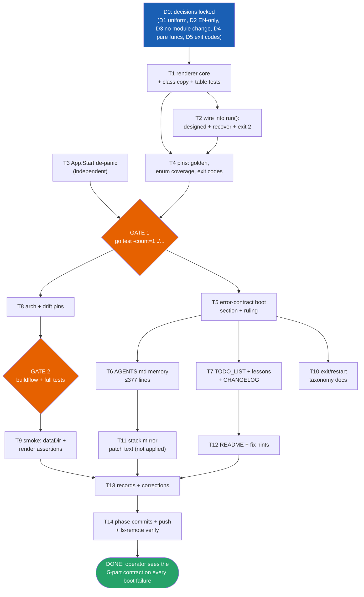

# SUPERB Plan: Operator Boot-Error Contract

- **Date**: 2026-10-02 10:23 CEST
- **Inputs**: session status report `docs/status/2026-10-02_10-19_mustinvoke-operator-contract-session-review.md` (rounds 1-4: MustInvoke rationale → skills verdict → operator-as-user concession).
- **Format**: `.md` + mermaid at explicit operator-demanded path (overrides pareto-planning skill's HTML default; flagged, not propagated).
- **Tree warning**: a FOREIGN in-flight train (message-org: `panels.go`, `i18n.go`, `messages.templ`, …) is uncommitted by other sessions. Never stage, commit, or "fix" those files. Re-View `main.go`/`app.go` immediately before every edit (daemon races).

## Goal

The operator is a user. Every boot failure renders the five-part error contract (what / reassure / why / fix / escape) on the operator surface (journald), English-only, version-stamped, with a documented exit-code taxonomy. The panic MECHANISM at the composition root stays (DO-1 compliant, fail-fast correct); only the PRESENTATION layer is added, plus removal of the three gratuitous panics in `App.Start` (the method already returns error).

Current state (audited 2026-10-02): miswiring panic = 1/5 contract parts (`panic: do: service not found: sqlite`, exit 2); designed boot errors = 2/5 (`slog.Error("webphone exited", "error", err)`, main.go:23-27, exit 1). Precedent for the fix: `cqrshtmx.RecoveryMiddleware` logs stack + re-raises per request (docs/error-contract.md:27) — boot lacks its analogue.

## Decisions (settled autonomously; veto points marked)

| ID | Decision                                                                                                                                                                                                       | Rationale                                                                                                                | Veto?                                                                       |
| -- | -------------------------------------------------------------------------------------------------------------------------------------------------------------------------------------------------------------- | ------------------------------------------------------------------------------------------------------------------------ | --------------------------------------------------------------------------- |
| D1 | UNIFORM renderer: ALL boot failure classes through one 5-part printer                                                                                                                                          | One surface, one test matrix; classes are data rows, not code paths                                                      | Owner may narrow to panics-only                                             |
| D2 | Boot journal copy is ENGLISH-ONLY                                                                                                                                                                              | D3 ruling precedent (shell copy EN, 2026-09-20); operator trail = `#log` channel tradition; no i18n map entries (not UI) | Owner may demand de                                                         |
| D3 | NO module change this train. `Restart=on-failure`, `RestartSec=5` (package/nixos-module.nix:151-152) ALREADY retries boot failures every 5s — the renderer renders once per attempt; journald shows the repeat | Changing restart policy is a release/ops decision touching the consuming stack; document + recommend, don't act          | **Open owner call**: cap the retry loop (StartLimitBurst) or keep 5s retry? |
| D4 | Renderer lives as PURE functions in `cmd/webphone` (process concern, per composition-root split)                                                                                                               | Table-testable without spawning processes; no new package, no API surface                                                | —                                                                           |
| D5 | Exit codes: 1 = designed boot error (today's behavior), 2 = panic-rendered (today's Go default, now deliberate)                                                                                                | Zero behavior change, taxonomy becomes contract                                                                          | —                                                                           |

## Grounding facts (do not re-derive)

- Failure classes to render (6 + fallback): **panic-miswire** (container), **config-invalid** (config.Load), **data-dir** (MkdirAll, app.go:108), **timezone** (app.go:117), **paperless** (app.go:155), **listen** (bind failure, main.go:104-106 — the MOST COMMON real operator failure), **generic**.
- Version stamp source: `internal/server.buildVersion` (ldflags target, smoke `--expect-version` hits `/version`). cmd needs a read accessor; keep the ldflags variable path STABLE (release tooling depends on it).
- Error discipline: renderer PRINTS, it does not create error paths — no new errorfamily codes owed. Existing wraps use `propagatef` (main.go:35, family-neutral, nolint documented) and `wrapf` (app). Do not touch either.
- Mirror obligation: stack runbook `nix-international-telephony/docs/ops-runbook.md` § "Webphone error contract" (error-contract.md:80-87). Push-order ritual: webphone first, clean stack tree, then relock (docs/release-runbook.md).
- AGENTS.md is capped at 377 lines by BuildFlow preflight — additions must be paid for with trims elsewhere.
- Test home for pure renders: `cmd/webphone` package tests (drift_test.go precedent: sandbox-aware skips, no external deps).
- Erraudit tiers must stay 0 (tier 1+2); re-measure cadence 2026-10-22.
- Full MustInvoke call-site count: ~33 real calls (grep said 37 matches; 4 are comment lines — status report already confessed this).

## Pareto breakdown

| Tier                 | What                                                                                                                                            | Delivers                                                                        |
| -------------------- | ----------------------------------------------------------------------------------------------------------------------------------------------- | ------------------------------------------------------------------------------- |
| **1% → 51%**         | THE DECISION: recover-and-render at the `run()` boundary + the 5-part skeleton wired for the two classes operators actually hit (panic, listen) | Every boot failure becomes contract output; the gap the operator exposed closes |
| **4% → 64%**         | + all 6 designed classes through the same printer (class copy as data rows) + App.Start de-panic                                                | Uniform surface; last gratuitous panics gone                                    |
| **20% → 80%**        | + pins (golden + five-parts-never-empty) + the ruling recorded in docs/error-contract.md + AGENTS.md memory                                     | Contract binds future work; regression-proof; knowledge survives sessions       |
| **other 20% → 100%** | hardening (arch test, drift pin, smoke), taxonomy/restart documentation, stack mirror patch, README/hints, history (CHANGELOG/lessons), harvest | Defense against re-drift, cross-repo consistency, discoverability               |

## Level-1 plan (30–100 min tasks, sorted by importance/impact/effort/customer-value)

Customer = the operator on the PBX box. Effort in minutes. Gate = blocking verification.

| #   | Task                                                                                                                                                  | Tier          | Impact   | Effort | Customer value                       | Depends       | Gate                     |
| --- | ----------------------------------------------------------------------------------------------------------------------------------------------------- | ------------- | -------- | ------ | ------------------------------------ | ------------- | ------------------------ |
| T1  | Renderer core: `bootFailure` model + pure render funcs + class copy table (6+fallback, EN, version-stamped, phase-tagged) + accessor for buildVersion | 1%/4%         | Critical | 75     | Contract-grade output exists         | D1,D2         | table tests green        |
| T2  | Wire into `run()`: designed-error call sites → printer; `defer` recover → render + trace-after-block + exit 2; single render per attempt              | 1%            | Critical | 45     | Every boot failure hits the surface  | T1            | unit + build             |
| T3  | `App.Start` de-panic: 3× `MustInvokeNamed` → `InvokeNamed` + `wrapf` (app.go:283,291,292)                                                             | 4%            | High     | 30     | Panic-free where error return exists | —             | `go test ./internal/app` |
| T4  | Pins: golden byte-exact render; five-parts-never-empty across ALL enum values; exit-code assertions; EN-only pin                                      | 20%           | High     | 40     | Contract cannot silently regress     | T1,T2         | tests green              |
| T5  | docs/error-contract.md: boot-surface section + dated ruling (2026-10-02) + failure-table rows + 1/5→2/5 audit appendix                                | 20%           | High     | 45     | Ruling binds future sessions         | T1 copy final | docs re-read first       |
| T6  | AGENTS.md memory: MustInvoke rationale into composition-root bullet + boot-contract one-liner; TRIM to stay ≤377 lines                                | 20%           | High     | 30     | Knowledge survives sessions          | T5            | size preflight           |
| T7  | History + harvest: TODO_LIST entries, lessons.md line ("graded mechanism, missed surface"), CHANGELOG (unreleased)                                    | 20%           | Med      | 40     | Living docs own the work             | T5            | docs-health rules        |
| T8  | Hardening: arch test (`do.MustInvoke*` confined to internal/app) + drift_test pin (render copy one-home)                                              | other 20%     | Med      | 35     | Structural regression guard          | T1-T4         | full `go test ./...`     |
| T9  | Smoke: unwritable dataDir boot check + 5 greppable render lines in `scripts/webphone-smoke.py`                                                        | other 20%     | Med      | 45     | Boot contract verified live          | T2,G2         | smoke run                |
| T10 | Taxonomy + restart documentation: exit codes, Restart=on-failure/5s behavior, D3 recommendation                                                       | other 20%     | Med      | 30     | Operator knows what systemd will do  | T5            | verified vs module       |
| T11 | Stack mirror patch TEXT for ops-runbook § "Webphone error contract" (apply happens in stack repo, separate dispatch)                                  | other 20%     | Med      | 30     | Cross-repo consistency prepared      | T5            | ritual noted             |
| T12 | README readiness line + config-class fix hints (IANA example, paperless both-or-neither, dataDir perms)                                               | other 20%     | Low      | 30     | Discoverability                      | T1            | —                        |
| T13 | Records: `InvokeAs` considered-rejected; call-count correction; E2E-not-owed note; re-audit tie to 2026-10-22                                         | other 20%     | Low      | 25     | No re-litigation                     | T7            | —                        |
| T14 | Git ritual: phase-boundary narrative commits, push (authorized), `git ls-remote` end-state verify                                                     | cross-cutting | Med      | 25     | Traceable, safe history              | all           | clean status (mine only) |

**Total ≈ 525 min (~8.75 h).** Execution order follows the mermaid graph; T14 runs at every phase boundary, not just at the end.

## Level-2 breakdown (≤12 min per task, ALL todos)

### T1 Renderer core (75m)

| µ   | Task                                                                                                                | Min |
| --- | ------------------------------------------------------------------------------------------------------------------- | --- |
| 1.1 | Re-View main.go + app.go failure sites; finalize the 6+1 class table                                                | 10  |
| 1.2 | Define `bootClass` enum + `bootFailure` struct (class, what, why, phase, dynamic bits)                              | 12  |
| 1.3 | `renderBootFailure(b bootFailure) string`: 5-part template + version + phase tag                                    | 12  |
| 1.4 | Static copy rows: reassure/fix/escape per class (rollback, reset-failed, both-or-neither, IANA, perms, port-in-use) | 12  |
| 1.5 | buildVersion accessor in internal/server (ldflags target untouched) + micro-test                                    | 10  |
| 1.6 | Trace-after-block helper (stack trace printed BELOW the render)                                                     | 8   |
| 1.7 | Table test: every enum value renders all 5 parts non-empty + fallback class                                         | 12  |

### T2 Wiring (45m)

| µ   | Task                                                                                | Min |
| --- | ----------------------------------------------------------------------------------- | --- |
| 2.1 | `defer` recover in `run()`: classify, render, log, exit 2                           | 12  |
| 2.2 | Designed-error call sites (config, build app, start app, listen) → printer + exit 1 | 12  |
| 2.3 | Exit-code constants + doc comment (taxonomy D5)                                     | 6   |
| 2.4 | Journal discipline: one slog line carrying structured attrs + the render block      | 10  |
| 2.5 | Recover-wrapper unit test via injectable printer func                               | 12  |

### T3 App.Start de-panic (30m)

| µ   | Task                                                                         | Min |
| --- | ---------------------------------------------------------------------------- | --- |
| 3.1 | Re-View app.go for daemon/foreign drift before edit                          | 5   |
| 3.2 | 3× `MustInvokeNamed` → `InvokeNamed` + `wrapf` (dashboard, sqlite, blob-dir) | 10  |
| 3.3 | Check no new bare fmt.Errorf / family violation (erraudit tiers 0)           | 10  |
| 3.4 | `nix develop -c go test -count=1 ./internal/app/...`                         | 5   |

### T4 Pins (40m)

| µ | Task | Min |
|---|---|
| 4.1 | Golden test: byte-exact render for one class (patterns: byte-pins in views tests) | 12 |
| 4.2 | Enum-coverage test: new bootClass values WITHOUT copy fail compilation/test | 10 |
| 4.3 | Exit-code taxonomy assertions (designed=1, panic=2) | 8 |
| 4.4 | EN-only pin: render output contains no dictionary keys / localized strings | 10 |

### T5 error-contract.md (45m)

| µ   | Task                                                                              | Min |
| --- | --------------------------------------------------------------------------------- | --- |
| 5.1 | Read the FULL doc (incl. line-82 region + cross-repo section) — split-brain guard | 10  |
| 5.2 | New "Boot surface (operator as user, 2026-10-02)" section + ruling                | 12  |
| 5.3 | Failure-table rows for all 6+1 classes (copy homes, pins)                         | 12  |
| 5.4 | Audit appendix: the 1/5 + 2/5 grading table, dated                                | 6   |
| 5.5 | Cross-link from AGENTS.md failure→feedback bullet (pointer only, no duplication)  | 5   |

### T6 AGENTS.md memory (30m)

| µ   | Task                                                                                      | Min |
| --- | ----------------------------------------------------------------------------------------- | --- |
| 6.1 | Re-View AGENTS.md immediately (daemon race)                                               | 5   |
| 6.2 | Composition-root bullet: 3-line MustInvoke rationale (fail-fast, probe truth, DO-1 homes) | 12  |
| 6.3 | Boot-contract one-liner + pointer to error-contract section                               | 8   |
| 6.4 | Trim compensation to stay ≤377 lines; run docs size preflight                             | 5   |

### T7 History + harvest (40m)

| µ   | Task                                                                  | Min |
| --- | --------------------------------------------------------------------- | --- |
| 7.1 | TODO_LIST.md: actionable entries from THIS plan (bounded, statused)   | 12  |
| 7.2 | lessons.md line: "graded the mechanism, missed the surface" war story | 10  |
| 7.3 | CHANGELOG unreleased entry                                            | 8   |
| 7.4 | Mark status report (f) items harvested (ANNOTATE style, no rewrite)   | 10  |

### T8 Hardening (35m)

| µ   | Task                                                                          | Min |
| --- | ----------------------------------------------------------------------------- | --- |
| 8.1 | Read arch_test.go pattern                                                     | 6   |
| 8.2 | Arch rule: `do.MustInvoke*` only in internal/app                              | 12  |
| 8.3 | Drift pin: boot copy lives in ONE home (grep-style guard, sandbox-aware skip) | 12  |
| 8.4 | Full `nix develop -c go test -count=1 ./...`                                  | 5   |

### T9 Smoke (45m)

| µ   | Task                                                                 | Min |
| --- | -------------------------------------------------------------------- | --- |
| 9.1 | Read smoke script structure (scenario helpers)                       | 8   |
| 9.2 | Scenario: unwritable dataDir boot → expect non-listen + render lines | 12  |
| 9.3 | Assert 5 greppable contract markers in captured output               | 12  |
| 9.4 | Run smoke loopback end-to-end                                        | 12  |

### T10 Taxonomy docs (30m)

| µ    | Task                                                                         | Min |
| ---- | ---------------------------------------------------------------------------- | --- |
| 10.1 | Verify module facts (Restart/RestartSec, vm-test NRestarts=0) against source | 8   |
| 10.2 | Write exit-code + restart-behavior doc (error-contract boot section tail)    | 12  |
| 10.3 | Record D3 recommendation + owner veto framing                                | 10  |

### T11 Stack mirror (30m)

| µ    | Task                                                                 | Min |
| ---- | -------------------------------------------------------------------- | --- |
| 11.1 | Draft exact ops-runbook § patch text (boot rows + taxonomy)          | 12  |
| 11.2 | Note push-order ritual steps for the applying session                | 10  |
| 11.3 | Park patch text in this repo's planning follow-up (NOT applied here) | 8   |

### T12 README + hints (30m)

| µ    | Task                                                              | Min |
| ---- | ----------------------------------------------------------------- | --- |
| 12.1 | README "Readiness vs systemd": one boot-failure-presentation line | 8   |
| 12.2 | Fix-hint copy refinement per class (concrete commands)            | 12  |
| 12.3 | Consistency read of README claims vs renderer behavior            | 10  |

### T13 Records (25m)

| µ    | Task                                                       | Min |
| ---- | ---------------------------------------------------------- | --- |
| 13.1 | `do.InvokeAs` considered-rejected note (all deps concrete) | 6   |
| 13.2 | Correct call-count (~33) wherever "37" leaked into docs    | 7   |
| 13.3 | E2E-not-owed note (no markup change) in plan follow-ups    | 6   |
| 13.4 | Re-audit scheduling tied to erraudit 2026-10-22            | 6   |

### T14 Git ritual (25m, repeated per phase)

| µ    | Task                                                          | Min |
| ---- | ------------------------------------------------------------- | --- |
| 14.1 | `git status` attribution check — stage ONLY authored files    | 5   |
| 14.2 | Narrative commit per phase boundary (detailed message)        | 12  |
| 14.3 | Push (operator-authorized) + `git ls-remote` end-state verify | 8   |

**Level-2 total: 62 micro-tasks, ≈525 min.**

## Execution graph

## Verification gates

- **Gate 1** (after code): `nix develop -c go test -count=1 ./...` green; erraudit tiers 1+2 = 0; no new files in island/ (no `nix fmt`/E2E owed otherwise).
- **Gate 2** (after hardening): buildflow green inside `nix develop`; full flake check NOT owed (no module/flake touch — deliberate, D3).
- **Final**: smoke loopback green incl. new boot scenario; `git ls-remote` shows pushed narrative commits; foreign train untouched.

## Anti-verschlimmbessern NOT-list

1. NO module/flake changes (restart policy stays `on-failure`/5s; D3 is documentation + a recommendation).
2. NO changes to the panic mechanism in `New`/provider closures; NO conversion of `MustInvoke` outside `App.Start`.
3. NO touching `propagatef`/`wrapf` semantics, no new errorfamily codes (renderer prints).
4. NO staging/committing/reverting foreign-session files (message-org train in tree).
5. NO i18n dictionary entries for boot copy (EN-only, D2); no UI/DOM changes (no E2E owed); no `.templ` edits (no `templ generate` cycle).
6. NO new packages; renderer stays `cmd/webphone`-local pure funcs (D4).
7. NO AGENTS.md growth past 377 lines (trim-compensate).
8. NO stack repo edits from this train (patch text prepared, applied under the ritual).

## Open veto point (single)

D3 follow-up: cap systemd's boot-failure retry loop (`StartLimitBurst`/`IntervalSec`) so a persistent config error doesn't render every 5s forever, or accept the 5s retry as desirable liveness. Owner call; blocked on nothing else.
