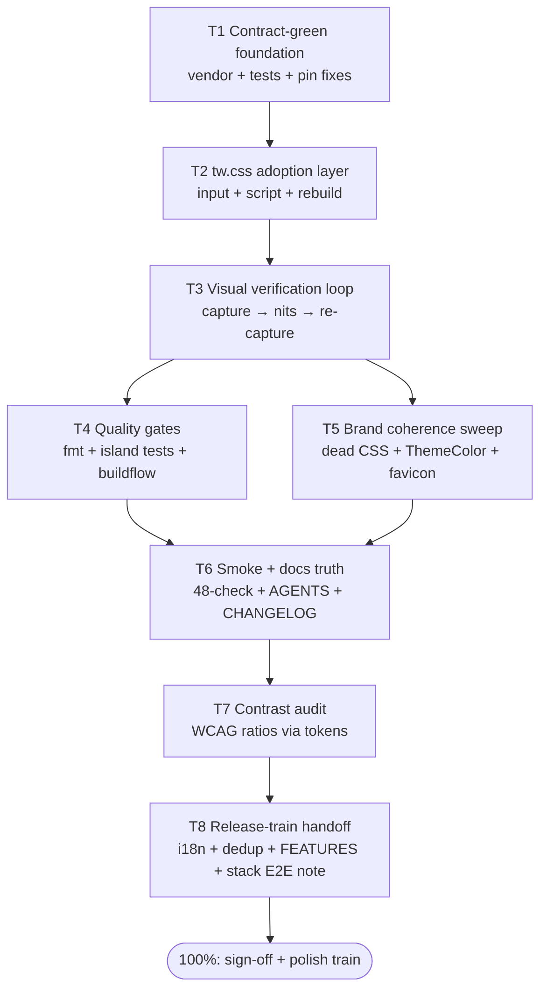

# SUPERB — templ-components UI redesign completion plan (2026-10-04 08:19)

Status: **GO decision pending** — this file is the plan + commitment device
for finishing the redesign train that is ~60% in flight. Written BEFORE any
further code change, per the rule: plan comprehensively, execute one step at
a time, verify after each step.

## Context (why this exists)

The 2026-10-04 morning session replaced the webphone design system
("Graphite desk + signal green": new token blocks in `app.css` +
`island/style.css`, restyled ~25 surface groups) and swapped every primary
CTA + three forms to pinned-v1.19.4 templ-components
(`display.Button`, `forms.Input`, `forms.Textarea`). Before-shots:
`ui-shots-before/`; phase-1 shots: `ui-shots/`.

**The tree builds green again** (`go mod vendor` landed after the forms
import briefly broke vendor mode). **Full test battery ran: every
markup-pin test is GREEN; the single failure (`TestErrorCodeRegistryIsFresh`,
104 doc-drift lines for `blob.*`/`config.*`/`crm.*` codes) traces to a
concurrent session's error-contract regeneration landing in daemon commit
04b1d94 — files this train never touched. Left alone on purpose (never
stomp in-flight work); attributed per AGENTS.md.**

### Verschlimmbesserung guardrails (the "never break" list)

The app is contract-dense. Any of these failing = the change made it WORSE,
no matter how it looks:

1. The 43 DOM-contract ids (`docs/dom-contract.md`,
   `TestServedPageHoldsTheDomContract`).
2. Byte-exact strings: `.wp-error` banner, `.wp-identity`, `panelHead`
   renders, `>📌</button>`-class flag glyphs, `wp-thread-row`, `wp-bubble`,
   `wp-fax-row`, `wp-compose-body`, `wp-segcount`, `wp-snippet-row/quick`,
   `wp-vm-player`, `wp-nav-badge`, `aria-current="page"/"false"`,
   `#toasts` live-region attrs, htmx-config meta.
3. Island modules served VERBATIM (no bundling) — never touched.
4. CSP: no inline scripts, no inline styles, `TestServedPageSatisfiesStrictCSP`.
5. Token blocks mirrored between the two stylesheets
   (`TestCSSTokenBlocksAreMirrored`), logical CSS properties
   (`TestStylesUseLogicalProperties`).
6. i18n parity: EN/DE key sets identical, no unused keys, no missing keys.
7. Shell copy English (D3); island copy en/de.
8. SSE payloads stay swap-safe (no `<section`, no composer fragments).

Rollback = `git revert` of the small per-step commits (the daemon commits
small units anyway).

## The Pareto cut

**The result**: the app looks properly designed, everything works, zero
pinned contracts broke, gates green.

### The 1% that delivers 51%

| # | Item                                                                                                                                                                                                                                                | Why it is the 1%                                                                                                                                                        |
| - | --------------------------------------------------------------------------------------------------------------------------------------------------------------------------------------------------------------------------------------------------- | ----------------------------------------------------------------------------------------------------------------------------------------------------------------------- |
| 1 | **Green tree** — vendor fix (done), full `go test -count=1 ./...` green, byte-pin fallout fixed                                                                                                                                                     | A red or contract-breaking tree is negative value; every pinned test is the design's license to exist                                                                   |
| 2 | **tw.css rebuild** — committed `tw.css.input` + `scripts/build-tw-css.sh` + rebuilt artifact, with `@custom-variant dark` mapped to `:root[data-theme="dark"]` and `@theme` remapping Tailwind's blue/gray/red/amber ramps onto the webphone tokens | WITHOUT this every adopted Button/Input renders UNSTYLED — the redesign would be a regression. This single artifact makes the whole component adoption look intentional |
| 3 | **Visual proof** — rebuild + 14-shot capture, reviewed against `ui-shots-before/`                                                                                                                                                                   | The deliverable IS the look; screenshots are the acceptance test                                                                                                        |

### The 4% that delivers 64% (1% + 3 items)

| # | Item                                                                                                                                                                         | Why                                                                                    |
| - | ---------------------------------------------------------------------------------------------------------------------------------------------------------------------------- | -------------------------------------------------------------------------------------- |
| 4 | **Brand coherence sweep** — delete orphaned CSS (`button.wp-primary`, `.wp-older button`), update `layout.templ` ThemeColor hexes, re-tint `island/favicon.svg` if hardcoded | Half-old-brand remnants are exactly the "half-adopted" smell                           |
| 5 | **Visual nit fixes** (one extra capture loop) — bubble meta contrast on the filled green, keypad/toast/empty-state tuning under the new tokens                               | First-pass reviews always find 3-6 nits; one iteration converts "better" into "proper" |
| 6 | **Cheap hard gates** — `nix fmt` + island node tests                                                                                                                         | Minutes of effort, prevents formatter/gate drift (has failed gates before)             |

### The 20% that delivers 80% (4% + 4 items)

| #  | Item                                                                                                                           | Why                                                                                              |
| -- | ------------------------------------------------------------------------------------------------------------------------------ | ------------------------------------------------------------------------------------------------ |
| 7  | **buildflow full gate green**                                                                                                  | The quality bar; nothing ships around it                                                         |
| 8  | **webphone-smoke 48-check** on the rebuilt binary                                                                              | Boot-to-boot behavior proof (errors, restart, boot-failure scenarios)                            |
| 9  | **Docs truth** — AGENTS.md templ-components paragraph (adoption list + tw.css input note), CHANGELOG entry                     | AGENTS.md currently says "Base + EmptyState only" — stale docs actively mislead the next session |
| 10 | **Contrast audit** — scripted WCAG ratio check over the token pairs (text/bg, on-accent/accent, muted/surface, status-on-fill) | The a11y floor becomes provable instead of eyeballed; failures feed nit fixes                    |

### The last 20% to 100%

| #  | Item                                                                                                                                                     | Why                                                                                                        |
| -- | -------------------------------------------------------------------------------------------------------------------------------------------------------- | ---------------------------------------------------------------------------------------------------------- |
| 11 | **Stack browser E2E** (nix-international-telephony)                                                                                                      | Served markup changed → release-runbook obligation; needs the stack repo, coordinated on the release train |
| 12 | **i18n sweep verify** after component swaps (parity + unused/referenced-key tests are in the suite; explicitly confirm)                                  | Button Text refs keep keys alive, but prove it                                                             |
| 13 | **Bookkeeping** — dedup-registry sweep-log line, FEATURES/TODO_LIST updates                                                                              | One-home-per-fact discipline                                                                               |
| 14 | **Owner sign-off loop** — palette direction, dependency-bump question (v1.19.4 vs local +195 commits), copy-pass question; then a follow-up polish train | Design taste is the owner's call; the three questions are already in the session status doc                |

## Table 1 — the comprehensive plan (30–100 min tasks)

Sorted by importance/impact/effort/customer-value. "Val" = customer value.

| #  | Task                                    | Contents                                                                                                           | Impact   | Effort                     | Val   |
| -- | --------------------------------------- | ------------------------------------------------------------------------------------------------------------------ | -------- | -------------------------- | ----- |
| T1 | **Contract-green foundation**           | Full test suite; fix every byte-pin the component swaps broke (or revert that swap); vendor consistency            | CRITICAL | 30–60 min                  | 10/10 |
| T2 | **tw.css adoption layer**               | `tw.css.input` (dark-variant + @theme token remap + @source set), `build-tw-css.sh`, rebuild artifact, commit both | CRITICAL | 45–60 min                  | 10/10 |
| T3 | **Visual verification loop**            | Rebuild binary → 14-shot capture → side-by-side vs before → fix nits → ONE repeat loop                             | HIGH     | 60–100 min                 | 9/10  |
| T4 | **Quality gates**                       | `nix fmt`, island node tests, buildflow full                                                                       | HIGH     | 60–90 min (mostly machine) | 8/10  |
| T5 | **Brand coherence sweep**               | Dead CSS removal, ThemeColor, favicon                                                                              | MEDIUM   | ~30 min                    | 7/10  |
| T6 | **Smoke + docs truth**                  | webphone-smoke 48-check; AGENTS.md adoption/tw.css paragraph; CHANGELOG                                            | MEDIUM   | 45–60 min                  | 7/10  |
| T7 | **Contrast audit + fixes**              | Token-pair ratio script; fix any failing pair via tokens only                                                      | MEDIUM   | 30–45 min                  | 6/10  |
| T8 | **Release-train handoff + bookkeeping** | Stack-E2E obligation note, i18n explicit verify, dedup log line, FEATURES/TODO_LIST                                | LOW-MED  | ~30 min                    | 5/10  |

Dependency order: T1 → T2 → T3 → (T4 ∥ T5) → T6 → T7 → T8. T1 blocks
everything (a red tree poisons every later verification). T2 must precede
T3 (unstyled components would fake "ugly design" findings). T4/T5 are
independent of each other; both before T6 (docs describe the final state).

## Table 2 — micro-tasks (≤12 min each)

| #   | Task (≤12 min)                                                                                                                              | Parent | Command / file                          | Verify                                         |
| --- | ------------------------------------------------------------------------------------------------------------------------------------------- | ------ | --------------------------------------- | ---------------------------------------------- |
| 1.1 | Read full-suite results; list failures                                                                                                      | T1     | job 036 output                          | failure list                                   |
| 1.2 | Fix/revert failing pin(s), one commit per concern                                                                                           | T1     | views/*.templ                           | targeted test green                            |
| 1.3 | Re-run full suite                                                                                                                           | T1     | `nix develop -c go test -count=1 ./...` | all green                                      |
| 2.1 | Write `internal/web/assets/tw.css.input` (@custom-variant dark → data-theme; @theme ramps → tokens; @source views + adopted vendored files) | T2     | new file                                | file lints                                     |
| 2.2 | Write `scripts/build-tw-css.sh` (staged build, mirror of build-health-css.sh)                                                               | T2     | new script                              | `bash -n` passes                               |
| 2.3 | Run rebuild: `nix run nixpkgs#tailwindcss_4 -- -i … -o … --minify`                                                                          | T2     | tw.css                                  | artifact contains button/input utility classes |
| 2.4 | Sanity-render one Button via a scratch test; eyeball classes resolve                                                                        | T2     | `go run`/test snippet                   | CSS present                                    |
| 3.1 | Rebuild binary                                                                                                                              | T3     | `nix build .#webphone`                  | out-path                                       |
| 3.2 | 14-shot capture                                                                                                                             | T3     | ui-capture.py                           | shots land                                     |
| 3.3 | Review vs `ui-shots-before/`; write nit list                                                                                                | T3     | view shots                              | nit list                                       |
| 3.4 | Fix nit batch 1 (tokens/CSS only)                                                                                                           | T3     | app.css/island css                      | targeted re-shot                               |
| 3.5 | Re-capture; fix nit batch 2 or accept                                                                                                       | T3     | same                                    | shots final                                    |
| 4.1 | `nix fmt`                                                                                                                                   | T4     | flake                                   | clean diff                                     |
| 4.2 | Island node tests                                                                                                                           | T4     | nodejs --test island-tests              | green                                          |
| 4.3 | buildflow (background, long)                                                                                                                | T4     | `buildflow`                             | exit 0                                         |
| 5.1 | Remove `button.wp-primary` + `.wp-older button` dead CSS                                                                                    | T5     | app.css                                 | grep zero refs                                 |
| 5.2 | Update layout.templ ThemeColor hexes                                                                                                        | T5     | layout.templ                            | re-gen + tests                                 |
| 5.3 | Check/re-tint island/favicon.svg                                                                                                            | T5     | favicon.svg                             | visual                                         |
| 6.1 | webphone-smoke 48-check                                                                                                                     | T6     | smoke script                            | 48/48                                          |
| 6.2 | AGENTS.md adoption + tw.css paragraph                                                                                                       | T6     | AGENTS.md                               | size cap ok (377)                              |
| 6.3 | CHANGELOG entry                                                                                                                             | T6     | CHANGELOG.md                            | —                                              |
| 7.1 | Write ratio-check script over token pairs                                                                                                   | T7     | scripts/ or throwaway                   | ratios printed                                 |
| 7.2 | Fix failing pairs via token values only                                                                                                     | T7     | both css                                | re-run ratios ≥ 4.5:1 body                     |
| 8.1 | i18n tests explicit confirm                                                                                                                 | T8     | go test i18n                            | green                                          |
| 8.2 | dedup-registry sweep-log line                                                                                                               | T8     | docs/dedup-registry.md                  | —                                              |
| 8.3 | FEATURES/TODO_LIST + stack-E2E note                                                                                                         | T8     | docs                                    | —                                              |

## Execution graph

## The three owner questions (blocking 100%, not 80%)

1. Palette direction sign-off (signal-green on graphite vs another family).
2. Dependency: stay pinned v1.19.4 or bump to the local +195-commit version
   (unlocks Checkbox/Toggle and the newer form kit) in this train?
3. Copy pass in scope, or strictly visual?
