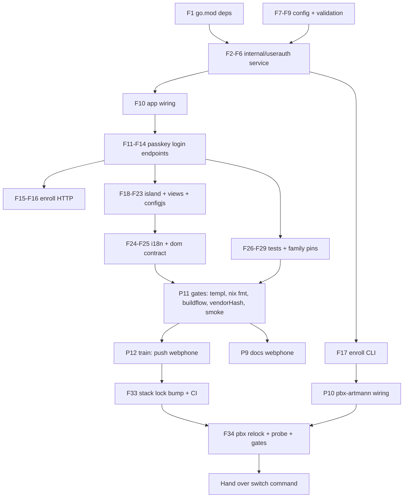

# SUPERB — Passkey users for the webphone (usermgmt, embedded)

Status: IN PROGRESS (2026-10-04)
Owner ask: "Why do we have these ugly extensions? Why don't we have proper
WebAuth users with cqrs-htmx/usermgmt and smartly show the numbers based on
what is available to a user?" → **BUILD IT.**

## 1. Problem & goal

Today the webphone's only identity is the FreeSWITCH extension number +
its SIP directory password (deliberate single-source-of-truth decision,
2026-09-21 v2 session model). Users must know "1000" to log in, and the UI
presents `extension@sip_domain` as the identity.

Goal: an OPTIONAL passkey (WebAuthn) login mode backed by
`github.com/larsartmann/cqrs-htmx/usermgmt/v4` embedded in the webphone
process (sqlite-backed, zero new services), where:

- The user signs in with **email + passkey**; the extension becomes an
  internal routing detail.
- After login the UI shows the **display name and the user's numbers**
  (the DIDs of all extensions mapped to the user), not a bare extension.
- **Break-glass stays**: extension + SIP password login remains available
  (lifeline property: login must never depend on more than FreeSWITCH +
  the webphone process).
- Off by default (`auth.passkey` zero value = disabled) — CRM/Paperless
  precedent.

## 2. Decisions (recorded BEFORE building)

| #  | Decision                                                                                                                                                                                              | Rationale                                                                                                                                                                                                                                                                                                                                                 |
| -- | ----------------------------------------------------------------------------------------------------------------------------------------------------------------------------------------------------- | --------------------------------------------------------------------------------------------------------------------------------------------------------------------------------------------------------------------------------------------------------------------------------------------------------------------------------------------------------- |
| D1 | Embed usermgmt as a **library** (NewService + SQL event store + SQL read models, sqlite file `<data_dir>/usermgmt.db`)                                                                                | usermgmt is a Go library, not a daemon; same-process embedding adds no failure domain to the lifeline property. Separate DB file from webphone.db (versioned-migration split-brain).                                                                                                                                                                      |
| D2 | user→extension mapping is **static config** (`auth.passkey.users`), display name included                                                                                                             | Matches the DECIDED 2026-09-20 "own-number feed = static config map (`identities`)" stance; a stack identity endpoint remains the upgrade path.                                                                                                                                                                                                           |
| D3 | Passkey login mints the session via the SAME `Sessions.Create(extension, password)` seam; the SIP password is read at login from **operator-managed files** (`auth.passkey.extension_password_files`) | The session row must carry the SIP directory password (island REGISTER + /phone-api proxy by design). The user never types it in passkey mode, so the server sources it like the bridge sources its secrets (runtime file, fail-closed on read error). pbx-artmann's secrets-perms unit already heals exactly this pattern for `webphone_gateway_secret`. |
| D4 | PBX verification still runs at passkey login (when phone_api configured)                                                                                                                              | A stale/rotated password file must fail closed at login (401/502), never mint a dead session.                                                                                                                                                                                                                                                             |
| D5 | Enrollment via **one-time CLI token**: `webphone -enroll-passkey <email>` prints a URL; the enroll page verifies the token, then runs the WebAuthn registration ceremony for a config-declared email  | An open enroll page would let anyone claim a config-declared identity (session = SIP creds — unacceptable). The CLI token keeps secrets out of the nix store and out of config; operator authority = shell on the host. Reused later for new-device/password-reset flows.                                                                                 |
| D6 | usermgmt's own session (FinishLogin side effect) is ignored; the webphone session stays the single session truth                                                                                      | No dual-session split brain; usermgmt session store stays default in-memory.                                                                                                                                                                                                                                                                              |
| D7 | v1: a user maps to a LIST of extensions; the session binds the FIRST; the whoami line shows ALL mapped numbers                                                                                        | Model supports multi-line from day one (the +48 Warsaw DID), without building the extension-switcher product now (all stores are extension-scoped).                                                                                                                                                                                                       |
| D8 | No usermgmt email-verification / TOTP / RBAC surface in v1                                                                                                                                            | BeginLogin does not gate on verified email (verified in source); wiring SMTP/TOTP for a 1.5-user PBX is verschlimmbessern.                                                                                                                                                                                                                                |
| D9 | Stack (nix-international-telephony) untouched in v1                                                                                                                                                   | `services.webphone.settings` is freeform JSON; `auth.passkey.*` flows straight through. Stack-level derivation (rp_id from domain) is a later stack option.                                                                                                                                                                                               |

### Honest limits (do NOT lie about these)

- The extension does not disappear: it is still the FreeSWITCH addressing
  key, still visible in Settings/dialing, still the store scoping. It
  stops being the LOGIN identity and the headline UI identity.
- Multi-extension users see all their numbers but operate the first
  extension's session (D7).
- Passkeys are bound to `rp_id` + `rp_origins` (operator-declared, like
  `csrf.trusted_origins`).

## 3. Pareto breakdown

| Layer                | Share                                                                                                                                                                                                                                                                                                                           | What it is |
| -------------------- | ------------------------------------------------------------------------------------------------------------------------------------------------------------------------------------------------------------------------------------------------------------------------------------------------------------------------------- | ---------- |
| **1% → 51%**         | The passkey LOGIN path end-to-end: config + `internal/userauth` service + begin/finish endpoints + island ceremony + session mint from file-sourced creds. This single path IS the feature.                                                                                                                                     |            |
| **4% → 64%**         | + identity presentation: display name + "your numbers" in login/getSession responses + whoami line (the visible "smart numbers" win).                                                                                                                                                                                           |            |
| **20% → 80%**        | + enrollment (CLI one-time token + enroll page ceremony) — without it nobody can ever log in; + fail-closed config validation.                                                                                                                                                                                                  |            |
| **other 20% → 100%** | + break-glass retention check, tests (stubbed WebAuthnProvider), i18n en/de, family pins, pbx-artmann wiring (settings + secrets perms + enroll wrapper), docs (FEATURES/CHANGELOG/AGENTS/README + dom-contract), vendorHash/nix gates, buildflow full, 3-repo train (webphone → stack lock → pbx relock), plan doc + handover. |            |

## 4. Phase plan (tasks 10–30 min each, sorted by impact/effort/value)

> Annotated 2026-10-04 (train-tail session): the code train shipped and the
> 3-repo deploy train staged; owner-side rows carry their outstanding leg in
> the marker. Plans are snapshots (docs-health) — this table records verdicts,
> it no longer plans work.

| #       | Task                                                                                                                                                                                                                                                                                                                                                                                | Impact | Effort | Deps     |
| ------- | ----------------------------------------------------------------------------------------------------------------------------------------------------------------------------------------------------------------------------------------------------------------------------------------------------------------------------------------------------------------------------------- | ------ | ------ | -------- |
| ~~P1~~  | ~~`internal/userauth`: Service wrapper (usermgmt NewService, SQL event store + read models + webauthn provider, `<data_dir>/usermgmt.db`), Close/drain~~ done                                                                                                                                                                                                                       | HIGH   | M      | —        |
| ~~P2~~  | ~~Config: `Auth.Passkey` struct + koanf tags + fail-closed validation (normalized extensions, rp_id+origins+users+password files all-or-nothing, users' ext in identities not required)~~ done                                                                                                                                                                                      | HIGH   | S      | —        |
| ~~P3~~  | ~~Server: `POST /api/auth/passkey/begin\|finish` (loginLimiter treatment, CSRF, JSON contract `{email}` → `{options,session_key}` → `{session_key, assertion}` → createSession response + display_name/numbers); refactor session minting out of createSession into one helper~~ done                                                                                               | HIGH   | M      | P1, P2   |
| ~~P4~~  | ~~`cmd/webphone -enroll-passkey <email>`: load config, build service, Register user if missing, mint one-time token (sha256+expiry in `wp_enroll_tokens`), print enroll URL~~ done                                                                                                                                                                                                  | HIGH   | M      | P1, P2   |
| ~~P5~~  | ~~Enroll HTTP surface: `GET /enroll` page (token verify → email → passkey ceremony begin/finish) + POST endpoints, rate-limited~~ done                                                                                                                                                                                                                                              | HIGH   | M      | P4       |
| ~~P6~~  | ~~Island: `passkey.js` login module (email field + ceremony + adopt creds → SIP REGISTER → wp:session-opened), login view markup (conditional passkey section + break-glass form), configjs flag, whoami display name + numbers~~ done                                                                                                                                              | HIGH   | M      | P3       |
| ~~P7~~  | ~~Tests: userauth (sqlite tmp, stub WebAuthnProvider mirroring usermgmt's own stubs: register → enroll → login → session mint; token expiry/burn; file-sourced password read errors), server handler tests (401/429/404-off mapping), config family tests~~ done                                                                                                                    | HIGH   | M      | P3, P5   |
| ~~P8~~  | ~~i18n en/de keys + dom-contract ids + views tests for login markup~~ done                                                                                                                                                                                                                                                                                                          | MED    | S      | P6       |
| ~~P9~~  | ~~Docs: FEATURES/CHANGELOG/TODO_LIST/README/AGENTS + error-contract rows + family pins (`webphone.auth.*` seam)~~ done                                                                                                                                                                                                                                                              | MED    | S      | P7       |
| ~~P10~~ | ~~pbx-artmann: settings.auth.passkey values (users lars→1000, rp_id pbx.artmann.tech), secrets-perms telephony_ext_1000/1001 → root:webphone 640, enroll wrapper script, CHANGELOG/AGENTS/runbook notes~~ done — shipped (settings + secrets-perms; enroll stays runbook-only, wrapper cut pending owner ratification)                                                              | HIGH   | S      | P3       |
| ~~P11~~ | ~~Nix: vendorHash (buildflow nix-hash-fix), templ generate, `nix fmt` (island/shell/css), buildflow full, smoke (`--base` mode)~~ done                                                                                                                                                                                                                                              | HIGH   | M      | P6, P7   |
| ~~P12~~ | ~~Train: push webphone main → stack `nix flake update webphone` + push (CI-green check) → pbx-artmann `nix flake update telephony` + lock-drift-probe + both-arch eval + toplevel build + deploy-freshness staging + docs gates; hand over switch command~~ done — staged + handed over (webphone 400eaff pushed, stack 890a526, pbx-artmann staged 0ngvm4q7; owner switch pending) | HIGH   | M      | P10, P11 |

## 5. Fine-grained tasks (max 12 min each)

| #       | Task (≤12 min)                                                                                                                                                              | Parent |
| ------- | --------------------------------------------------------------------------------------------------------------------------------------------------------------------------- | ------ |
| ~~F1~~  | ~~go.mod: add usermgmt + usermgmt/webauthn deps (`go get`, tidy)~~ done                                                                                                     | P1     |
| ~~F2~~  | ~~`internal/userauth/userauth.go`: Config→Service constructor (sqlite open at dataDir/usermgmt.db, OptimizeSQLiteDB, NewSQLEventStore, NewService with webauthn.New)~~ done | P1     |
| ~~F3~~  | ~~`internal/userauth`: Resolve(email) → User{Extensions, DisplayName}; NumbersFor(user, identities) → []string~~ done                                                       | P1     |
| ~~F4~~  | ~~`internal/userauth`: password file read (trim, empty→rejection; read-at-login, never cached)~~ done                                                                       | P1     |
| ~~F5~~  | ~~`internal/userauth`: enroll token mint/verify/burn (wp_enroll_tokens, sha256, 15 min TTL)~~ done                                                                          | P4     |
| ~~F6~~  | ~~`internal/userauth`: Close/Drain wiring + nil-safe disabled type~~ done                                                                                                   | P1     |
| ~~F7~~  | ~~config.go: Auth/Passkey structs + koanf tags~~ done                                                                                                                       | P2     |
| ~~F8~~  | ~~config.go: validation (all-or-nothing set, normalized ext keys, non-empty origins, email keys contain "@")~~ done                                                         | P2     |
| ~~F9~~  | ~~config family_test rows for the new rejections~~ done — pins landed with the 2026-10-04 tail (config.auth.passkey.* family rows)                                          | P2     |
| ~~F10~~ | ~~app.go: provide UserAuth (nil when disabled) + shutdown order~~ done                                                                                                      | P1     |
| ~~F11~~ | ~~server: extract `mintSession(w, r, extension, password)` from createSession~~ done                                                                                        | P3     |
| ~~F12~~ | ~~server: POST /api/auth/passkey/begin handler (+rate limiter, +error mapping 401/429/503)~~ done                                                                           | P3     |
| ~~F13~~ | ~~server: POST /api/auth/passkey/finish handler (FinishLogin → resolve → file creds → VerifyCredentials → mint → response +display_name+numbers)~~ done                     | P3     |
| ~~F14~~ | ~~server: Deps.UserAuth + route registration (guarded)~~ done                                                                                                               | P3     |
| ~~F15~~ | ~~server: enroll page GET /enroll + token verify endpoint~~ done                                                                                                            | P5     |
| ~~F16~~ | ~~server: enroll begin/finish endpoints (Register-if-missing, BeginRegistration/FinishRegistration)~~ done                                                                  | P5     |
| ~~F17~~ | ~~cmd/webphone: -enroll-passkey flag path~~ done                                                                                                                            | P4     |
| ~~F18~~ | ~~phone.templ: passkey section (email input + button + divider + break-glass collapse)~~ done                                                                               | P6     |
| ~~F19~~ | ~~templ generate + views render test~~ done                                                                                                                                 | P6     |
| ~~F20~~ | ~~island passkey.js: begin→navigator.credentials.get→finish→creds into register path~~ done                                                                                 | P6     |
| ~~F21~~ | ~~island session/whoami: display_name + numbers rendering; getSession/createSession response fields~~ done                                                                  | P6     |
| ~~F22~~ | ~~configjs.go: passkey flag; configjs test~~ done                                                                                                                           | P6     |
| ~~F23~~ | ~~main.js: wire passkey module when flag set; arch_test pass (no new island import cycles)~~ done                                                                           | P6     |
| ~~F24~~ | ~~i18n keys en/de + parity test~~ done                                                                                                                                      | P8     |
| ~~F25~~ | ~~dom-contract: new ids + contract test update~~ done                                                                                                                       | P8     |
| ~~F26~~ | ~~userauth service tests (stub provider, sqlite tmp): happy path~~ done                                                                                                     | P7     |
| ~~F27~~ | ~~userauth tests: token burn/expiry, file read failures, unknown email~~ done                                                                                               | P7     |
| ~~F28~~ | ~~server handler tests: off=404, rate limit, CSRF, response shape~~ done — plus enroll begin/finish handler tests in the 2026-10-04 tail                                    | P7     |
| ~~F29~~ | ~~family_test pins for webphone.auth.* codes~~ done                                                                                                                         | P7     |
| ~~F30~~ | ~~docs sweep (FEATURES/CHANGELOG/README/AGENTS/error-contract)~~ done                                                                                                       | P9     |
| ~~F31~~ | ~~pbx-artmann: settings block + perms case + wrapper + docs~~ done — wrapper cut: enroll rides the runbook CLI command (ratification pending)                               | P10    |
| ~~F32~~ | ~~pbx-artmann: both-arch eval + toplevel build + gates~~ done                                                                                                               | P12    |
| ~~F33~~ | ~~stack: webphone lock bump + push + CI check~~ done — stack 890a526 pushed                                                                                                 | P12    |
| ~~F34~~ | ~~pbx-artmann: telephony relock + probe + deploy-freshness staging~~ done — staged, probe OK; owner switch pending                                                          | P12    |

## 6. Execution graph

## 7. Verification gates (per phase)

- Every Go task: `nix develop -c go test -count=1 ./internal/...` for the
  touched packages, then full `go test ./...` at phase boundaries.
- After any .templ edit: `templ generate ./internal/web/views/` (committed
  *_templ.go).
- After island/css edits: `nix fmt` BEFORE gates (buildflow skips island
  files).
- Phase end: `buildflow` full mode (inside `nix develop`); vendorHash via
  `buildflow -s nix-hash-fix --fix` after go.mod changes.
- `nix flake check` (sandbox tests + island-lint + treefmt).
- Smoke: build binary, boot loopback, hit /enroll without token (expect
  rejection), login page shape with passkey off/on.
- pbx-artmann: toplevel build x86 + `nix eval` both arches, docs-gates,
  lock-drift-probe, deploy-freshness staging root.

## 8. Risks & mitigations

| Risk                                                                 | Mitigation                                                                                                                                                                                     |
| -------------------------------------------------------------------- | ---------------------------------------------------------------------------------------------------------------------------------------------------------------------------------------------- |
| usermgmt dependency graph is heavy (watermill, casbin, cqrs-lite...) | Accepted: all public, all already in the LarsArtmann ecosystem; vendorHash grows but hermetic. Binary size +68% class rejections were about cqrs-htmx `setup` bundle, NOT usermgmt direct use. |
| WebAuthn ceremony untestable without an authenticator                | Stub WebAuthnProvider (interface, structural typing — usermgmt's own test strategy); real-ceremony proof happens in the owner's browser at first enroll (runbook step).                        |
| Stale SIP password file mints dead sessions                          | VerifyCredentials at login (D4) + login-time read (F4) + runbook: rotate via push-secrets then re-login.                                                                                       |
| Race: enroll token URL leaks (terminal scrollback)                   | 15 min TTL, one-time burn, sha256-at-rest, email must be config-declared.                                                                                                                      |
| Break-glass regressions                                              | Extension login path untouched (only refactored into shared helper); explicit test that ext login still works with passkey enabled.                                                            |
| Verschlimmbessern (owner's balls clause)                             | Passkey is OFF by default; zero-value config = byte-identical behavior to today (asserted by tests); no existing route/UI changes beyond the additive login section.                           |

## 9. Out of scope (v1)

- Extension switcher for multi-extension sessions (D7 upgrade path).
- Stack-level (`services.telephony.webphone.passkey`) options + derivation.
- usermgmt email verification, TOTP, RBAC, OAuth2, tenants, bots.
- Passkey management UI (add/remove credentials beyond enroll).
- Admin UI for the user→extension mapping (config file is the admin
  surface, like `identities`).
