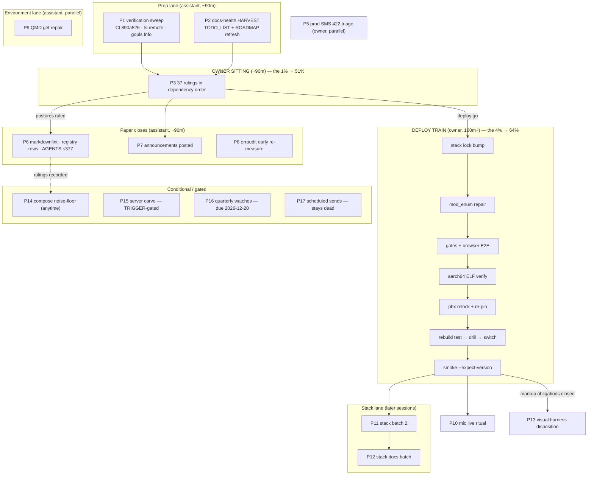

# SUPERB — Owner-terminal Pareto plan (2026-10-05 15:25)

**Scope:** the next execution train for webphone + its tri-repo obligations.
**Inputs:** TODO_LIST.md (16 open rows, sweep 2026-10-04) · docs/dedup-registry.md
open owner calls (4) · this session's mixin-review status (14:46) + session
status (14:50, §f) · owner-calls briefing `2026-09-22_13-50` (28 rows).

**The key finding (READ THIS FIRST):** the codebase is healthy — zero code
debt is High-priority. What remains is a **decision bottleneck**: nearly
every High row terminates in (a) one OWNER decision sitting and (b) one
OWNER deploy train through the stack. The Pareto optimum is therefore NOT
more code — it is **clearing the human gates** and closing their paper
trails. The plan below deliberately contains ZERO speculative code changes
(no refactor, no new module, no "while we're at it") — anything else here
would be verschlimmbessern.

---

## Step 1 — Pareto breakdown

### The 1% that delivers 51% — THE OWNER SITTING
One sitting, ~28+9 decision rows, ≈90 minutes of human rulings:
the owner-calls briefing batch + the scattered gate decisions (passkey
runbook-only enroll + Lars-only v1 mapping + switch-now-vs-CI, v2.9.0 fold,
D3 systemd retry-loop, markdownlint posture, dedup quartet, /health
exposure, announcements channel, scheduled-sends NO-GO ratification,
mixin-detector policy + CRM/Paperless twin from 2026-10-05). Resolving this
single sitting flips the terminal state of **9 of 16** TODO rows from
"awaiting owner" to "executable/closed".

### The 4% that delivers 64% — THE SITTING + THE DEPLOY TRAIN
The sitting, plus executing the v2.8.0+passkey deploy terminal (stack lock
bump → mod_enum repair → gates + browser E2E → aarch64 → pbx-artmann
relock/re-pin → rebuild → drill → smoke) and the prod SMS-bridge 422 triage
(triage pack ready). This puts **two releases of user-facing content**
(2.7.0+2.8.0 incl. passkey, honest error surfaces, morph UX) in front of
users and closes 4 trains' live-proof obligations.

### The 20% that delivers 80% — + ASSISTANT PREP & PAPER CLOSES
Add: the pre-sitting verification sweep (CI verdict for stack `890a526`,
end-state ls-remote, passkey_api.go:211 attribution), the docs-health
HARVEST keeping TODO_LIST truthful FOR the sitting, the post-sitting
document closes (markdownlint posture, registry rows, AGENTS edits inside
the 377-line cap), early erraudit tier-1/2 re-measure (due 2026-10-22), the
release-announcement posting, and the QMD `get` repair (velocity for every
future session in this environment).

### The other 20% (to reach 100%) — STACK LANE, RITUALS, CONDITIONALS
Stack-side batch (paperless module option + smoke arm, `ftypqt` sniff fix,
E2E MMS-outbound, pbx FEATURES:87 text), stack docs batch (WebTransport
verdict doc, deploy.md secret PATH column, ops-runbook demo-call recipe,
MOH//recordings/CDR checks), mic pre-warm live ritual (post-deploy), visual
harness disposition (eyeball + persistence + optional vision provider),
`branching-flow compose` noise-floor baseline, the TRIGGER-gated
internal/server carve (fires on the next file added there — NOT now), the
DECIDED-AGAINST scheduled-sends row (stays dead unless ratified alive), and
the quarterly watches (next due 2026-12-20).

---

## Step 2 — Comprehensive plan (30–100 min tasks, sorted by importance / impact / effort / customer-value)

| # | Task | Actor | Size | Priority | Impact | Unblocks |
|---|------|-------|------|----------|--------|----------|
| P1 | Pre-sitting verification sweep: CI verdict for stack `890a526`, `git ls-remote` end-state of session docs, `passkey_api.go:211` attribution, briefing addendum | Assistant | 30m | High | De-risks every sitting decision | P3 |
| P2 | docs-health HARVEST: fold the 10-05 mixin/session/plan items into TODO_LIST + ROADMAP (living sources, not entombed) | Assistant | 60m | High | Sitting decides on current truth | P3 |
| P3 | **THE OWNER SITTING** — 37 decision rows in dependency order (release/deploy → passkey → dedup → tooling → UX/product → announcements) | **Owner** | 90m | **Highest** | 51%: flips 9/16 rows | P4, P6, P7, P8 |
| P4 | **DEPLOY TRAIN**: stack lock bump → mod_enum repair → stack gates + browser E2E (covers cascade-fix + passkey-tail markup obligations) → aarch64 ELF → pbx relock/re-pin → rebuild test/switch → fail-closed password-file drill → smoke `--expect-version` | **Owner** | 100m+ | **Highest** | 64%: 2 releases live, 4 trains closed | P10, P13 |
| P5 | Prod SMS-bridge 422 triage: journal `telnyx-webhooks`, decision-tree §4, test SMS, record root cause (TODO + stack runbook) | **Owner** | 30m | High | Restores outbound SMS certainty | — |
| P6 | Post-sitting paper closes: markdownlint posture implementation, registry rows for ratified dedup/mixin rulings, AGENTS edits (≤377 lines), TODO verdict updates | Assistant | 90m | High | Makes rulings durable | — |
| P7 | Release announcements: owner picks channel(s), approves v2.8.0 draft A/B/C, posts | **Owner** | 30m | Med | Public proof-of-life | — |
| P8 | erraudit tier-1+2 re-measure EARLY (due 10-22) + boot-surface re-grade vs error-contract table | Assistant | 45m | Med | Keeps the tier-2=0 pin honest | — |
| P9 | QMD `mcp_qmd_get` repair: crush_logs triage → repro → fix/file upstream → verify via CV docid | Assistant | 100m | Med | Every future session's search velocity | — |
| P10 | Mic pre-warm live ritual: accept→speak sub-second, indicator at ring, warm release on reject/missed (post-deploy) | **Owner** | 30m | Med | Closes T07 train live-proof | — |
| P11 | Stack batch 2: `services.webphone.paperless` option + smoke arm, `ftypqt`→`video/quicktime` sniff, E2E MMS-outbound, pbx FEATURES:87 text | Stack session | 90m | Med | Cross-repo contract honesty | — |
| P12 | Stack docs batch: WebTransport verdict doc, deploy.md secret PATH column, ops-runbook demo-call recipe, MOH + `/recordings/` + CDR checks | Stack session | 60m | Low | Operator runbook completeness | — |
| P13 | Visual harness disposition: eyeball the 14-shot matrix, persistence decision (default per-release), optional vision-provider call | **Owner** | 30m | Low | Closes T23 disposition | — |
| P14 | `branching-flow compose` noise-floor baseline run + registry note (informational; triage bar now on record) | Assistant | 45m | Low | Calibrates detector family | — |
| P15 | internal/server carve (`server/api` + `server/hooks`) — **CONDITIONAL: fires only when the next file lands in internal/server**; NOT scheduled | Assistant (trigger) | 100m×3 | Low-when-triggered | Review-threshold hygiene | — |
| P16 | Quarterly standing watches re-check — **DATE-GATED: next due 2026-12-20** (sip.js 0.22, templ-components, oxlint globals, E2E budget) | Assistant (date) | 30m | Low | Long-horizon insurance | — |
| P17 | Scheduled sends (M21.6) — **DECIDED-AGAINST, stays dead** unless the sitting ratifies it alive (gateway seam has no deferred-send) | — (decision) | 0m | — | Prevents zombie work | — |

Sorted view = table order (importance × impact ÷ effort, customer-value weighted). P1/P2 precede P3 because a sitting on stale truth is worse than no sitting.

---

## Step 3 — Fine breakdown (every task ≤ 12 min, sorted by importance/impact/effort/customer-value)

| ID | Micro-task | Parent | Est |
|----|-----------|--------|-----|
| F1.1 | `git ls-remote origin main`; confirm 10-05 session/plan commits landed (never trust push logs) | P1 | 5m |
| F1.2 | Check CI verdict for stack sibling `890a526` (gh, read-only); record pass/fail | P1 | 10m |
| F1.3 | Re-check `passkey_api.go:211` unused-`r` at HEAD; attribute to owning session or hand off | P1 | 5m |
| F1.4 | Write briefing addendum: CI verdict + mixin policy + CRM/Paperless + QMD rows | P1 | 12m |
| F2.1 | Load docs-health HARVEST; read 14:46 + 14:50 reports + this plan | P2 | 10m |
| F2.2 | Fold §f items into TODO_LIST rows (mixin policy, QMD, compose, registry calls) | P2 | 12m |
| F2.3 | Route roadmap-fuel items to ROADMAP (compose baseline, carve trigger, watches) | P2 | 10m |
| F2.4 | Link mixin-review evidence in the dedup-registry references | P2 | 8m |
| F2.5 | Verify TODO_LIST invariants: one home per fact, every row cites evidence | P2 | 10m |
| F3.1 | SITTING part 1 — release/deploy: v2.9.0 fold, switch-now-vs-CI, installer republish | P3 | 12m |
| F3.2 | SITTING part 2 — passkey ratifications: runbook-only enroll, Lars-only v1 mapping | P3 | 10m |
| F3.3 | SITTING part 3 — dedup quartet: `-t 3` baseline, registry ratify, `settingsRow`, suppression scope | P3 | 12m |
| F3.4 | SITTING part 4 — tooling postures: markdownlint, push-lag threshold, sniff-fallback lifespan | P3 | 12m |
| F3.5 | SITTING part 5 — UX/product: D3 retry-loop, scheduled-sends NO-GO, missed-call, `?q=`, `msg/`→`message/`, `Must*`, `attachment_limit`, templ blemish, mixin + CRM/Paperless | P3 | 12m |
| F3.6 | SITTING part 6 — announcements channel/disclosure, vision provider, QMD posture | P3 | 10m |
| F3.7 | Record all verdicts into the briefing doc + TODO rows (same sitting, no drift) | P3 | 12m |
| F4.1 | Stack: bump webphone lock to main HEAD | P4 | 10m |
| F4.2 | Stack: repair FreeSWITCH `mod_enum` build (diagnose log → patch/override → rebuild) | P4 | 12m×N |
| F4.3 | Stack gates: `nix flake check` + VM test | P4 | 12m |
| F4.4 | Stack browser E2E (445s budget; ONE re-run on the known ~90s transfer flake) | P4 | 12m |
| F4.5 | aarch64 cross-build + ELF byte verification (never exit-code alone) | P4 | 12m |
| F4.6 | pbx-artmann: clean-tree check → relock → re-pin | P4 | 10m |
| F4.7 | `nixos-rebuild test` → live passkey fail-closed password-file drill → `switch` | P4 | 12m |
| F4.8 | Rotate `/tmp/pbx-toplevel-current` + record fresh diff-closures baseline | P4 | 10m |
| F4.9 | `webphone-smoke.py --base https://pbx.artmann.tech --expect-version <V>` | P4 | 10m |
| F5.1 | Journal `telnyx-webhooks` unit + grep sms/422/error lines | P5 | 10m |
| F5.2 | Apply triage-pack §4 decision tree (creds vs bridge down vs expected self-send) | P5 | 10m |
| F5.3 | Test SMS; record root cause in TODO row + stack runbook | P5 | 10m |
| F6.1 | Implement ratified markdownlint posture (config to house style OR AGENTS detect-only note) | P6 | 12m |
| F6.2 | Add registry standing rows for ratified dedup/mixin rulings | P6 | 10m |
| F6.3 | AGENTS.md edits within the 377-line cap (move evidence to docs/ if needed) | P6 | 10m |
| F6.4 | Update TODO/ROADMAP verdict rows for every sitting outcome | P6 | 12m |
| F6.5 | Gates on touched files (markdownlint detect; no code gates needed if docs-only) | P6 | 10m |
| F7.1 | Pick announcement channel(s); approve v2.8.0 draft A/B/C wording | P7 | 12m |
| F7.2 | Post announcements; link from CHANGELOG if the ruling says so | P7 | 10m |
| F8.1 | Run erraudit tier 1 (`--type-aware --disable-extensions`) — must stay 0 | P8 | 10m |
| F8.2 | Run erraudit tier 2 (`--enforce-go-error-family` + `--enforce-coded-errors`) — must stay 0 | P8 | 12m |
| F8.3 | Re-grade boot surfaces against error-contract §"Boot surface" | P8 | 10m |
| F8.4 | Record numbers; bump the next-due date in AGENTS | P8 | 8m |
| F9.1 | crush_logs `[mcp]` triage for the qmd get failure | P9 | 10m |
| F9.2 | Minimal repro (query → get, docid AND path forms) | P9 | 10m |
| F9.3 | Locate QMD server source; identify the render bug | P9 | 12m |
| F9.4 | Fix + rebuild OR file upstream issue with the repro attached | P9 | 12m |
| F9.5 | Reload MCP; verify via the CV docid that failed today | P9 | 10m |
| F10.1 | Live call: accept → speak sub-second; indicator visible at ring | P10 | 12m |
| F10.2 | Reject + missed legs: warm release; record results in TODO row | P10 | 10m |
| F11.1 | Stack: `services.webphone.paperless` module option + smoke arm | P11 | 12m |
| F11.2 | Stack: `ftypqt`→`video/quicktime` sniff fix | P11 | 12m |
| F11.3 | Stack E2E: MMS-outbound coverage | P11 | 12m |
| F11.4 | pbx-artmann FEATURES:87 stale sniff text fix | P11 | 10m |
| F12.1 | Stack: WebTransport-not-adopted verdict doc | P12 | 12m |
| F12.2 | Stack: telephony deploy.md secret PATH column | P12 | 10m |
| F12.3 | Stack: ops-runbook demo-call recipe + secrets path | P12 | 10m |
| F12.4 | Stack: MOH audibility + `/recordings/` + CDR checks | P12 | 12m |
| F13.1 | Eyeball the 14-shot ui-shots matrix (7 surfaces × light/dark) | P13 | 12m |
| F13.2 | Persistence ruling (default per-release) + optional vision-provider decision | P13 | 10m |
| F14.1 | Run `branching-flow compose . --format markdown`; inventory top warnings | P14 | 10m |
| F14.2 | Triage warnings against registry + CV precedent; zero speculative refactors | P14 | 12m |
| F14.3 | Record the noise-floor note in the registry sweep log | P14 | 8m |
| F15.x | (CONDITIONAL — do NOT start) server carve micro-plan when the trigger fires | P15 | 0m now |
| F16.x | (DATE-GATED — due 2026-12-20) quarterly watch re-checks | P16 | 0m now |
| F17 | (DECIDED-AGAINST) scheduled sends stays dead unless P3.5 ratifies it alive | P17 | 0m |

---

## Execution graph

## Guardrails (anti-verschlimmbessern)

1. **Zero speculative code changes** in this plan. The only code-adjacent
   item (P9) fixes a broken tool, not working software.
2. **No owner unilateralism**: P3's 37 rows are the owner's; the assistant
   prepares and records, never decides (registry protocol, TODO doctrine).
3. **No assistant ssh/deploy**: P4/P5/P10/P13 are owner-terminal by
   pbx-artmann rule — the plan makes them one-command-easy, that is all.
4. **Conditional items stay conditional**: P15 fires only on its trigger;
   P16 on its date; P17 stays dead. Starting them early = scope crime.
5. Every docs close (P6) respects one-home-per-fact and the AGENTS 377-line
   cap; evidence goes to docs/, rules to AGENTS.md.

## Sources

- TODO_LIST.md (16 rows, sweep 2026-10-04) · ROADMAP owner-call rows
- docs/dedup-registry.md (4 open owner calls + 2026-10-05 sweep-log line)
- docs/status/2026-10-05_14-46_branching-flow-mixin-review-status.md
- docs/status/2026-10-05_14-50_branching-flow-mixin-review-session-status.md §f
- docs/planning/2026-09-22_13-50_owner-calls-briefing.md (28 rows)
- Release ritual: docs/release-runbook.md
