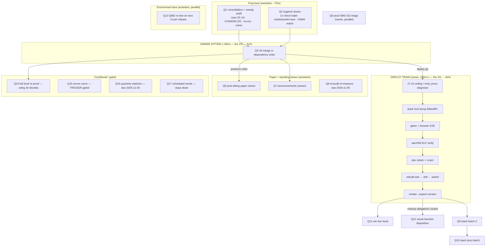

# SUPERB — Owner-terminal Pareto plan, ROUND 2 (2026-10-05 20:30)

**Scope:** the next execution round for webphone + tri-repo obligations.
**This is a RE-PLAN after execution.** The 15:25 plan
(`2026-10-05_15-25_SUPERB-owner-terminal-pareto-plan.md`) had its entire
assistant-legal set executed and verified 16:30–20:30 (P1 sweep, P2 HARVEST,
P8 erraudit 0/0/0, P9 QMD→crush #3846, P14 noise floor) plus two
fix-on-sight repairs: **main was CI-red ~4h** from the dependency sweep
(stale `vendorHash` + the sweep's doc reflow breaking the error-code
registry freshness pin) until `66ba48f` flipped it green. That plan is
NOT rewritten — this one supersedes it for everything still open and folds
in what execution surfaced.

**Inputs:** TODO_LIST.md (16 rows, swept 2026-10-05 16:50) · owner-calls
briefing (32 rows + 16:50 addendum) · the 20:27 execution status report
(§f 16 items + 3 owner questions) · the 15:25 plan's remaining owner legs.

**Key finding, unchanged and now proven twice:** the codebase is healthy —
zero High-priority code debt. The bottleneck is ONE OWNER SITTING and ONE
OWNER DEPLOY TRAIN. Round 2 adds only: a sweep-train audit leg (the
dependency sweep's non-hash obligations were never closed), two new
sitting rulings surfaced by execution, and small hygiene closes.
**Zero speculative code changes** — same guardrail as round 1; anything
else here would be verschlimmbessern.

---

## Step 1 — Pareto breakdown (round 2)

### The 1% that delivers 51% — THE OWNER SITTING, now 34 rows

One sitting, ~90 minutes: briefing rows 1–32 (unchanged) **+ two new
rulings the execution surfaced**: (33) daemon-docs-formatting policy —
the daemon's table reflow is exactly what broke the registry pin; keep the
behavior and accept occasional `-update` regenerations, or exclude
`docs/**` from daemon formatting? (34) the proof bar for "green" — is
CI-success the ratified bar, or a local full buildflow + full
`nix flake check` before sittings/releases? Still flips **9 of 16** TODO
rows from "awaiting owner" to "executable/closed".

### The 4% that delivers 64% — SITTING + DEPLOY TRAIN + SWEEP-AUDIT CLOSURE

The sitting, plus the v2.8.0+passkey deploy terminal (stack CI 1h-ceiling
/mod_enum diagnosis FIRST — every recent `main` run dies there — then lock
bump → stack gates + browser E2E → aarch64 ELF → pbx relock/re-pin →
rebuild test/switch → fail-closed password-file drill → smoke
`--expect-version`), WITH the sweep-train audit riding the same train:
CHANGELOG entries for the dependency bumps (templ 0.3.1070,
templ-components 1.20.0, usermgmt 4.14.0, go-health 0.5.0, webauthn 0.18.2,
otel 1.47.0), the watches-row tw.css class-identity check for the
1.19.4→1.20.0 ride, vulnix over the NEW runtime closure, and the
finished-vs-in-flight ruling (20:27 report question 1). Two releases of
user-facing content in front of users; four trains' live-proof obligations
closed; the deploy ships a coherent changelog instead of a silent bump.

### The 20% that delivers 80% — + HYGIENE CLOSES, PAPER CLOSES, ANNOUNCEMENTS, SMS TRIAGE

Add: the assistant hygiene closes (post-push CI-check habit as an AGENTS
line swap, markdownlint invocation settled and run, crush #3846 subscribed),
the post-sitting paper closes (postures, registry standing rows for 29–32 +
the vcard triad, AGENTS edits ≤377, TODO verdict updates), the release
announcements (owner), and the prod SMS-bridge 422 triage (owner; pack
ready).

### The other 20% (to reach 100%) — STACK LANE, RITUALS, TRIGGERS, WATCHES

Stack batch 2 (paperless module option + smoke arm, `ftypqt` sniff fix, E2E
MMS-outbound, pbx FEATURES:87) + stack docs batch (deploy-gated behind the
train); mic pre-warm live ritual + visual-harness disposition (owner,
post-deploy); the QMD re-test on the next Crush release; the
full-local-reproof leg (or its permanent waiving if ruling 34 says
CI-is-the-bar); the TRIGGER-gated internal/server carve; the
errorfamily.Join third-site trigger; quarterly watches (2026-12-20);
scheduled sends stays dead unless the sitting ratifies it alive.

---

## Step 2 — Comprehensive plan (30–100 min tasks, sorted by importance / impact / effort / customer-value)

| #    | Task                                                                                                                                                                                                | Actor      | Size   | Priority    | Impact                                  | Unblocks        |
| ---- | --------------------------------------------------------------------------------------------------------------------------------------------------------------------------------------------------- | ---------- | ------ | ----------- | --------------------------------------- | --------------- |
| Q1   | Pre-sitting consolidation: add sitting rows 33–34 (daemon-docs-format, proof-bar) to the briefing; sweep-train audit (CHANGELOG entries for the 6 dep bumps, tw.css class-identity check 1.19.4→1.20.0, vulnix over the new closure, finished-vs-in-flight ruling) | Assistant  | 45m    | High        | Sitting decides on complete truth       | Q3, Q4          |
| Q2   | Hygiene closes: post-push CI-check habit (AGENTS line swap, net-zero lines), markdownlint invocation settled + run over the session's docs, crush #3846 subscribed as watch                                                          | Assistant  | 30m    | Medium      | Kills 3 recurring §f leftovers          | —               |
| Q3   | **THE OWNER SITTING** — 34 rows in dependency order (release/deploy → passkey → dedup → tooling → UX/product → announcements → round-2 rulings 33–34)                                                                                 | **Owner**  | 90m    | **Highest** | 51%: flips 9/16 rows                    | Q4, Q6, Q7, Q8  |
| Q4   | **DEPLOY TRAIN**: stack CI 1h-ceiling/mod_enum diagnosis → lock bump → stack gates + browser E2E (cascade-fix + passkey-tail markup obligations) → aarch64 ELF → pbx relock/re-pin → rebuild test/switch → fail-closed drill → smoke `--expect-version` | **Owner**  | 100m+  | **Highest** | 64%: 2 releases live, 4 trains closed   | Q9, Q10, Q11, Q12 |
| Q5   | Prod SMS-bridge 422 triage: journal `telnyx-webhooks`, decision-tree §4, test SMS, record root cause (TODO + stack runbook)                                                                                                         | **Owner**  | 30m    | High        | Restores outbound SMS certainty         | —               |
| Q6   | Post-sitting paper closes: markdownlint posture per ruling 18, registry standing rows for ratified 29–32 + vcard triad, AGENTS edits ≤377, TODO/ROADMAP verdict updates for every outcome                                            | Assistant  | 90m    | High        | Makes rulings durable                   | —               |
| Q7   | Release announcements: pick channel(s), approve v2.8.0 draft A/B/C, post (per ruling on row 5/disclosure)                                                                                                                           | **Owner**  | 30m    | Medium      | Public proof-of-life                    | —               |
| Q8   | erraudit tier-1+2 monthly re-measure — **date-gated: due 2026-11-05** (last 2026-10-05, early; bar currently 0/0/0)                                                                                                                 | Assistant  | 45m    | Medium      | Keeps the tier-2=0 pin honest           | —               |
| Q9   | Stack batch 2: `services.webphone.paperless` option + smoke arm, `ftypqt`→`video/quicktime` sniff, E2E MMS-outbound, pbx-artmann FEATURES:87 text                                                                                   | Stack      | 90m    | Medium      | Cross-repo contract honesty             | —               |
| Q10  | Stack docs batch: WebTransport verdict doc, deploy.md secret PATH column, ops-runbook demo-call recipe, MOH + `/recordings/` + CDR checks                                                                                           | Stack      | 60m    | Low         | Operator runbook completeness           | —               |
| Q11  | Mic pre-warm live ritual: accept→speak sub-second, indicator at ring, warm release on reject/missed (post-deploy)                                                                                                                   | **Owner**  | 30m    | Medium      | Closes T07 live-proof                   | —               |
| Q12  | Visual harness disposition: eyeball the 14-shot matrix, persistence ruling, optional vision-provider call                                                                                                                           | **Owner**  | 30m    | Low         | Closes T23 disposition                  | —               |
| Q13  | QMD unblock: re-test `mcp_qmd_get` on the next Crush release (workaround = `query` + disk reads until then)                                                                                                                         | Assistant  | 10m    | Low         | Restores retrieval-tool velocity        | —               |
| Q14  | Full local re-proof (clean-cache buildflow + full `nix flake check`) — **CONDITIONAL: only if sitting ruling 34 keeps the local bar; else record CI-as-bar and close**                                                              | Assistant  | 45m    | Low         | Proof-bar clarity                       | —               |
| Q15  | internal/server carve (`server/api` + `server/hooks`) — **TRIGGER-gated: fires only when the next file lands in internal/server**; NOT scheduled                                                                                     | Assistant  | 100m×3 | Low-when-triggered | Review-threshold hygiene         | —               |
| Q16  | Quarterly standing watches — **DATE-GATED: due 2026-12-20** (sip.js 0.22, templ-components, oxlint globals, E2E budget)                                                                                                             | Assistant  | 30m    | Low         | Long-horizon insurance                  | —               |
| Q17  | Scheduled sends (M21.6) — **DECIDED-AGAINST, stays dead** unless the sitting ratifies it alive                                                                                                                                      | —          | 0m     | —           | Prevents zombie work                    | —               |

Sorted view = table order (importance × impact ÷ effort, customer-value weighted). Q1/Q2 precede Q3 because a sitting on stale truth is worse than no sitting (proven again by the CI-red-for-4h miss).

---

## Step 3 — Fine breakdown (every task ≤ 12 min, sorted by importance/impact/effort/customer-value)

| ID     | Micro-task                                                                                                                              | Parent | Est   |
| ------ | --------------------------------------------------------------------------------------------------------------------------------------- | ------ | ----- |
| F1.1   | Briefing: append rows 33 (daemon-docs-format policy) + 34 (proof-bar ruling) with options + recommendations                            | Q1     | 8m    |
| F1.2   | Sweep audit: check CHANGELOG [Unreleased] covers the 6 dep bumps; draft missing entries (never invent behavior — versions + links only)  | Q1     | 12m   |
| F1.3   | Sweep audit: tw.css class-identity check for templ-components 1.19.4→1.20.0 (watches-row obligation; regen only if classes changed)     | Q1     | 12m   |
| F1.4   | Sweep audit: `nix run .#vulnix` over the NEW runtime closure; triage verdict via the CLI                                                | Q1     | 10m   |
| F1.5   | Sweep audit: attribute finished-vs-in-flight (git evidence: last sweep commit 15:42, tree clean since) → record in briefing row 33-adjacent note | Q1  | 6m    |
| F2.1   | AGENTS: swap one line to carry "CI verdict after every push" (net-zero lines, ≤377 cap)                                                 | Q2     | 10m   |
| F2.2   | Settle ONE markdownlint invocation that exists (npx markdownlint-cli2 or devshell binary); run over the 10-05 docs; record the recipe    | Q2     | 12m   |
| F2.3   | Subscribe/watch crush #3846 on the owner's GitHub (gh)                                                                                  | Q2     | 2m    |
| F3.1   | SITTING part 1 — release/deploy: v2.9.0 fold, switch-now-vs-CI (verdict now in hand), installer republish                               | Q3     | 12m   |
| F3.2   | SITTING part 2 — passkey ratifications: runbook-only enroll, Lars-only v1 mapping                                                       | Q3     | 10m   |
| F3.3   | SITTING part 3 — dedup quartet: `-t 3` baseline, registry ratification, `settingsRow`, suppression scope                                | Q3     | 12m   |
| F3.4   | SITTING part 4 — tooling postures: markdownlint (18), push-lag, sniff-fallback lifespan, errorfamily.Join (32)                          | Q3     | 12m   |
| F3.5   | SITTING part 5 — UX/product: D3 retry-loop, scheduled-sends NO-GO, missed-call, `?q=`, `msg/`→`message/`, `Must*`, `attachment_limit`, templ blemish, mixin + CRM/Paperless (29–30) + vcard triad (31) | Q3 | 12m |
| F3.6   | SITTING part 6 — announcements channel/disclosure, vision provider, QMD indexing (row 20)                                               | Q3     | 10m   |
| F3.7   | SITTING part 7 — round-2 rulings: daemon-docs-format (33), proof-bar (34), sweep-train closure note                                      | Q3     | 10m   |
| F3.8   | Record all verdicts into the briefing doc + TODO rows (same sitting, no drift)                                                           | Q3     | 12m   |
| F4.1   | Stack: diagnose the 1h-ceiling failure inside `nix flake check` (mod_enum build log → patch/override or cache)                           | Q4     | 12m×N |
| F4.2   | Stack: bump webphone lock to `66ba48f` (or newer)                                                                                       | Q4     | 10m   |
| F4.3   | Stack gates: `nix flake check` + VM test (now under the ceiling)                                                                        | Q4     | 12m   |
| F4.4   | Stack browser E2E (445s budget; ONE re-run on the known transfer flake)                                                                 | Q4     | 12m   |
| F4.5   | aarch64 cross-build + ELF byte verification (never exit-code alone)                                                                     | Q4     | 12m   |
| F4.6   | pbx-artmann: clean-tree check → relock → re-pin                                                                                         | Q4     | 10m   |
| F4.7   | `nixos-rebuild test` → live passkey fail-closed password-file drill → `switch`                                                          | Q4     | 12m   |
| F4.8   | Rotate `/tmp/pbx-toplevel-current` + record fresh diff-closures baseline                                                                                                | Q4     | 10m   |
| F4.9   | `webphone-smoke.py --base https://pbx.artmann.tech --expect-version <V>`                                                                                                | Q4     | 10m   |
| F5.1   | Journal `telnyx-webhooks` unit + grep sms/422/error lines                                                                                                               | Q5     | 10m   |
| F5.2   | Apply triage-pack §4 decision tree (creds vs bridge down vs expected self-send)                                                          | Q5     | 10m   |
| F5.3   | Test SMS; record root cause in the TODO row + stack runbook                                                                             | Q5     | 10m   |
| F6.1   | Implement the ruled markdownlint posture (config to house style OR AGENTS detect-only note)                                             | Q6     | 12m   |
| F6.2   | Registry standing rows for every ratified ruling among 29–32 + the vcard triad                                                                                          | Q6     | 10m   |
| F6.3   | AGENTS.md edits within the 377-line cap (move evidence to docs/ if needed)                                                                                              | Q6     | 10m   |
| F6.4   | Update TODO/ROADMAP verdict rows for every sitting outcome                                                                                                              | Q6     | 12m   |
| F6.5   | Gates on touched files (docs-only unless a posture demanded config)                                                                                                     | Q6     | 10m   |
| F7.1   | Pick announcement channel(s); approve v2.8.0 draft A/B/C wording                                                                                                        | Q7     | 12m   |
| F7.2   | Post announcements; link from CHANGELOG if the ruling says so                                                                                                           | Q7     | 10m   |
| F8.1   | Run erraudit tiers 1+2 (due 2026-11-05); both must stay 0                                                                               | Q8     | 12m   |
| F8.2   | Re-grade boot surfaces vs error-contract §"Boot surface"; record + bump next-due in AGENTS                                                                              | Q8     | 10m   |
| F9.1   | Stack: `services.webphone.paperless` module option + smoke arm                                                                                                          | Q9     | 12m   |
| F9.2   | Stack: `ftypqt`→`video/quicktime` sniff fix                                                                                            | Q9     | 12m   |
| F9.3   | Stack E2E: MMS-outbound coverage                                                                                                        | Q9     | 12m   |
| F9.4   | pbx-artmann FEATURES:87 stale sniff text fix                                                                                            | Q9     | 10m   |
| F10.1  | Stack: WebTransport-not-adopted verdict doc                                                                                             | Q10    | 12m   |
| F10.2  | Stack: telephony deploy.md secret PATH column                                                                                           | Q10    | 10m   |
| F10.3  | Stack: ops-runbook demo-call recipe + secrets path                                                                                      | Q10    | 10m   |
| F10.4  | Stack: MOH audibility + `/recordings/` + CDR checks                                                                                     | Q10    | 12m   |
| F11.1  | Live call: accept → speak sub-second; indicator visible at ring                                                                         | Q11    | 12m   |
| F11.2  | Reject + missed legs: warm release; record results in the TODO row                                                                      | Q11    | 10m   |
| F12.1  | Eyeball the 14-shot ui-shots matrix (7 surfaces × light/dark)                                                                           | Q12    | 12m   |
| F12.2  | Persistence ruling (default per-release) + optional vision-provider decision                                                                                            | Q12    | 10m   |
| F13.1  | After the next Crush upgrade: re-test `mcp_qmd_get` via the CV corpus; close or keep the watch                                          | Q13    | 10m   |
| F14.x  | (CONDITIONAL — ruling 34 decides) clean-cache buildflow + full `nix flake check`; OR record CI-as-bar and close                          | Q14    | 0–45m |
| F15.x  | (TRIGGER-gated — do NOT start) server-carve micro-plan when the next file lands in internal/server                                      | Q15    | 0m now |
| F16.x  | (DATE-gated — due 2026-12-20) quarterly watch re-checks                                                                                 | Q16    | 0m now |
| F17    | (DECIDED-AGAINST) scheduled sends stays dead unless the sitting ratifies it alive                                                                                       | Q17    | 0m    |

---

## Execution graph (round 2)

---

## Guardrails (anti-verschlimmbessern — same doctrine as round 1, now with receipts)

1. **Zero speculative code changes.** The only code-adjacent items: Q2's
   markdownlint invocation (mechanical) and Q6's ruled postures (only what
   the sitting orders). The 20:27 session's "fixes" were gate-restoring,
   not feature work — that bar holds.
2. **No owner unilateralism**: Q3's rows are the owner's; the assistant
   prepares (Q1) and records (Q6), never decides.
3. **No assistant ssh/deploy**: Q4/Q5/Q11/Q12 stay owner-terminal by
   pbx-artmann rule.
4. **Conditional items stay conditional**: Q14 waits for ruling 34; Q15 for
   its file-add trigger; Q16 for its date; Q17 stays dead. Starting any
   early = scope crime.
5. **One home per fact**: CHANGELOG entries (Q1/F1.2) describe the swept
   versions only — never invent behavior claims for code not inspected.
6. **Post-push CI check** is part of every push from now on (the 4h-red
   incident is the receipt; encoded in Q2/F2.1).

## Sources

- TODO_LIST.md (16 rows, sweep 2026-10-05 16:50) · ROADMAP owner-call rows
- Owner-calls briefing (32 rows + 16:50 addendum; this plan adds 33–34 via Q1)
- Execution status `docs/status/2026-10-05_20-27_pareto-plan-execution-session-status.md` (§f 16 items; §g 3 questions → Q1/F1.5, row 33, row 34)
- Round-1 plan `docs/planning/2026-10-05_15-25_SUPERB-owner-terminal-pareto-plan.md` (executed legs recorded in its own trail; not rewritten)
- Release ritual: docs/release-runbook.md · CI verdicts: webphone `66ba48f` green; stack `main` RED by 1h ceiling
