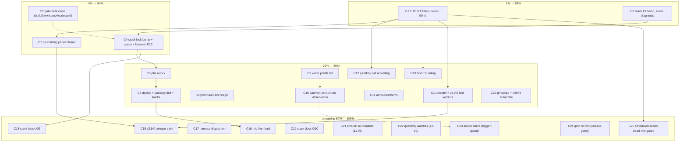

# SUPERB round-3 Pareto plan — post-churn-kill, pre-sitting (2026-10-06 01:43)

**Inputs:** live `TODO_LIST.md` (16 rows) · round-2 plan `2026-10-05_20-30` (Q1–Q17, F-ids) · round-2 execution report `2026-10-05_21-41` (§c/§f, 42 items) · registry-writer session reports `2026-10-06_00-52` + `01-40` (40-item §f, 3 open questions). Round-2's assistant legs are DONE; this plan carries everything still open.

**Standing rules honored:** no assistant ssh/deploy (pbx-artmann AGENTS); gated items stay gated (Q14 ruling-34, Q15 carve post-plan trigger, Q8/Q16 dates, Q13 Crush release); daemon-shared edits atomic; every push gets a CI verdict.

---

## Pareto breakdown

**1% → 51% — THE SITTING (`C1`) + the stack-CI diagnosis (`C3`).** The sitting flips 9/16 TODO rows in ~90 minutes of owner decisions; every post-sitting close (C7, C12–C15) and both standing questions from the 01-40 review (CI-bar, push-lag) hang off it. The mod_enum/1h-ceiling diagnosis is the single blocker of the entire deploy train (C4→C5→C6), which itself closes the passkey tail, the v2.8.0 tail, the island-honesty E2E debt, and puts the day's five commits on prod.

**4% → 64% — `C2` gate-debt close + `C7` post-sitting closes + `C4` lock-bump/E2E leg.** C2 removes the only dishonest verification state left in the repo (my own commit never saw buildflow/island/codespell). C7 converts sitting verdicts into docs within the same sitting (no drift). C4 is the deploy train's long leg (browser E2E covers two markup-changing trains' obligation).

**20% → 80% — deploy-train tail (C5, C6), prod triage (C8), writer polish tail (C9, C10), announcements (C11), passkey/boot-contract/samber-do verdict recording (C12–C14), gh scope (C20).** Each is small, independent, and closes a named TODO row outright.

**Remaining 80% → 100% — v2.9.0 fold + release (C14→C15), mic ritual (C16), harness disposition (C17), stack batches (C18, C19), date-gated watches (C21, C22), trigger-gated carve (C23), release-gated qmd re-test (C24), the dead scheduled-sends row (C25).** Nothing here blocks anything above; they ride owner time, dates, or triggers.

---

## Comprehensive plan (30–100 min tasks, ALL TODOs, sorted by importance/impact/effort/customer-value)

| # | Task | Owner | Effort | Impact | Value | Depends |
|---|------|-------|--------|--------|-------|---------|
| C1 | THE SITTING — 34 briefing rows in dependency order (release/deploy, rows 33–34 with fresh evidence, tooling postures, dedup/registry ratifications, seam micro-decisions, passkey calls, v2.9.0 fold, CI-bar + push-lag + coupling-home from 01-40 §g) | 👤 owner | 90m | 🔥🔥🔥 | flips 9/16 rows; unblocks C7/C12–C15 | briefing doc (ready) |
| C2 | Gate-debt close over `2b52fbf`: buildflow + island JS tests + codespell over new docs; record results | 🤖 | 30m | 🔥🔥 | restores honest verification bar (01-40 d.1/d.3) | — |
| C3 | Stack CI 1h-ceiling diagnosis inside `nix flake check` (mod_enum build log; read-only `gh run list` on stack first) | 👤 | 100m | 🔥🔥🔥 | unblocks entire deploy train | — |
| C4 | Stack lock bump to ≥`3b52fbf` + stack gates + browser E2E (445s budget, one re-run on transfer flake); nginx→caddy edits at relock | 👤 | 100m | 🔥🔥🔥 | closes island-honesty + cascade/passkey E2E debt | C3 |
| C5 | pbx-artmann clean-tree check → relock → re-pin | 👤 | 30m | 🔥🔥 | prod rides pinned tree | C4 |
| C6 | Deploy: `nixos-rebuild test` → passkey fail-closed password-file drill → `switch` → rotate `/tmp/pbx-toplevel-current` → smoke `--expect-version` | 👤 | 60m | 🔥🔥🔥 | ships the day's work; live passkey proof | C5 |
| C7 | Post-sitting paper closes (Q6): verdicts → briefing/TODO/ROADMAP; markdownlint posture implementation; AGENTS edits within 377 cap; registry standing rows for ratified 29–32 + vcard triad | 🤖 | 100m | 🔥🔥 | decisions become durable docs, no drift | C1 |
| C8 | Prod SMS 422 triage: journal `telnyx-webhooks` → §4 decision tree → test SMS → record root cause (runbook + TODO) | 👤 | 30m | 🔥🔥 | restores outbound SMS on prod | — |
| C9 | Registry-writer polish tail: framing pin (`"\n\n"` blank line) + uniform-row-length property in `TestRegistryBlockEmitsDaemonAlignedRows`; re-flow 00-52 report table to aligned form | 🤖 | 30m | 🔥 | hardens the churn kill; eats own dogfood | — |
| C10 | Daemon-cycle zero-churn observation: after next daemon commit touches `docs/error-contract.md`, verify zero reflow diff; record in TODO tooling row | 🤖 | 12m | 🔥 | inference → evidence | daemon activity |
| C11 | Announcements: pick channels, approve v2.8.0 draft A/B/C, post | 👤 | 30m | 🔥 | public release story | — |
| C12 | Passkey owner-call recording: runbook-only enroll + Lars-only v1 mapping ratification; installer release republish timing | 👤 | 30m | 🔥 | closes passkey row's non-deploy remainder | C1 |
| C13 | Boot-contract D3 ruling: cap `StartLimitBurst`/`StartLimitIntervalSec` or ratify 5s `Restart=on-failure`; apply to module if capped | 👤 | 30m | 🔥 | closes boot-contract row | C1 |
| C14 | samber/do verdicts: stack `/health` exposure policy + v2.9.0 fold decision (default: one release) | 👤 | 30m | 🔥 | closes dashboard row; gates C15 | C1 |
| C15 | v2.9.0 release train: CHANGELOG cut, version decision, tag, gh release, stack re-pin dance per release-runbook | 👤+🤖 | 100m | 🔥🔥 | folds the day's work into a version | C14 |
| C16 | Mic pre-warm live ritual: accept→speak sub-second, indicator at ring, warm release on reject/missed | 👤 | 30m | 🔥 | closes T07/T11 verification leg | C6 (fresh prod) |
| C17 | Visual-harness disposition: eyeball 14 shots; per-release vs per-train persistence ruling; optional vision-CLI provider decision | 👤 | 30m | 🔥 | closes T23 row | — |
| C18 | Stack batch Q9: `services.webphone.paperless` module option + smoke arm; `ftypqt`→`video/quicktime` sniff fix; E2E MMS-outbound; pbx-artmann FEATURES:87 text | 🔀 stack | 100m | 🔥 | gateway-seam row remainder | C4 (deploy-gated) |
| C19 | Stack docs batch Q10: WebTransport verdict doc; deploy.md secret PATH column; ops-runbook demo-call recipe + secrets path; MOH + `/recordings/` + CDR checks | 🔀 stack | 60m | 🔥 | cross-repo obligations row | — |
| C20 | gh `notifications` scope refresh → `updateSubscription` mutation on crush #3846 (or web-Subscribe) | 👤 | 12m | 🔢 | unblinds the qmd watch | — |
| C21 | erraudit tier-1+2 re-measure (must stay 0/0) + boot-surface re-grade; bump next-due in AGENTS | 🤖 | 30m | 🔢 | date-gated | 2026-11-05 |
| C22 | Quarterly watches: sip.js 0.22, templ-components upstream, oxlint globals, E2E budget ×2 rule | 🤖 | 30m | 🔢 | date-gated | 2026-12-20 |
| C23 | internal/server carve: micro-plan then execution (`server/api` + `server/hooks`) | 🤖 | 3×100m | 🔥 | trigger-gated hygiene | next file in `internal/server` post-2026-10-05-plan |
| C24 | QMD `get` re-test after next Crush release (>v0.97.1) | 🤖 | 12m | 🔢 | release-gated | Crush release |
| C25 | Scheduled sends — confirm-dead no-op: stays DECIDED-AGAINST unless the sitting revives it | — | 0m | — | zombie-row guard | C1 (if revived) |

**Coverage proof — every TODO_LIST row maps:** passkey-tail→C1/C6/C12 · boot-contract→C13 · v2.8.0-tail→C3–C6/C8 · SMS-422→C8 · scheduled-sends→C25 · gateway-CT→C18 · tooling-hygiene→C1/C7 · owner-calls→C1/C7/C12–C14 · announcements→C11 · watches→C20–C22 · carve→C23 · mic→C16 · island-honesty→C4 · samber/do→C14 · harness→C17 · cross-repo→C18/C19. Session-debt (01-40 §f)→C2/C9/C10/C20.

---

## Fine breakdown (max 12 min each, ALL TODOs, sorted)

| # | Task (≤12m) | Parent | Owner |
|---|-------------|--------|-------|
| 1.1 | Sitting block A: release/deploy rows 15–17, 27 (v2.8 ratify, fold, switch-vs-CI) | C1 | 👤 |
| 1.2 | Sitting block B: daemon-format policy + proof-bar (rows 33–34, fresh evidence) | C1 | 👤 |
| 1.3 | Sitting block C: CI-bar ruling 34 + push-lag threshold (01-40 §g.1–2) | C1 | 👤 |
| 1.4 | Sitting block D: daemon-format coupling home (01-40 §g.3) | C1 | 👤 |
| 1.5 | Sitting block E: markdownlint posture row 18 (configure vs detect-only) | C1 | 👤 |
| 1.6 | Sitting block F: dedup registry ratification + `-t 3` baseline + suppression scope | C1 | 👤 |
| 1.7 | Sitting block G: mixin/CRM/Paperless twin rulings (rows 29–31) + errorfamily.Join (32) | C1 | 👤 |
| 1.8 | Sitting block H: vcard triad + `settingsRow` build-or-retire + micro-test bar | C1 | 👤 |
| 1.9 | Sitting block I: passkey calls (runbook-only enroll, Lars-only mapping) | C1 | 👤 |
| 1.10 | Sitting block J: boot D3 + `/health` exposure + scheduled-sends revival check (C25) | C1 | 👤 |
| 1.11 | Sitting block K: remaining rows (push ratification, AGENTS restructure, chmod/re-backup, destDir, sniff lifespan, msg→message rename, missed-call, `?q=`, `Must*`) | C1 | 👤 |
| 1.12 | Sitting block L: closed-since sweep + adjourn; hand verdict list to assistant | C1 | 👤 |
| 2.1 | Run buildflow over `2b52fbf` (inside `nix develop`) | C2 | 🤖 |
| 2.2 | Run island JS tests (`node --test internal/web/assets/island-tests/*.test.mjs`) | C2 | 🤖 |
| 2.3 | Codespell real-binary over CHANGELOG/docs delta | C2 | 🤖 |
| 2.4 | Record gate-debt results in TODO tooling row + 01-40 report annotation | C2 | 🤖 |
| 3.1 | Read-only stack CI state: `gh run list` on stack repo | C3 | 👤 |
| 3.2 | Pull the cancelling run's `nix flake check` log; isolate mod_enum vs timeout | C3 | 👤 |
| 3.3 | Repair or pin-around mod_enum build break | C3 | 👤 |
| 3.4 | Verify stack CI green under 1h ceiling (or split the job) | C3 | 👤 |
| 4.1 | Stack relock to ≥`2b52fbf`; apply nginx→caddy module edits at relock | C4 | 👤 |
| 4.2 | Stack flake check + VM leg green | C4 | 👤 |
| 4.3 | Browser E2E run 1 (445s budget) | C4 | 👤 |
| 4.4 | E2E re-run once if transfer-flake; record both verdicts | C4 | 👤 |
| 5.1 | pbx-artmann tree-clean check (`git status`, lock state) | C5 | 👤 |
| 5.2 | pbx relock + re-pin + probe OK | C5 | 👤 |
| 6.1 | `nixos-rebuild test --flake .#pbx --target-host root@pbx.artmann.tech` | C6 | 👤 |
| 6.2 | Passkey fail-closed password-file drill (live proof) | C6 | 👤 |
| 6.3 | `nixos-rebuild switch` | C6 | 👤 |
| 6.4 | Rotate `/tmp/pbx-toplevel-current` + fresh diff-closures baseline | C6 | 👤 |
| 6.5 | Smoke `--base https://pbx.artmann.tech --expect-version <V>` (expect self-send 422 = healthy) | C6 | 👤 |
| 7.1 | Transcribe sitting verdicts into briefing (closed markers) | C7 | 🤖 |
| 7.2 | Update TODO_LIST: delete closed rows, reword reopened ones | C7 | 🤖 |
| 7.3 | Implement markdownlint posture (config or AGENTS note) | C7 | 🤖 |
| 7.4 | AGENTS edits (≤377 lines) for every ruled posture | C7 | 🤖 |
| 7.5 | Dedup-registry standing rows for ratified 29–32 + vcard; sweep-log line | C7 | 🤖 |
| 7.6 | ROADMAP verdict updates (revived/dead items) | C7 | 🤖 |
| 7.7 | Commit + push + CI verdict (standing habit) | C7 | 🤖 |
| 8.1 | `systemctl status/journal telnyx-webhooks` — unit state + errors | C8 | 👤 |
| 8.2 | Grep journal for sms/422/error; read bridge cred strings | C8 | 👤 |
| 8.3 | Fix creds / restart bridge per §4 decision tree | C8 | 👤 |
| 8.4 | Send test SMS (non-self-send); record root cause in stack runbook + TODO | C8 | 👤 |
| 9.1 | Add framing pin + uniform-row-length assertions to writer test | C9 | 🤖 |
| 9.2 | Re-flow 00-52 report table to aligned form | C9 | 🤖 |
| 9.3 | `go test ./internal/arch`; commit + CI verdict | C9 | 🤖 |
| 10.1 | After next daemon commit: diff `docs/error-contract.md`; assert zero reflow | C10 | 🤖 |
| 10.2 | Record zero-churn verdict in TODO tooling row | C10 | 🤖 |
| 11.1 | Pick channels; approve draft A/B/C wording + disclosure posture | C11 | 👤 |
| 11.2 | Post announcements | C11 | 👤 |
| 12.1 | Record runbook-only-enroll + mapping ratifications in plan doc + TODO | C12 | 👤 |
| 12.2 | Decide installer republish timing; execute or schedule | C12 | 👤 |
| 13.1 | D3 verdict: cap burst/interval or ratify 5s retry | C13 | 👤 |
| 13.2 | If capped: module edit + `webphone-module` check + stack re-pin ride-along | C13 | 👤 |
| 14.1 | `/health` exposure verdict (remote_ip vs PublicMode vs basic auth) | C14 | 👤 |
| 14.2 | v2.9.0 fold verdict (default: one release) | C14 | 👤 |
| 15.1 | CHANGELOG cut for v2.9.0 | C15 | 🤖 |
| 15.2 | Version bump (flake.nix `webphoneVersion`) + release.sh gates | C15 | 👤+🤖 |
| 15.3 | Tag + push + gh release + verify CI/`ls-remote` | C15 | 👤 |
| 15.4 | Stack lock bump + pbx re-pin per release-runbook | C15 | 👤 |
| 16.1 | Live call ritual: accept→speak sub-second check | C16 | 👤 |
| 16.2 | Indicator-at-ring + warm-release-on-reject checks; record in TODO | C16 | 👤 |
| 17.1 | Eyeball 14-shot matrix; note regressions | C17 | 👤 |
| 17.2 | Persistence ruling (per-release default) + vision-CLI provider call | C17 | 👤 |
| 18.1 | Stack: `services.webphone.paperless` option + smoke arm | C18 | 🔀 |
| 18.2 | Stack: `ftypqt`→`video/quicktime` sniff fix | C18 | 🔀 |
| 18.3 | Stack: E2E MMS-outbound coverage | C18 | 🔀 |
| 18.4 | pbx-artmann FEATURES:87 stale text fix | C18 | 🔀 |
| 19.1 | WebTransport-not-adopted verdict doc | C19 | 🔀 |
| 19.2 | deploy.md secret PATH column | C19 | 🔀 |
| 19.3 | Ops-runbook demo-call recipe + secrets path | C19 | 🔀 |
| 19.4 | MOH audibility + `/recordings/` + CDR checks | C19 | 🔀 |
| 20.1 | `gh auth refresh -s notifications`; subscribe #3846 via mutation or web | C20 | 👤 |
| 21.1 | erraudit tier-1 + tier-2a/2b re-measure (stay 0/0) | C21 | 🤖 |
| 21.2 | Boot-surface re-grade vs error-contract §"Boot surface"; bump next-due in AGENTS | C21 | 🤖 |
| 22.1 | Quarterly re-check: sip.js npm latest; templ-components upstream; oxlint globals; E2E budget ×2 rule | C22 | 🤖 |
| 23.1 | Carve micro-plan (file moves, helper homes, contract-test updates) — only after trigger fires | C23 | 🤖 |
| 23.2 | Move `server/api` (contacts, calls, session, csrf) + tests | C23 | 🤖 |
| 23.3 | Move `server/hooks` (webhooks, idempotency) + tests | C23 | 🤖 |
| 23.4 | Update arch test + 401-writer allowlist + DOM pins; render-diff parity if wanted | C23 | 🤖 |
| 23.5 | Full gates (buildflow + flake check) + CI verdict | C23 | 🤖 |
| 24.1 | Re-test `mcp_qmd_get` post-Crush-release; close or re-file the watch | C24 | 🤖 |
| 25.1 | No-op verification: scheduled-sends stays dead unless C1 block J revived it | C25 | — |

*(86 fine tasks; ALL TODOs present.)*

---

## Execution graph

**Dashed edges** are hygiene orderings, not hard blockers. C2/C9/C10/C20 are free-floating assistant/owner legs — any session can take them between owner legs.

## Guardrails

- **No Verschlimmbesserung:** gated items (C21–C25) do NOT start early; every owner leg is handed over, never ssh'd; the carve waits for its trigger; behavior parity on any port.
- Every push verified via `ls-remote` + CI verdict; daemon-shared docs edited atomically; verification via snapshot hashes, never `git status` against a movable HEAD.
- This plan supersedes nothing: the round-2 plan's open items are fully folded here; TODO_LIST stays the living source (new findings → TODO rows, not plan edits).
