# SUPERB Round-4 Pareto Plan — every open TODO, post-auth-hardening

**Written:** 2026-10-06 13:31 CEST · **Supersedes:** round-3 plan (2026-10-06_01-43) for all OPEN work — its C2/C9/C10 assistant legs are DONE (CI-green `2b52fbf`→`57cebe6` chain), everything else carries forward re-lettered **D**.
**Inputs:** TODO_LIST.md (16 live rows), round-3 plan C1–C25 statuses, 04-12 review §e/§f (process debt), 13-12 auth review §b/§c/§f (auth tail + unanswered §g), auth audit trail in TODO_LIST's passkey row.
**Method:** tables below are written at natural width — the daemon reflows them once, accepted per the 04-12 §e.3 ruling (hand-alignment is churn bait).

## Pareto verdict

**1% → 51%: D1 THE SITTING.** One 90-minute owner sitting flips 9/16 TODO rows, unblocks the paper-close train (D7), the release train (D8), and now carries SEVEN accumulated §g questions (CI-bar subset, push-lag threshold + anchor definition, daemon-format coupling home, `__Host-` cookie prefix, enroll token binding, passkey `?user_id=` ceremony-key acceptance, auth audit cadence). Nothing else in the system moves without it.

**4% → 64%: D1 + the deploy chain (D2→D3→D4→D5).** The sitting's verdicts plus one executed deploy train turn ~five sessions of shipped-and-green code (passkey mode, island honesty, cascade fixes, auth hardening `57cebe6`) into LIVE product value behind pbx.artmann.tech, close the E2E obligation two markup-changing trains owe, and prove passkey fail-closed on prod.

**20% → 80%: + D7 paper closes (verdicts become durable docs before drift), D8 v2.9.0 release (folds passkey + registry-writer + auth trains into a version), D18/D19 auth tail (renewal pin, secret-leak grep, island-side audit — the audit's own unfinished 20%), D6 SMS 422 triage (restores outbound SMS = the one live customer-facing breakage).**

**Remaining 20% → 100%: announcements (D9), mic ritual (D13), harness disposition (D14), stack batches (D15/D16), date-gated watches (D20/D21), trigger-gated carve (D22), release-gated QMD (D23), zombie guard (D24), hygiene micro-batch (D18b), post-verdict tooling implementations (markdownlint posture, gosec, push-leg diagnosis — folded into D7/D26).**

## Comprehensive plan (30–100 min tasks, ALL open TODOs, sorted by importance/impact/effort/customer-value)

| #   | Task                                                                                                                                                                                                                                                                                                                                                                                                                                                                                                                                                                                                                                                                        | Owner    | Effort | Impact | Value                                              | Depends                                      |
| --- | --------------------------------------------------------------------------------------------------------------------------------------------------------------------------------------------------------------------------------------------------------------------------------------------------------------------------------------------------------------------------------------------------------------------------------------------------------------------------------------------------------------------------------------------------------------------------------------------------------------------------------------------------------------------------- | -------- | ------ | ------ | -------------------------------------------------- | -------------------------------------------- |
| D1  | THE SITTING v2 — 35 briefing rows in dependency order + SEVEN new §g verdicts: CI-bar subset for docs/test-only changes · push-lag threshold + ANCHOR definition (6 datapoints: green/3h, red-fix/15m, green/25m, green/6m, green/>60m, green/60m-stall-manual-push; interim anchor = first-unpushed-commit timestamp, see AGENTS) · daemon-format coupling home (now with the md-table-shape 25-finding corpus evidence + armed 03-40 canary) · `__Host-webphone_session` prefix adopt-or-not · enroll-ceremony token binding vs ULID-secrecy posture · passkey `?user_id=` ceremony-key acceptance (briefing row 35) · auth audit cadence (one-off vs quarterly-with-C21) | 👤       | 90m    | 🔥🔥🔥 | flips 9/16 rows; unblocks D7/D8/D26/D29/D30        | briefing doc (ready)                         |
| D2  | Stack CI 1h-ceiling diagnosis inside `nix flake check` (mod_enum build log; read-only `gh run list` on the stack first)                                                                                                                                                                                                                                                                                                                                                                                                                                                                                                                                                     | 👤       | 100m   | 🔥🔥🔥 | unblocks entire deploy train                       | —                                            |
| D3  | Stack lock bump to ≥`57cebe6` + stack gates + browser E2E (445s budget, one re-run on the transfer flake); nginx→caddy edits at relock per the TODO command sheet                                                                                                                                                                                                                                                                                                                                                                                                                                                                                                           | 👤       | 100m   | 🔥🔥🔥 | closes island-honesty + cascade + passkey E2E debt | D2                                           |
| D4  | pbx-artmann clean-tree check → relock → re-pin                                                                                                                                                                                                                                                                                                                                                                                                                                                                                                                                                                                                                              | 👤       | 30m    | 🔥🔥   | prod rides the pinned tree                         | D3                                           |
| D5  | Deploy: `nixos-rebuild test` → passkey fail-closed password-file drill → `switch` → rotate `/tmp/pbx-toplevel-current` → fresh diff-closures baseline → smoke `--expect-version <V>`                                                                                                                                                                                                                                                                                                                                                                                                                                                                                        | 👤       | 60m    | 🔥🔥🔥 | ships the day's work; live passkey proof           | D4                                           |
| D6  | Prod SMS 422 triage: journal `telnyx-webhooks` → §4 decision tree → test SMS → record root cause (runbook + TODO)                                                                                                                                                                                                                                                                                                                                                                                                                                                                                                                                                           | 👤       | 30m    | 🔥🔥   | restores outbound SMS on prod                      | —                                            |
| D7  | Post-sitting paper closes (Q6-class): verdicts → briefing/TODO/ROADMAP; markdownlint posture implementation (row-18 verdict); AGENTS edits within the 377 cap; registry standing rows for ratified 29–32 + vcard triad; the three 13-12 §g verdicts land in TODO rows; TODO_LIST harvest of the auth-tail rows                                                                                                                                                                                                                                                                                                                                                              | 🤖       | 100m   | 🔥🔥   | decisions become durable docs, no drift            | D1                                           |
| D8  | v2.9.0 release train: CHANGELOG cut (folds passkey + registry-writer + auth § Security), version decision, tag, gh release, stack re-pin dance per release-runbook                                                                                                                                                                                                                                                                                                                                                                                                                                                                                                          | 👤+🤖    | 100m   | 🔥🔥   | folds the trains into a version                    | D12                                          |
| D18 | Auth tail batch A (assistant, executable NOW): renewal Secure re-issue end-to-end spec · slog secret-leak grep across server/userauth/gateway · codespell over the CHANGELOG/lessons delta (the twice-skipped subset) · auth-regression label convention row in AGENTS                                                                                                                                                                                                                                                                                                                                                                                                      | 🤖       | 30m    | 🔥🔥   | closes the audit's own unfinished 20%              | —                                            |
| D19 | Island-side auth audit (client): csrf.js adoption ladder, session.js/passkey.js token handling, XSS-reachable DOM surfaces, localStorage legacy-contact import gate                                                                                                                                                                                                                                                                                                                                                                                                                                                                                                         | 🤖       | 60m    | 🔥🔥   | the unaudited half of the auth surface             | — (pre-D8 preferred)                         |
| D25 | Hygiene micro-batch: near-aligned-table sweep over 10-05+ reports (churn-minimization honesty) · whitespace-drift pre-commit self-check (`git diff --cached -w` divergence detector, the e62fe34 class) · aligner-vs-accept-churn convention note once D1 rules the coupling home                                                                                                                                                                                                                                                                                                                                                                                           | 🤖       | 30m    | 🔢     | kills two documented near-miss classes             | D1 (coupling-home verdict)                   |
| D12 | samber/do verdicts: stack `/health` exposure policy + v2.9.0 fold decision (default: one release)                                                                                                                                                                                                                                                                                                                                                                                                                                                                                                                                                                           | 👤       | 30m    | 🔥     | closes dashboard row; gates D8                     | D1                                           |
| D10 | Passkey owner-call recording: runbook-only enroll + Lars-only v1 mapping ratification; installer release republish timing                                                                                                                                                                                                                                                                                                                                                                                                                                                                                                                                                   | 👤       | 30m    | 🔥     | closes passkey row's non-deploy remainder          | D1                                           |
| D11 | Boot-contract D3 ruling: cap `StartLimitBurst`/`StartLimitIntervalSec` or ratify 5s `Restart=on-failure`; apply to module if capped                                                                                                                                                                                                                                                                                                                                                                                                                                                                                                                                         | 👤       | 30m    | 🔥     | closes boot-contract row                           | D1                                           |
| D29 | `__Host-` session-cookie prefix implementation (loopback keeps the plain name; one-time re-login cost) — ONLY if D1 ratifies                                                                                                                                                                                                                                                                                                                                                                                                                                                                                                                                                | 🤖       | 30m    | 🔥     | browser-enforced attribute pinning                 | D1                                           |
| D30 | usermgmt enroll-ceremony token binding (begin requires token-verified server-side handshake) — upstream library change; ONLY if D1 picks binding over ULID-secrecy                                                                                                                                                                                                                                                                                                                                                                                                                                                                                                          | 👤+🤖    | 100m   | 🔥     | removes ULID-secrecy dependence                    | D1                                           |
| D13 | Mic pre-warm live ritual: accept→speak sub-second, indicator at ring, warm release on reject/missed                                                                                                                                                                                                                                                                                                                                                                                                                                                                                                                                                                         | 👤       | 30m    | 🔥     | closes T07/T11 verification leg                    | D5 (fresh prod)                              |
| D14 | Visual-harness disposition: eyeball 14 shots; per-release vs per-train persistence ruling; optional vision-CLI provider decision                                                                                                                                                                                                                                                                                                                                                                                                                                                                                                                                            | 👤       | 30m    | 🔥     | closes T23 row                                     | —                                            |
| D15 | Stack batch Q9: `services.webphone.paperless` module option + smoke arm; `ftypqt`→`video/quicktime` sniff fix; E2E MMS-outbound; pbx-artmann FEATURES:87 text                                                                                                                                                                                                                                                                                                                                                                                                                                                                                                               | 🔀 stack | 100m   | 🔥     | gateway-seam row remainder                         | D3 (deploy-gated)                            |
| D16 | Stack docs batch Q10: WebTransport verdict doc; deploy.md secret PATH column; ops-runbook demo-call recipe + secrets path; MOH + `/recordings/` + CDR checks                                                                                                                                                                                                                                                                                                                                                                                                                                                                                                                | 🔀 stack | 60m    | 🔥     | cross-repo obligations row                         | —                                            |
| D17 | gh `notifications` scope refresh → `updateSubscription` mutation on crush #3846 (or web-Subscribe)                                                                                                                                                                                                                                                                                                                                                                                                                                                                                                                                                                          | 👤       | 12m    | 🔢     | unblinds the QMD watch                             | —                                            |
| D9  | Announcements: pick channels, approve v2.8.0 draft A/B/C, post (disclosure posture per draft)                                                                                                                                                                                                                                                                                                                                                                                                                                                                                                                                                                               | 👤       | 30m    | 🔥     | public release story                               | —                                            |
| D26 | Post-verdict tooling implementations: gosec adoption (if D1 says yes) · CI queue congestion review (concurrency/rerun settings — 1h28m + queue repeats) · daemon push-leg diagnosis (pma logs; two deaths 10-06) once the threshold verdict lands                                                                                                                                                                                                                                                                                                                                                                                                                           | 👤+🤖    | 60m    | 🔢     | kills the recurring infra friction                 | D1                                           |
| D20 | erraudit tier-1+2 re-measure (must stay 0/0) + boot-surface re-grade; bump next-due in AGENTS                                                                                                                                                                                                                                                                                                                                                                                                                                                                                                                                                                               | 🤖       | 30m    | 🔢     | date-gated                                         | 2026-11-05                                   |
| D21 | Quarterly watches: sip.js 0.22, templ-components upstream, oxlint globals, E2E budget ×2 rule — + auth-audit cadence slot if D1 wants it recurring                                                                                                                                                                                                                                                                                                                                                                                                                                                                                                                          | 🤖       | 30m    | 🔢     | date-gated                                         | 2026-12-20                                   |
| D22 | internal/server carve: micro-plan then execution (`server/api` + `server/hooks`)                                                                                                                                                                                                                                                                                                                                                                                                                                                                                                                                                                                            | 🤖       | 3×100m | 🔥     | trigger-gated hygiene                              | next file in internal/server post-09-30-plan |
| D23 | QMD `get` re-test after next Crush release (>v0.97.1)                                                                                                                                                                                                                                                                                                                                                                                                                                                                                                                                                                                                                       | 🤖       | 12m    | 🔢     | release-gated                                      | Crush release                                |
| D24 | Scheduled sends — confirm-dead no-op: stays DECIDED-AGAINST unless the sitting revives it                                                                                                                                                                                                                                                                                                                                                                                                                                                                                                                                                                                   | —        | 0m     | —      | zombie-row guard                                   | D1 (if revived)                              |

(26 tasks; every open item below maps.)

## Fine breakdown (≤12 min each, ALL TODOs, sorted by importance/impact/effort/customer-value)

| #    | Fine task                                                                                     | Parent | Owner |
| ---- | --------------------------------------------------------------------------------------------- | ------ | ----- |
| 1.1  | Read the briefing doc end-to-end; confirm the 35 rows' order still holds                      | D1     | 👤    |
| 1.2  | Verdict: CI-bar subset policy for docs/test-only changes (fmt gate NEVER droppable)           | D1     | 👤    |
| 1.3  | Verdict: push-lag threshold number + session-push ratification                                | D1     | 👤    |
| 1.4  | Verdict: daemon-format coupling note home                                                     | D1     | 👤    |
| 1.5  | Verdict: `__Host-` cookie prefix yes/no                                                       | D1     | 👤    |
| 1.6  | Verdict: enroll token binding vs ULID-secrecy posture                                         | D1     | 👤    |
| 1.7  | Verdict: auth audit cadence (one-off vs quarterly)                                            | D1     | 👤    |
| 1.8  | Rows 33–34 (release/deploy order) with fresh evidence                                         | D1     | 👤    |
| 1.9  | Remaining tooling/dedup/seam micro-decision rows                                              | D1     | 👤    |
| 1.10 | Write the sitting minutes into the briefing doc                                               | D1     | 👤    |
| 2.1  | Stack `gh run list` read-only: last 10 runs, failure signatures                               | D2     | 👤    |
| 2.2  | Pull the mod_enum build log; identify the 1h-ceiling step                                     | D2     | 👤    |
| 2.3  | Classify: flake, real break, or timeout budget                                                | D2     | 👤    |
| 2.4  | Fix or fence the failing leg; re-run `nix flake check`                                        | D2     | 👤    |
| 3.1  | Bump the stack lock to webphone ≥`57cebe6`                                                    | D3     | 👤    |
| 3.2  | Apply nginx→caddy edits at the relock (command sheet)                                         | D3     | 👤    |
| 3.3  | Stack gates: flake check + VM                                                                 | D3     | 👤    |
| 3.4  | Browser E2E run 1 (445s budget)                                                               | D3     | 👤    |
| 3.5  | On transfer-flake death: ONE re-run before digging                                            | D3     | 👤    |
| 3.6  | Record E2E green receipt in the TODO row                                                      | D3     | 👤    |
| 4.1  | pbx-artmann tree-clean check                                                                  | D4     | 👤    |
| 4.2  | Relock + re-pin + probe OK                                                                    | D4     | 👤    |
| 5.1  | `nixos-rebuild test --flake .#pbx --target-host root@pbx.artmann.tech`                        | D5     | 👤    |
| 5.2  | Passkey fail-closed drill: break the password file → expect loud 503 Rejection                | D5     | 👤    |
| 5.3  | Restore file → login green                                                                    | D5     | 👤    |
| 5.4  | `nixos-rebuild switch`                                                                        | D5     | 👤    |
| 5.5  | Rotate `/tmp/pbx-toplevel-current` + fresh diff-closures baseline                             | D5     | 👤    |
| 5.6  | Smoke `--base https://pbx.artmann.tech --expect-version <V>`                                  | D5     | 👤    |
| 5.7  | Session-cookie Secure sanity: browser devtools shows `Secure` on webphone_session over https  | D5     | 👤    |
| 6.1  | Journal telnyx-webhooks unit: status + recent error lines                                     | D6     | 👤    |
| 6.2  | Walk the §4 decision tree; fix creds/bridge per findings                                      | D6     | 👤    |
| 6.3  | Test SMS (self-send 422 = expected)                                                           | D6     | 👤    |
| 6.4  | Record root cause in TODO + stack runbook                                                     | D6     | 👤    |
| 7.1  | Harvest sitting verdicts into TODO_LIST rows (mechanical)                                     | D7     | 🤖    |
| 7.2  | markdownlint posture: implement or record detect-only (per row-18 verdict)                    | D7     | 🤖    |
| 7.3  | Registry standing rows 29–32 + vcard triad ratifications                                      | D7     | 🤖    |
| 7.4  | AGENTS edits within the 377-line cap                                                          | D7     | 🤖    |
| 7.5  | ROADMAP/FEATURES truthing for every flipped row                                               | D7     | 🤖    |
| 8.1  | CHANGELOG cut for v2.9.0 (incl. § Security fold)                                              | D8     | 👤+🤖 |
| 8.2  | Version decision + `webphoneVersion` bump in flake.nix                                        | D8     | 👤    |
| 8.3  | Full release gate: buildflow + vulnix + flake check                                           | D8     | 🤖    |
| 8.4  | Tag + push + gh release                                                                       | D8     | 👤    |
| 8.5  | Stack re-pin dance per release-runbook                                                        | D8     | 👤    |
| 8.6  | Post-release TODO sweep (delete done rows)                                                    | D8     | 🤖    |
| 18.1 | Renewal Secure re-issue spec (past-half-life request under https origins → Set-Cookie Secure) | D18    | 🤖    |
| 18.2 | slog secret-leak grep (webhook secret, passwords, tokens) over server/userauth/gateway        | D18    | 🤖    |
| 18.3 | Codespell over the 10-06 docs delta                                                           | D18    | 🤖    |
| 18.4 | Auth-regression label convention (AGENTS row)                                                 | D18    | 🤖    |
| 19.1 | csrf.js adoption ladder review (retry-2 recover, reload-3)                                    | D19    | 🤖    |
| 19.2 | session.js + passkey.js token handling (no token in URLs/logs)                                | D19    | 🤖    |
| 19.3 | XSS surface: innerHTML sinks, lightbox, snippet fill                                          | D19    | 🤖    |
| 19.4 | localStorage legacy-import gate re-check (post-accept delete)                                 | D19    | 🤖    |
| 19.5 | Findings → fixes or TODO rows; island tests green                                             | D19    | 🤖    |
| 25.1 | Sweep 10-05+ reports for near-aligned tables; daemon-shape or accept-churn per verdict        | D25    | 🤖    |
| 25.2 | Whitespace-drift staged-diff self-check recipe; wire into session habit                       | D25    | 🤖    |
| 25.3 | Convention note (AGENTS or lessons) once D1.4 rules                                           | D25    | 🤖    |
| 12.1 | `/health` exposure verdict (remote_ip vs PublicMode vs basic auth)                            | D12    | 👤    |
| 12.2 | v2.9.0 fold verdict (default: one release)                                                    | D12    | 👤    |
| 10.1 | Record runbook-only-enroll + Lars-only v1 mapping verdicts                                    | D10    | 👤    |
| 10.2 | Installer republish timing decision                                                           | D10    | 👤    |
| 11.1 | D3 retry-loop verdict; module edit if capped                                                  | D11    | 👤    |
| 29.1 | Conditional: `__Host-` prefix in SetCookie + tests + docs                                     | D29    | 🤖    |
| 30.1 | Conditional: usermgmt handshake design note                                                   | D30    | 👤+🤖 |
| 30.2 | Conditional: library change + webphone ride + tests                                           | D30    | 👤+🤖 |
| 13.1 | Live mic ritual (accept→speak, indicator timing, reject/missed release)                       | D13    | 👤    |
| 14.1 | Eyeball the 14-shot matrix                                                                    | D14    | 👤    |
| 14.2 | Persistence ruling (per-release default) + vision-CLI provider decision                       | D14    | 👤    |
| 15.1 | paperless module option + smoke arm                                                           | D15    | 🔀    |
| 15.2 | ftypqt sniff fix                                                                              | D15    | 🔀    |
| 15.3 | E2E MMS-outbound coverage                                                                     | D15    | 🔀    |
| 15.4 | pbx-artmann FEATURES:87 text refresh                                                          | D15    | 🔀    |
| 16.1 | WebTransport verdict doc                                                                      | D16    | 🔀    |
| 16.2 | deploy.md secret PATH column                                                                  | D16    | 🔀    |
| 16.3 | Ops-runbook demo-call recipe + secrets path                                                   | D16    | 🔀    |
| 16.4 | MOH + `/recordings/` + CDR checks                                                             | D16    | 🔀    |
| 17.1 | `gh auth refresh -s notifications` + subscribe to crush #3846                                 | D17    | 👤    |
| 9.1  | Channel pick + wording approval (v2.8.0 drafts A/B/C)                                         | D9     | 👤    |
| 9.2  | Post + record links in TODO                                                                   | D9     | 👤    |
| 26.1 | gosec in-or-out verdict implementation                                                        | D26    | 🤖    |
| 26.2 | CI workflow concurrency/rerun settings                                                        | D26    | 👤    |
| 26.3 | Daemon push-leg diagnosis (pma logs; two 10-06 deaths)                                        | D26    | 👤    |
| 20.1 | erraudit tier-1+2 re-measure + suppression audit                                              | D20    | 🤖    |
| 20.2 | Boot-surface re-grade + AGENTS next-due bump                                                  | D20    | 🤖    |
| 21.1 | sip.js 0.22 / templ-components / oxlint globals / E2E budget checks                           | D21    | 🤖    |
| 21.2 | Auth-audit re-run slot (if D1.7 wants recurring)                                              | D21    | 🤖    |
| 22.1 | Trigger fires: micro-plan the carve                                                           | D22    | 🤖    |
| 22.2 | Execute `server/api` split + tests move                                                       | D22    | 🤖    |
| 22.3 | Execute `server/hooks` split + contract-test updates                                          | D22    | 🤖    |
| 23.1 | Crush >v0.97.1: re-test QMD `get`/`multi_get`                                                 | D23    | 🤖    |
| 24.1 | Keep DECIDED-AGAINST; revive only by sitting verdict                                          | D24    | —     |

(88 fine tasks.)

## Execution graph

```mermaid
graph TD
    D1["D1 THE SITTING v2 (35 rows + 7 §g verdicts)"]
    D2["D2 stack CI 1h-ceiling diagnosis"]
    D3["D3 stack lock bump + gates + browser E2E"]
    D4["D4 pbx-artmann relock/re-pin"]
    D5["D5 deploy + passkey drill + smoke"]
    D6["D6 prod SMS 422 triage"]
    D7["D7 post-sitting paper closes"]
    D8["D8 v2.9.0 release train"]
    D12["D12 /health + fold verdicts"]
    D18["D18 auth tail A: renewal pin, slog grep, codespell, label"]
    D19["D19 island-side auth audit"]
    D25["D25 hygiene: table sweep + drift detector"]
    D29["D29 __Host- prefix (conditional)"]
    D30["D30 enroll token binding (conditional, upstream)"]
    D26["D26 tooling: gosec, CI congestion, daemon push-leg"]
    D9["D9 announcements"]
    D10["D10 passkey owner-calls"]
    D11["D11 boot D3 ruling"]
    D13["D13 mic live ritual"]
    D14["D14 harness disposition"]
    D15["D15 stack Q9 batch"]
    D16["D16 stack Q10 docs"]
    D17["D17 gh notifications scope"]
    D20["D20 erraudit re-measure (2026-11-05)"]
    D21["D21 quarterly watches (2026-12-20)"]
    D22["D22 server carve (trigger)"]
    D23["D23 QMD re-test (release)"]
    D24["D24 zombie guard"]

    D1 --> D7
    D1 --> D12
    D1 --> D26
    D1 -.-> D29
    D1 -.-> D30
    D2 --> D3 --> D4 --> D5
    D5 --> D13
    D3 -.-> D15
    D12 --> D8
    D7 -.-> D8
    D18 --> D19
    D19 -.-> D8
    D1 -.-> D25
```

**Solid edges** are hard blockers; **dashed** are hygiene/conditional orderings. D18/D19/D25 are free-floating assistant legs — any session can take them between owner legs. D17/D6/D9/D14/D16 have no blockers at all.

## Coverage proof — every open item maps

- passkey-tail row → D1 (verdicts) · D5 (drill+proof) · D10 · D30 (conditional)
- boot-contract row → D11
- v2.8.0-deploy-tail row → D2→D5 (whole chain) · D3 (nginx→caddy edits)
- SMS-422 row → D6
- scheduled-sends row → D24
- gateway-CT row → D15 (stack remainder; webphone side done)
- tooling-hygiene row → D7 (markdownlint posture) · D25 · D26 · D20
- owner-calls row → D1 (the sitting IS the row)
- announcements row → D9
- watches row → D20 · D21 · D17 · D23
- carve row → D22 (trigger-gated, adjudicated 10-06)
- mic row → D13
- island-honesty row → D3 (E2E leg)
- samber/do row → D12 · D8
- harness row → D14
- cross-repo row → D15 · D16 (+D2–D5 legs)
- 13-12 review §f 1–9 → 1:18.3 · 2:18.1 · 3:D19 · 4:18.2 · 5:D1.6+D30 · 6:D1 (reconfirm) · 7:D1.5+D29 · 8:D26.1 · 9:21.2
- 04-12 review §f 27–30 → 27:18.1 · 28/29:25.1–25.3 · 30:25.1
- round-3 carryovers C1→D1 · C3–C6/C8→D2–D6 · C7→D7 · C11→D9 · C12→D10 · C13→D11 · C14→D12 · C15→D8 · C16→D13 · C17→D14 · C18→D15 · C19→D16 · C20→D17 · C21→D20 · C22→D21 · C23→D22 · C24→D23 · C25→D24

## Verschlimmbesserung guardrails

- Nothing in this plan rewrites ratified verdicts: the carve stays trigger-gated, scheduled sends stay dead, passkey defaults stay OFF, the plaintext-at-rest row only gets a reconfirmation, and every §g answer is the OWNER's, not the plan's.
- Assistant legs (D7/D18/D19/D25, D8's 🤖 steps) follow the session-exit checklist v3: fmt → suite → buildflow → codespell(docs delta) → CI verdict → every claimed note already a committed diff.
- No new process is invented (no gosec, no `__Host-`, no cadence) before its D1 verdict exists.
