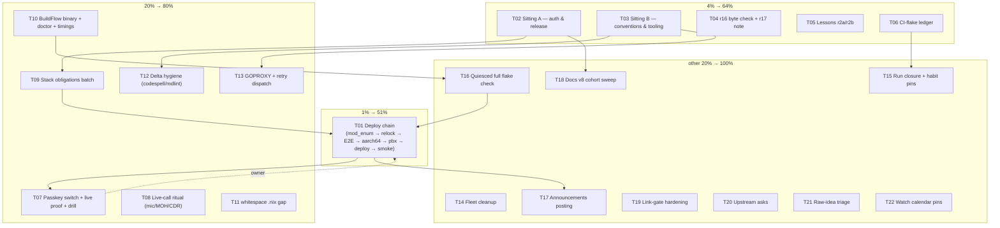

# SUPERB Round-5 Pareto Execution Plan — the post-v7 state (2026-10-06 23:47 CEST)

**Source of truth:** `TODO_LIST.md` (17 open rows incl. the docs-health v7
fold) + `ROADMAP.md` open questions + the v7 self-review §f. This plan is a
point-in-time snapshot — annotate, never rewrite. Every task maps to a TODO
row or a routed residual; no new homes invented (TODO_LIST stays the living
source).
**Format note:** the pareto-planning skill's house style is a styled HTML
report; the owner explicitly ordered an `.md` file with a mermaid execution
graph — owner instruction wins, divergence flagged here per house rule.

## The goal function

Deployed user value + unblocked decisions + a repo that does not rot.
Nothing since v2.8.0 (passkey mode, session hardening, thread
organization, typography, island fixes — two weeks of trains) has
reached a user. That fact orders everything below.

## Pareto breakdown

### The 1% that delivers 51% — THE DEPLOY CHAIN

`mod_enum` repair → stack relock to webphone `main` → stack gates
(browser E2E ×1) → aarch64 → pbx-artmann relock → owner deploy command
→ `webphone-smoke.py --base https://pbx.artmann.tech --expect-version`.
One chain converts ~15 days of merged work into customer value AND
closes the served-markup E2E obligation (cascade-fix + passkey-tail
trains) AND exercises the honest-Content-Type lane in prod. **T01.**

### The 4% that delivers 64% — SITTINGS + S-EXECUTIONS

Add: **T02/T03 THE SITTING** (38 briefing rows gate the 4 plan archives,
auth postures, release cadence, tooling postures — every downstream
"decide" task waits on it) and the **three S-executions** the v7
self-review flagged as routable-but-runnable: r16 greppable-class byte
check, the two lessons stories, the CI-flake ledger (**T04–T06**, ~105
min total, closes open honesty/verification loops).

### The 20% that delivers 80% — LIVE PROOFS + STACK BATCH + TOOLING TAIL

Add: **T07** passkey owner switch + live ceremony + fail-closed drill
(the open deploy-risk item); **T08** the live-call ritual (mic pre-warm
+ MOH + `/recordings/` + CDR — retires ~5 routed items); **T09** the
stack obligations batch (paperless module option, WebTransport verdict
doc, runbook/deploy.md patches, gateway bits); **T10–T13** the
gate-recovery tooling tail (BuildFlow binary + doctor gate + timings,
whitespace `.nix` gap, delta hygiene, GOPROXY/retry dispatch).

### The other 20% (to reach 100%) — LONG-TAIL HYGIENE

**T14–T22:** fleet cleanups (wedged-go audit, /tmp, gopls), run-closure
+ habit pins, quiesced-host full flake check, announcements posting,
the 2026-10 cohort docs sweep + TODO row split, link-gate hardening,
upstream asks, raw-idea triage, watch calendar pins.

## Comprehensive plan (30–100 min tasks; sorted by importance / impact / effort / customer value)

| #  | Task | Delivers | Impact | Effort | Customer value | Source |
| -- | ---- | -------- | ------ | ------ | -------------- | ------ |
| T01 | Execute the deploy chain (mod_enum → relock → E2E → aarch64 → pbx relock → deploy → smoke) | ~15 days of merged trains to users; closes E2E obligation | 10 | 90m | 10 | TODO v2.8.0 deploy tail + cross-repo row |
| T02 | Sitting A — auth & release decisions (38-row briefing part 1: gated plans, passkey postures, v2.9.0 fold, numbering) | Unblocks 15+ gated decisions | 9 | 60m | 6 | TODO OWNER-calls row |
| T03 | Sitting B — conventions & tooling postures (rows 33–38, markdownlint, dedup baseline, D1–D5 autonomy) | Unblocks convention-class decisions | 8 | 45m | 4 | TODO OWNER-calls + tooling rows |
| T04 | r16 greppable-class byte check + r17 DOM-contract reasoning note | Closes the v1.20.1 verification loop | 6 | 30m | 3 | TODO gate-recovery remainder |
| T05 | Lessons stories r2a (outage timeline) + r2b (h1 ≠ sha256 oracle) | Converts outage knowledge into durable memory | 6 | 45m | 2 | TODO gate-recovery remainder |
| T06 | CI-flake ledger (format + 3 seed entries + wiring) | Flake history becomes data, not folklore | 5 | 30m | 2 | TODO gate-recovery remainder |
| T07 | Passkey owner switch + live ceremony proof + fail-closed password-file drill | Proves the headline 2.9 feature live; retires the top auth risk | 9 | 60m | 8 | TODO passkey tail |
| T08 | Live-call ritual: mic pre-warm accept→speak, indicator-at-ring, warm release, MOH + `/recordings/` + CDR check | Proves core call UX live; retires ~5 routed items | 7 | 60m | 7 | TODO mic row + cross-repo row |
| T09 | Stack obligations batch: `services.webphone.paperless` option + smoke arm, WebTransport verdict doc, deploy.md PATH column, ops-runbook demo recipe, `ftypqt`/MMS-outbound/FEATURES:87 | Closes the cross-repo debt in one session | 7 | 90m | 5 | TODO cross-repo row |
| T10 | BuildFlow tooling: rebuild stale binary + doctor gate in runbook prelude + timings rebaseline | Verdicts trustworthy again; gate drift caught | 6 | 60m | 2 | TODO gate-recovery remainder |
| T11 | whitespace-drift `.nix` gap: cover or document + scratch-repo self-test | Kills the e62fe34 class for Nix files | 5 | 30m | 1 | TODO gate-recovery remainder |
| T12 | Session-delta hygiene: codespell + markdownlint over v7 docs; fix real hits | The sweep's own e4 debt paid | 4 | 30m | 1 | v7 self-review e4 |
| T13 | GOPROXY fallback chain + BuildFlow retry-wrapper dispatch (post-g1 verdict) | Fleet outage class prevented | 6 | 45m | 3 | TODO gate-recovery + 23:22 g1 |
| T14 | Fleet cleanup: wedged-go audit, /tmp probe-artifact prune, gopls workspace close | Host health; flock-waiter class visible | 4 | 30m | 1 | TODO gate-recovery remainder |
| T15 | Run-37496169265 closure + kill-builtin empirical verify + `git ls-remote` habit pin | Honest CI history; the sweep-close gate institutionalized | 3 | 30m | 1 | TODO gate-recovery + v7 e5 |
| T16 | Quiesced-host full `nix flake check` (incl. KVM backup leg) | The un-run local full gate since the dep train | 6 | 90m | 2 | TODO gate-recovery remainder |
| T17 | Announcements: owner picks channel + draft, approves wording/disclosure, posts | Public presence for 2.1→2.8 story | 5 | 30m | 5 | TODO announcements row |
| T18 | Docs-health v8: 2026-10 cohort sweep + gate-recovery row split | Corpus stays honest; decoder-ring row dissolved | 5 | 90m | 1 | v7 self-review f22/f23 |
| T19 | Link-gate extension (all living docs) + pre-mv citation grep as a named gate step | v6's broken-link class becomes impossible | 4 | 30m | 1 | v7 self-review e1/f20 |
| T20 | Upstream asks: templ-components errorpage tagging discipline + go-cqrs-lite release-tooling audit | Poisoned-version class prevented upstream | 3 | 45m | 1 | TODO gate-recovery remainder |
| T21 | Raw-idea triage: paperless follow-ups, mic extras, typography extras; god-package carve trigger check | Backlog stays intentional, not ambient | 3 | 30m | 2 | ROADMAP clusters |
| T22 | Watch calendar pins: erraudit 2026-11-05, quarterly 2026-12-20, sessions re-review 2026-12-30, QMD subscribe | Time-based obligations become calendar facts | 2 | 30m | 1 | TODO Standing watches |

**22 tasks · ~16.5 h total · T01–T03 are the Pareto core (~3.25 h).**

## Detailed breakdown (≤12 min micro-tasks; grouped by task, priority-ordered)

| # | Micro-task | Est | Task |
| - | ---------- | --- | ---- |
| M01 | Verify webphone `main` green (CI verdict) + `ls-remote` end-state + pick the target rev | 10m | T01 |
| M02 | Stack: repair/verify the FreeSWITCH `mod_enum` build | 12m | T01 |
| M03 | Stack: relock the webphone input to the target rev | 8m | T01 |
| M04 | Stack: `nix flake check` + browser E2E ×1; record wall-time vs 445s budget | 12m | T01 |
| M05 | aarch64 cross-build; verify by ELF machine bytes | 10m | T01 |
| M06 | pbx-artmann: relock + gates + staged activation | 12m | T01 |
| M07 | Owner deploy command run + journal watch | 12m | T01 |
| M08 | Post-deploy smoke `--base https://pbx.artmann.tech --expect-version <V>` | 10m | T01 |
| M09 | Record closure: TODO rows, CHANGELOG, E2E obligation checkbox | 10m | T01 |
| M10 | Pre-sitting digest: one-page auth/release row summary for the owner | 12m | T02 |
| M11 | Ratify the 4 gated plans → archive-or-keep decision per plan | 12m | T02 |
| M12 | v2.9.0 fold decision + release numbering + bridge ">=2.8" claims | 10m | T02 |
| M13 | Passkey postures: rows 1.6/35/36, enroll runbook-only, Lars-only v1 mapping | 12m | T02 |
| M14 | Record verdicts → briefing closed-since + TODO deletions | 12m | T02 |
| M15 | Conventions: rows 33/34/38 + push-lag threshold + session-phase pushes | 12m | T03 |
| M16 | Tooling postures: markdownlint row 18 + devShells/lychee row 37 | 12m | T03 |
| M17 | Dedup ratification: `-t 3` baseline + suppression scope + registry home | 12m | T03 |
| M18 | Remaining semantics batch: D1–D5 autonomy, helper micro-test bar, missed-call/`?q=`/`Must*` | 12m | T03 |
| M19 | Grep served thread/transcript payloads for `wp-thread-row`/`wp-bubble` on the v1.20.1 tree; record | 12m | T04 |
| M20 | Write the DOM-contract v1.20.1 coverage-reasoning note (dom-contract.md § notes) | 10m | T04 |
| M21 | Lessons r2a draft: the 15:58 wedge → recovery timeline | 12m | T05 |
| M22 | Lessons r2a: verify every claim against the 22:08 report; finalize | 10m | T05 |
| M23 | Lessons r2b draft: `/go.mod` h1 ≠ sha256 oracle story | 12m | T05 |
| M24 | Lessons r2b: verify + cross-link the AGENTS vendorHash rule | 8m | T05 |
| M25 | Design the CI-flake ledger shape (file/test/date/run-id/verdict) | 10m | T06 |
| M26 | Create the ledger + seed runs 37496169265, 37524833682, tonight's session | 12m | T06 |
| M27 | Wire references: TODO tooling row + AGENTS pointer | 8m | T06 |
| M28 | Owner-switch prep checklist + rotate `/tmp/pbx-toplevel-current` | 10m | T07 |
| M29 | Flip `auth.passkey.*` in the stack config (owner terminal) | 10m | T07 |
| M30 | Live browser enroll + login ceremony on prod; record screenshots | 12m | T07 |
| M31 | Fail-closed drill: empty password file → verify Rejection + event log | 12m | T07 |
| M32 | Record the fresh diff-closures baseline + close the TODO row | 10m | T07 |
| M33 | Live check: accept→speak sub-second + mic indicator at ring | 12m | T08 |
| M34 | Live check: warm release on reject/missed paths | 10m | T08 |
| M35 | Live check: MOH audibility + `/recordings/` listing + CDR rows | 12m | T08 |
| M36 | Record ritual results; retire the routed mic/cross-repo items | 10m | T08 |
| M37 | Stack: `services.webphone.paperless` module option + wiring | 12m | T09 |
| M38 | Stack: paperless smoke arm | 12m | T09 |
| M39 | WebTransport NOT-ADOPTED verdict doc (stack repo) | 12m | T09 |
| M40 | `deploy.md` secret PATH column | 10m | T09 |
| M41 | Ops-runbook demo-call recipe + `/var/lib/telephony-secrets/` path | 12m | T09 |
| M42 | `ftypqt` sniff fix + E2E MMS-outbound + pbx FEATURES:87 text | 12m | T09 |
| M43 | Stack relock/push ritual for the batch | 12m | T09 |
| M44 | Rebuild the BuildFlow binary in its repo + reinstall | 12m | T10 |
| M45 | Release-runbook prelude: standing `buildflow doctor` gate line | 10m | T10 |
| M46 | `buildflow timings --regressions` rebaseline on the quiesced host | 12m | T10 |
| M47 | Verify tool warnings shrank (4 devshell legs gone post-row-37) | 8m | T10 |
| M48 | whitespace-drift.sh: cover `.nix` or document the exclusion | 12m | T11 |
| M49 | Scratch-repo self-test: whitespace-only `.nix` edit exits 1 | 12m | T11 |
| M50 | codespell over the v7 delta (both reports + edits) | 8m | T12 |
| M51 | markdownlint baseline over the two new v7 docs; record posture | 12m | T12 |
| M52 | Fix real typo hits (if any) | 10m | T12 |
| M53 | crush-config: GOPROXY fallback chain config/PR | 12m | T13 |
| M54 | BuildFlow: retry-or-kill wrapper issue/PR for network go steps | 12m | T13 |
| M55 | `--fail-on`/retry policy note + fleet rollout record | 10m | T13 |
| M56 | Fleet wedged-go audit (flock-waiter scan across machines) | 12m | T14 |
| M57 | Prune stale /tmp probe artifacts (trash, not rm) | 8m | T14 |
| M58 | Close stale gopls editor workspaces | 10m | T14 |
| M59 | Characterize or close run 37496169265 (flake window note) | 12m | T15 |
| M60 | kill-builtin empirical verify at the next natural kill (python one-liner) | 5m | T15 |
| M61 | `git ls-remote` end-state verify + pin the habit in the runbook close | 8m | T15 |
| M62 | Pre-check host quiescence + flock convention | 8m | T16 |
| M63 | `nix flake check` run leg 1 (package + sandbox tests) | 12m | T16 |
| M64 | `nix flake check` verdict + KVM backup-leg confirmation | 12m | T16 |
| M65 | Announcements: owner picks channels + draft variant | 10m | T17 |
| M66 | Approve wording + disclosure posture (fix-acknowledged, no exploit detail) | 10m | T17 |
| M67 | Post + record links; close the TODO row | 10m | T17 |
| M68 | Docs v8: read the 2026-10 status cohort (candidates) | 12m | T18 |
| M69 | Docs v8: read the 2026-10 planning cohort | 12m | T18 |
| M70 | Docs v8: annotate + archive the closed files (pipeline per house form) | 12m | T18 |
| M71 | Docs v8: gates (completeness/link/check-rows) + manifest + report | 12m | T18 |
| M72 | Split the gate-recovery TODO row into named sub-bullets | 12m | T18 |
| M73 | Extend the link-existence loop to ALL living docs/*.md | 12m | T19 |
| M74 | Add the pre-mv citation grep as a named gate step (runbook/skill-side note) | 10m | T19 |
| M75 | templ-components: errorpage tagging-discipline upstream issue | 12m | T20 |
| M76 | go-cqrs-lite: release-tooling audit (non-/v4 requires) | 12m | T20 |
| M77 | Record upstream asks + watch entries | 10m | T20 |
| M78 | Paperless follow-ups pick/park decision prep (one-page) | 10m | T21 |
| M79 | Mic + typography extras triage (pick/park with dates) | 10m | T21 |
| M80 | God-package carve trigger check (any NEW file in internal/server since 10-05?) | 10m | T21 |
| M81 | Calendar pins: erraudit 11-05, quarterly 12-20, sessions re-review 12-30 | 8m | T22 |
| M82 | QMD subscribe: owner `gh auth refresh -s notifications` + mutation | 10m | T22 |
| M83 | Verify Standing-watches wording matches the pins | 6m | T22 |
**83 micro-tasks · every task covered · max 12 min each.**

## Execution graph

Dashed = owner-terminal dependency; solid = hard ordering. T16 and T09
feed T01 (gates + stack bits should land before the release chain
re-runs); T01 unlocks the live proofs and the public announcements.

## Guards

- **No verschlimmbesserung:** every task leaves the repo verifiably no
  worse (gates before/after; annotate-never-rewrite on snapshots).
- Plans go stale: when this plan is superseded, docs-health ANNOTATE
  resolves it — never rewrite.
- No new homes: any task that surfaces genuinely NEW work adds it to
  TODO_LIST, not only here.

_Point-in-time snapshot. The auto-commit daemon owns commits and
pushes; this plan's own commit is the session's narrative boundary._
