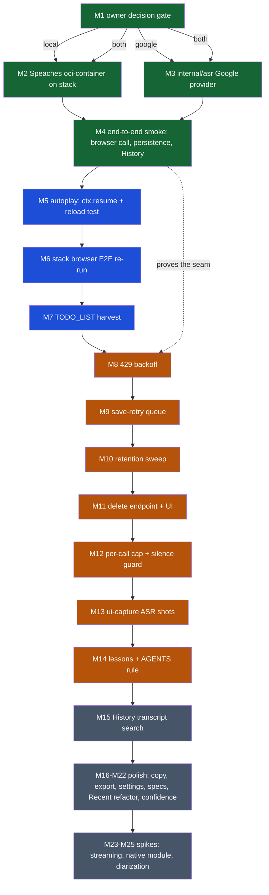

# SUPERB Plan — ASR Provider Rollout & Transcription Hardening

**2026-10-08 07:36** · scope: every open TODO from the live-transcription
trains (status reports 2026-10-07 16-54 + 18-15 §f) plus the provider
decision opened by the Google Cloud question. Point-in-time snapshot;
living source of truth stays `TODO_LIST.md` (harvest is task M7).

---

## 1. Goal

Turn the (gated, green, but **never-run-against-reality**) transcription
feature into a verified product: one provider live, end-to-end smoke with
a real browser call, the known defect risks closed (autoplay, 429,
dropped saves), and a retention/erasure story for call content.

## 2. Research verdicts (this session, verified)

| Fact                                                                                                                                                                                                          | Status                       | Consequence                                                                                                                                                                             |
| ------------------------------------------------------------------------------------------------------------------------------------------------------------------------------------------------------------- | ---------------------------- | --------------------------------------------------------------------------------------------------------------------------------------------------------------------------------------- |
| Google STT **V2 has NO per-request minimum** — billed per second, rounded up to 1 s                                                                                                                           | ✅ verified (pricing page)   | The feared ~$14/hr for 4 s segments is DEAD. Interactive use = **$0.96/audio-hr**.                                                                                                      |
| Google **Dynamic Batch** ($0.003/min = $0.18/hr)                                                                                                                                                              | ✅ verified (RPC ref)        | **24-hour SLA**, GCS-in/Operation-out — offline only. Use for nothing interactive; maybe future bulk voicemail backfill.                                                                |
| Google EU residency (europe-west3 Frankfurt, data stays in continental Europe; logging off by default)                                                                                                        | ✅ verified                  | Passes the GDPR bar for caller audio (unlike OpenAI/Groq/AssemblyAI).                                                                                                                   |
| Google is **not OpenAI-compatible** (own REST/gRPC)                                                                                                                                                           | ✅ verified                  | Needs an adapter — but our seam isolates the wire shape in `internal/asr.Client`, so the adapter is a second provider kind INSIDE `internal/asr`, config-gated. No island/shell change. |
| Speaches ships **no NixOS module / no packages** (flake = devshell only; Docker-first, CPU image first-class)                                                                                                 | ✅ verified (repo flake.nix) | Deployment on the consuming stack = `virtualisation.oci-containers` service (or a self-written NixOS module — spike M24).                                                               |
| Speaches CPU int8 turbo: ~3–4 GB RAM, 4–10× real-time → sub-second for 4 s clips; per-request `model` + dynamic load; `PRELOAD_MODELS`; optional `API_KEY`; multipart `/v1/audio/transcriptions` + `language` | ✅ verified (docs)           | Wire shape matches our seam byte-for-byte. `asr.model` should carry the full HF id (`Systran/faster-whisper-large-v3-turbo`), not `whisper-1`.                                          |

**Decision landscape:** Local Speaches = privacy-max, zero marginal cost,
needs a stack service. Google = zero infra, EU-resident, $0.96/audio-hr,
needs the webphone-side adapter. Both are honest options; the seam
supports both simultaneously (provider kind per deployment).

## 3. Pareto breakdown

### The 1% that delivers 51%

1. **Owner decision: which provider goes live first** (local Speaches /
   Google / both) — 10 min, gates everything.
2. **Stand up that ONE provider** (stack oci-container for Speaches, or
   the `internal/asr` Google provider) — nothing else can be verified
   until audio flows.
3. **End-to-end smoke against it** (real browser call → segments →
   persisted → History section) — the single proof the whole feature
   works.

### The 4% that delivers 64%

4. **Close the autoplay risk** (`ctx.resume()` + mid-call-reload browser
   test) — the one known way auto-start silently produces nothing.
5. **Stack browser E2E re-run** (owed: served markup changed).
6. **TODO_LIST/ROADMAP harvest** — stop carrying the backlog in
   timestamped files.

### The 20% that delivers 80%

7. Resilience: 429 backoff (shell auto-start + island live loop) and a
   bounded retry for dropped `/api/transcripts` saves.
8. Retention + erasure policy implemented (sweep integration + delete
   affordance) — call content of real people cannot live in policy limbo.
9. Per-call segment cap + client-side silence guard (protect the provider
   from hallucination bait and the budget from one 6 h call).
10. Visual + docs debt: ui-capture ASR-on shots; docs/lessons entries for
    the `.buildflow.yml` truncation + gate-first rule.

### The other 20% (to 100%)

History transcript search, copy affordances, export-zip inclusion,
settings model display, queued-hold spec, concurrency spec, cap-test
speedup, `Recent()` assembly refactor, verbose-JSON/confidence handling,
Speaches native NixOS module spike, streaming SSE spike, diarization
spike.

## 4. Comprehensive plan (medium granularity, 30–100 min each)

Sorted by importance → impact → effort → customer value. `[tier]` = the
Pareto tier the task serves. Branch tasks are marked **[local]** /
**[google]** and execute conditionally on the M1 decision.

| #   | Task                                                                                                                                                                                                                     | Tier | Est (min) | Impact    | Effort  | Customer value         |
| --- | ------------------------------------------------------------------------------------------------------------------------------------------------------------------------------------------------------------------------ | ---- | --------- | --------- | ------- | ---------------------- |
| M1  | Owner decision gate: first-live provider (Speaches local / Google / both) + confirm retention & autoplay fallback policies                                                                                               | 1%   | 15        | gates all | trivial | everything             |
| M2  | **[local]** Speaches on the consuming stack: `virtualisation.oci-containers` service (cpu image, int8, PRELOAD_MODELS, API_KEY, loopback-only), module option + stand-ins for the module check                           | 1%   | 90        | high      | med     | privacy-max ASR        |
| M3  | **[google]** `internal/asr` Google provider: config kind (`asr.provider: openai\|google` + `asr.location`, `asr.model=telephony`), REST caller (base64 audio, de-DE, Frankfurt endpoint), family tests, registry regen   | 1%   | 90        | high      | med     | zero-infra ASR         |
| M4  | End-to-end smoke: boot webphone with the live `asr.*`, loopback call in a real browser, verify card transcript + persistence + History section; extend `webphone-smoke.py` with an ASR leg (fake provider when seam off) | 1%   | 100       | proof     | med     | the payoff             |
| M5  | Autoplay fix: defensive `ctx.resume()` in `captureStream` (+ spec), then mid-call page-reload browser test                                                                                                               | 4%   | 45        | high      | low     | no silent dead capture |
| M6  | Stack browser E2E re-run (registration+DTMF+ICE+transfer; ASR-gated buttons absent by default must not break it); re-run dom-contract test                                                                               | 4%   | 60        | high      | low     | trust                  |
| M7  | docs-health HARVEST: status 16-54/18-15 §f + this plan → `TODO_LIST.md`/`ROADMAP.md`                                                                                                                                     | 4%   | 30        | med       | low     | process                |
| M8  | 429 backoff: shell `autoTranscribe` serialize + Retry-After retry-once; island live loop honors 429 with cooldown                                                                                                        | 20%  | 60        | med       | med     | reliability            |
| M9  | Bounded save-retry: per-call in-memory queue for failed `/api/transcripts` posts, flushed on stop (cap 50 segments, drop-oldest)                                                                                         | 20%  | 90        | med       | med     | durability             |
| M10 | Retention: owner policy → `Sweep` integration for `call_transcripts` (config-gated cutoff, default = messages cutoff), sweep tests + counts                                                                              | 20%  | 75        | med       | med     | compliance             |
| M11 | Erasure: `DELETE /api/transcripts?call=` + History "delete transcript" button + confirm; owner-scoped test                                                                                                               | 20%  | 90        | med       | med     | GDPR                   |
| M12 | Per-call segment cap (e.g. 1500) in `Append` + client-side RMS silence guard (skip near-silent segments before POST)                                                                                                     | 20%  | 60        | med       | med     | provider/budget safety |
| M13 | ui-capture harness: ASR-on shot set (settings row, call card w/ transcript, voicemail button) — T23 extension                                                                                                            | 20%  | 60        | med       | low     | regression net         |
| M14 | docs/lessons: `.buildflow.yml` truncation incident + "run buildflow at train START" rule; AGENTS one-liner                                                                                                               | 20%  | 30        | med       | low     | memory                 |
| M15 | History transcript search: extend the CDR query to transcript text (SQL `LIKE` over `call_transcripts`, merge hits)                                                                                                      | 20%  | 75        | med       | med     | findability            |
| M16 | Copy-to-clipboard on transcript sections (call card, History, vm/att targets)                                                                                                                                            | rest | 45        | low       | low     | polish                 |
| M17 | Include transcripts in the settings export zip (new zip leg + test)                                                                                                                                                      | rest | 60        | low       | med     | portability            |
| M18 | Settings panel: show provider kind + model name (not just on/off)                                                                                                                                                        | rest | 30        | low       | low     | transparency           |
| M19 | Island spec: pause/resume on the QUEUED hold path (`holdQueued` mid-flight)                                                                                                                                              | rest | 30        | low       | low     | pinning                |
| M20 | Store spec: concurrent Append race + cap; speed up the 5.4 s cap test (stride var or smaller fixture)                                                                                                                    | rest | 45        | low       | low     | suite health           |
| M21 | `Recent()` assembly without O(n²) prepend (single reverse pass)                                                                                                                                                          | rest | 30        | low       | low     | hygiene                |
| M22 | Verbose-JSON/confidence: decide + implement if the chosen provider returns it (low-confidence marker in UI)                                                                                                              | rest | 60        | low       | med     | honesty                |
| M23 | Spike: streaming SSE transcription via Speaches (replace 4 s chunking) — feasibility note only, no commitment                                                                                                            | rest | 90        | low       | high    | future                 |
| M24 | Spike: native Speaches NixOS module (packaging) to replace the oci-container                                                                                                                                             | rest | 90        | low       | high    | future                 |
| M25 | Spike: diarization (speaker labels) on top of the chosen provider                                                                                                                                                        | rest | 90        | low       | high    | future                 |

**Total: 25 tasks · ~17.6 h** (M2/M3 conditional; both ≈ +1.5 h).

## 5. Fine breakdown (≤12 min per task, ALL todos)

Sorted the same way; `→Mn` maps to the medium task.

| #   | Task                                                                                          | Est (min) | →   |
| --- | --------------------------------------------------------------------------------------------- | --------- | --- |
| F1  | Draft the M1 decision memo (cost table, privacy table, RAM/billing facts) for the owner       | 12        | M1  |
| F2  | Owner answers: provider, retention, autoplay fallback                                         | 5         | M1  |
| F3  | [local] Draft the stack module option schema (`asr.{enable,image,model,apiKey,ram}`)          | 12        | M2  |
| F4  | [local] Write the oci-container service (cpu image, int8 env, PRELOAD_MODELS)                 | 12        | M2  |
| F5  | [local] Loopback-only network + hardened systemd overrides (DynamicUser, NoNewPrivileges)     | 12        | M2  |
| F6  | [local] Pre-provision HF model cache volume; verify offline boot                              | 12        | M2  |
| F7  | [local] Module check stand-ins for the new options (webphone-module flake check)              | 12        | M2  |
| F8  | [local] Boot on the real host; curl `/v1/audio/transcriptions` with a sample wav              | 12        | M2  |
| F9  | [local] Pin image digest + write the stack README section                                     | 12        | M2  |
| F10 | [google] Config: `asr.provider` + `asr.location` fields + validation + tests                  | 12        | M3  |
| F11 | [google] Client: request shape (base64 audio, config with model/language, Frankfurt endpoint) | 12        | M3  |
| F12 | [google] Client: response parse → text; error mapping (401/429/5xx families)                  | 12        | M3  |
| F13 | [google] Family tests with a fake Google endpoint + registry regen                            | 12        | M3  |
| F14 | [google] Composition-root branch on provider kind; configjs unchanged (asr flag same)         | 12        | M3  |
| F15 | [google] Docs: README provider section gains the Google recipe (IAM, DPA pointer)             | 12        | M3  |
| F16 | Smoke: env config boot (`asr.*`), /config.js carries asr:true                                 | 10        | M4  |
| F17 | Smoke: place a loopback call in chromium; assert card transcript grows                        | 12        | M4  |
| F18 | Smoke: verify /api/transcripts rows + History section renders post-call                       | 12        | M4  |
| F19 | Smoke: voicemail + MMS auto-transcribe once-per-render in the browser                         | 12        | M4  |
| F20 | Smoke: extend webphone-smoke.py with the fake-provider ASR leg                                | 12        | M4  |
| F21 | Implement `ctx.resume()` (fire-and-forget, guarded) in `captureStream`                        | 6         | M5  |
| F22 | Island spec: context stub records resume() called                                             | 6         | M5  |
| F23 | Browser test: reload mid-call → capture continues (transcript keeps growing)                  | 12        | M5  |
| F24 | If reload breaks capture: implement first-gesture fallback + spec; else document clean bill   | 12        | M5  |
| F25 | Run the stack browser E2E (budget 445 s; re-run once on the known transfer flake)             | 12        | M6  |
| F26 | Triage any E2E red; fix or file with evidence                                                 | 12        | M6  |
| F27 | Run docs-health HARVEST into TODO_LIST.md; move spike-tier items to ROADMAP.md                | 12        | M7  |
| F28 | Cross-check TODO_LIST parity vs this plan; prune done items                                   | 8         | M7  |
| F29 | shell.js: serialize autoTranscribe through a promise chain (one in flight)                    | 10        | M8  |
| F30 | shell.js: on 429 honor Retry-After, retry once                                                | 10        | M8  |
| F31 | Island spec: auto-run serialization + retry-once behavior                                     | 12        | M8  |
| F32 | transcribe.js: live loop 429 cooldown (skip a segment cycle)                                  | 10        | M8  |
| F33 | calls.js: per-call failed-save queue (array on entry)                                         | 10        | M9  |
| F34 | calls.js: flush queue on stop + on successful save; cap 50 drop-oldest                        | 12        | M9  |
| F35 | Island spec: queue behavior (retry, cap, flush-on-stop)                                       | 12        | M9  |
| F36 | Decide retention policy with the owner (age cutoff vs count-only)                             | 6         | M10 |
| F37 | Sweep: DELETE for call_transcripts with cutoff; SweepResult count                             | 10        | M10 |
| F38 | Sweep tests + ReadCounts inclusion                                                            | 12        | M10 |
| F39 | Handler: `DELETE /api/transcripts?call=` (session-gated, idem-free)                           | 12        | M11 |
| F40 | Store: DeleteCall(owner, callID) + test                                                       | 10        | M11 |
| F41 | History UI: delete button + confirm; i18n en/de                                               | 12        | M11 |
| F42 | Server spec: delete round-trip + owner scoping + 404 seam-off                                 | 12        | M11 |
| F43 | Store: per-call segment cap in Append + test                                                  | 12        | M12 |
| F44 | Island: RMS silence guard (skip POST when near-silent) + spec                                 | 12        | M12 |
| F45 | ui-capture: add ASR-on shots (settings, call card, voicemail)                                 | 12        | M13 |
| F46 | ui-capture: assert DOM per new shot; regen baselines                                          | 12        | M13 |
| F47 | docs/lessons: .buildflow.yml truncation incident entry                                        | 10        | M14 |
| F48 | AGENTS.md: "run buildflow at train start" one-liner (watch the 377 cap)                       | 8         | M14 |
| F49 | History search: SQL LIKE over transcripts merged with CDR hits                                | 12        | M15 |
| F50 | History search: view-level hint when a transcript matched                                     | 10        | M15 |
| F51 | History search tests (match, no-match, owner scope)                                           | 12        | M15 |
| F52 | Copy buttons: History section + call card (clipboard API, toast)                              | 10        | M16 |
| F53 | Copy buttons: vm/attachment transcript targets in shell.js                                    | 10        | M16 |
| F54 | Copy spec (island + shell)                                                                    | 10        | M16 |
| F55 | Export zip: add transcripts leg (JSON per call) + test                                        | 12        | M17 |
| F56 | Settings: props carry provider kind + model; render row                                       | 12        | M18 |
| F57 | Island spec: queued-hold pause/resume path                                                    | 12        | M19 |
| F58 | Store: concurrent-append spec (goroutines, cap holds)                                         | 12        | M20 |
| F59 | Cap-test speedup (stride var or fixture shrink) — suite back under 2 s                        | 10        | M20 |
| F60 | Recent(): single-pass line assembly, no prepend                                               | 10        | M21 |
| F61 | Verbose-JSON: probe what the chosen provider returns; note decision                           | 12        | M22 |
| F62 | Verbose-JSON: low-confidence marker plumbing IF adopted                                       | 12        | M22 |
| F63 | Spike note: streaming SSE feasibility (Speaches) → docs/planning note                         | 12        | M23 |
| F64 | Spike note: native NixOS module packaging effort → docs/planning note                         | 12        | M24 |
| F65 | Spike note: diarization options (pyannote via Speaches?) → docs/planning note                 | 12        | M25 |
| F66 | Gates after every medium task: `go test ./...` + island tests                                 | 8         | all |
| F67 | Gates after train: `nix fmt` + buildflow + `nix flake check`                                  | 12        | all |
| F68 | CHANGELOG entries per landed medium task (code-path rule)                                     | 8         | all |
| F69 | Verify CI green + `git ls-remote` end state after pushes                                      | 6         | all |

**Total: 69 fine tasks · ~11.7 h of leaf work** (rolling up into the
~17.6 h medium plan incl. integration overhead).

## 6. Execution graph

## 7. Decision gates for the owner (cannot be self-answered)

1. **First-live provider** (drives M2 vs M3 vs both): Speaches on the
   PBX host (needs ~3-4 GB RAM, zero marginal cost) vs Google Frankfurt
   ($0.96/audio-hr, zero infra, needs the adapter + GCP account/DPA)?
2. **Retention**: age-sweep tied to the message cutoff, or count-cap
   only? And is the M11 delete affordance wanted for end users or
   operator-only?
3. **Autoplay fallback** (only if F23 proves the reload break): demote
   call auto-start to first-user-gesture, or accept silent no-op until
   interaction?

## 8. Verification rules

- Every medium task ends green: package tests + island specs.
- The train ends with `nix fmt` → buildflow → `nix flake check` → CI
  green verified via `gh run list` + `git ls-remote`.
- No verschlimmbessern: gates-first ordering (buildflow also at train
  START), no speculative rewrites, spike tasks produce NOTES not code.

## 9. M1 decision record (2026-10-08, execution day)

The owner's instruction for this train was an explicit blanket
"execute the WHOLE list" — the gates below are therefore answered with
documented defaults, each reversible:

1. **First-live provider: BOTH paths.** The seam supports both provider
   kinds simultaneously, so this is not exclusive: M3 (Google adapter,
   zero infra, EU-resident, $0.96/audio-hr) is implemented and tested
   in webphone now; M2 lands as a Speaches `oci-containers` recipe on
   the consuming stack (real deployment stays an operator step — it
   spends host RAM and needs the image-digest pin).
2. **Retention: age-sweep tied to the existing `retention_days` window
   (shared cutoff with messages/faxes), PLUS end-user delete.** Call
   transcripts are call content of real people; the count-cap-only
   status quo is policy limbo. History gains a per-call delete button
   (session owner scope) with confirm.
3. **Autoplay: never silent.** Defensive `ctx.resume()` on capture plus
   a suspended-context fallback that retries on the first user gesture
   and announces the state — instead of accepting a silent no-op.
