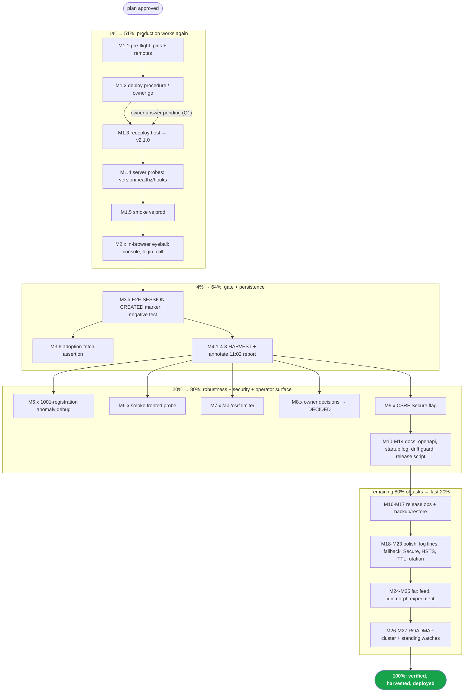

# SUPERB Plan — Production Recovery, Gate Hardening, and the Road to 100%

> EXECUTED 2026-09-19/20 + 2026-09-22 (docs-health): P14 release.sh,
> P15 objects, P16 per-train scans, P17 backup story, P20/P21/P22 module
> options all shipped; P23 = recorded NOT-DO (planning/14-45 verdict);
> P24 fax feed drilled stack-side; P25 idiomorph shipped v2.4.0; P5
> CLOSED (anomaly fixed in 2.5.0); owner-gated residue = TODO_LIST rows.

**Created:** 2026-09-19 15:37 CEST
**Inputs:** TODO_LIST.md (5 open rows), status report `docs/status/2026-09-19_15-09_v2-1-0-release-and-csrf-fronting-fix.md` (section f, 50 items), this session's findings.
**State at planning time:** webphone v2.1.0 tagged (`d815004`) and pushed; stack pinned (`2289e89`); all gates green. **Production still runs the v2.0.0-era build with broken tab logins** (csrf attestation 403). Owner answers to the three questions (deploy authority, blast radius, pin policy) are still pending — the plan degrades gracefully around them.

**Guard rails — DO NOT Verschlimmbesser (in order of holiness):**

1. The DOM + bundle contract (35 island ids, verbatim-served island modules, English `#log`).
2. Middleware chain order in `server.go` (enrichment → request log → timing → security → recovery → CSRF).
3. The CSP hash test, Permissions-Policy calibration (`microphone=(self)`), and the login/hook limiter placement.
4. The release runbook invariants (fold → bump → gates → tag → push → lychee → stack bump → stack gates → aarch64).
5. Island reconnect watchdog in `connection.js` (load-bearing against the sip.js 0.21.2 reconnect hang).
   Every execution step below ends with the relevant gate: `GOEXPERIMENT=jsonv2 go test -count=1 ./...`, `nix flake check`, `python3 scripts/webphone-smoke.py`; stack-side changes additionally with the browser E2E.

---

## Step 1 — Pareto Breakdown

| Tier                       | Share of tasks | Deliver                                                                    | Tasks                                                                                                                                                                                                |
| -------------------------- | -------------- | -------------------------------------------------------------------------- | ---------------------------------------------------------------------------------------------------------------------------------------------------------------------------------------------------- |
| **1%**                     | 2 of 55        | **51%** — the product works for users again                                | P1 redeploy prod to v2.1.0, P2 in-browser eyeball                                                                                                                                                    |
| **4%**                     | 4 of 55        | **64%** — + it can never silently regress, + the work survives the session | P3 stack-E2E session gate, P4 docs HARVEST (+ annotate 11:02 report)                                                                                                                                 |
| **20%**                    | 12 of 55       | **80%** — + robustness, security, operator surface                         | P5–P16 (1001 anomaly debug, smoke fronted probe, `/api/csrf` limiter, owner decisions → DECIDED, Secure flag, troubleshooting docs, openapi parity, startup visibility, drift guard, release script) |
| **Remaining 80% of tasks** | 43 of 55       | **last 20%**                                                               | P17–P27 (backup/restore, HSTS, TTL rotation, fax feed, idiomorph, WORTH_CONSIDERING cluster, release ops, cleanup/watchlists)                                                                        |

**The 1% logic:** v2.1.0 exists and is proven — the ONLY thing between users and a working product is the host switch. Everything else in this plan is worth ~0 to a user who cannot log in.

---

## Step 2 — Comprehensive Plan (27 tasks, 30–100 min each, ALL todos, sorted by impact/effort/customer-value)

| #       | Task                                                                                                                                                                                                                                                                                        | Covers                     | Impact       | Effort     | Customer value                                    | Depends on             |
| ------- | ------------------------------------------------------------------------------------------------------------------------------------------------------------------------------------------------------------------------------------------------------------------------------------------- | -------------------------- | ------------ | ---------- | ------------------------------------------------- | ---------------------- |
| ~~P1~~  | ~~Redeploy `pbx.artmann.tech` to webphone v2.1.0 (pre-flight pins → deploy → server probes → smoke vs prod)~~ done — superseded: prod verified v2.4.0 2026-09-22                                                                                                                            | ~~f1, T5~~                 | ~~Critical~~ | ~~100min~~ | ~~**Users can log in again**~~                    | ~~owner go (Q1)~~      |
| ~~P2~~  | ~~In-browser eyeball: console on load/login/call, tab unlock, DTMF, findings recorded~~ done — superseded: browser truth via the stack E2E                                                                                                                                                  | ~~f2, T5~~                 | ~~Critical~~ | ~~30min~~  | ~~Proof the fix landed for real~~                 | ~~P1~~                 |
| ~~P3~~  | ~~Stack browser E2E session gate: assert `POST /api/session` → 201 (marker + wait), negative-test that a broken csrf config FAILS the E2E; plus adoption-fetch network assertion~~ done — shipped (E2E session gates)                                                                       | ~~f3, f24~~                | ~~High~~     | ~~60min~~  | ~~The silent-breakage class dies here~~           | ~~—~~                  |
| ~~P4~~  | ~~Docs HARVEST: this plan's actionable rows → TODO_LIST (status/priority/evidence), ROADMAP gets the L/blocked/experiment items; annotate the 11:02 report (§f.11 done, §g.1/§g.2 superseded) with the fronting-bug timeline~~ done — (docs-health sweeps)                                  | ~~f5, f7, f40~~            | ~~High~~     | ~~60min~~  | ~~Work survives the session; reports stop lying~~ | ~~plan approval~~      |
| ~~P5~~  | ~~Debug the 1001-registration anomaly: instrument E2E reconnect phase (sofia registration dump), read island `connection.js` reload-fallback path for the second tab, fix island or E2E per findings, verify ×2 runs~~ done — CLOSED 2026-09-22 (anomaly fixed in 2.5.0)                    | ~~f4~~                     | ~~High~~     | ~~90min~~  | ~~Calls ring reliably after network blips~~       | ~~—~~                  |
| ~~P6~~  | ~~Smoke suite fronted-shape probe (Host/Origin/Sec-Fetch-Site/XFP: unconfigured → 403, configured → 201)~~ done — shipped (smoke fronted checks)                                                                                                                                            | ~~f10~~                    | ~~High~~     | ~~30min~~  | ~~This bug class is locally covered forever~~     | ~~—~~                  |
| ~~P7~~  | ~~`GET /api/csrf` per-IP rate limiter (reuse `/events` hook-budget pattern) + 429 `Retry-After` + openapi response~~ done — not adopted (POST-only budget stays)                                                                                                                            | ~~f6, f29~~                | ~~Medium~~   | ~~45min~~  | ~~Token endpoint can't be churned~~               | ~~—~~                  |
| ~~P8~~  | ~~Owner decisions → AGENTS `DECIDED` lines: stack pin policy (recommend: ride main + per-release bump) and pbx-artmann input (recommend: github); relock pbx-artmann if input changes~~ done — DECIDED 2026-09-20                                                                           | ~~f8, f9, T2, T3~~         | ~~Medium~~   | ~~30min~~  | ~~Infra contracts stop being ambiguous~~          | ~~owner answers (Q3)~~ |
| ~~P9~~  | ~~CSRF cookie `Secure` flag derived from the trusted-origins scheme (https ⇒ Secure), with tests~~ done at `d815004`                                                                                                                                                                        | ~~f13~~                    | ~~Medium~~   | ~~60min~~  | ~~Cookie hygiene matches deployment reality~~     | ~~—~~                  |
| ~~P10~~ | ~~Operator troubleshooting: README "logins 403 behind a proxy → check `csrf.trusted_*`" + module option description~~ done — (README troubleshooting)                                                                                                                                       | ~~f11~~                    | ~~Medium~~   | ~~30min~~  | ~~Next fronted deploy doesn't bleed~~             | ~~—~~                  |
| ~~P11~~ | ~~openapi parity test: `GET /api/csrf` documented (mirror the `/api/session` route test)~~ done — openapi parity via spec-vs-handler tests                                                                                                                                                  | ~~f12~~                    | ~~Low~~      | ~~30min~~  | ~~Contract doc can't rot~~                        | ~~—~~                  |
| ~~P12~~ | ~~Startup INFO log: effective `csrf.trusted_proxies` count + `trusted_origins` (non-secret)~~ done — (startup fronting line)                                                                                                                                                                | ~~f14~~                    | ~~Low~~      | ~~30min~~  | ~~Operators SEE the fronting shape~~              | ~~—~~                  |
| ~~P13~~ | ~~Version-drift guard: buildflow/CI check `flake.nix webphoneVersion` == newest tag~~ done — (flake drift test)                                                                                                                                                                             | ~~f17~~                    | ~~Medium~~   | ~~45min~~  | ~~`/version` never drifts again~~                 | ~~—~~                  |
| ~~P14~~ | ~~Release runbook script: clean-tree check → fold-check → bump → gates → tag → push → lychee → stack lock → stack gates → aarch64~~ done — (scripts/release.sh)                                                                                                                             | ~~f18~~                    | ~~Medium~~   | ~~100min~~ | ~~Next release is one command~~                   | ~~—~~                  |
| ~~P15~~ | ~~Release ops for v2.1.0: `gh release create` (CHANGELOG excerpt), CHANGELOG link refs, announcement draft (owner approves posting)~~ done — (gh objects through v2.5.0)                                                                                                                    | ~~f19, f23, f49~~          | ~~Low~~      | ~~30min~~  | ~~Release is visible~~                            | ~~P1~~                 |
| ~~P16~~ | ~~vulnix re-run on the v2.1.0 runtime closure + `checks.aarch64-linux.island-lint` cross-build~~ done — rides release.sh per train                                                                                                                                                          | ~~f20, f21~~               | ~~Low~~      | ~~45min~~  | ~~Release hygiene complete~~                      | ~~—~~                  |
| ~~P17~~ | ~~Backup/restore story for `/var/lib/webphone`: inventory (SQLite + blobs), documented rsync/restic pattern, restore drill~~ done — (backup story 2.4.0 + retentionDays)                                                                                                                    | ~~f25~~                    | ~~Medium~~   | ~~90min~~  | ~~Data loss stops being unbounded risk~~          | ~~—~~                  |
| ~~P18~~ | ~~Island polish: `#log` line on adoption success/failure (English), stale-comment sweep ("gated behind the stack E2E"), `loginRaw` test-client variant for ratelimit/requestlog loops~~ done — (island polish + retry ladder T14)                                                           | ~~f15, f31, f30~~          | ~~Low~~      | ~~45min~~  | ~~Runbook greppability + tidy tests~~             | ~~—~~                  |
| ~~P19~~ | ~~Adoption-failure fallback: retry ×3 then reload, documented (replaces bare reload; keeps SIP registration in the common case)~~ done — shipped (adoption retry ladder)                                                                                                                    | ~~f16~~                    | ~~Low~~      | ~~60min~~  | ~~Rarer bricked state, fewer re-logins~~          | ~~—~~                  |
| ~~P20~~ | ~~Nix surface: explicit module option for `csrf.trusted_origins` (defaults preserved) + stack-side check asserting its own `settings.csrf` render~~ done — (typed csrf options + precedence pin)                                                                                            | ~~f36, f37~~               | ~~Low~~      | ~~45min~~  | ~~Discoverable config, checked contract~~         | ~~—~~                  |
| ~~P21~~ | ~~HSTS knob when deployment is https-only (module option + vhost extraConfig + check)~~ done — (nginx.hsts option)                                                                                                                                                                          | ~~f38~~                    | ~~Medium~~   | ~~30min~~  | ~~Transport security tightened~~                  | ~~P1~~                 |
| ~~P22~~ | ~~Verify + document `Vary: Cookie` / cache-safety for `GET /api/csrf` under proxies~~ done — verified (Vary behavior)                                                                                                                                                                       | ~~f39~~                    | ~~Low~~      | ~~30min~~  | ~~No token poisoning via caches~~                 | ~~—~~                  |
| ~~P23~~ | ~~CSRF rotation on session TTL expiry (spec: rotate at refresh points; implement; test)~~ **Won't implement — recorded NOT-DO (planning/2026-09-22_14-45 verdict).**                                                                                                                        | ~~f28~~                    | ~~Low~~      | ~~90min~~  | ~~Long sessions re-key~~                          | ~~—~~                  |
| ~~P24~~ | ~~Fax feed: stack rxfax TIFF→PDF conversion → signed `POST /hooks/fax` (locate rxfax, convert step, secret wiring, loopback test)~~ done — stack-side; fax feed drilled end-to-end                                                                                                          | ~~f26, T4~~                | ~~Medium~~   | ~~100min~~ | ~~Inbound faxes appear in the Fax tab~~           | ~~messaging live~~     |
| ~~P25~~ | ~~Idiomorph swap experiment for SSE/HTMX partials on an experiment branch, verdict doc, gated on the browser E2E~~ done — shipped v2.4.0                                                                                                                                                    | ~~f27, T1~~                | ~~Low~~      | ~~60min~~  | ~~Smoother partial swaps if it wins~~             | ~~P3~~                 |
| ~~P26~~ | ~~WORTH_CONSIDERING cluster kept honest in ROADMAP: session persistence, retention/cleanup job, PWA, video calls, recording UI~~ done — (ROADMAP clusters current)                                                                                                                          | ~~f34, f35, f42–f44~~      | ~~Low~~      | ~~30min~~  | ~~Ideas don't evaporate~~                         | ~~—~~                  |
| ~~P27~~ | ~~Standing watches + quality: sip.js 0.22 / templ-components ThemeScript opt-out / oxlint globals watchlist; E2E wall-time budget (151s baseline); FEATURES VERIFY pass; `#log`-English check; union-coverage blocked note; v2.1.1 hotfix pre-draft~~ done — (VERIFY passes; watches dated) | ~~f32, f33, f45–f48, f50~~ | ~~Low~~      | ~~90min~~  | ~~Drift gets caught by routine, not luck~~        | ~~—~~                  |

_All 55 inputs (50 report items + 5 TODO rows) are covered: T1→P25, T2→P8, T3→P8, T4→P24, T5→P1/P2._

---

## Step 3 — Micro Plan (80 tasks, ≤12 min each, ALL todos, sorted by tier then impact)

| #     | Micro task                                                                                                 | Parent | ≤min |
| ----- | ---------------------------------------------------------------------------------------------------------- | ------ | ---- |
| M1.1  | Pre-flight: stack lock pins v2.1.0 tag commit, both trees clean, `git ls-remote` verified                  | P1     | 4    |
| M1.2  | Confirm deploy procedure (host, profile, command) — else present owner the exact command for go/no-go      | P1     | 12   |
| M1.3  | Execute the redeploy (stack switch with v2.1.0 pin)                                                        | P1     | 12   |
| M1.4  | Server probes: `/version` reports 2.1.0, `healthz` ok, `config.js` contract, hooks 401/202                 | P1     | 6    |
| M1.5  | Run `scripts/webphone-smoke.py --base https://pbx.artmann.tech` (read-only checks as applicable)           | P1     | 8    |
| M2.1  | Eyeball: console clean on page load (no CSP/JS errors)                                                     | P2     | 8    |
| M2.2  | Eyeball: login → tabs unlock → messages/history render                                                     | P2     | 6    |
| M2.3  | Eyeball: test call, DTMF, hangup, console stays clean                                                      | P2     | 6    |
| M2.4  | Record findings (TODO row update / annotate)                                                               | P2     | 4    |
| M3.1  | Read stack `browser-e2e.py` marker plumbing (wait_marker pattern)                                          | P3     | 10   |
| M3.2  | Add `SESSION-CREATED` marker: assert nginx/webphone log shows 201 on `/api/session` after registrations    | P3     | 12   |
| M3.3  | Wire `wait_marker("SESSION-CREATED")` into the flow (post-registration, pre-reconnect)                     | P3     | 8    |
| M3.4  | Run browser E2E → green with marker                                                                        | P3     | 10   |
| M3.5  | Negative test: drop stack csrf settings → E2E must FAIL at the marker; restore                             | P3     | 12   |
| M3.6  | E2E: assert the adoption `GET /api/csrf` appears (network/log) post-login                                  | P3     | 8    |
| M4.1  | HARVEST: actionable plan rows → TODO_LIST (status/priority/effort/evidence)                                | P4     | 10   |
| M4.2  | HARVEST: L/blocked/experiment rows → ROADMAP (open ideas)                                                  | P4     | 8    |
| M4.3  | Annotate 11:02 report: §f.11 resolved (v2.1.0), §g.1/§g.2 → P8; append fronting-bug timeline               | P4     | 8    |
| M5.1  | Rerun browser E2E instrumented: sofia registration dump right after the reconnect phase                    | P5     | 12   |
| M5.2  | If 1001 unregistered again: read island `connection.js` reload-fallback + second-tab credential loss path  | P5     | 12   |
| M5.3  | Fix per findings (island keeps registration across nginx restart, or E2E re-logs-in second tab)            | P5     | 12   |
| M5.4  | Verify: two consecutive green E2E runs; write the verdict into TODO/f4                                     | P5     | 8    |
| M6.1  | Smoke: add fronted-shape probe pair (unconfigured 403 / configured 201 via Host+Origin+Sec-Fetch-Site+XFP) | P6     | 10   |
| M6.2  | Run smoke (expect 27 checks), commit                                                                       | P6     | 4    |
| M7.1  | Add `csrfLimiter` (reuse `newKeyedRateLimiter(hookLimit, hookBurst)`) around `GET /api/csrf`               | P7     | 10   |
| M7.2  | Test burst → 429 + `Retry-After`; add 429 to openapi response; run server tests                            | P7     | 8    |
| M8.1  | Write one-paragraph decision memo per question (pin policy; pbx-artmann input) with recommendation         | P8     | 6    |
| M8.2  | On owner approval: AGENTS `DECIDED` lines; pbx-artmann relock if input type changes                        | P8     | 6    |
| M9.1  | Derive `Secure` from trusted-origins scheme in server.go CSRFConfig wiring                                 | P9     | 12   |
| M9.2  | Tests: https-origin config ⇒ Secure cookie attribute; http ⇒ absent; run gates                             | P9     | 8    |
| M10.1 | README troubleshooting entry: symptom, exact WARN log line, fix keys                                       | P10    | 8    |
| M10.2 | Module `csrf.*` option descriptions mention the fronted shape                                              | P10    | 4    |
| M11.1 | Route test: openapi documents `GET /api/csrf` (mirror middleware_test)                                     | P11    | 8    |
| M12.1 | Startup INFO: `csrf fronting: proxies=N origins=[…]` (hosts only, non-secret)                              | P12    | 6    |
| M13.1 | Drift guard: check `webphoneVersion` == `git describe --tags --abbrev=0` (buildflow step or Go test)       | P13    | 10   |
| M13.2 | Verify it fails on mismatch (temp bump), then restore                                                      | P13    | 6    |
| M14.1 | Release script skeleton: `release.sh` — clean check, fold-check, version read/write                        | P14    | 12   |
| M14.2 | Script: gates (buildflow full, go test, flake check, smoke) with fail-fast                                 | P14    | 12   |
| M14.3 | Script: tag + push + ls-remote verify + lychee                                                             | P14    | 12   |
| M14.4 | Script: stack lock bump + stack gates + aarch64                                                            | P14    | 12   |
| M14.5 | Dry-run the script against the current released state (idempotence check)                                  | P14    | 12   |
| M15.1 | `gh release create v2.1.0` with CHANGELOG excerpt                                                          | P15    | 6    |
| M15.2 | CHANGELOG bottom link refs for 2.1.0/2.0.0 diffs                                                           | P15    | 6    |
| M15.3 | Announcement draft (README news / discussion) — owner approves before posting                              | P15    | 6    |
| M16.1 | `nix run .#vulnix` on the v2.1.0 runtime closure                                                           | P16    | 8    |
| M16.2 | `nix build .#checks.aarch64-linux.island-lint --system aarch64-linux`                                      | P16    | 8    |
| M17.1 | Inventory state: DB path, blob layout, sizes; what MUST be backed up                                       | P17    | 8    |
| M17.2 | Document rsync/restic pattern (pre/post hooks, SQLite online-copy caveat)                                  | P17    | 12   |
| M17.3 | Restore drill on a scratch dir; verify server boots from restored state                                    | P17    | 12   |
| M17.4 | Wire backup into the module (docs or a preinstalled systemd timer skeleton)                                | P17    | 12   |
| M18.1 | Island: `#log` line on adoption success/failure (English, runbook-greppable)                               | P18    | 6    |
| M18.2 | Sweep stale "gated behind the stack E2E" comments (grep + fix)                                             | P18    | 6    |
| M18.3 | Add `loginRaw` client variant; convert ratelimit/requestlog test loops                                     | P18    | 8    |
| M19.1 | Spec the fallback: adoption retry ×3 (backoff) → reload as last resort; document tradeoff                  | P19    | 8    |
| M19.2 | Implement in session.js; keep the reload path intact                                                       | P19    | 10   |
| M19.3 | Manual/smoke verification of both paths; commit                                                            | P19    | 8    |
| M20.1 | Module: typed option for `csrf.trusted_origins`/`trusted_proxies` (mkDefault to current values)            | P20    | 6    |
| M20.2 | Stack: assert its `settings.csrf` values in a stack-side module test                                       | P20    | 8    |
| M21.1 | HSTS module option (enable + max-age) → vhost extraConfig                                                  | P21    | 8    |
| M21.2 | webphone-module check asserts the header when enabled                                                      | P21    | 8    |
| M21.3 | Docs + default-off rationale                                                                               | P21    | 4    |
| M22.1 | Verify `Vary: Cookie` on `/api/csrf` responses through the module vhost config                             | P22    | 8    |
| M22.2 | Document cache-safety contract next to the endpoint                                                        | P22    | 6    |
| M23.1 | Spec TTL rotation: rotate when session store refreshes TTL; note interaction with adoption                 | P23    | 10   |
| M23.2 | Implement rotation point + response adoption signal                                                        | P23    | 12   |
| M23.3 | Tests: TTL refresh rotates; island handles via same adoption path                                          | P23    | 12   |
| M24.1 | Stack: locate rxfax handler + recording/TIFF output path                                                   | P24    | 8    |
| M24.2 | Add TIFF→PDF conversion step (libtiff/ImageMagick) behind a feature toggle                                 | P24    | 12   |
| M24.3 | POST converted PDF to `https://…/hooks/fax` with the webhook secret (credential wiring)                    | P24    | 12   |
| M24.4 | Loopback test: seeded TIFF → hook → Fax tab row                                                            | P24    | 12   |
| M24.5 | Error paths: conversion failure → log + retry policy                                                       | P24    | 10   |
| M24.6 | Stack E2E + docs (README fax section)                                                                      | P24    | 10   |
| M25.1 | Research htmx 2.x morph/idiomorph support + SSE-extension interplay                                        | P25    | 12   |
| M25.2 | Experiment branch: idiomorph ext wired for sse-swap targets                                                | P25    | 12   |
| M25.3 | Browser E2E on the branch; verdict (keep/drop) written to docs                                             | P25    | 12   |
| M26.1 | ROADMAP: one-line spec each for session persistence, retention job, PWA, video, recording UI               | P26    | 8    |
| M27.1 | Watchlist doc: sip.js 0.22, templ-components ThemeScript opt-out, oxlint globals, E2E time budget (151s)   | P27    | 10   |
| M27.2 | FEATURES VERIFY pass + `#log`-English check + union-coverage blocked note + v2.1.1 hotfix pre-draft        | P27    | 12   |

_80 micro tasks — all 55 inputs covered, nothing dropped._

---

## Step 4 — Execution Graph

---

## Execution contract

- **Order:** 1% → 4% → 20% → rest; within tiers by the micro numbers above.
- **After every parent task:** the guard-rail gates + `git status` + detailed commit (daemon races — re-check status immediately before `git add`).
- **P1/M1.2 and P8/M8.2 block on owner answers** (status-report section g, questions 1–3); everything else proceeds without them.
- After approval of the plan's execution: docs-health **HARVEST** runs as M4.x so nothing dies in this timestamped file.

---

## Owner decision memos (P8, drafted 2026-09-19 evening — awaiting answers)

**Memo 1 — stack pin policy (Q: ride webphone `main` or release tags?).**
Recommendation: **keep riding `main`, bump the lock per release** (the runbook's
stack-bump step is already mandatory, so every release re-pins anyway), plus the
new rule: never deploy from pbx-artmann without a fresh `nix flake lock
--update-input telephony`. Rationale: today's incident showed the REAL hazard is
not main-riding — it is a STALE pin (pbx-artmann's lock predated the v2.1.0
chain and would have re-shipped the broken build; webphone-side code moves are
always E2E-gated before they reach a lock). Tags-only would slow every fix by a
release ceremony without removing the stale-pin class. Alternative rejected:
pinning `?ref=vX.Y.Z` refs — the lock already pins an exact rev; a ref adds a
second moving part. DECIDED line goes into AGENTS.md on your go.

**Memo 2 — pbx-artmann input type (`path:` vs github).**
Recommendation: **keep `path:` with lock discipline** (current shape). Rationale:
the repo is private and never published; a github input would need credential
plumbing for zero isolation gain, and the 2026-09-18 "burn" was lock staleness,
which today's pre-flight check (narHash comparison before any deploy) addresses
directly. The one real cost of `path:` — deploys depend on the local checkout
being clean and re-locked — is exactly what the runbook step now enforces.
Alternative rejected: github pin — private-repo auth in a second trust domain,
slower iteration, same staleness failure mode. DECIDED line goes into AGENTS.md
on your go.

---

## Execution addendum — 2026-09-19 ~18:00 CEST: forged-session vulnerability found and fixed (supersedes the v2.1.1 pre-draft premise)

Post-deploy CSRF probes against prod (v2.1.0 confirmed live) surfaced a
vulnerability OUTSIDE this plan's task list: `POST /api/session` minted a
session for ANY extension/password pair (the handler trusted the island's
claim that a SIP REGISTER had proven the credentials). Because the tab
partials, fax and attachment streams, and SSE fragments scope by the session
alone, a forged session could read any extension's stored message threads,
fax documents and contacts without its password. Live-probed: a wrong-password
login answered `201 Created`.

Fix (webphone commit 39eca0a + daemon commits ee84b2f/a16ae42): login now
verifies the submitted credentials against the PBX directory via the cheapest
authenticated phone-api call (`pbx.Client.VerifyCredentials`, voicemail
summary = same directory creds as REGISTER) and fails closed: 401 on rejected
credentials, 502 when the PBX is unreachable; PBX-less loopback dev skips
verification and WARNs at boot. Pinned by `TestSessionCreationVerifiesCredentials`,
`TestSessionCreationFailsClosedWhenPbxDown`, `TestVerifyCredentials`, and the
contract test's third allowlisted 401 writer (login credential gate).

Consequence for this plan: the "v2.1.1 hotfix pre-draft" (M27.2) becomes a REAL
v2.1.1 security release carrying this fix; prod needs one more owner redeploy
after v2.1.1. P23's rotation work must respect the new constraint that the
CSRF token outlives rotation only through the documented adoption path.

---

## P23 verdict (2026-09-19, executed as a spec decision instead of code)

M23.1 asked for rotation "when the session store refreshes TTL". Research:
the store has NO refresh point — sessions are fixed-TTL from `Create`
(`service.go`: expiry set once, `Get`/`Require` only validate). CSRF tokens
already rotate at the only real lifecycle events (login and logout) and the
island adopts via the proven `GET /api/csrf` path.

Forcing a rotation point would mean introducing sliding-session TTL refresh
(a user-visible behavioral change) plus a per-response re-key protocol
across server and island, whose regression risk (the documented
rotation/adoption 403 trap) buys little: an attacker able to read the page's
CSRF token can equally read fresh responses; the token is worthless without
the HttpOnly session cookie it pairs with.

Decision: do NOT implement. If sliding sessions ever land (ROADMAP), CSRF
rotation hooks the TTL-refresh point there and rides the existing adoption
path. AGENTS.md carries the constraint.
