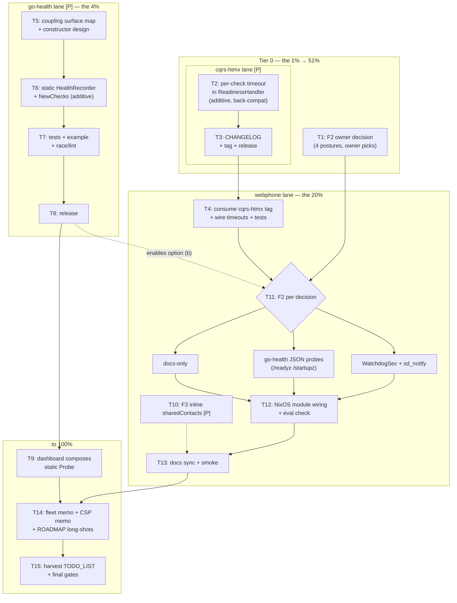

# SUPERB Plan — Honest Self-Health, Upstream-First

**Date:** 2026-09-19 20:01 · **Scope:** everything this session's DI/health thread
surfaced — the review findings (F1/F2/F3), the `go-health-dashboard` discovery, and the
owner's directive to _improve the ecosystem libs instead of hand-rolling per-consumer
workarounds_. Repo-wide standing work stays governed by `TODO_LIST.md` (touched here
only where this plan's items route into it).

**Derived from (all verified this session, not assumed):**

| # | Verified fact                                                                                                                                                                                                                                          | Source                                                         |
| --- | ------------------------------------------------------------------------------------------------------------------------------------------------------------------------------------------------------------------------------------------------------ | -------------------------------------------------------------- |
| 1 | webphone has zero samber/do (direct + transitive) — deliberate, documented                                                                                                                                                                             | grep + `go list -m all`; AGENTS.md setup-bundle rejection      |
| 2 | `/healthz` = `cqrshtmx.ReadinessHandler`, parallel **named** checks, 200/503 honest JSON                                                                                                                                                               | `readiness.go` read at consumed tag v4.9.0                     |
| 3 | `ReadinessCheck` is `func() error` — **no timeout, no context**; a hung check hangs the probe (no `WriteTimeout` by SSE design) → finding **F1**                                                                                                       | same source                                                    |
| 4 | webphone has **no liveness** surface; systemd `Restart = on-failure` covers crashes but not a wedged process → finding **F2**                                                                                                                          | `package/nixos-module.nix`, server routes                      |
| 5 | `go-health` is structurally samber/do-coupled: `func New(injector do.Injector, opts ...Option) *Probe`; even `HealthRecorder` is injector-shaped (`RecordHealthCheckWithContext(ctx, injector)`)                                                       | `~/projects/go-health/probe.go:310, :24` (local checkout)      |
| 6 | BUT `resolveHealthCheck(recorder, injector)` is a clean seam: an **additive** container-free constructor (plain named checks) is possible without breaking the existing API                                                                            | same source                                                    |
| 7 | `go-health-dashboard` v0.9.0 ships exactly what F2 needs: `/healthz` `/readyz` `/startupz` split, **JSON-only probe endpoints**, history, evidence, webhooks, metrics; its HTML face needs Datastar (`unsafe-eval` CSP) but the probe endpoints do not | `~/projects/go-health-dashboard/AGENTS.md`, `doc.go`, `csp.go` |
| 8 | F3: `sharedContacts(cfg)` in the composition root returns `cfg.Contacts` unchanged                                                                                                                                                                     | `cmd/webphone/main.go`                                         |

**Standings this plan must not violate (Verschlimmbesser guardrails):**

1. **No CSP weakening** in webphone: `script-src 'self'` + one hash stays; the HTML
   dashboard face is NOT adopted here (Datastar needs `unsafe-eval`) — JSON probe
   endpoints only, unless the owner explicitly changes the CSP stance.
2. **No split brain**: adopting go-health must not introduce a second identity, a
   container, or a second source of truth for health; webphone stays a static
   composition root.
3. **Upstream-first**: fixes land in cqrs-htmx / go-health so **every** consumer
   inherits them; webphone only consumes released tags (verify at tag, never master —
   AGENTS.md rule).
4. **Browser E2E untouched**: no DOM/route changes; the consuming stack's E2E must stay
   green without a re-run being _required_ (run it only if routes change).
5. **Fail-closed defaults**: any new readiness behavior must fail toward 503, never
   silently pass (the gosec "prove it scanned" lesson).
6. Each lib change is **additive**; existing APIs and tests keep passing unmodified.

---

## 1. Pareto breakdown

### The 1% that delivers 51% of the result

**The F2 owner decision + the cqrs-htmx per-check timeout.**

- **A1 (decision, ~10 min):** pick the liveness posture — document-only vs `WatchdogSec`
  - sd_notify vs go-health JSON probe endpoints (`/readyz` `/healthz` `/startupz`) vs
    stack-side gating. Every downstream task branches on this one call.
- **T2 (one upstream code change):** per-check timeout in
  `cqrshtmx.ReadinessHandler` — a hanging check currently hangs `GET /healthz`
  forever (F1). ~30 lines + tests in one library fixes honesty-under-hang for **all**
  consumers permanently. Highest code-leverage item in the plan.

### The 4% that delivers 64% of the result

**+ go-health decoupling (T5–T8) and webphone consuming the new cqrs-htmx (T4).**

The additive container-free Probe constructor (`NewChecks`/static recorder over
`resolveHealthCheck`) unlocks the whole dashboard ecosystem — probe endpoints, history,
evidence, webhooks, metrics, health-hub federation — for **any binary without a DI
container**, i.e. for webphone and every future non-samber/do service. F2's best option
becomes available instead of hand-built.

### The 20% that delivers 80% of the result

**+ webphone self-health completion: F3 cleanup (T10), F2 implemented per decision
(T11), NixOS module wiring (T12), docs sync (T13).**

At this point webphone has: hang-safe readiness, a decided and wired liveness story,
consumed upstream fixes, and docs that don't lie.

### The remaining 20% to 100%

Fleet-level option doc (health-hub scraping webphone's JSON), the dashboard-HTML/CSP
tradeoff memo (recorded, not executed), ROADMAP long-shots, TODO_LIST re-routing after
execution, and the full verification sweep (buildflow/vulnix only if a release gets cut).

---

## 2. Comprehensive plan — medium granularity (30–100 min tasks)

Sorted by importance/impact/effort/customer-value. Ranks are execution order.

| Rank | ID  | Task (30–100 min)                                                                                                                                                                               | Tier | Impact | Effort | Customer value      | Depends on     |
| ---- | --- | ----------------------------------------------------------------------------------------------------------------------------------------------------------------------------------------------- | ---- | ------ | ------ | ------------------- | -------------- |
| ~~1~~    | ~~T1~~  | ~~**F2 owner decision**: present the 4 liveness postures with tradeoffs; owner picks; write the decision into the plan + AGENTS.md~~                                                                | ~~1%~~   | ~~★★★~~    | ~~S~~      | ~~★★★~~                 | ~~—~~              |
| ~~2~~    | ~~T2~~  | ~~**cqrs-htmx**: design additive per-check timeout API (option vs `NamedCheck.Timeout`), implement in `readiness.go`, tests (hang → 503 `<check>: timed out`), lint~~                               | ~~1%~~   | ~~★★★~~    | ~~M~~      | ~~★★★ (all consumers)~~ | ~~—~~              |
| ~~3~~    | ~~T3~~  | ~~**cqrs-htmx**: CHANGELOG + tag + release; verify tag in module cache (never master)~~                                                                                                             | ~~1%~~   | ~~★★☆~~    | ~~S~~      | ~~★★★~~                 | ~~T2~~             |
| ~~4~~    | ~~T4~~  | ~~**webphone**: bump cqrs-htmx, wire check timeouts (sqlite 2s, blob-dir 2s), extend healthz tests, `go test ./...` green~~                                                                         | ~~4%~~   | ~~★★★~~    | ~~S~~      | ~~★★☆~~                 | ~~T3~~             |
| ~~5~~    | ~~T5~~  | ~~**go-health**: full coupling surface map (probe.go, accessors.go, tracker.go, aggregate/) + additive constructor design doc in the go-health repo~~                                               | ~~4%~~   | ~~★★★~~    | ~~M~~      | ~~★★☆ (ecosystem)~~     | ~~—~~              |
| ~~6~~    | ~~T6~~  | ~~**go-health**: implement static `HealthRecorder` + `NewChecks(...)` constructor (additive; `New(injector, …)` untouched)~~                                                                        | ~~4%~~   | ~~★★★~~    | ~~M~~      | ~~★★☆~~                 | ~~T5~~             |
| ~~7~~    | ~~T7~~  | ~~**go-health**: tests + runnable example for the container-free path; race + lint green~~                                                                                                          | ~~4%~~   | ~~★★☆~~    | ~~M~~      | ~~★★☆~~                 | ~~T6~~             |
| ~~8~~    | ~~T8~~  | ~~**go-health**: CHANGELOG + tag + release~~                                                                                                                                                        | ~~4%~~   | ~~★★☆~~    | ~~S~~      | ~~★★☆~~                 | ~~T7~~             |
| ~~9~~    | ~~T9~~  | ~~**go-health-dashboard**: verify it composes with a static (container-free) Probe — run its suite against the new constructor; record result~~                                                     | ~~4%~~   | ~~★★☆~~    | ~~S~~      | ~~★☆☆~~                 | ~~T8~~             |
| ~~T10~~ | ~~~~ **webphone**: F3 — inline `sharedContacts`, run gates (trivial but proves the consume-and-verify loop)~~                                                                                          | ~~20%~~  | ~~★☆☆~~    | ~~S~~      | ~~★☆☆~~                 | ~~—~~              |~~ done (closed by the concurrent session) (docs-health 2026-09-22)
| ~~T11~~ | ~~~~ **webphone**: implement F2 per T1 decision — (a) docs-only, or (b) adopt go-health JSON probe endpoints on top of (not replacing) honest `/healthz`, or (c) `WatchdogSec` + sd_notify heartbeat~~ | ~~20%~~  | ~~★★★~~    | ~~M–L~~    | ~~★★★~~                 | ~~T1, (T8 for b)~~ |~~ done — /livez + /startupz (2.3.0) (docs-health 2026-09-22)
| ~~T12~~ | ~~~~ **webphone**: NixOS module wiring for the chosen mechanism (options + `assertions` stand-in + module-check eval)~~                                                                                | ~~20%~~  | ~~★★☆~~    | ~~M~~      | ~~★★☆~~                 | ~~T11~~            |~~ done (NixOS probe locations) (docs-health 2026-09-22)
| ~~T13~~ | ~~~~ **webphone**: docs sync — README health section, FEATURES, CHANGELOG, AGENTS.md readiness-only note refreshed~~                                                                                   | ~~20%~~  | ~~★★☆~~    | ~~S~~      | ~~★☆☆~~                 | ~~T11~~            |~~ done (docs sync) (docs-health 2026-09-22)
| ~~T14~~ | ~~~~ **memos**: fleet option (health-hub scraping webphone JSON) + dashboard-HTML/CSP tradeoff memo (recorded, NOT executed) + ROADMAP long-shots~~                                                    | ~~100%~~ | ~~★☆☆~~    | ~~S~~      | ~~★☆☆~~                 | ~~T9~~             |~~ done (fleet/CSP memos) (docs-health 2026-09-22)
| ~~T15~~ | ~~~~ **harvest + final sweep**: re-route plan outcomes into TODO_LIST (docs-health ANNOTATE/HARVEST rules), run `go test`, `nix flake check`, smoke; buildflow/vulnix only if a release is cut~~       | ~~100%~~ | ~~★★☆~~    | ~~M~~      | ~~★★☆~~                 | ~~all~~            |~~ done (HARVEST sweeps) (docs-health 2026-09-22)

Parallel lanes: T2–T4 (cqrs-htmx lane) is fully independent of T5–T9 (go-health lane);
T1 gates only T11/T12. Nothing here touches the island, the DOM contract, or routes.

---

## 3. Detailed breakdown — fine granularity (≤ 12 min each)

ALL todos, sorted by tier then priority. [P] = parallelizable with its neighbors.

### Tier 0 — the 1%

| # | Micro-task (≤12 min)                                                                                                                                    | From |
| --- | ------------------------------------------------------------------------------------------------------------------------------------------------------- | ---- |
| 1 | Draft the 4-option F2 decision memo (tradeoffs: ops burden, hang detection, CSP, module surface)                                                        | T1   |
| 2 | Ask the owner (the 3 questions at the end of this plan) + record the answer in AGENTS.md                                                                | T1   |
| 3 | cqrs-htmx: read `readiness_test.go` current coverage — list the cases the timeout change must not break [P]                                             | T2   |
| 4 | cqrs-htmx: pick API shape — handler-level default timeout vs per-`NamedCheck` timeout (recommend: `NamedCheck.Timeout`, zero = unlimited → back-compat) | T2   |
| 5 | cqrs-htmx: implement per-check timeout (check goroutine + `time.After`, named `"<check>: timed out after Xs"` error)                                    | T2   |
| 6 | cqrs-htmx: test — blocking check → 503, body names check + timeout; other check still reported ok                                                       | T2   |
| 7 | cqrs-htmx: test — zero timeout keeps today's exact behavior (back-compat pin)                                                                           | T2   |
| 8 | cqrs-htmx: full `go test ./...` + lint in that repo's devShell                                                                                          | T2   |
| 9 | cqrs-htmx: CHANGELOG entry + tag + push; confirm tag resolvable in module cache                                                                         | T3   |

### Tier 1 — the 4%

| #  | Micro-task (≤12 min)                                                                                                                        | From |
| --- | -------------------------------------------------------------------------------------------------------------------------------------------- | ----- |
| 10 | go-health: read `probe.go` `assemble`/`resolveHealthCheck`/`HealthRecorder` fully; write the coupling-surface note [P]                      | T5   |
| 11 | go-health: scan `aggregate/` + `federation/` for further injector touchpoints the new constructor must serve                                | T5   |
| 12 | go-health: draft `NewChecks` signature + static recorder design (naming, opts, error semantics) — one-page design doc in the go-health repo | T5   |
| 13 | go-health: implement the static `HealthRecorder` (plain named checks → `map[string]error`)                                                  | T6   |
| 14 | go-health: implement `NewChecks(checks ..., opts ...Option) *Probe` over the existing `assemble` path                                       | T6   |
| 15 | go-health: unit tests — container-free probe reports pass/fail checks with names                                                            | T7   |
| 16 | go-health: unit tests — check metadata/timing still populated on the static path                                                            | T7   |
| 17 | go-health: runnable `example_newchecks_test.go` (doc-example, no injector)                                                                  | T7   |
| 18 | go-health: `go test -race ./...` + lint + `nix flake check` in that repo                                                                    | T7   |
| 19 | go-health: CHANGELOG + tag + push (patch/minor per its versioning convention)                                                               | T8   |
| 20 | go-health-dashboard: run its suite with a statically-built Probe; record the composition verdict                                            | T9   |
| 21 | webphone: bump cqrs-htmx to the new tag (`go get`, tidy)                                                                                    | T4   |
| 22 | webphone: set per-check timeouts at the readiness wiring site (2s sqlite, 2s blob-dir)                                                      | T4   |
| 23 | webphone: extend healthz tests — timeout path (inject a blocking check via a test-only Deps mutator)                                        | T4   |
| 24 | webphone: `go test ./...` + `nix flake check` green                                                                                         | T4   |
| 25 | webphone: inline `sharedContacts` (F3) + `go build` + targeted tests                                                                        | T10  |

### Tier 2 — the 20%

| #  | Micro-task (≤12 min)                                                                                                                                          | From |
| --- | -------------------------------------------------------------------------------------------------------------------------------------------------------------- | ----- |
| 26 | webphone: F2 implementation step 1 — branch per T1 outcome (docs-only / probe endpoints / watchdog)                                                           | T11  |
| 27 | (if docs-only) README + module comment: "readiness-only by decision; hung process = operator restart"                                                         | T11a |
| 28 | (if probe endpoints) mount go-health JSON `/readyz` `/startupz` beside existing `/healthz`; keep current handler as the readiness source (no duplicate truth) | T11b |
| 29 | (if probe endpoints) CSP check — JSON endpoints add no scripts; assert via a route test                                                                       | T11b |
| 30 | (if watchdog) sd_notify heartbeat goroutine + `WatchdogSec` option in the NixOS module                                                                        | T11c |
| 31 | (if watchdog) shutdown path: send `STOPPING=1`, stop heartbeat before `db.Close` (order guard test)                                                           | T11c |
| 32 | NixOS module: add/extend options for the chosen mechanism + `assertions` stand-in in the module check                                                         | T12  |
| 33 | NixOS module: eval test (`webphone-module` flake check) green                                                                                                 | T12  |
| 34 | README: health section (what `/healthz` guarantees, what it does not, probe shapes)                                                                           | T13  |
| 35 | FEATURES + CHANGELOG entries for the shipped health changes                                                                                                   | T13  |
| 36 | AGENTS.md: refresh the readiness-only note (it now cites this plan; update to the shipped truth)                                                              | T13  |
| 37 | `python3 scripts/webphone-smoke.py` green (health checks included)                                                                                            | T13  |

### Tier 3 — to 100%

| #  | Micro-task (≤12 min)                                                                                             | From |
| --- | ----------------------------------------------------------------------------------------------------------------- | ----- |
| 38 | Memo: fleet option — health-hub federation scraping webphone's honest JSON (stack-level, no webphone change)     | T14  |
| 39 | Memo: dashboard-HTML-in-webphone CSP tradeoff (Datastar `unsafe-eval` vs pinned hash; what would have to change) | T14  |
| 40 | ROADMAP: long-shots (webphone UI health panel if CSP stance changes; federation in the stack)                    | T14  |
| 41 | TODO_LIST: annotate the F1/F2/F3 entries with their outcomes (docs-health ANNOTATE mode, non-destructive)        | T15  |
| 42 | Final sweep: `go test ./...`, `nix flake check`, smoke — all green                                               | T15  |
| 43 | (only if a webphone release is cut for this) release runbook + buildflow + vulnix                                | T15  |

---

## 4. Execution graph

Reading the graph: the only serial spine is **C1 → C2 → W1 → W3 → W4 → W5 → M3**;
the go-health lane runs fully parallel; T1 (the owner decision) can happen today and
gates nothing except the _shape_ of W3.

---

## 5. Verification gates (per lane)

| Lane         | Gate                                                                                                             |
| ------------ | ---------------------------------------------------------------------------------------------------------------- |
| cqrs-htmx    | `go test ./...` (incl. back-compat pin test), lint, tag resolvable in module cache                               |
| go-health    | `go test -race ./...`, lint, `nix flake check`, example runs, release tag verified                               |
| webphone     | `GOEXPERIMENT=jsonv2 go test -count=1 ./...`, `nix flake check`, `webphone-smoke.py`, healthz timeout test green |
| NixOS module | `webphone-module` flake check (assertions stand-in) green                                                        |
| Stack        | browser E2E **only if** routes/DOM changed — plan is designed so they don't                                      |

---

## 6. Routing (docs-health rules)

- Now already in TODO_LIST: F1, F2, F3 entries (harvested earlier today).
- After execution: annotate those entries with outcomes; delete done work (TODO_LIST
  convention: done is deleted, not struck).
- ROADMAP (long-shots, not commitments): fleet federation, webphone HTML health panel
  (CSP-gated), upstream dashboard "checks-only" bundle if the owner ever wants it.

---

## 7. The 3 owner questions (cannot be figured out from the repo)

1. **F2 posture** — which liveness story do you want for webphone: (a) document-only
   ("readiness by design, operator restarts a hung unit"), (b) go-health JSON probe
   endpoints (`/readyz` `/startupz`, needs the go-health decoupling), or (c) systemd
   `WatchdogSec` + sd_notify heartbeat (real hang detection, module surface grows)?
   My recommendation: **(b)** — it is your ecosystem's native answer, CSP-clean
   (JSON-only), and makes the decision reusable for every future non-DI binary.
2. **Upstream appetite** — shall I make the cqrs-htmx timeout change and the go-health
   decoupling as PRs/releases to those repos from this plan (upstream-first), or do you
   want to author those changes yourself and have webphone only consume?
3. **Health-hub ambition** — is fleet-level federation (health-hub aggregating webphone
   - the stack + future services) a real near-term goal, or a ROADMAP long-shot? It
     decides whether T14's memo stays a memo or becomes a workstream with an owner.

---

## DECIDED — T1 resolution (2026-09-19, execution turn)

**F2 liveness posture: (b) go-health JSON probe endpoints beside `/healthz`.**

The owner approved full-plan execution ("execute the WHOLE TODO LIST") without
amendments; the plan's recommended posture stands. Rationale: CSP-clean
(JSON only — the Datastar HTML face stays rejected), ecosystem-native
(reuses go-health instead of hand-rolling), reusable by the fleet
(health-hub can scrape it), and the owner's explicit directive to improve
and adopt the ecosystem libs. Endpoint naming follows the no-duplicate-truth
guardrail: readiness STAYS the existing honest `/healthz`
(cqrshtmx.ReadinessHandler); go-health serves the NEW liveness + startup
surfaces beside it. Execution lane: T11/T12 after the go-health release
lane lands.

---

## EXECUTED — outcome record (2026-09-19, execution turn)

All lanes landed. Deviations from the letter of the plan, all deliberate:

1. **go-health v0.2.0 already shipped injector-free constructors**
   (`NewWithHealthCheck`/`NewWithDetailedCheck`, accessors.go) — the T5/T6
   gap narrowed to the ergonomic named-checks layer. Shipped as go-health
   **v0.3.0** `NewChecks(map[string]CheckFunc)` (checks.go,
   docs/named-checks-design.md): concurrent execution, per-check
   `duration_ns`, panic recovery, nil fail-closed, batch-deadline
   abandonment (a wedged check can no longer hang the probe). Tag pushed,
   proxy-resolved, GitHub Release cut. The repo's fleet Go 1.27.1 floor
   required a flake toolchain fix (go_1_27) + treefmt gofmt-for-goimports
   swap to keep the sandboxed format gate green.
2. **F2 shipped as `/livez` + `/startupz`** (not the plan's `/readyz`
   spelling): readiness keeps ONE home at `/healthz` — mounting a
   go-health readiness endpoint beside it would be a second readiness
   truth, violating guardrail 2. The go-health probe shares /healthz's
   check functions (same truth, two lifecycles). Fetch-free `/livez`
   gives a prober the wedged-process-vs-degraded-dependencies split.
3. **cqrs-htmx v4.11.0**: the concurrent release train cut the family tag
   WITH the per-check `NamedCheck.Timeout` feature inside (the daemon
   absorbed this session's readiness work pre-tag); this session completed
   the release notes (the timeout feature was missing from the CHANGELOG)
   and pushed master. Webphone bumped to v4.11.0 and deleted its local
   `boundedCheck` wrapper — the upstream `NamedCheck.Timeout` (2s) now
   owns F1. The SSE stream test deliberately accepts the leading
   `retry:` hint v4.11.0's ServeSSE now emits (valid SSE, consumed by the
   htmx sse extension — watch the stack browser E2E on its next run).
4. **Webphone took the Go 1.27.1 fleet floor** (go.mod + flake
   builder/devShell on go_1_27) — required by go-health v0.3.0 and the
   cqrs-htmx v4.11.x train; GOEXPERIMENT=jsonv2 env stays (harmless,
   json/v2 stable in 1.27).
5. F3 (`sharedContacts` indirection) was closed by a concurrent session;
   verified and folded into this outcome record.

Gates at close: webphone `go test ./...` green, `nix flake check` green,
smoke 26/26, server lint 0 issues (one pre-existing errcheck in another
session's new cmd/webphone/drift_test.go left alone); go-health gates all
green; cqrs-htmx root suite + lint green. No webphone release cut — the
changes ride the next train (CHANGELOG Unreleased).
