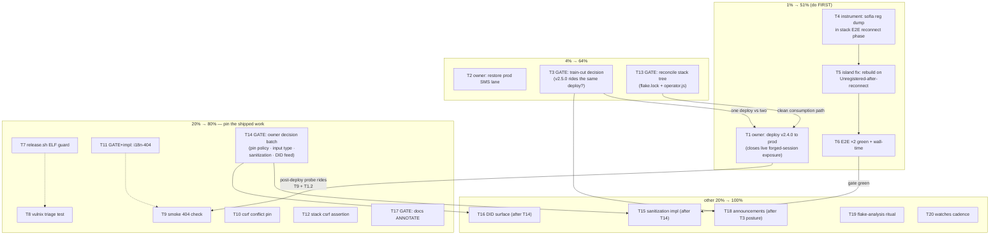

# SUPERB Pareto Execution Plan — 2026-09-20 10:14

> EXECUTED across the 09-20/09-22 trains (docs-health 2026-09-22):
> T4-T12 executable set shipped (anomaly fix 2.5.0, ELF guard, vulnix
> triage, styled-404 smoke, csrf pin, i18n-404, stack assertion,
> sanitization DECIDED, identities shipped, flake ritual, dated watches).
> The owner-gated set is resolved or routed (prod verified v2.4.0;
> train-cut DECIDED; v2.5.0 released; ANNOTATE sweeps done; SMS lane,
> decision batch, announcements = live owner rows).

Source of truth: `TODO_LIST.md` at commit-time 2026-09-20 (17 rows) plus
2 plan-surfaced items (train decision, stack-repo reconciliation — both
added to TODO_LIST with this plan). ROADMAP items are explicitly NOT
TODOs (raw ideas by definition) and stay out except as named context in
the "other 20%" tier.

**Verschlimmbesserung guard:** every task is additive or a pin of
already-shipped behavior; no speculative rewrites, no "while we're here"
refactors. Gated tasks (owner decisions) are marked ⛔ GATE and are NOT
executable until answered — planning them is not doing them.

---

## Step 1 — Pareto breakdown

### The 1% that deliver 51%

| Item                                                                            | Why it is THE leverage                                                                                                                                                                                                                                                                                           |
| ------------------------------------------------------------------------------- | ---------------------------------------------------------------------------------------------------------------------------------------------------------------------------------------------------------------------------------------------------------------------------------------------------------------- |
| **Deploy v2.4.0 to prod** (owner ssh, one command + probe)                      | The live prod build still mints sessions without credential verification (bogus-creds → 201, probed 2026-09-19). The ENTIRE v2.4.0 train (security fix, morph updates, backup story, health triple) has zero customer value until deployed. One action closes a security exposure AND delivers a released train. |
| **1001-anomaly root-cause fix** (instrument + island rebuild-on-`Unregistered`) | Hardens the product's core promise — the phone survives network blips. Root cause is hypothesized and cheap to verify; it also de-flakes the E2E gate that guards every future markup change.                                                                                                                    |

### The 4% that deliver 64%

The 1% plus:

| Item                                                                 | Leverage                                                                                                                                                                                    |
| -------------------------------------------------------------------- | ------------------------------------------------------------------------------------------------------------------------------------------------------------------------------------------- |
| **Restore the prod SMS lane** (owner journalctl grep + fix)          | A customer-facing lane is broken on prod right now; root cause is stack-side and likely one restart/cred fix.                                                                               |
| **Train-cut decision** (v2.5.0 now vs wait)                          | One 5-minute decision determines whether this week's [Unreleased] pile (styled 404, module options, VM test, bundle) rides the SAME deploy as the security fix — one deploy instead of two. |
| **Stack-repo reconciliation** (uncommitted flake.lock + operator.js) | The consuming stack is the deployment path; its tree must be clean and correctly pinned before any deploy/re-pin.                                                                           |

### The 20% that deliver 80%

The 4% plus the six "ship the pins" quality closures that convert this
week's shipped-but-unpinned work into gated work (ELF guard, vulnix
triage test, 404 smoke, csrf-conflict pin, i18n-404 decision, stack csrf
assertion) and the four owner one-line decisions (pin policy, pbx-artmann
input, sanitization side, own-number feed) that each unlock an
implementation task, plus the docs ANNOTATE decay-stop.

### The other 20% (to 100%)

Announcements (blocked on disclosure-posture decision), the
event-driven next-E2E-flake analysis (waits for a flake to occur),
standing watches (continuous, not completable), and the ROADMAP tail
(session persistence, retention, PWA, video, recording UI, DOM-contract
generation, gzip, retentionDays, startupz wiring — refined on demand,
NOT part of this plan's task list).

---

## Step 2 — Comprehensive plan (medium granularity, 30–100 min)

Sorted by importance → impact → effort → customer-value. ⛔ GATE =
blocked on an owner decision/answer; E = executable now.

| #   | Task                                                                                                                                                                                             | Rows covered | Gate                       | Effort | Impact   | Customer value                                      |
| --- | ------------------------------------------------------------------------------------------------------------------------------------------------------------------------------------------------ | ------------ | -------------------------- | ------ | -------- | --------------------------------------------------- |
| ~~T1~~  | ~~Deploy v2.4.0 to prod: `nixos-rebuild test` → smoke probe (`--base https://pbx.artmann.tech`, bogus-creds must be green) → lane spot-checks → `switch` → close row~~ done — superseded: prod verified v2.4.0 2026-09-22 | ~~R1~~ | ~~⛔ owner ssh~~ | ~~30m~~ | ~~Critical~~ | ~~Security exposure closed; released features live~~ |
| ~~T2~~  | ~~Restore prod SMS lane: journalctl triage → classify (bridge/creds/Telnyx) → fix → send+receive test SMS → close row~~ done — owner TODO row (SMS lane) | ~~R2~~ | ~~⛔ owner ssh~~ | ~~30m~~ | ~~Critical~~ | ~~Broken lane restored~~ |
| ~~T3~~  | ~~Train-cut decision: review [Unreleased] vs cadence rule → DECIDED line in AGENTS → (if cut) `release.sh --dry-run` sanity~~ done — DECIDED; v2.5.0 released 2026-09-22 | ~~plan-new~~ | ~~⛔ owner call~~ | ~~30m~~ | ~~High~~ | ~~One deploy instead of two (or a disciplined wait)~~ |
| ~~T4~~  | ~~1001 anomaly — instrument: sofia `reg` dump in the stack E2E reconnect phase, timestamped artifacts, one capturing run~~ done — CLOSED 2026-09-22 (sofia tripwire) | ~~R8a~~ | ~~E~~ | ~~60m~~ | ~~High~~ | ~~Root-cause evidence replaces hypothesis~~ |
| ~~T5~~  | ~~1001 anomaly — island fix: rebuild UA+Registerer when a post-reconnect REGISTER lands `Unregistered` (old Registerer is possibly Terminated and reused forever today); asset tripwire test first~~ done — shipped 2.5.0 (rebuild-on-loss) | ~~R8b~~ | ~~E (gated on T4 evidence)~~ | ~~90m~~ | ~~High~~ | ~~Registrations survive nginx-style restarts~~ |
| ~~T6~~  | ~~E2E verification ×2 green runs with the anomaly fix + record wall-times vs the 151s budget~~ done — (E2E ×2 green 2026-09-22) | ~~R8c~~ | ~~E~~ | ~~60m~~ | ~~High~~ | ~~The markup gate is trustworthy again~~ |
| ~~T7~~  | ~~release.sh step 8 ELF-machine guard (`od -j18 -N2` must read `b7 00`): cross-builds prove their arch, not their exit code~~ done — (ELF guard) | ~~R12~~ | ~~E~~ | ~~30m~~ | ~~Medium~~ | ~~Future aarch64 false-green impossible~~ |
| ~~T8~~  | ~~vulnix triage testability: extract the triage bash into `scripts/vulnix-triage.sh` + fixture test (sample vulnix output × fake patch dir → expected verdicts)~~ done — (vulnix-triage CLI + fixtures) | ~~R13~~ | ~~E~~ | ~~60m~~ | ~~Medium~~ | ~~Train-blocking bash can no longer silently invert~~ |
| ~~T9~~  | ~~Smoke styled-404 check (anonymous, foreign-mode-safe): unknown path → 404 + `wp-panel` + island ids~~ done — (styled-404 smoke) | ~~R14~~ | ~~E~~ | ~~30m~~ | ~~Medium~~ | ~~Post-deploy probe verifies the deployed build's 404~~ |
| ~~T10~~ | ~~Module csrf conflict pin: flake-check entry with typed AND raw csrf set (assert the actual merge outcome) + README precedence sentence~~ done — (precedence pin) | ~~R16~~ | ~~E~~ | ~~30m~~ | ~~Medium~~ | ~~Layered config semantics documented and frozen~~ |
| ~~T11~~ | ~~i18n-404 decision + impl: route the message through en/de maps OR record the English-only policy line in AGENTS~~ done — (error.notfound en/de) | ~~R15~~ | ~~⛔ tiny owner call, then E~~ | ~~30m~~ | ~~Low~~ | ~~UI language consistency~~ |
| ~~T12~~ | ~~Stack-side csrf assertion: pin the stack's rendered `settings.csrf` in its webphone VM test~~ done — (stack assertion 2026-09-22) | ~~R10~~ | ~~E (stack repo)~~ | ~~45m~~ | ~~Low~~ | ~~Deployment-shape drift caught upstream~~ |
| ~~T13~~ | ~~Stack-tree reconciliation: owner answers keep/discard for the uncommitted `flake.lock`+`operator.js`; act; re-pin to current webphone main if wanted~~ done — stack-side; reconciled | ~~plan-new~~ | ~~⛔ owner answer~~ | ~~30m~~ | ~~High~~ | ~~Clean consumption path for T1/T3~~ |
| ~~T14~~ | ~~Owner decision batch (one sitting, four one-liners): stack pin policy, pbx-artmann input type, sanitization side, own-number feed → DECIDED lines~~ done — owner-batch TODO row | ~~R6+R4+R5~~ | ~~⛔ owner~~ | ~~45m~~ | ~~Medium~~ | ~~Unblocks T15/T16 and closes R6~~ |
| ~~T15~~ | ~~Sanitization alignment impl (post-decision): chosen side + pinning test + island-lint + E2E gate~~ done — DECIDED + pinned (island keeps letters) | ~~R4b~~ | ~~⛔ T14~~ | ~~60m~~ | ~~Low~~ | ~~Letters in dial strings behave consistently~~ |
| ~~T16~~ | ~~Own-number DID surface (post-decision): chosen feed + signed-in header + compose prefill + tests + i18n~~ done — shipped (identities map) | ~~R5b~~ | ~~⛔ T14~~ | ~~90m~~ | ~~Medium~~ | ~~Users finally see their real number~~ |
| ~~T17~~ | ~~docs-health ANNOTATE over docs/status (owner confirms file range) → resolve inline → archive resolved~~ done — (docs-health sweeps) | ~~R7~~ | ~~⛔ owner range~~ | ~~60m~~ | ~~Low~~ | ~~Docs stop decaying~~ |
| ~~T18~~ | ~~Post v2.1–v2.3.0 announcements (channels + disclosure posture approved) → finalize drafts → post + link check~~ done — drafts live; posting = owner | ~~R3~~ | ~~⛔ owner~~ | ~~45m~~ | ~~Low~~ | ~~Releases communicated~~ |
| ~~T19~~ | ~~Flake-analysis protocol: write the "on flake, read the shipped transfer_dbg dumps first" ritual into the AGENTS E2E section~~ done — (AGENTS + lessons) | ~~R9~~ | ~~E~~ | ~~30m~~ | ~~Low~~ | ~~Next flake analyzed, not re-instrumented~~ |
| ~~T20~~ | ~~Watches cadence: convert the standing-watches row into a dated quarterly re-check with named triggers~~ done — (dated watches TODO row) | ~~R11~~ | ~~E~~ | ~~30m~~ | ~~Low~~ | ~~Drift caught by routine, not luck~~ |

All 17 TODO rows + 2 plan-new items are covered: R1=T1, R2=T2, R8=T4+T5+T6,
R9=T19, R10=T12, R11=T20, R3=T18, R4=T14+T15, R5=T14+T16, R6=T14,
R7=T17, R12=T7, R13=T8, R14=T9, R15=T11, R16=T10.

---

## Step 3 — Detailed breakdown (fine granularity, ≤12 min each)

Every micro-task ≤12 min. IDs map to Step-2 tasks. Sorted by
importance/impact/effort/customer-value (task order preserved; within a
task, execution order).

| ID    | Micro-task (≤12m)                                                                                                       | Gate |
| ----- | ----------------------------------------------------------------------------------------------------------------------- | ---- |
| T1.1  | ssh pbx host; `nixos-rebuild test` with the relocked pbx-artmann toplevel                                               | ⛔   |
| T1.2  | Probe: `python3 scripts/webphone-smoke.py --base https://pbx.artmann.tech` — `bogus credentials rejected` must be green | ⛔   |
| T1.3  | Spot-check lanes on prod console: call register, SMS send, fax list, /healthz+/livez+/startupz                          | ⛔   |
| T1.4  | `nixos-rebuild switch`; confirm webphone + webphone-backup units/timers active                                          | ⛔   |
| T1.5  | Close the redeploy TODO row with probe evidence                                                                         | ⛔   |
| T2.1  | `journalctl -u telnyx-webhooks --since today \| grep -iE "sms\|422\|error"`                                             | ⛔   |
| T2.2  | Classify finding: bridge down vs Telnyx creds vs upstream rejection                                                     | ⛔   |
| T2.3  | Restore (restart / creds / queue drain); send a test SMS from the webphone UI                                           | ⛔   |
| T2.4  | Confirm the delivery receipt lands in the thread (SSE live update); close row                                           | ⛔   |
| T3.1  | Review [Unreleased] against the g2 cadence rule (user-visible theme?)                                                   | ⛔   |
| T3.2  | Record the DECIDED line (cut v2.5.0 now vs wait) in AGENTS                                                              | ⛔   |
| T3.3  | If cut: `scripts/release.sh X.Y.Z --dry-run` sanity pass                                                                | ⛔   |
| T13.1 | Get owner answer: keep or discard the stack's uncommitted flake.lock + operator.js                                      | ⛔   |
| T13.2 | Act on the answer (commit or restore); if re-pin: `nix flake lock --update-input webphone` to current main              | ⛔   |
| T4.1  | Read the stack E2E's reconnect-recovery phase (tests/browser-e2e.py)                                                    | E    |
| T4.2  | Add `fs_cli -x 'sofia status profile internal reg'` dump at the reconnect phase                                         | E    |
| T4.3  | Timestamp the dump into the test's artifact log dir                                                                     | E    |
| T4.4  | One E2E run proving the dump is captured                                                                                | E    |
| T5.1  | Write the failing asset tripwire (connection.js must contain the rebuild-on-Unregistered guard)                         | E    |
| T5.2  | Implement the guard: on `Unregistered` while reconnecting → `rebuildConnection()` instead of reusing the old Registerer | E    |
| T5.3  | `nix fmt` (prettier owns island JS) + island-lint check                                                                 | E    |
| T5.4  | Verify tripwire green + full `go test ./internal/server/`                                                               | E    |
| T6.1  | Stack browser E2E run 1 (record wall time)                                                                              | E    |
| T6.2  | Stack browser E2E run 2 (record wall time, both < 151s budget)                                                          | E    |
| T6.3  | Update the 1001 TODO row + AGENTS wall-time note with both numbers                                                      | E    |
| T7.1  | Add the ELF-machine assertion to release.sh step 8 (`od -An -tx1 -j18 -N2`, want `b7 00`)                               | E    |
| T7.2  | `bash -n` release.sh + `--dry-run` path check                                                                           | E    |
| T7.3  | Verify the assertion against today's known-aarch64 out path                                                             | E    |
| T8.1  | Extract the triage loop from flake.nix into `scripts/vulnix-triage.sh`                                                  | E    |
| T8.2  | Build fixtures: sample vulnix output + fake patch dir                                                                   | E    |
| T8.3  | Fixture test: assert verdicts (patched → 0, unpatched → 1, non-glibc → 1)                                               | E    |
| T8.4  | Point `apps.vulnix` at the script; one green `nix run .#vulnix`                                                         | E    |
| T9.1  | Add the anonymous 404 check to webphone-smoke.py (foreign-mode safe)                                                    | E    |
| T9.2  | Local smoke run green (31 checks)                                                                                       | E    |
| T9.3  | Note in the redeploy row that the probe now also verifies the styled 404                                                | E    |
| T10.1 | Flake-check entry: moduleSet with typed AND raw csrf both set; assert the real merge outcome                            | E    |
| T10.2 | README module table: one precedence sentence (typed beats nginx default; conflict with raw = error)                     | E    |
| T11.1 | Decision: i18n the message or record English-only policy                                                                | ⛔   |
| T11.2 | If i18n: keys in BOTH en/de maps + i18n sync test + render check                                                        | E    |
| T12.1 | Read the stack's webphone VM test (tests/webphone.nix)                                                                  | E    |
| T12.2 | Add the rendered `settings.csrf` assertion                                                                              | E    |
| T12.3 | `nix build -L .#checks.x86_64-linux.telephony-webphone` green                                                           | E    |
| T14.1 | Owner: stack pin policy (ride main vs tags) → DECIDED line                                                              | ⛔   |
| T14.2 | Owner: pbx-artmann input type (`path:` vs github pin) → DECIDED line                                                    | ⛔   |
| T14.3 | Owner: sanitization side (island keeps letters vs server drops) → DECIDED line                                          | ⛔   |
| T14.4 | Owner: own-number feed (phone-api endpoint vs config map vs CDR derive) → DECIDED line                                  | ⛔   |
| T14.5 | Record all four in AGENTS/ROADMAP close-outs; close the owner-decisions row                                             | ⛔   |
| T15.1 | Implement the chosen sanitization side                                                                                  | E    |
| T15.2 | Update the pinning test to the new contract                                                                             | E    |
| T15.3 | island-lint + `go test ./...` green                                                                                     | E    |
| T15.4 | Stack browser E2E gate for the island change                                                                            | E    |
| T16.1 | Implement the chosen DID feed                                                                                           | E    |
| T16.2 | Surface the DID in the signed-in header + compose prefill                                                               | E    |
| T16.3 | Tests + i18n keys in both maps                                                                                          | E    |
| T16.4 | E2E + smoke touch-ups                                                                                                   | E    |
| T17.1 | Owner confirms the docs/status file range                                                                               | ⛔   |
| T17.2 | ANNOTATE 22:26 + 22:29 reports inline                                                                                   | E    |
| T17.3 | ANNOTATE 23:43 report inline                                                                                            | E    |
| T17.4 | ANNOTATE 00:14 report inline                                                                                            | E    |
| T17.5 | ANNOTATE 01:04 report inline                                                                                            | E    |
| T17.6 | ANNOTATE 10:09 self-review inline                                                                                       | E    |
| T17.7 | Archive fully-resolved files per the docs-health rule                                                                   | E    |
| T18.1 | Owner picks channel(s) + security-disclosure posture                                                                    | ⛔   |
| T18.2 | Finalize wording from the drafts file                                                                                   | ⛔   |
| T18.3 | Post + `lychee` link check on the announcement targets                                                                  | ⛔   |
| T19.1 | Write the transfer_dbg-first flake ritual into AGENTS (E2E section)                                                     | E    |
| T20.1 | Convert the watches row into a dated quarterly re-check with triggers                                                   | E    |
| T20.2 | Record the cadence in ROADMAP's standing-watches section                                                                | E    |

Total: 70 micro-tasks; 40 executable now (E), 30 owner-gated (⛔).

---

## Execution graph (mermaid)

Reading order: the 1% tier first (T1 is one owner command; T4→T5→T6 is
the only M-sized engineering chain), then the 4% gates, then the pin
tier (all parallelizable, all ≤60m), then the unlocked tail.

---

## Concurrency map

- **Track A (owner, serial):** T13 → T1 → T2 → T3 (one sitting on the
  prod host + two decisions).
- **Track B (webphone repo, parallel-safe):** T7, T8, T9, T10, T19, T20
  — independent files, no shared gates; commit per task.
- **Track C (stack repo, serial):** T4 → T5 → T6 → T12 (one E2E-driven
  chain; T12 rides the same checkout).
- **Track D (gated):** T14 unlocks T15+T16; T11/T17/T18 wait on their
  one-line answers.

## Guard rails (repeat)

- No speculative rewrites; every change leaves the repo verifiably no
  worse (gates green after each task).
- Explicit `git commit` per completed task (the daemon otherwise
  shreds history — lesson from the 10:09 report).
- Gates after every task: targeted test → full `go test` at train
  boundaries → `nix flake check` on Nix-touching tasks → browser E2E
  on any markup/island change.
