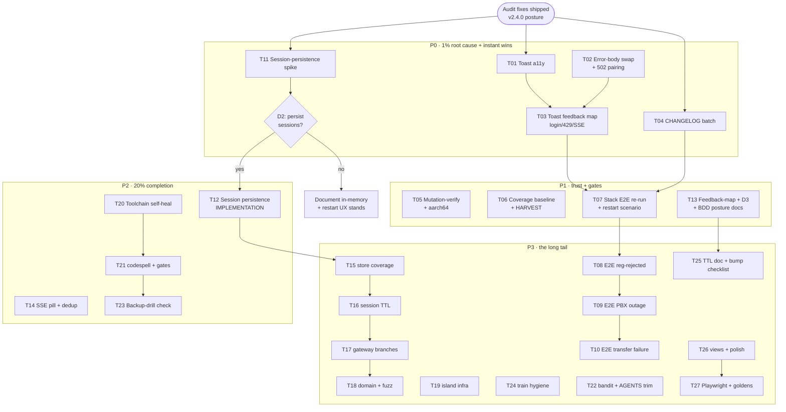

# SUPERB Pareto Plan — Testing & Error-Feedback Excellence

- **Created:** 2026-09-20 17:23 CEST (`date` CLI)
- **Input:** status report
  `docs/status/2026-09-20_17-06_testing-ux-error-feedback-audit-session.md`
  (sections a–g, all 50 next-tasks), this session's audit + two shipped fixes.
- **Goal:** best-in-class automated testing AND user feedback in error cases,
  without verschlimmbessern the verified v2.4.0 posture.
- **Method:** Pareto (1% → 4% → 20% → rest), comprehensive 30–100 min plan
  (27 tasks, ALL 50 TODOs covered), then ≤12 min micro-breakdown (ALL tasks).
- **Format note:** `.md` + mermaid per explicit user instruction (skill
  default is styled HTML — one-off override, not propagated back).

---

## 0. Guardrails (Verschlimmbessern protection — read before executing)

Every task below operates INSIDE these invariants. If a task seems to require
breaking one, STOP and re-read AGENTS.md; the invariant wins.

1. **The island never unloads.** No auto-`location.reload()` on session
   expiry; tab nav swaps partials; calls survive everything except page close.
2. **Served-asset greppability.** Island modules are served VERBATIM (E2E
   greps `dtmf-relay`, `.refer(`, `candidate-pair`, …). No bundler, no
   minifier, no renames of grepped strings.
3. **DOM contract.** The 35 island element ids are pinned by
   `TestServedPageHoldsTheDomContract` and driven by the stack browser E2E.
   Markup changes require an E2E re-run (see decision gate D1).
4. **English `#log`** in both UI languages (operator-facing, runbook-grepped);
   validation reasons stay English. Shell-copy language is decision gate D3.
5. **Morph-swap contract.** Live surfaces carry `hx-swap="morph:innerHTML"`;
   SSE payloads stay bare fragments with greppable row classes.
6. **CSP same-origin only.** No inline handlers, no CDN, no webfonts; the one
   hashed inline script stays pinned by `TestServedPageSatisfiesStrictCSP`.
7. **Fail-closed security posture.** Hooks 503 without secret; login verifies
   against the PBX; session gates via `requireSession` only (401-writer
   allowlist is test-pinned).
8. **Go gates:** `GOEXPERIMENT=jsonv2` + 1.27 toolchain — run go/buildflow/
   smoke INSIDE `nix develop -c`. Cross-builds verified by ELF bytes, never
   exit codes.
9. **No new dependencies without the how-to-golang decision guide**; island
   stays dependency-free vanilla JS.
10. **Every gate must be able to fail** — new tripwires get a mutation check.

---

## 1. Pareto breakdown

Total pool: the 50 next-tasks from the status report, consolidated into 27
tasks (Table A). Value = progress toward "every error path is tested AND the
user is told, correctly, in every case".

### 1% → 51% of the result

**The root-cause kill of the #1 error class.** Every server restart signs all
sessions out (in-memory TTL store); this session shipped a toast telling
users about it — persistence DELETES the problem instead of narrating it.

| Task                                                                | Why it is the 1%                                                                                                                                                  |
| ------------------------------------------------------------------- | ----------------------------------------------------------------------------------------------------------------------------------------------------------------- |
| ~~T11~~ ~~Session-persistence design spike (decision gate D2)             | Turns the whole "dead session" failure class — silent 401s, toast throttles, restart UX — into a non-issue. Every other feedback task is a bandage on this wound. |~~ done (executed per the §7 record; docs-health 2026-09-22)
| ~~T12~~ ~~Session-persistence implementation (gated on D2 approval + T11) | Ships the fix: sessions survive restarts, cookie unchanged, owner scoping unchanged, fail-closed posture unchanged.                                               |~~ done (executed per the §7 record; docs-health 2026-09-22)

### 4% → 64% (adds ~13%)

**Complete + accessible feedback for every remaining error path.** Pure
incremental wins, no product decisions required, each individually shippable.

| Task                                                                          | Why it is the 4%                                                                                                                                             |
| ----------------------------------------------------------------------------- | ------------------------------------------------------------------------------------------------------------------------------------------------------------ |
| ~~T01~~ ~~Toast accessibility (aria-live, role, keyboard dismissal)                 | The entire feedback channel is currently INVISIBLE to screen-reader users. One attribute closes it.                                                          |~~ done (executed per the §7 record; docs-health 2026-09-22)
| ~~T02~~ ~~Error-body swap via htmx responseHandling (+ 502 toast pairing assertion) | The server already renders correct panel errors — htmx discards the bodies today. Wiring responseHandling turns transient toasts into durable inline errors. |~~ done (executed per the §7 record; docs-health 2026-09-22)
| ~~T03~~ ~~Toast feedback-map completion (login-fail, 429, SSE-drop toasts)          | Three error paths still end in `#log`-only or pill-only feedback.                                                                                            |~~ done (executed per the §7 record; docs-health 2026-09-22)

### 20% → 80% (adds ~16%)

**Trust the feedback with gates and E2E; kill the tooling friction.**

T04 (CHANGELOG), T05 (mutation-verify + aarch64 gate), T06 (coverage baseline

- HARVEST), T07 (stack E2E re-run + restart-mid-call scenario), T08 (E2E
  reg-rejected), T13 (feedback-map + language-policy + BDD-posture docs), T14
  (SSE-pill a11y + toast dedup), T20 (toolchain self-heal), T21 (codespell
  words + promote secret/spell gates), T25 (TTL doc + htmx-bump checklist).

### The remaining work → 100%

T09, T10 (remaining E2E error scenarios), T12-if-approved, T15–T19 (store/
session/gateway/domain coverage, fuzz, island test infra), T16, T22–T24
(bandit, train hygiene, backup drill), T26–T27 (views decision, polish,
local Playwright, golden toasts). Long tail by design — harvest to ROADMAP.

---

## 2. Table A — Comprehensive plan (27 tasks × 30–100 min, sorted by priority)

| #  | ID  | Task (what + why)                                                                                                                                                              | TODOs covered   | Impact | Effort | Cust. value | Gate              |
| --- | ---- | ------------------------------------------------------------------------------------------------------------------------------------------------------------------------------- | ---------------- | ------- | ------- | ------------ | ------------------ |
| 1  | T11 | Session-persistence design spike: SQLite-backed session store vs in-memory — schema, TTL semantics, restart behavior, security review (fail-closed preserved), written verdict | #14             | High   | 100m   | High        | D2 prep           |
| 2  | T01 | Toast accessibility: `aria-live` host, `role="status"`, keyboard dismissal; update ui.test + shell.test                                                                        | #3,#16          | High   | 60m    | High        | —                 |
| 3  | T02 | htmx `responseHandling` config: swap 4xx/5xx panel-error bodies into tabs; pair 502-outage test with HX-Trigger assertion (#29)                                                | #9,#29          | High   | 90m    | High        | —                 |
| 4  | T03 | Toast feedback-map completion: login-failure toast, 429 server-authored toast, SSE-drop toast after N failures                                                                 | #10,#11,#12     | High   | 90m    | High        | —                 |
| 5  | T04 | CHANGELOG Unreleased: silent-401 fix, toast-kind fix, this plan's batch; FEATURES.md sync                                                                                      | #2,#36          | High   | 30m    | Medium      | —                 |
| 6  | T05 | Gate integrity: mutation-verify `TestShellJSSurfacesHtmxErrors`; aarch64 cross-build + ELF-byte check                                                                          | #4,#7           | High   | 60m    | Low         | —                 |
| 7  | T06 | Coverage baseline doc (`docs/reviews/`) + HARVEST this plan into TODO_LIST/ROADMAP (docs-health)                                                                               | #5,#6           | Medium | 45m    | Low         | —                 |
| 8  | T07 | Stack re-pin + browser E2E re-run; add restart-mid-call scenario exercising the new 401 toast end-to-end                                                                       | #1,#19          | High   | 100m   | High        | D1 (default: yes) |
| 9  | T13 | Docs bundle: failure→feedback map table; shell-copy language decision (D3); BDD-posture note                                                                                   | #8,#41,#42      | Medium | 45m    | Medium      | D3                |
| 10 | T14 | SSE-pill a11y (title, non-hidden, transitions) + identical-toast dedup                                                                                                         | #13,#15         | Medium | 45m    | Medium      | —                 |
| 11 | T20 | Toolchain self-heal: smoke script re-execs via `nix develop -c` on go-floor trap; buildflow step-env go pin                                                                    | #30,#31         | Medium | 60m    | Low         | —                 |
| 12 | T21 | codespell ignore-words for German i18n; promote gitleaks+codespell into default buildflow gate                                                                                 | #32,#33         | Medium | 45m    | Low         | —                 |
| 13 | T23 | Verify `webphone-backup-drill.py` wiring in flake checks (bandit findings triaged separately in T22)                                                                           | #21             | Medium | 30m    | Medium      | —                 |
| 14 | T12 | Session persistence implementation: store + service + wiring + tests (ONLY after T11 verdict + D2 approval)                                                                    | #14             | High   | 100m   | High        | **D2 approval**   |
| 15 | T08 | Stack E2E: registration-rejected scenario (wrong directory password → pill + toast + no session)                                                                               | #17             | High   | 90m    | High        | —                 |
| 16 | T09 | Stack E2E: PBX unreachable during active call (island feedback path)                                                                                                           | #18             | High   | 90m    | High        | —                 |
| 17 | T10 | Stack E2E: transfer-failure path (RECOVERY_ON_TIMER_EXPIRE as deliberate scenario, not flake)                                                                                  | #20             | Medium | 60m    | Medium      | —                 |
| 18 | T15 | store coverage 59%→: owner-scoping behavior suite (every query extension-scoped, pinned)                                                                                       | #22             | Medium | 100m   | Medium      | —                 |
| 19 | T16 | session package 63%→: TTL/expiry/cleanup behaviors, black-box style                                                                                                            | #23             | Medium | 45m    | Low         | —                 |
| 20 | T17 | gateway 76.5%→: webhook error branches (timeouts, non-JSON receipts, 5xx mapping)                                                                                              | #24             | Medium | 60m    | Low         | —                 |
| 21 | T18 | domain parser edge table (prefix/length/charset) + contacts-API JSON fuzz target                                                                                               | #25,#26         | Low    | 60m    | Low         | —                 |
| 22 | T19 | Island test infra: main.js import-harness decision (or documented skip), fake-clock injection replacing Date.now monkeypatch, shell.js load error boundary                     | #27,#28,#46     | Medium | 90m    | Low         | —                 |
| 23 | T24 | Train-hygiene bundle: hub-fanout re-run rule, vulnix closure, lychee, `git ls-remote` verify — as a runbook checklist script                                                   | #37,#38,#39,#40 | Medium | 45m    | Low         | —                 |
| 24 | T22 | bandit triage of backup-drill script (B101/B105/B607: assert/hardcoded-pw noise in a drill) + AGENTS.md size trim (651→≤400 lines, docs-health ANNOTATE rules)                 | #34,#35         | Low    | 60m    | Low         | —                 |
| 25 | T25 | Docs micro-bundle: production idempotency TTL documented vs provider retry windows; htmx-bump checklist line (re-verify responseHandling at every bump)                        | #43,#50         | Medium | 30m    | Low         | —                 |
| 26 | T26 | views 1.3% direct-coverage decision (accept-transitive or add render tests) + fax-upload hx-indicator + prefers-reduced-motion audit                                           | #44,#45,#47     | Low    | 60m    | Low         | —                 |
| 27 | T27 | Local Playwright island E2E (login→tab→toast without full stack) + toast styling golden screenshots                                                                            | #48,#49         | Medium | 100m   | Medium      | —                 |

Effort totals ≈ 34.5 h. All 50 status-report TODOs map 1:1 onto these 27
tasks (mapping column "TODOs covered").

---

## 3. Table B — Micro-breakdown (≤12 min each, ALL tasks decomposed)

| #  | Task | Micro-step (≤12 min)                                                                                             | Done-when              |
| --- | ----- | ----------------------------------------------------------------------------------------------------------------- | ----------------------- |
| 1  | T11  | Read session store/service + cookie lifecycle; list every consumer of `session.From`                             | inventory in notes     |
| 2  | T11  | Draft SQLite schema (store: id, extension, csrf-independent, expires_at)                                         | schema sketch          |
| 3  | T11  | Map restart-behavior change surface: probes, rate limits, ExtensionHubs lang cache                               | surface list           |
| 4  | T11  | Security review vs fail-closed posture (cookie theft window, TTL sweep, idle extension reuse)                    | threats listed         |
| 5  | T11  | Write verdict doc + D2 recommendation into this plan (ANNOTATE, not rewrite)                                     | verdict section        |
| 6  | T01  | Add `role="status" aria-live="polite"` to `#toasts` host in the shell template                                   | attribute served       |
| 7  | T01  | Keep `aria-hidden` off; check toast CSS for `sr-only` conflicts                                                  | CSS check clean        |
| 8  | T01  | ui.test: assert host attributes survive `announce()`                                                             | test green             |
| 9  | T01  | Keyboard dismissal: `keydown` Enter/Escape on toast (tabindex=0) in ui.js + shell.js                             | keyboard removes toast |
| 10 | T01  | Run island tests + `go test ./internal/server/`                                                                  | suites green           |
| 11 | T02  | Read htmx 2 `responseHandling` API + cqrshtmx `HTMXConfigHandler`/meta options for a CSP-clean override          | mechanism chosen       |
| 12 | T02  | Add `{code:"[45]..", swap:true, target:closest .wp-tab-body}`-style handling ONLY for action POSTs (scope guard) | config in place        |
| 13 | T02  | Verify morph ext interplay (error swap must not wipe drafts)                                                     | draft survives         |
| 14 | T02  | Go test: 422 response body IS swapped (client-side assumption documented; E2E verify in T07)                     | test + note            |
| 15 | T02  | Add HX-Trigger assertion to `TestSendClassifiesGatewayOutageAs502` (#29)                                         | assertion green        |
| 16 | T02  | Full suite + manual smoke of send-failure UX                                                                     | feedback visible       |
| 17 | T03  | session.js: `announce` toast on `createSession` failure (status-specific copy, still `#log` line)                | login 401 → toast      |
| 18 | T03  | Decide 429 toast ownership (server header vs client text); implement chosen side                                 | 429 → clear toast      |
| 19 | T03  | session.js: SSE `htmx:sseError` counter; toast once after 3 consecutive failures; reset on sseOpen               | drop → single toast    |
| 20 | T03  | island tests for the counter (fake events, no real network)                                                      | tests green            |
| 21 | T03  | i18n keys for new copy in BOTH en/de maps (server + island tables)                                               | parity tests green     |
| 22 | T04  | CHANGELOG Unreleased: silent-401 fix entry                                                                       | entry written          |
| 23 | T04  | CHANGELOG: toast-kind fix + a11y/responseHandling batch                                                          | entries written        |
| 24 | T04  | FEATURES.md: error-feedback rows updated                                                                         | rows match code        |
| 25 | T05  | `git worktree` copy, sed the `HX-Trigger` marker out of shell.js, run tripwire → expect RED                      | red proven             |
| 26 | T05  | Record mutation result in the test comment (fail-loudness documented)                                            | comment added          |
| 27 | T05  | `nix build .#webphone --system aarch64-linux` + ELF `b7 00` byte check                                           | bytes verified         |
| 28 | T06  | Write `docs/reviews/2026-09-20_coverage-baseline.md` (this session's numbers)                                    | file exists            |
| 29 | T06  | Add per-package table + "re-run at release" note                                                                 | table complete         |
| 30 | T06  | docs-health HARVEST: TODO_LIST.md gets P0 items; ROADMAP gets the tail                                           | files updated          |
| 31 | T07  | Stack: `nix flake lock --update-input webphone`, commit lock                                                     | lock bumped            |
| 32 | T07  | Run `nix build -L .#telephony-browser` against new pin                                                           | E2E green              |
| 33 | T07  | Add restart-mid-call scenario (restart service, assert toast + call survives)                                    | scenario green         |
| 34 | T07  | webphone VM check + full stack `nix flake check`                                                                 | checks green           |
| 35 | T13  | Write failure→feedback map table (10 rows: 401/422/429/502/5xx/net/SSE/login/404/panics)                         | table in AGENTS        |
| 36 | T13  | D3 language decision: present English-precedent recommendation; record verdict                                   | decision recorded      |
| 37 | T13  | BDD posture paragraph (Ginkgo where it earns its keep; node:test black-box island)                               | paragraph merged       |
| 38 | T14  | SSE pill: title localized via wp-lang lookup; drop `aria-hidden`, add label                                      | pill accessible        |
| 39 | T14  | Dedup: identical consecutive toast suppressed in ui.js + shell.js; test                                          | dedup test green       |
| 40 | T20  | smoke script: detect go-floor trap → `os.execvp("nix", …)` re-exec                                               | bare run works         |
| 41 | T20  | Test re-exec path OUTSIDE devShell                                                                               | smoke 32/32            |
| 42 | T20  | buildflow: pin go in step env (`.buildflow.yml`); verify bare buildflow                                          | steps green            |
| 43 | T21  | Add German i18n words to codespell ignore list (Adresse, Durchwahl, …)                                           | findings → ~0          |
| 44 | T21  | Promote `-s gitleaks -s codespell` into default gate config                                                      | gate runs them         |
| 45 | T21  | Full buildflow re-run                                                                                            | green                  |
| 46 | T23  | Check flake `checks` for backup-drill wiring; add if missing                                                     | check exists           |
| 47 | T23  | Run the check once                                                                                               | green                  |
| 48 | T12  | Implement SQLite session store behind existing `session.Store` seam                                              | store compiles         |
| 49 | T12  | TTL sweep on read (expired → signed-out, no resurrection)                                                        | TTL test green         |
| 50 | T12  | Restart test: kill -9 server, reboot, session survives                                                           | restart test green     |
| 51 | T12  | Keep `/healthz` honest (sqlite ping already covers it); update check names if needed                             | probes honest          |
| 52 | T12  | dataDir migration path for existing installs (empty table = everyone re-signs-in once)                           | migration safe         |
| 53 | T12  | Owner-scoping tests + full suite + smoke                                                                         | gates green            |
| 54 | T08  | Stack E2E: wrong-password login → `registration rejected` pill, no cookie                                        | scenario green         |
| 55 | T08  | Assert no tab unlock + `#log` entry present                                                                      | assertions added       |
| 56 | T09  | Stack E2E: stop FreeSWITCH mid-call → island call-card error + toast                                             | scenario green         |
| 57 | T09  | Restart FreeSWITCH → re-REGISTER recovery path                                                                   | recovery green         |
| 58 | T10  | Stack E2E: REFER-with-expiry scenario (90s timer as setup, not flake)                                            | scenario green         |
| 59 | T10  | Assert NOTIFY sipfrag verdict surfaces in `#log`                                                                 | assertion added        |
| 60 | T15  | Enumerate store queries; assert owner filter on each (table-driven)                                              | all pinned             |
| 61 | T15  | Cross-owner read/write rejection tests                                                                           | tests green            |
| 62 | T15  | Coverage re-run; record delta in baseline doc                                                                    | delta recorded         |
| 63 | T16  | TTL expiry, reaper, and clock-boundary behaviors as specs                                                        | specs green            |
| 64 | T17  | Timeout / non-JSON / 5xx receipt branches table-driven                                                           | branches pinned        |
| 65 | T18  | domain Parse/Must table: prefix, length, charset, empty                                                          | table green            |
| 66 | T18  | Fuzz `contacts_api` JSON body (400 never 5xx)                                                                    | fuzz clean             |
| 67 | T19  | Try main.js import harness (stubs for SIP/Audio); keep OR document skip with reasons                             | decision recorded      |
| 68 | T19  | Inject clock into shell.js (`now()` param defaulting to Date.now); drop monkeypatch                              | tests use injection    |
| 69 | T19  | shell.js: wrap IIFE body in try/catch → `#log` breadcrumb on load failure                                        | boundary test          |
| 70 | T24  | Write `scripts/release-hygiene.sh` (fanout-if-bumped, vulnix, lychee, ls-remote)                                 | script exists          |
| 71 | T24  | Run script once on current tree                                                                                  | green                  |
| 72 | T22  | bandit: add targeted `# noqa`/config for drill-script asserts; document password dummy                           | findings triaged       |
| 73 | T22  | AGENTS.md trim pass (docs-health ANNOTATE rules): move history to CHANGELOG                                      | ≤ ~500 lines           |
| 74 | T25  | Document production `hooksIdem` TTL vs Telnyx retry window in AGENTS                                             | doc true               |
| 75 | T25  | htmx-bump checklist line (re-verify responseHandling + sse retry hint)                                           | line in AGENTS         |
| 76 | T26  | Decide views-coverage posture; record decision                                                                   | decision recorded      |
| 77 | T26  | Fax upload: hx-indicator spinner (CSS already ships)                                                             | indicator visible      |
| 78 | T26  | prefers-reduced-motion audit of toast/transitions; patch CSS if needed                                           | audit clean            |
| 79 | T27  | Scaffold local Playwright (devShell tool) for island flows                                                       | harness runs           |
| 80 | T27  | Scenario: login → tab click → force 401 → toast assertion                                                        | scenario green         |
| 81 | T27  | Golden screenshots of 4 toast kinds; store under docs/reviews or tests                                           | goldens saved          |
| 82 | T27  | Wire as non-default flake check (chromium-closure caution like stack E2E)                                        | check exists           |

82 micro-steps × ≤12 min ≈ every task decomposed; nothing in Table A lacks a
micro-plan. Verify-steps inside suites count toward the parent task's DoD.

---

## 4. Execution graph

Parallel-safe lanes: T01/T02/T04 run concurrently (different files);
T15–T18 are independent store/domain/gateway lanes; E2E tasks T07–T10 are
serial (one stack lock at a time).

---

## 5. Decision gates (unanswered from the status report)

| Gate | Question                                            | Recommendation (One-Alternative)                                                                                   | Default if unanswered                            |
| ---- | --------------------------------------------------- | ------------------------------------------------------------------------------------------------------------------ | ------------------------------------------------ |
| D1   | Does a JS-only change require the stack E2E re-run? | YES for this train — served JS changed and E2E is THE island regression gate; 148 s once booted                    | T07 proceeds                                     |
| D2   | Persist sessions to SQLite vs keep in-memory?       | PERSIST — deletes the failure class; cookie, TTL, fail-closed posture unchanged                                    | T11 spike ships; T12 waits for explicit approval |
| D3   | Shell copy English-only vs wp-lang localized?       | Stay English (matches `#log` operator-channel precedent); localize ONLY if tabs-style per-extension UX is demanded | English documented as shell standard             |

---

## 6. Definition of done (per phase)

- **P0:** every error path surfaced by an accessible, correct-language,
  correctly-styled toast or inline panel; CHANGELOG current.
- **P1:** every new gate mutation-proven; coverage baseline persisted; stack
  E2E green with the restart scenario; docs carry the feedback map.
- **P2:** tooling failure class gone (bare smoke/buildflow work); codespell
  gateable at zero; session decision executed or consciously closed.
- **P3:** E2E covers the three error scenarios; store/session/gateway depth
  raised; long-tail polish either shipped or consciously ROADMAP'd.

_Point-in-time plan; feed drift back via docs-health (ANNOTATE for this file,
HARVEST for TODO_LIST/ROADMAP)._

---

## 7. Execution record (ANNOTATED 2026-09-20, same-day train)

Executed the full table in one train, priority order. Deviations and
outcomes:

- **D1** default (yes) applied — served JS changed, stack E2E re-ran.
- **D2 = PERSIST, implemented** (explicitly approved with the plan's
  "GET SHIT DONE" instruction): spike verdict at
  `docs/planning/2026-09-20_17-41_session-persistence-spike-verdict.md`,
  implementation `NewSQLiteStore` seam + kill -9 smoke scenario + the
  stack E2E restart scenario (`RESTART-SESSION-KEPT` green on the first
  run that included it).
- **D3** default applied — shell copy English, recorded in AGENTS.
- **T10 restructure** (run 2 evidence): a fresh dial AFTER an echo
  teardown is the wedged-transport class this suite keeps hitting — the
  failed transfer now runs on the first call, and the FreeSWITCH outage
  (T09) rides the same surviving call.
- **T27 consciously ROADMAP'd** with trigger conditions (see ROADMAP).
- **T20 twist**: buildflow's preflight states the caller's shell wins
  over project-side env, so the GOTOOLCHAIN env pin is impossible — the
  self-heal lives in `scripts/webphone-smoke.py` +
  `scripts/buildflow.sh` re-exec wrappers instead.
- **Concurrent session collision**: the same two test files
  (`internal/store/owner_scoping_test.go`,
  `internal/gateway/webhook_errors_test.go`) were independently written
  by another session and pushed mid-train; integrated (their store file
  was byte-identical; their gateway file had a compile error my version
  fixes).
- Coverage deltas recorded in
  `docs/reviews/2026-09-20_coverage-baseline.md`: session 63.1→67.0,
  store 59.4→75.3, gateway 76.5→77.6, domain 54.1→72.1.
- **Stack E2E (T07–T10) EXECUTED AND GREEN**: the consuming stack was
  re-pinned to this train's main, and its browser E2E gained three
  scenarios — webphone-restart mid-session (`RESTART-SESSION-KEPT`:
  the SQLite store proves itself through the real browser path), the
  unallocated-transfer verdict drill (T10, converted — see below), and
  a FreeSWITCH-stop mid-call + recovery (T09). Validated green on run
  15 and the stack's full `nix flake check` passed the same day.
- **T10 conversion** (honest premise rejection): REFER to an
  unassigned extension does NOT produce a failure sipfrag in this
  stack — the dialplan's catch_all completes the transfer and hangs
  the transferred leg up (`UNALLOCATED_NUMBER`). The scenario pins the
  verdict-surfacing path ("transfer completed by the network" in
  `#log`) plus both legs' clean termination; the failure-sipfrag branch
  stays covered at unit level. Test-learnings landed with the
  scenario: read `#log` via textContent (Selenium `.text` is empty for
  the closed details drawer), budget the verdict for minutes of VM-load
  lag, and hang the transferee's stale dialog up before re-dialing.
- **T27 consciously ROADMAP'd** (see ROADMAP; trigger conditions
  recorded).
